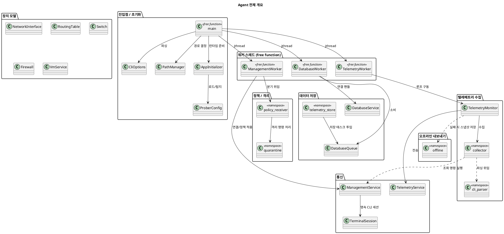
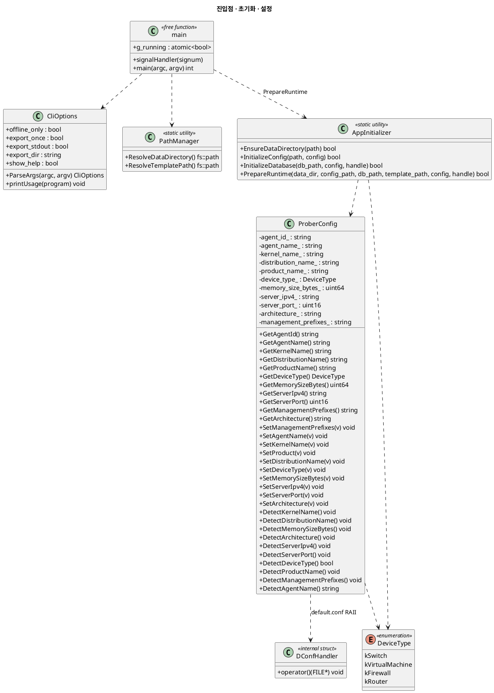
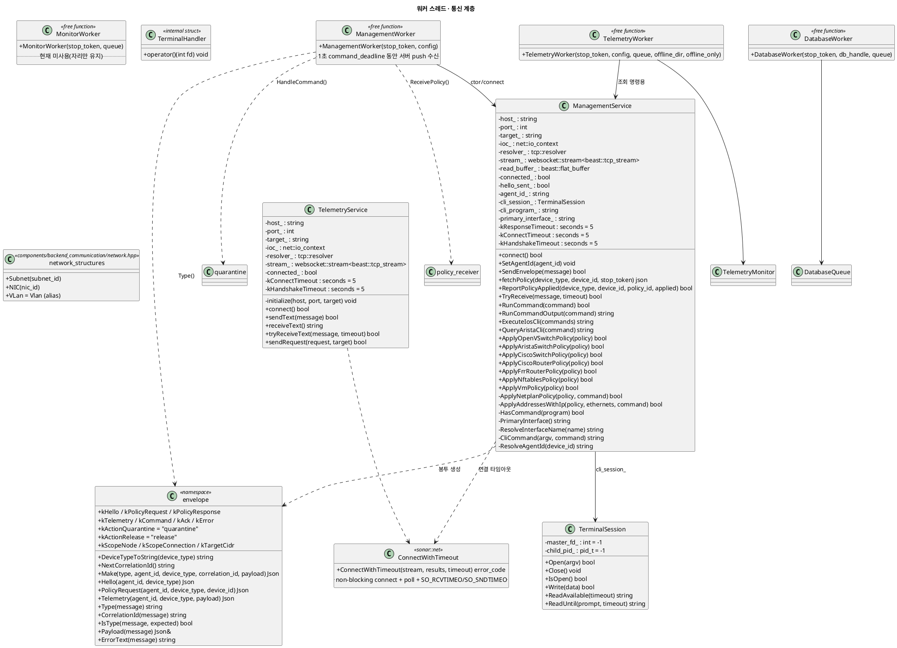
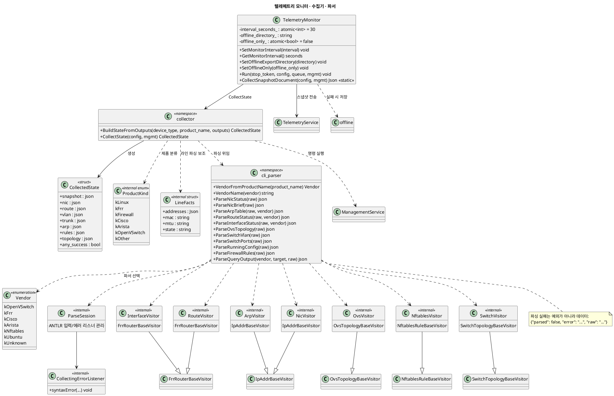
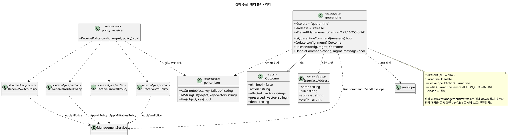
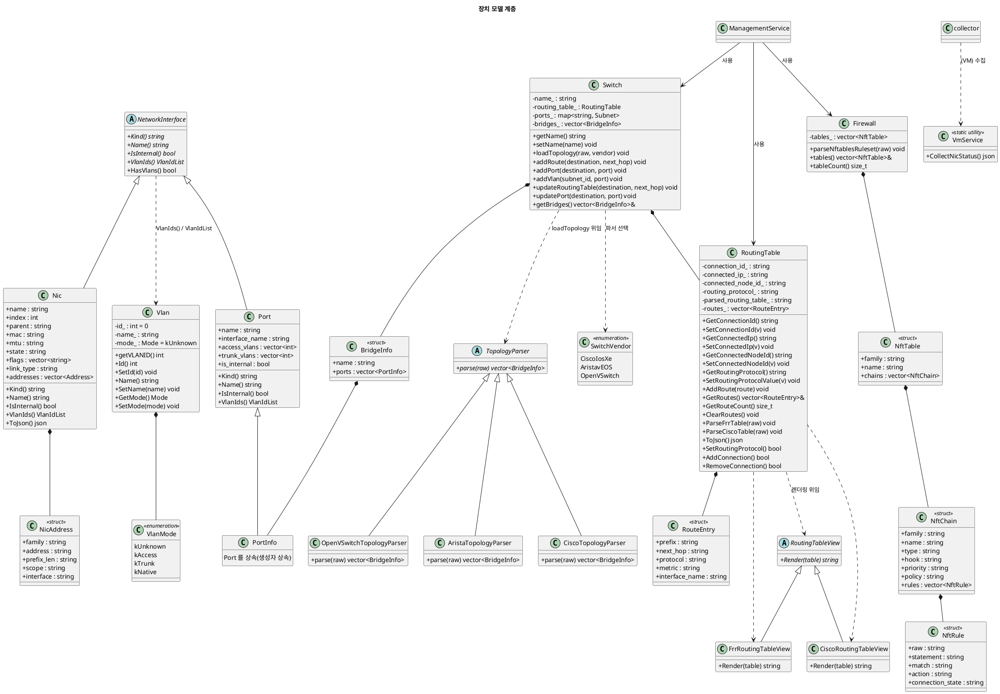
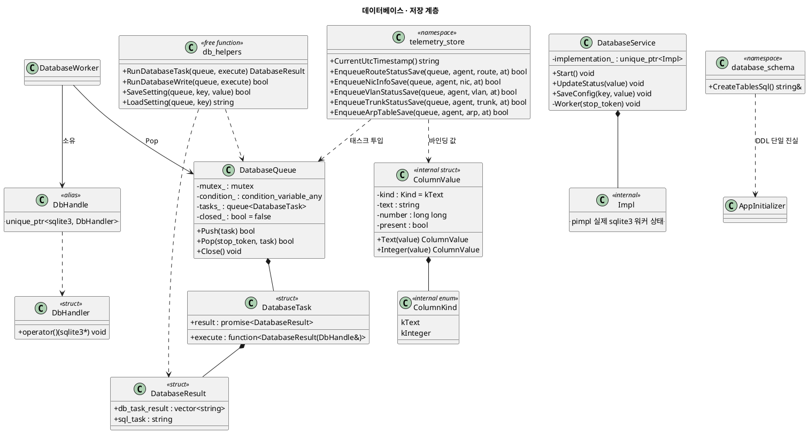
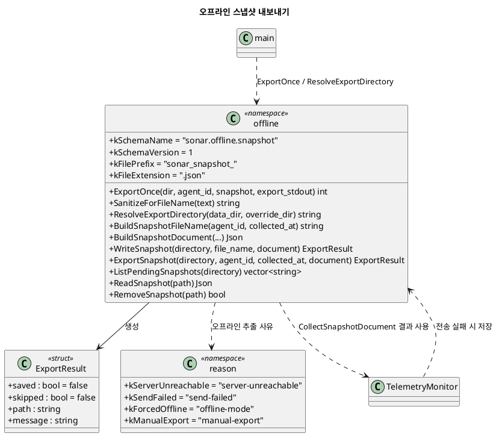

# Agent (SonarValidator_Prober) 클래스 다이어그램

`SonarValidator_Prober` (C++23 프로버 에이전트)의 **전체 클래스 구조**를 PlantUML로 정리한 문서입니다.
모든 내용은 실제 소스 코드를 기준으로 작성했습니다.

- **대상**: `SonarValidator_Prober/` (에이전트 본체)
- **범위**: Linux VM(Ubuntu), Cisco 8000v(IOS-XE), Arista vEOS, Open vSwitch, nftables/Alpine 방화벽, FRR
- **작성 기준**: 현재 워킹 트리 소스
- **렌더링**: PlantUML 코드블록을 지원하는 뷰어(예: VS Code PlantUML 확장, plantuml.com)에서 확인

---

## 1. 전체 개요

에이전트는 크게 **① 초기화 → ② 3개 워커 스레드(관리/텔레메트리/DB)** 구조로 동작합니다.
관리(정책·명령), 텔레메트리(수집·전송), DB(로컬 SQLite 저장)가 스레드별로 분리되어 있습니다.

---

## 2. 진입점 / 초기화 / 설정

---

## 3. 워커 스레드 & 통신

> **참고**: `TelemetryService` 는 `using CommunicationService = TelemetryService;` 별칭으로도 쓰입니다.
> `ManagementService` 와 `TelemetryService` 는 모두 `sonar::net::ConnectWithTimeout()` 으로
> 동기 connect/handshake 에 제한 시간을 겁니다 (SIGTERM 시 hang 방지).

---

## 4. 텔레메트리 수집 & 파서

---

## 5. 정책 적용 & 격리

---

## 6. 장치 모델 (공통 네트워크 객체 · 라우터 · 스위치 · 방화벽 · VM)

---

## 7. 데이터베이스 & 텔레메트리 저장

---

## 8. 오프라인 내보내기

---

## 9. 열거형 요약

| 열거형                                 | 정의 위치                                                | 값                                                                                            | 용도                 |
| -------------------------------------- | -------------------------------------------------------- | --------------------------------------------------------------------------------------------- | -------------------- |
| `DeviceType`                         | `components/device/device_type.hpp`                    | `kSwitch`, `kVirtualMachine`, `kFirewall`, `kRouter`                                  | 정책/명령 분기 기준  |
| `cli_parser::Vendor`                 | `components/parser/cli_output_parser.hpp`              | `kOpenVSwitch`, `kFrr`, `kCisco`, `kArista`, `kNftables`, `kUbuntu`, `kUnknown` | 파서 출력 형식 선택  |
| `collector::ProductKind`             | `module/telemetry_module/command_collector.cpp` (내부) | `kLinux`, `kFrr`, `kFirewall`, `kCisco`, `kArista`, `kOpenVSwitch`, `kOther`    | 조회 명령 선택       |
| `SwitchVendor`                       | `components/device/switch/switch_interface/switch.hpp` | `CiscoIosXe`, `AristavEOS`, `OpenVSwitch`                                               | 토폴로지 파서 선택   |
| `Vlan::Mode`                         | `components/network_object/vlan.hpp`                   | `kUnknown`, `kAccess`, `kTrunk`, `kNative`                                            | VLAN 취급 모드       |
| `telemetry_store::ColumnValue::Kind` | `database/telemetry_store.cpp` (내부)                  | `kText`, `kInteger`                                                                       | SQL 바인딩 타입 구분 |

---

## 10. 주요 설계 계약 (문자열 · 안전장치)

- **격리 문자열 계약**: `quarantine::kIsolate` == `envelope::kActionQuarantine` == 서버 `QuarantineService.ACTION_QUARANTINE` (Release 동일). 한 글자만 달라도 격리 버튼이 조용히 무시됩니다.
- **관리 경로 보존**: 격리는 `ProberConfig::GetManagementPrefixes()` 대역을 절대 내리지 않습니다. 관리 대역을 찾지 못하면 `ok=false`로 실패 보고(원격 장치 복구 불가 방지).
- **연결 격리(`scope=connection`)**: 에이전트는 인터페이스를 건드리지 않습니다(방화벽 서버 규칙 처리). 이중 안전장치.
- **오프라인/온라인 동일 payload**: 두 경로가 같은 파서를 공유하도록 payload 구조를 일치시킵니다.
- **파서 실패 = 데이터**: `cli_parser`는 예외를 던지지 않고 `{"parsed": false, ...}`를 반환합니다(수집 루프 보호).
- **동기 연결 타임아웃**: `sonar::net::ConnectWithTimeout()`이 없으면 SIGTERM 후에도 워커가 join에서 멈춥니다.

---

## 11. 내부(익명 네임스페이스) 헬퍼 목록

다이어그램의 `<<internal>>` 요소들은 `.cpp` 내부(익명 네임스페이스/파일 지역)에서만 쓰이는 구현 세부입니다.

| 심볼                                                        | 위치                                                | 역할                          |
| ----------------------------------------------------------- | --------------------------------------------------- | ----------------------------- |
| `DConfHandler`                                            | `module/configuration_module/prober_config.cpp`   | `FILE*` RAII 삭제자         |
| `TerminalHandler`                                         | `module/management_module/management_service.cpp` | pty`master_fd_` RAII 삭제자 |
| `PipeCloser`                                              | `components/device/vm/ubuntu/vm_service.cpp`      | `popen` 파이프 RAII         |
| `ProductKind`, `LineFacts`                              | `module/telemetry_module/command_collector.cpp`   | 제품 분류 / 라인 파싱 보조    |
| `InterfaceAddress`                                        | `components/policy/quarantine_handler.cpp`        | 격리 대상 주소 표현           |
| `ColumnValue`, `Kind`                                   | `database/telemetry_store.cpp`                    | SQL 바인딩 값 표현            |
| `DatabaseService::Impl`                                   | `database/database_service.hpp`                   | pimpl                         |
| `ParseSession`, `CollectingErrorListener`, `*Visitor` | `components/parser/cli_output_parser.cpp`         | ANTLR 파싱 세션/방문자        |
| `ReceiveSwitch/Router/Firewall/VmPolicy`                  | `components/policy/policy_receiver.cpp`           | 벤더별 정책 분기              |

> `MonitorWorker` 는 현재 사용되지 않는 자리(placeholder)이며 `main.cpp`에서 기동하지 않습니다.
