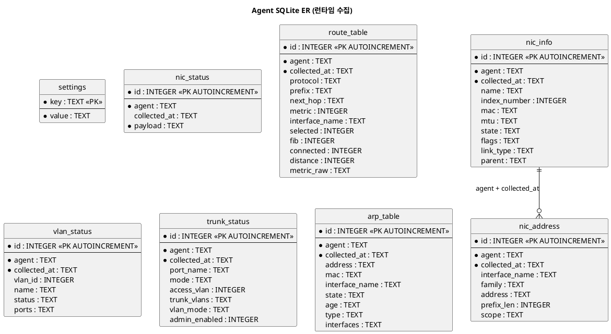
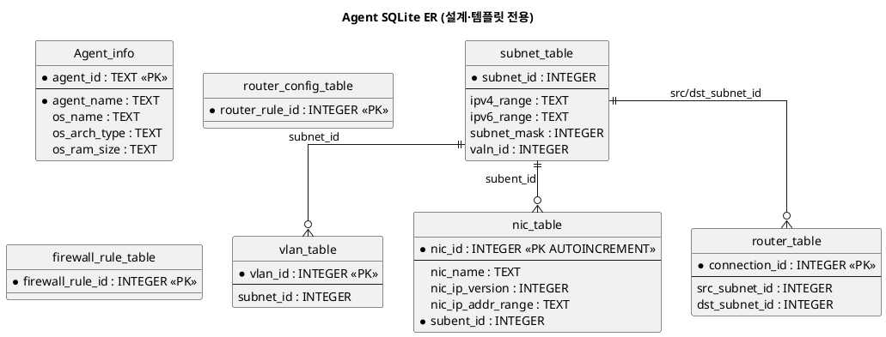

# Agent (SonarValidator_Prober) DB 스키마

`SonarValidator_Prober`가 사용하는 **로컬 SQLite 데이터베이스** 스키마 문서입니다.
모든 내용은 실제 소스(`database/schema.cpp`, `Installer/default_template.sqlite`)를 기준으로 작성했습니다.

- **DBMS**: SQLite 3
- **파일 위치**: `<데이터 디렉터리>/prober_db.sqlite` (기본 `/etc/sonar_validator_prober/data` 계열, `SONAR_DATA_DIR`로 변경 가능)
- **템플릿**: `/etc/sonar_validator_prober/sqlite_template.sqlite` (`Installer/default_template.sqlite`를 `Installer.sh`가 복사)
- **DDL 단일 진실**: `database/schema.cpp` 의 `database_schema::CreateTablesSql()`
  - `AppInitializer::InitializeDatabase()` 가 런타임 DB에 `sqlite3_exec` 로 적용
  - `./build/schema_dump | sqlite3 Installer/default_template.sqlite` 로 템플릿 재생성
  - 모든 문장이 `CREATE ... IF NOT EXISTS` 라서 **멱등**(몇 번 실행해도 안전)

---

## 1. 테이블 분류

| 구분 | 테이블 | 생성 주체 | 성격 |
|---|---|---|---|
| **런타임(수집)** | `nic_status`, `settings` | `schema.cpp` | 텔레메트리 원본(JSON) + key-value 설정 |
| **런타임(수집)** | `route_table`, `nic_info`, `nic_address`, `vlan_status`, `trunk_status`, `arp_table` | `schema.cpp` | 한 번의 수집 = 한 스냅샷 |
| **설계(템플릿 전용)** | `Agent_info` | 템플릿 SQLite | 에이전트 정적 정보 |
| **설계(템플릿 전용)** | `subnet_table`, `vlan_table`, `nic_table` | 템플릿 SQLite | 네트워크 설계(토폴로지) 스키마 |
| **설계(템플릿 전용)** | `router_table`, `router_config_table`, `firewall_rule_table` | 템플릿 SQLite | 설계 규칙 테이블(런타임 미사용) |

> ⚠️ `vlan_table`(설계)과 `vlan_status`(런타임)은 **의도적으로 별개**입니다.
> 같은 테이블을 재사용하면 설계 데이터를 수집 결과가 덮어씁니다.
> (`telemetry_store_test` 가 `vlan_table` 이 변경되지 않음을 검증)

---

## 2. ER 다이어그램 (런타임)



---

## 3. 런타임 테이블 상세

### 3.1 `settings` — key-value 설정

| 컬럼 | 타입 | 제약 | 설명 |
|---|---|---|---|
| `key` | TEXT | **PK** | 설정 키 |
| `value` | TEXT | NOT NULL | 설정 값 |

- 접근: `SaveSetting()` / `LoadSetting()` → `INSERT OR REPLACE INTO settings`.
- `settings` 의 PK는 TEXT이므로 SQLite 자동 인덱스(`sqlite_autoindex_settings_1`)가 생성됩니다.

### 3.2 `nic_status` — 텔레메트리 원본(JSON 스냅샷)

| 컬럼 | 타입 | 제약 | 설명 |
|---|---|---|---|
| `id` | INTEGER | PK AUTOINCREMENT | 행 ID |
| `agent` | TEXT | NOT NULL | 에이전트 식별자 |
| `collected_at` | TEXT | DEFAULT CURRENT_TIMESTAMP | 수집 시각 |
| `payload` | TEXT | NOT NULL | JSON 스냅샷 전문 |

> 기존 코드/테스트가 사용하므로 **정의를 바꾸지 않습니다.**

### 3.3 `route_table` — 라우팅 테이블 (`show ip route` 1줄 = 1행)

| 컬럼 | 타입 | 설명 |
|---|---|---|
| `id` | INTEGER | PK AUTOINCREMENT |
| `agent` | TEXT | NOT NULL, 에이전트 |
| `collected_at` | TEXT | NOT NULL, 수집 시각 |
| `protocol` | TEXT | `ospf`, `connected`, `kernel` … |
| `prefix` | TEXT | `10.20.111.0/24` |
| `next_hop` | TEXT | 다음 홉 (direct 는 NULL/빈 값) |
| `metric` | **INTEGER** | 파서가 정수로 냅니다(Java 계약) |
| `interface_name` | TEXT | 출구 인터페이스 |
| `selected` | INTEGER | FIB 설치 여부 0/1 |
| `fib` | INTEGER | fib 플래그 0/1 |
| `connected` | INTEGER | directly connected 0/1 |
| `distance` | INTEGER | administrative distance (예: 110), 없으면 NULL |
| `metric_raw` | TEXT | 숫자로 못 읽은 원문(예: `"foo/bar"`), 없으면 NULL |

인덱스: `idx_route_table_snapshot (agent, collected_at)`

> **타입 변경 이력 (2026-09-25)**: `metric` 을 TEXT → INTEGER 로 변경.
> `[110/200]` 은 `distance=110`, `metric=200` 으로 **분리**됩니다.
> 이 DDL은 `IF NOT EXISTS` 라 기존 DB에는 적용되지 않지만, SQLite의 타입 친화도(affinity) 덕분에 정수를 넣어도 정상 동작합니다.

### 3.4 `nic_info` — NIC 정보 (`ip a` 인터페이스 1개 = 1행)

| 컬럼 | 타입 | 설명 |
|---|---|---|
| `id` | INTEGER | PK AUTOINCREMENT |
| `agent` | TEXT | NOT NULL |
| `collected_at` | TEXT | NOT NULL |
| `name` | TEXT | `eth1.131` |
| `index_number` | INTEGER | ifindex (`index` 는 SQL 키워드라 회피) |
| `mac` | TEXT | MAC 주소 |
| `mtu` | TEXT | `"1500"` (문자열로 오는 경우가 있음) |
| `state` | TEXT | `UP` / `DOWN` / `UNKNOWN` |
| `flags` | TEXT | JSON 배열 문자열 `["BROADCAST","UP",…]` |
| `link_type` | TEXT | `ether`, `loopback` … |
| `parent` | TEXT | VLAN 서브인터페이스의 부모 (`eth1`) |

인덱스: `idx_nic_info_snapshot (agent, collected_at)`

### 3.5 `nic_address` — NIC 주소 (인터페이스 1:N)

| 컬럼 | 타입 | 설명 |
|---|---|---|
| `id` | INTEGER | PK AUTOINCREMENT |
| `agent` | TEXT | NOT NULL |
| `collected_at` | TEXT | NOT NULL (부모 인터페이스와 동일 값 공유) |
| `interface_name` | TEXT | 주소가 달린 인터페이스 |
| `family` | TEXT | `inet` / `inet6` |
| `address` | TEXT | 주소 |
| `prefix_len` | INTEGER | 프리픽스 길이 |
| `scope` | TEXT | `global`, `link`, `host` |

인덱스: `idx_nic_address_snapshot (agent, collected_at)`

### 3.6 `vlan_status` — VLAN 런타임 상태 (`show vlan brief` 1줄 = 1행)

| 컬럼 | 타입 | 설명 |
|---|---|---|
| `id` | INTEGER | PK AUTOINCREMENT |
| `agent` | TEXT | NOT NULL |
| `collected_at` | TEXT | NOT NULL |
| `vlan_id` | INTEGER | VLAN ID |
| `name` | TEXT | VLAN 이름 |
| `status` | TEXT | `active` / `act/unsup` … |
| `ports` | TEXT | JSON 배열 문자열 `["Cpu","Et2"]` |

인덱스: `idx_vlan_status_snapshot (agent, collected_at)`

> 설계용 `vlan_table` 과 **별개**입니다(수집 결과가 설계 데이터를 덮지 않도록).

### 3.7 `trunk_status` — 스위치 포트 상태 (`show interfaces switchport` 1포트 = 1행)

| 컬럼 | 타입 | 설명 |
|---|---|---|
| `id` | INTEGER | PK AUTOINCREMENT |
| `agent` | TEXT | NOT NULL |
| `collected_at` | TEXT | NOT NULL |
| `port_name` | TEXT | `Ethernet1`, `eth1` … |
| `mode` | TEXT | `access` / `trunk` / … |
| `access_vlan` | INTEGER | access VLAN |
| `trunk_vlans` | TEXT | JSON 배열 문자열 `[111,112]` (범위는 `{"start","end"}`) |
| `vlan_mode` | TEXT | 벤더별 vlan mode 표기 |
| `admin_enabled` | INTEGER | 관리자 enabled 0/1 |

인덱스: `idx_trunk_status_snapshot (agent, collected_at)`

### 3.8 `arp_table` — ARP/이웃 테이블 (`ip neigh show` 1항목 = 1행)

| 컬럼 | 타입 | 설명 |
|---|---|---|
| `id` | INTEGER | PK AUTOINCREMENT |
| `agent` | TEXT | NOT NULL |
| `collected_at` | TEXT | NOT NULL |
| `address` | TEXT | IP 주소 |
| `mac` | TEXT | MAC 주소 |
| `interface_name` | TEXT | 인터페이스 |
| `state` | TEXT | `REACHABLE` / `STALE` … |
| `age` | TEXT | `"2:31:51"` (표기 그대로) |
| `type` | TEXT | `ARPA` … |
| `interfaces` | TEXT | LAG 구성원 등 부가 목록(JSON 배열 문자열) |

인덱스: `idx_arp_table_snapshot (agent, collected_at)`

> ⚠️ 현재 파서는 아직 `entries` 를 만들지 않습니다(추가 예정).
> 키가 없으면 `telemetry_store` 가 조용히 0행으로 처리합니다.

---

## 4. 설계(템플릿 전용) 테이블

`Installer/default_template.sqlite` 에만 존재하며 `schema.cpp` DDL에는 없습니다.
(레거시/설계 스키마 — 현재 런타임 코드는 `vlan_table` 만 테스트에서 참조)



| 테이블 | 컬럼 | 비고 |
|---|---|---|
| `Agent_info` | `agent_id`(PK), `agent_name`(NOT NULL), `os_name`, `os_arch_type`, `os_ram_size` | 에이전트 정적 정보 |
| `subnet_table` | `subnet_id`, `ipv4_range`, `ipv6_range`, `subnet_mask`, `valn_id` | PK 미선언 |
| `vlan_table` | `vlan_id`(PK), `subnet_id` | **설계용** (런타임은 `vlan_status`) |
| `nic_table` | `nic_id`(PK AI), `nic_name`, `nic_ip_version`, `nic_ip_addr_range`, `subent_id`(NOT NULL) | 오타 `subent_id` 는 실제 표기 |
| `router_table` | `connection_id`(PK), `src_subnet_id`, `dst_subnet_id` | |
| `router_config_table` | `router_rule_id`(PK) | 런타임 미사용 |
| `firewall_rule_table` | `firewall_rule_id`(PK) | 런타임 미사용 |

---

## 5. 인덱스 요약

| 인덱스 | 테이블 | 컬럼 | 용도 |
|---|---|---|---|
| `sqlite_autoindex_settings_1` | `settings` | `key` | PK 자동 |
| `sqlite_autoindex_Agent_info_1` | `Agent_info` | `agent_id` | PK 자동 |
| `idx_route_table_snapshot` | `route_table` | `(agent, collected_at)` | 스냅샷 조회 |
| `idx_nic_info_snapshot` | `nic_info` | `(agent, collected_at)` | 스냅샷 조회 |
| `idx_nic_address_snapshot` | `nic_address` | `(agent, collected_at)` | 스냅샷 조회 |
| `idx_vlan_status_snapshot` | `vlan_status` | `(agent, collected_at)` | 스냅샷 조회 |
| `idx_trunk_status_snapshot` | `trunk_status` | `(agent, collected_at)` | 스냅샷 조회 |
| `idx_arp_table_snapshot` | `arp_table` | `(agent, collected_at)` | 스냅샷 조회 |

---

## 6. 설계 원칙 / 주의점

- **스냅샷 묶음**: 모든 런타임 테이블이 `(agent, collected_at)` 로 묶입니다. 같은 시각 값 = 한 번의 수집.
- **한 번의 수집 = 태스크 하나 = 트랜잭션 하나**: 행이 수천 개여도 커밋이 1회라 빠르고, 중간 실패 시 롤백되어 반쪽 스냅샷이 남지 않습니다.
- **JSON은 문자열로**: `flags`/`ports`/`trunk_vlans`/`interfaces` 는 JSON **배열 문자열**로 저장합니다(정규화하지 않음).
- **파싱 실패는 데이터**: `telemetry_store` 는 키가 없거나 형식이 다르면 그 행을 건너뜁니다(예외를 밖으로 던지지 않음).
- **`metric` 계약**: `distance`/`metric` 정수 분리는 Java Backend 계약과 일치해야 합니다. 원문은 `metric_raw`.
- **DDL 멱등**: `CREATE TABLE IF NOT EXISTS` 이므로 기존 DB에는 새 컬럼이 추가되지 않습니다. 스키마를 바꾸려면 마이그레이션 또는 DB 재생성이 필요합니다.
- **템플릿 vs 런타임**: 템플릿에는 설계 테이블 7개가 포함되고, 런타임 DDL이 수집 테이블 7개를 추가합니다.

---

## 7. 참고: 스키마 버전 관리

`database/schema.cpp` 상단에 변경 이력이 주석으로 관리됩니다. DDL을 바꿀 때 여기에도 함께 기록합니다.

```
변경 이력
─────────────────────────────────────────────
2026-09-25  route_table.metric 을 TEXT → INTEGER 로 변경
            ([110/200] → distance=110, metric=200 분리)
```