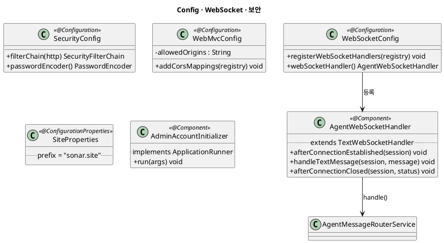
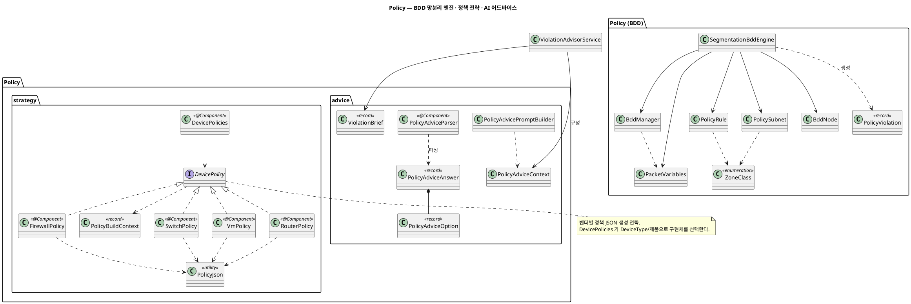
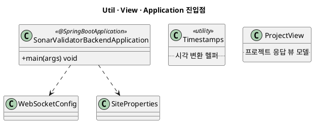

# Backend (SonarValidator_Backend) 클래스 다이어그램

`SonarValidator_Backend` (Spring Boot / Java)의 **전체 클래스 구조**를 PlantUML로 정리한 문서입니다.
모든 내용은 실제 소스 코드(`src/main/java/org/sonar/sonarvalidator_backend`)를 기준으로 작성했습니다.

- **기술 스택**: Spring Boot, Spring Web / WebSocket / Data JPA, ANTLR(CLI 파서), BDD 기반 망분리 검증
- **패키지 루트**: `org.sonar.sonarvalidator_backend`
- **렌더링**: PlantUML 코드블록을 지원하는 뷰어에서 확인

---

## 1. 전체 개요 (계층 구조)

에이전트(C++ Prober)는 **WebSocket Envelope 프로토콜**로, 브라우저는 **REST**로 접속합니다.
컨트롤러 → 서비스 → 리포지토리/엔티티의 전형적 계층이며, 정책 생성/검증은 `Policy` 패키지가 담당합니다.

```plantuml
@startuml Backend_Overview
title Backend 전체 개요

skinparam classAttributeIconSize 0
skinparam shadowing false

package "Config (@Configuration/@Component)" {
  class WebSocketConfig
  class AgentWebSocketHandler
  class SecurityConfig
  class WebMvcConfig
  class SiteProperties
  class AdminAccountInitializer
}

package "Controller (@RestController)" {
  class AgentStatusController
  class AgentBundleController
  class ExpectedAgentController
  class QuarantineController
  class PolicyManagement
  class PolicyAdviceController
  class ProjectController
  class NetworkTopologyController
  class ComplianceController
  class NotificationController
  class LogController
  class OPNsenseController
  class OfflineImportController
  class AiProviderController
  class AuthController
  class UserController
  class RouterController
  class CliIngestController
}

package "Service" {
  class AgentMessageRouterService
  class AgentSessionRegistry
  class AgentTelemetryStore
  class AgentBundleService
  class ExpectedAgentService
  class NodeRegistryService
  class PolicyRegistryService
  class QuarantineService
  class ProjectService
  class ComplianceService
  class NotificationService
  class LogService
  class ViolationAdvisorService
  class OfflineSnapshotService
}

package "Policy (BDD / 전략)" {
  class SegmentationBddEngine
  class DevicePolicies
  class QuarantineMethods
}

package "Repository (Spring Data JPA)" {
  class ProjectRepository
  class ExpectedAgentRepository
  class QuarantineStateRepository
  class NotificationRepository
}

package "Model / entity (@Entity)" {
  class Project
  class ProjectSubnet
  class ProjectRule
  class ExpectedAgent
  class QuarantineState
  class Notification
  class User
}

WebSocketConfig --> AgentWebSocketHandler
AgentWebSocketHandler --> AgentMessageRouterService
AgentMessageRouterService --> AgentSessionRegistry
AgentMessageRouterService --> AgentTelemetryStore
AgentMessageRouterService --> QuarantineService
AgentMessageRouterService --> PolicyRegistryService

AgentStatusController --> AgentMessageRouterService
AgentStatusController --> AgentTelemetryStore
AgentBundleController --> AgentBundleService
ExpectedAgentController --> ExpectedAgentService
QuarantineController --> QuarantineService
PolicyManagement --> SegmentationBddEngine
PolicyAdviceController --> ViolationAdvisorService
ProjectController --> ProjectService
NotificationController --> NotificationService
LogController --> LogService
AiProviderController --> AiProviderService
AuthController --> UserService
UserController --> UserService

ProjectService --> ProjectRepository
ExpectedAgentService --> ExpectedAgentRepository
QuarantineService --> QuarantineStateRepository
QuarantineService --> QuarantineMethods
PolicyRegistryService --> DevicePolicies
NotificationService --> NotificationRepository
ComplianceService --> ProjectRepository

ProjectRepository --> Project
ProjectRepository --> ProjectSubnet
ProjectRepository --> ProjectRule
QuarantineStateRepository --> QuarantineState
NotificationRepository --> Notification
@enduml
```

---

## 2. Config / WebSocket 계층

---

## 3. Controller 계층 (REST)

```plantuml
@startuml Backend_Controllers
title Controller 계층 (@RestController)

skinparam classAttributeIconSize 0
skinparam shadowing false

class AgentStatusController <<@RestController /api/v1/agents>> {
  + list()
  + telemetry(agentId)
  + config(agentId)
  + configs()
  + broadcast(body)
  + removeTelemetry(agentId)
}

class AgentBundleController <<@RestController /api/v1/agents/bundle>> {
  + info(nodeType)
  + download(...)
}

class ExpectedAgentController <<@RestController /api/v1/agents>> {
  + register(...)
  + list(...)
  + delete(...)
}

class QuarantineController <<@RestController /api/v1/quarantine>> {
  + quarantine(agentId, body)
  + release(agentId, body)
  + list(...)
  + status(...)
}

class PolicyManagement <<@RestController /api/v1/policy>> {
  + violations(projectId)
  + forbiddenPairs(projectId)
}

class PolicyAdviceController <<@RestController /api/v1/policy/advice>> {
  + request(projectId, body)
  + list(...)
  + get(...)
}

class ProjectController <<@RestController /api/v1/projects>> {
  + list()
  + get(projectId)
  + create(...)
  + update(...)
  + delete(projectId)
  + validate(...)
}

class NetworkTopologyController <<@RestController /api/v1/network>> {
  + topology(projectId)
  + discovered(projectId)
}

class ComplianceController <<@RestController /api/v1/compliance>> {
  + changes(projectId, agentId)
}

class NotificationController <<@RestController /api/v1/notifications>> {
  + list(category, ...)
  + unread()
  + markRead(id)
  + markAllRead()
  + delete(id)
}

class LogController <<@RestController /api/v1/logs>> {
  + list(agentId, ...)
  + analysis(...)
  + export(...)
}

class OPNsenseController <<@RestController /api/v1/opnsense>> {
  + listCredentials()
  + saveCredential(body)
  + verify(id)
  + probe(id)
}

class OfflineImportController <<@RestController /api/v1/offline>> {
  + schema()
  + importSnapshots(files)
  + imported()
}

class AiProviderController <<@RestController /api/v1/ai/providers>> {
  + list()
  + listEnabled()
  + get(id)
  + save(body)
  + delete(id)
  + check(id)
}

class AuthController <<@RestController /api/v1/auth>> {
  + login(body)
  + me()
  + logout()
}

class UserController <<@RestController /api/v1/users>> {
  + me()
  + changePassword(body)
  + list()
  + create(body)
  + setEnabled(...)
}

class RouterController <<@RestController /api/v1/routes>> {
  + list(protocol)
}

AgentStatusController --> AgentMessageRouterService
AgentStatusController --> AgentTelemetryStore
AgentBundleController --> AgentBundleService
ExpectedAgentController --> ExpectedAgentService
QuarantineController --> QuarantineService
PolicyManagement --> SegmentationBddEngine
PolicyManagement --> ProjectService
PolicyAdviceController --> ViolationAdvisorService
ProjectController --> ProjectService
NetworkTopologyController --> ProjectService
NetworkTopologyController --> NodeRegistryService
ComplianceController --> ComplianceService
NotificationController --> NotificationService
LogController --> LogService
OPNsenseController --> OPNsenseCredentialService
OfflineImportController --> OfflineSnapshotService
AiProviderController --> AiProviderService
AuthController --> UserService
UserController --> UserService
@enduml
```

---

## 4. 핵심 Service 계층 — 에이전트 / 정책 / 격리

```plantuml
@startuml Backend_CoreServices
title 핵심 서비스 — 에이전트 세션 · 텔레메트리 · 정책 · 격리

skinparam classAttributeIconSize 0
skinparam shadowing false

class AgentMessageRouterService <<@Service>> {
  + setQuarantineService(qs) void
  + setNodeRegistry(nr) void
  + handle(session, envelope) void
  + lastConfigOf(agentId) NeutralDeviceConfig
  + acceptOfflineTelemetry(agentId, product, payload) void
  + isOfflineOrigin(agentId) boolean
  + telemetryStore() AgentTelemetryStore
  + policyRequestCount() long
}

class AgentSessionRegistry <<@Service>> {
  + register(agentId, session) void
  + unregister(session) void
  + sendTo(agentId, envelope) boolean
  + broadcast(envelope) void
  + connectedCount() int
  + connectedAgentIds() Set<String>
}

class AgentTelemetryStore <<@Service>> {
  + touch(agentId) void
  + putTelemetry(agentId, payload) void
  + putConfig(agentId, config) void
  + putOfflineConfig(agentId, config) void
  + telemetryOf(agentId) JsonNode
  + configOf(agentId) NeutralDeviceConfig
  + allTelemetryAgentIds() Set<String>
  + remove(agentId) void
  + pruneUnseenSince(cutoff) int
  + summary() ...
}

class AgentNodeType <<enumeration>> {
  + canonical() String
  + label() String
  + fileToken() String
  + parse(value) AgentNodeType
  + matches(value) boolean
  + canonicalOf(value) String
}

class AgentBundleService <<@Service>> {
  .. 에이전트 설치 번들(.tar.gz) 생성/전송 ..
}

class ExpectedAgentService <<@Service>> {
  + register(...)
  + unregister(...)
  + list(...)
}

class NodeRegistryService <<@Service>> {
  .. 수집 노드 등록/조회 ..
}

class PolicyRegistryService <<@Service>> {
  + setDevicePolicies(...) void
  .. 서브넷/벤더별 정책 JSON 생성 ..
}

class QuarantineService <<@Service>> {
  + quarantine(...)
  + release(...)
  + list(...)
  .. ACTION_QUARANTINE / ACTION_RELEASE 상수 ..
}

class DeviceConfigService <<@Service>> {
  + parse(product, raw) NeutralDeviceConfig
}

class DeviceTypeResolver <<@Service>> {
  + resolve(entity) DeviceType
}

class ProjectService <<@Service>> {
  .. 프로젝트/서브넷/규칙 CRUD + 검증 ..
}

class ComplianceService <<@Service>> {
  + record(...)
  + changes(...)
}

class NotificationService <<@Service>> {
  + notify(...)
  + list(...)
  + markRead(...)
}

class UserService <<@Service>> {
  + login(...)
  + create(...)
  + changePassword(...)
}

class OfflineSnapshotService <<@Service>> {
  + importSnapshots(...)
  + imported()
}

class AiProviderService <<@Service>> {
  + list()
  + save(...)
  + check(id)
}

AgentMessageRouterService --> AgentSessionRegistry : 세션 관리
AgentMessageRouterService --> AgentTelemetryStore : 텔레메트리 저장
AgentMessageRouterService --> AgentNodeType : 노드 유형
AgentMessageRouterService --> QuarantineService : 격리 위임
AgentMessageRouterService --> PolicyRegistryService : 정책 응답
AgentMessageRouterService --> NodeRegistryService
AgentTelemetryStore ..> NeutralDeviceConfig
PolicyRegistryService --> DevicePolicies : 위임
QuarantineService --> QuarantineMethods : 위임
QuarantineService --> DeviceTypeResolver : 유형 판정
DeviceConfigService ..> DeviceConfigParser : 위임
DeviceConfigService ..> NeutralDeviceConfig
@enduml
```

---

## 5. Service 지원 패키지 — CLI 파서 / 로그 / AI / OPNsense / 정책 푸시 / 알림 / 격리 전략

```plantuml
@startuml Backend_SupportServices
title 서비스 지원 패키지

skinparam classAttributeIconSize 0
skinparam shadowing false

package "Service.cli" {
  class CliIngestController <<Controller>>
  class CliIngestService <<@Service>>
  class CliIngestionService <<@Service>>
  class CliOutputParser <<@Service>>
  class CliVendor <<enumeration>>
  class CliJson <<utility>>
  class CliText <<utility>>
  class RouteCodes <<utility>>
  class BriefEntry <<record>>
  class CliIngestRequest <<record>>
  class ParseSession <<generic L,P>>
  class TokenCursor <<generic E>>
  class IpAddrVisitor
  class FrrRouterVisitor
  class OvsVisitor
  class NftablesVisitor
  class SwitchVisitor
}

package "Service.cli.query" {
  interface CliQueryStrategy
  class CliQueryStrategies
  class QueryResult <<record>>
  class NicQueryStrategy
  class NicBriefQueryStrategy
  class RouteQueryStrategy
  class InterfaceStatusQueryStrategy
  class SwitchVlanQueryStrategy
  class SwitchPortQueryStrategy
  class OvsTopologyQueryStrategy
  class RunningConfigQueryStrategy
  class FirewallRulesQueryStrategy
  class FirewallChainQueryStrategy
  class ArpQueryStrategy
}

CliIngestService --> CliIngestionService
CliIngestionService --> CliOutputParser
CliOutputParser --> ParseSession
CliOutputParser ..> CliVendor
CliOutputParser ..> IpAddrVisitor
CliOutputParser ..> FrrRouterVisitor
CliOutputParser ..> OvsVisitor
CliOutputParser ..> NftablesVisitor
CliOutputParser ..> SwitchVisitor
ParseSession --> TokenCursor
CliIngestionService --> CliQueryStrategies
CliQueryStrategies --> CliQueryStrategy
CliQueryStrategy <|.. NicQueryStrategy
CliQueryStrategy <|.. NicBriefQueryStrategy
CliQueryStrategy <|.. RouteQueryStrategy
CliQueryStrategy <|.. InterfaceStatusQueryStrategy
CliQueryStrategy <|.. SwitchVlanQueryStrategy
CliQueryStrategy <|.. SwitchPortQueryStrategy
CliQueryStrategy <|.. OvsTopologyQueryStrategy
CliQueryStrategy <|.. RunningConfigQueryStrategy
CliQueryStrategy <|.. FirewallRulesQueryStrategy
CliQueryStrategy <|.. FirewallChainQueryStrategy
CliQueryStrategy <|.. ArpQueryStrategy
CliQueryStrategy ..> QueryResult : 생성
IpAddrVisitor --|> BaseVisitor : ANTLR
FrrRouterVisitor --|> BaseVisitor : ANTLR
@enduml
```

```plantuml
@startuml Backend_SupportServices2
title 로그 · AI · OPNsense · 정책 푸시 · 알림 · 격리 전략

skinparam classAttributeIconSize 0
skinparam shadowing false

package "Service.log" {
  interface LogLineSource
  class LogLineReader <<@Service>>
  class LogLineSources
  class LogNormalizer <<@Component>>
  class LogService <<@Service>>
}

package "Service.ai" {
  class AiProviderService <<@Service>>
  class LogAnalysisEngine <<@Service>>
  class OpenAiCompatibleClient <<@Component>>
}

package "Service.opnsense" {
  class OPNsenseCredentialService <<@Service>>
  class OPNsenseApiClient <<@Component>>
  class OPNsenseConnection <<record>>
  interface OPNsenseProbeStrategy
  class OPNsenseProbeStrategies <<@Component>>
  class ProbeStrategies
}

package "Service.policy" {
  class PolicyPushNotifier <<@Service>>
  interface PushOutcomeStrategy
  class PushOutcomes
  class ViolationAdvisorService <<@Service>>
}

package "Service.notification" {
  class NotificationCategory <<enumeration>>
  class NotificationSeverity <<enumeration>>
  class NotificationFilter <<record>>
}

package "Service.quarantine" {
  class QuarantineContext <<record>>
  interface QuarantineMethod
  class QuarantineMethods <<@Component>>
  class SwitchQuarantine <<@Component>>
  class VmQuarantine <<@Component>>
  class RouterQuarantine <<@Component>>
  class FirewallQuarantine <<@Component>>
}

package "Service.secret" {
  class SecretCipher <<@Component>>
}

LogService --> LogLineSources
LogLineSources ..> LogLineSource
LogService --> LogAnalysisEngine
LogService --> LogLineReader
LogService --> LogNormalizer
LogAnalysisEngine --> AiProviderService
AiProviderService --> AiProviderRepository
AiProviderService --> OpenAiCompatibleClient
AiProviderService ..> LogAnalysis
OPNsenseCredentialService --> OPNsenseApiClient
OPNsenseCredentialService --> OPNsenseProbeStrategies
OPNsenseProbeStrategies --> OPNsenseProbeStrategy
ProbeStrategies ..> OPNsenseProbeStrategy
OPNsenseCredentialService ..> OPNsenseConnection
ViolationAdvisorService --> PolicyAdviceParser
ViolationAdvisorService --> PolicyAdvicePromptBuilder
ViolationAdvisorService --> AiProviderService
PolicyPushNotifier --> PushOutcomeStrategy
PushOutcomes ..> PushOutcomeStrategy
QuarantineMethods --> QuarantineMethod
QuarantineMethod <|.. SwitchQuarantine
QuarantineMethod <|.. VmQuarantine
QuarantineMethod <|.. RouterQuarantine
QuarantineMethod <|.. FirewallQuarantine
QuarantineMethods ..> QuarantineContext
@enduml
```

---

## 6. Policy 패키지 — BDD 엔진 / 전략 / 어드바이스

---

## 7. 도메인 모델 (Model)

```plantuml
@startuml Backend_Model
title Model — 라우팅 · 네트워크 객체 · 설정 파서 · DTO

skinparam classAttributeIconSize 0
skinparam shadowing false

package "Model (라우팅/주소)" {
  interface AbstractRoute
  class StaticRoute
  class OspfRoute
  class Route
  class RoutingTable
  class Prefix
  class Prefix6
  class Ip
  class Ip6
  class OspfProtocolSubType <<enumeration>>
}

package "Model (네트워크/보안 구역)" {
  interface Zone
  class OpenZone
  class ConfidentialZone
  class SensitiveZoone
  class NetworkNode
  class Interface
  class Subnet <<@Component>>
  class Switch
  class VLan
  class Vrf
  class Configuration
  class ConfigurationFormat <<enumeration>>
  class ConfigurationType
  class DeviceType <<enumeration>>
  interface AclLineMatchExpr
  class IpAccessList
  class IpAccessListLine
  class LineAction <<enumeration>>
}

package "Model.Config" {
  interface DeviceConfigParser
  class AbstractDeviceConfigParser
  class NeutralDeviceConfig
  class JsonReader
  class OpenVSwitchConfigParser
  class AristaSwitchConfigParser
  class CiscoRouterConfigParser
  class FrrRouterConfigParser
  class LinuxVmConfigParser
  class AlpineFirewallConfigParser
}

package "Model.dto" {
  class Envelope
  class ProjectDto
  class ProjectMapper
}

package "Model.vendors" {
  class AlpineFirewall
  class CiscoSwitch
  class FRRSwitch
}

AbstractRoute <|.. StaticRoute
AbstractRoute <|.. OspfRoute
OspfRoute ..> OspfProtocolSubType
RoutingTable *-- Route
RoutingTable ..> AbstractRoute
Route ..> Prefix
Prefix6 ..> Prefix
Ip6 ..> Ip
Zone <|.. OpenZone
Zone <|.. ConfidentialZone
Zone <|.. SensitiveZoone
NetworkNode *-- Interface
Switch ..> VLan
Configuration ..> DeviceType
Configuration ..> ConfigurationType
AclLineMatchExpr <|.. IpAccessListLine
IpAccessList *-- IpAccessListLine
IpAccessListLine ..> LineAction
AbstractRoute ..> DeviceType

DeviceConfigParser <|.. AbstractDeviceConfigParser
AbstractDeviceConfigParser <|-- OpenVSwitchConfigParser
AbstractDeviceConfigParser <|-- AristaSwitchConfigParser
AbstractDeviceConfigParser <|-- CiscoRouterConfigParser
AbstractDeviceConfigParser <|-- FrrRouterConfigParser
AbstractDeviceConfigParser <|-- LinuxVmConfigParser
AbstractDeviceConfigParser <|-- AlpineFirewallConfigParser
AbstractDeviceConfigParser ..> NeutralDeviceConfig
JsonReader ..> NeutralDeviceConfig
ProjectMapper ..> ProjectDto
@enduml
```

---

## 8. JPA 엔티티 & Repository

```plantuml
@startuml Backend_JPA
title JPA 엔티티 · Repository

skinparam classAttributeIconSize 0
skinparam shadowing false

package "Model.entity (@Entity)" {
  class Project {
    + id : Long
    + projectKey : String
    + name : String
    + category : String
    + description : String
    + status : String
    + owner : User
    + managementPrefix : String
    + createdAt / updatedAt : Date
    + subnets : List<ProjectSubnet>
    + rules : List<ProjectRule>
  }
  class ProjectSubnet {
    + id : Long
    + project : Project
    + subnetId : String
    + cidr : String
    + zoneClass : ZoneClass
    + name : String
    + agentId : String
    + manuallyEdited : boolean
  }
  class ProjectRule {
    + id : Long
    + project : Project
    + ruleId : String
    + source / destination : String
    + port : Integer
    + protocol : String
    + origin : PolicyRule.Origin
    + enabled : boolean
    + note : String
  }
  class ExpectedAgent {
    + agentId : String
    + projectKey : String
    + deviceType / nodeType : String
    + expectedIp : String
    + status : String
    + note : String
  }
  class QuarantineState {
    + agentId : String
    + nodeId : Integer
    + scope : Scope
    + targetCidr : String
    + projectKey : String
    + requestedBy / reason : String
    + commandDelivered : boolean
    + quarantinedAt / releasedAt : Date
  }
  class Notification {
    + notificationId : String
    + category / severity : String
    + title / message : String
    + projectKey / agentId : String
    + nodeId : Integer
    + occurredAt : Date
    + read : boolean
    + dedupeKey : String
    + repeatCount : int
  }
  class DeviceLog {
    + id : Long
    + node : Configuration
    + agentId / projectKey / product : String
    + severityNum : Integer
    + severity / facility : String
    + message / raw : String
    + fingerprint : String
    + repeatCount : Integer
  }
  class LogAnalysis {
    + analysisId : String
    + logId : Long
    + projectKey : String
    + providerName / model : String
    + riskLevel / summary / rootCause : String
  }
  class PolicyAdvice {
    + adviceId : String
    + projectKey / ruleId : String
    + violationCount / compliant : ...
    + riskLevel / summary : String
    + policyAdvice : String
    + optionsJson / evidenceJson : String
  }
  class ComplianceChange {
    + changeId / scope / projectKey : String
    + agentId / type / summary : String
    + changedBy : String
    + timestamp : Date
    + status / detail : String
  }
  class User {
    + id : Long
    + username : String
    + passwordHash : String
    + displayName : String
    + role : Role
    + enabled : boolean
    + lastLoginAt / createdAt : Date
  }
  class AiProvider {
    + id : Long
    + name / baseUrl : String
    + apiKeyEncrypted : String
    + model / authStyle : String
    + timeoutSeconds / maxTokens : Integer
    + temperature : Double
    + isDefault / enabled : Boolean
  }
  class Configuration {
    + id : Integer
    + agentId / hostname : String
    + deviceType : DeviceType
  }
  class InterfaceEntity {
    + interfaceId : Long
    + node : Configuration
    + interfaceName : String
  }
  class OPNSenseFirewall {
    + nodeId : Integer
    + node : Configuration
    + name / managementIp / version : String
  }
  class OPNsenseCredential {
    + agentId : String
    + displayName / baseUrl : String
    + apiKey / secret : String
    + allowInsecureTls : boolean
    + status : Status
    + lastError / detectedVersion : String
  }
  class RestAPIConnectionConfig {
    + id : Long
    + node : Configuration
    + apikey / baseurl : String
  }
}

package "Repository" {
  interface ProjectRepository
  interface ProjectSubnetRepository
  interface ProjectRuleRepository
  interface ExpectedAgentRepository
  interface QuarantineStateRepository
  interface NotificationRepository
  interface DeviceLogRepository
  interface LogAnalysisRepository
  interface PolicyAdviceRepository
  interface ComplianceChangeRepository
  interface ConfigurationRepository
  interface InterfaceRepository
  interface UserRepository
  interface AiProviderRepository
  interface OPNSenseFirewallRepository
  interface OPNsenseCredentialRepository
}

Project "1" *-- "0..*" ProjectSubnet
Project "1" *-- "0..*" ProjectRule
Project "1" o-- "1" User : owner
ProjectRule ..> PolicyRule : origin
ProjectSubnet ..> ZoneClass

ProjectRepository ..> Project
ExpectedAgentRepository ..> ExpectedAgent
QuarantineStateRepository ..> QuarantineState
NotificationRepository ..> Notification
DeviceLogRepository ..> DeviceLog
LogAnalysisRepository ..> LogAnalysis
PolicyAdviceRepository ..> PolicyAdvice
ComplianceChangeRepository ..> ComplianceChange
ConfigurationRepository ..> Configuration
UserRepository ..> User
AiProviderRepository ..> AiProvider
OPNSenseFirewallRepository ..> OPNSenseFirewall
OPNsenseCredentialRepository ..> OPNsenseCredential
@enduml
```

> 리포지토리는 모두 `JpaRepository<엔티티, ID>`를 확장하고, 파생 쿼리(`findByAgentId`, `findByProjectKeyOrderBy...`)와 `@Query`(DeviceLog/Notification 검색)를 사용합니다.

---

## 9. Util / View / Application

---

## 10. 패키지 요약

| 패키지                              | 주요 타입                                                                                                                             | 역할                            |
| ----------------------------------- | ------------------------------------------------------------------------------------------------------------------------------------- | ------------------------------- |
| `Config`                          | `WebSocketConfig`, `AgentWebSocketHandler`, `SecurityConfig`, `WebMvcConfig`, `SiteProperties`, `AdminAccountInitializer` | 웹소켓/보안/CORS/초기 계정 설정 |
| `Controller`                      | 18개`@RestController`                                                                                                               | 브라우저 REST 엔드포인트        |
| `Service`                         | 에이전트 세션·텔레메트리·정책·격리·프로젝트·알림·로그·컴플라이언스                                                             | 도메인 오케스트레이션           |
| `Service.ai`                      | `AiProviderService`, `LogAnalysisEngine`, `OpenAiCompatibleClient`                                                              | LLM 로그 분석                   |
| `Service.cli`(+`query`)         | `CliOutputParser`, `*Visitor`, `*QueryStrategy`                                                                                 | 수집 CLI 파싱/질의 전략         |
| `Service.log`                     | `LogService`, `LogLineReader/Sources`, `LogNormalizer`                                                                          | 로그 수집/정규화                |
| `Service.notification`            | `NotificationCategory/Severity`, `NotificationFilter`                                                                             | 알림 분류/필터                  |
| `Service.opnsense`                | `OPNsenseApiClient`, `OPNsenseCredentialService`, `OPNsenseProbeStrategies`                                                     | OPNsense 연동                   |
| `Service.policy`                  | `PolicyPushNotifier`, `PushOutcomes`, `ViolationAdvisorService`                                                                 | 정책 푸시/위반 어드바이스       |
| `Service.quarantine`(+`vendor`) | `QuarantineMethods`, 벤더별 `*Quarantine`                                                                                         | 격리 적용 전략                  |
| `Policy`                          | `SegmentationBddEngine`, `BddManager`, `Policy*`                                                                                | BDD 기반 망분리 검증            |
| `Policy.strategy`(+`vendor`)    | `DevicePolicies`, 벤더별 `*Policy`                                                                                                | 벤더별 정책 JSON 생성           |
| `Policy.advice`                   | `PolicyAdviceParser`, `PolicyAdviceAnswer`                                                                                        | AI 어드바이스 파싱              |
| `Model`                           | 라우팅/주소/구역/설정 파서                                                                                                            | 도메인 모델                     |
| `Model.entity`                    | 14개`@Entity`                                                                                                                       | JPA 영속 엔티티                 |
| `Model.dto`                       | `Envelope`, `ProjectDto`, `ProjectMapper`                                                                                       | 웹소켓 봉투/프로젝트 DTO        |
| `Repository`                      | 16개 인터페이스                                                                                                                       | Spring Data JPA                 |
| `Util` / `View`                 | `Timestamps`, `ProjectView`                                                                                                       | 유틸/뷰                         |

---

## 11. 주요 계약 / 주의점

- **WebSocket Envelope 계약**: `Model.dto.Envelope`는 C++ Prober의 `envelope.hpp`와 필드명(`type`, `agent_id`, `device_type`, `correlation_id`, `payload`, `error`, snake_case)이 정확히 일치해야 합니다.
- **격리 문자열 계약**: `QuarantineService.ACTION_QUARANTINE`/`ACTION_RELEASE`는 Prober의 `envelope`/`quarantine` 상수와 일치해야 합니다.
- **오프라인 경로 공유**: `OfflineSnapshotService`는 온라인 텔레메트리와 동일한 payload를 벤더별 파서로 흘려보냅니다.
- **네이밍**: `OPNSense`/`OPNsense` 혼용과 `SensitiveZoone`(오타)는 실제 소스 표기를 그대로 반영했습니다.
