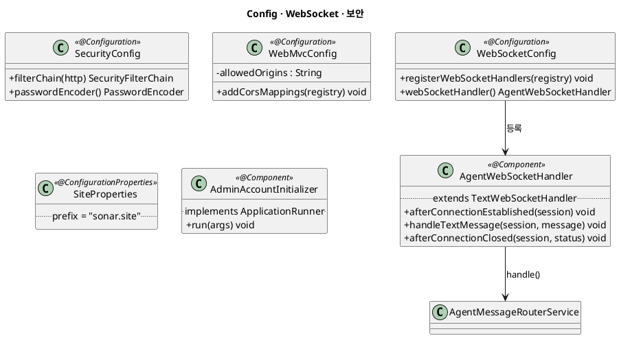
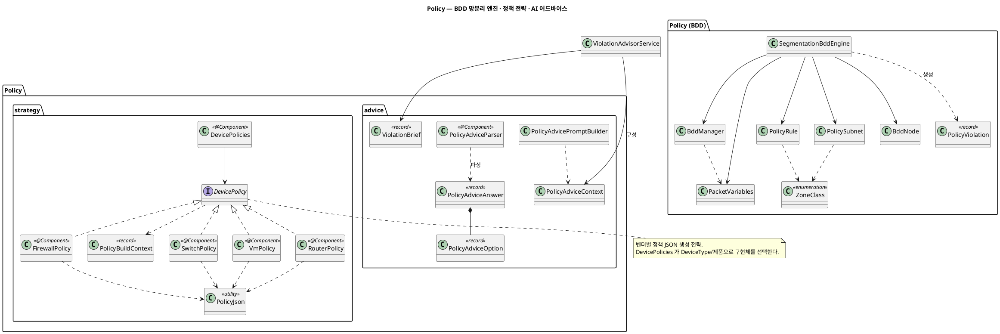
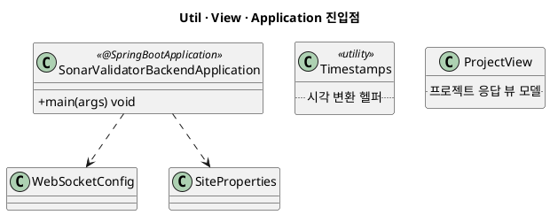

# Backend (SonarValidator_Backend) 클래스 다이어그램

`SonarValidator_Backend` (Spring Boot / Java)의 **전체 클래스 구조**를 PlantUML로 정리한 문서입니다.
모든 내용은 실제 소스 코드(`src/main/java/org/sonar/sonarvalidator_backend`)를 기준으로 작성했습니다.

- **기술 스택**: Spring Boot, Spring Web / WebSocket / Data JPA, ANTLR(CLI 파서), BDD 기반 망분리 검증
- **패키지 루트**: `org.sonar.sonarvalidator_backend`
- **렌더링**: PlantUML 코드블록을 지원하는 뷰어에서 확인

---

## 1. 전체 개요 (계층 구조)

에이전트(C++ Prober)는 **WebSocket Envelope 프로토콜**로, 브라우저는 **REST**로 접속합니다.
개요도는 요청이 들어오는 **Controller/API 계층**과 업무 규칙을 수행하는 **Service 계층**을 분리하고,
각 계층 안의 컴포넌트를 업무 영역별로 묶었습니다. 화살표는 주요 위임 관계만 표시합니다.
세부 메서드 및 전체 의존 관계는 아래의 계층별 다이어그램을 참고합니다.

```plantuml
@startuml Backend_Overview
title Backend 전체 개요

skinparam classAttributeIconSize 0
skinparam shadowing false
skinparam packageStyle rectangle
skinparam linetype ortho
top to bottom direction

package "Config (@Configuration/@Component)" {
  class WebSocketConfig
  class AgentWebSocketHandler
  class SecurityConfig
  class WebMvcConfig
  class SiteProperties
  class AdminAccountInitializer
}

package "1. API / Controller (@RestController)" as ControllerLayer {
  package "프로젝트 · 정책 · 위반 대응" as ProjectControllers {
    class ProjectController
    class PolicyManagement
    class PolicyAdviceController
    class NetworkTopologyController
    class ComplianceController
  }
  package "Agent · 장비 운영" as AgentControllers {
    class AgentStatusController
    class AgentBundleController
    class ExpectedAgentController
    class QuarantineController
    class OPNsenseController
    class OfflineImportController
    class RouterController
    class CliIngestController
  }
  package "공통 관리" as CommonControllers {
    class NotificationController
    class LogController
    class AiProviderController
    class AuthController
    class UserController
  }
}

package "2. Service (업무 로직 / 유스케이스)" as ServiceLayer {
  package "프로젝트 · 정책 · 위반 대응" as ProjectServices {
    class ProjectService
    class PolicyRegistryService
    class QuarantineService
    class ComplianceService
    class ViolationAdvisorService
  }
  package "Agent · 장비 운영" as AgentServices {
    class AgentMessageRouterService
    class AgentSessionRegistry
    class AgentTelemetryStore
    class AgentBundleService
    class ExpectedAgentService
    class NodeRegistryService
    class DeviceConfigService
    class DeviceTypeResolver
    class OfflineSnapshotService
    class CliIngestService
    class CliIngestionService
    class OPNsenseCredentialService
    class OPNsenseProbeStrategies
  }
  package "공통 관리" as CommonServices {
    class NotificationService
    class LogService
    class UserService
    class AiProviderService
  }
}

package "3. Policy (검증 / 장비별 전략)" as PolicyLayer {
  class SegmentationBddEngine
  class DevicePolicies
  class QuarantineMethods
  class PolicyPushNotifier
}

package "4. Repository (Spring Data JPA)" as RepositoryLayer {
  class ProjectRepository
  class ExpectedAgentRepository
  class QuarantineStateRepository
  class NotificationRepository
  class ComplianceChangeRepository
}

package "5. Model / Entity (@Entity)" as EntityLayer {
  class Project
  class ProjectSubnet
  class ProjectRule
  class ExpectedAgent
  class QuarantineState
  class Notification
  class User
}

WebSocketConfig --> AgentWebSocketHandler
AgentWebSocketHandler --> AgentMessageRouterService
AgentMessageRouterService --> AgentSessionRegistry
AgentMessageRouterService --> AgentTelemetryStore
AgentMessageRouterService --> QuarantineService
AgentMessageRouterService --> PolicyRegistryService
AgentMessageRouterService --> NodeRegistryService
AgentMessageRouterService --> DeviceConfigService
AgentMessageRouterService --> LogService
AgentMessageRouterService --> NotificationService
AgentMessageRouterService --> CliIngestionService

AgentStatusController --> AgentMessageRouterService
AgentStatusController --> AgentTelemetryStore
AgentStatusController --> AgentSessionRegistry
AgentStatusController --> DeviceConfigService
AgentStatusController --> ExpectedAgentService
AgentStatusController --> QuarantineService
AgentBundleController --> AgentBundleService
ExpectedAgentController --> ExpectedAgentService
ExpectedAgentController --> AgentMessageRouterService
QuarantineController --> QuarantineService
PolicyManagement --> ProjectService
PolicyManagement --> QuarantineService
PolicyManagement --> NotificationService
PolicyManagement --> PolicyPushNotifier
PolicyAdviceController --> ViolationAdvisorService
PolicyAdviceController --> NotificationService
ProjectController --> ProjectService
NetworkTopologyController --> ProjectService
NetworkTopologyController --> AgentMessageRouterService
NetworkTopologyController --> NodeRegistryService
NetworkTopologyController --> QuarantineService
ComplianceController --> ComplianceService
NotificationController --> NotificationService
LogController --> LogService
OPNsenseController --> OPNsenseCredentialService
OPNsenseController --> AgentMessageRouterService
OPNsenseController --> OPNsenseProbeStrategies
OfflineImportController --> OfflineSnapshotService
OfflineImportController --> AgentMessageRouterService
AiProviderController --> AiProviderService
AuthController --> UserService
UserController --> UserService
RouterController --> AgentMessageRouterService
CliIngestController --> CliIngestService

ProjectService --> ProjectRepository
ExpectedAgentService --> ExpectedAgentRepository
QuarantineService --> QuarantineStateRepository
QuarantineService --> ComplianceService
QuarantineService --> NotificationService
QuarantineService --> NodeRegistryService
QuarantineService --> ProjectRepository
QuarantineService --> QuarantineMethods
ProjectService --> ComplianceService
ProjectService --> NotificationService
PolicyRegistryService --> DevicePolicies
PolicyRegistryService --> QuarantineService
NotificationService --> NotificationRepository
ComplianceService --> ComplianceChangeRepository
CliIngestService --> CliIngestionService
CliIngestService --> DeviceConfigService
OfflineSnapshotService --> DeviceConfigService
OfflineSnapshotService --> AgentMessageRouterService

ProjectService --> SegmentationBddEngine
PolicyAdviceController --> ProjectService : 정책 위반 정보 참조
ViolationAdvisorService --> ProjectService : 분석 대상 프로젝트
PolicyPushNotifier ..> AgentMessageRouterService : Agent에 정책 전달

ProjectRepository --> Project
QuarantineStateRepository --> QuarantineState
NotificationRepository --> Notification
@enduml
```

### 관계를 간단히 설명하면

- **Controller는 API 진입점입니다.** 프로젝트 요청, 정책 조회/전달, 위반 조언 요청, 격리 요청처럼
  기능과 URL의 책임에 따라 나뉘며, 입력을 받고 적절한 Service에 위임합니다.
- **Service는 업무 처리 담당입니다.** 프로젝트 저장과 망분리 검증은 `ProjectService`,
  위반 조언은 `ViolationAdvisorService`, 격리·해제는 `QuarantineService`가 처리합니다.
  한 Service가 여러 Controller에서 재사용되거나 다른 Service와 협력할 수 있으므로
  Controller와 Service가 항상 일대일로 대응하지는 않습니다.
- 예를 들어 **프로젝트의 정책/위반 정보 조회**는 `ProjectController` 또는 `PolicyManagement`에서
  `ProjectService`로 이어지고, `ProjectService`가 정책 검증 엔진을 사용합니다.
  **위반 대응 조언**은 `PolicyAdviceController`가 `ViolationAdvisorService`에 위임하고,
  조언 서비스가 프로젝트 정보를 참조합니다.
- **격리 요청**은 `QuarantineController → QuarantineService`로 들어갑니다.
  격리 서비스는 장비별 전략을 선택하고 상태를 저장하며, 필요한 경우 Agent에 명령을 전달합니다.
  변경 이력과 알림도 관련 Service를 통해 기록합니다.
- 기능별 Controller로 나눈 이유는 API 책임과 접근 경계를 분명히 하고, 프로젝트·정책·격리 등
  서로 다른 업무 기능을 독립적으로 수정하기 위해서입니다. 대신 업무 흐름이 여러 Service를
  지나 복잡해질 수 있으므로, 개요도에서는 핵심 경로만 보여 주고 상세 의존은 하위 다이어그램으로
  분리했습니다.

---

## 2. Config / WebSocket 계층

---

## 3. Controller 계층 (REST)

```plantuml
@startuml Backend_Controllers
title Controller 계층 (@RestController)

skinparam classAttributeIconSize 0
skinparam shadowing false

class AgentStatusController <<@RestController /api/v1/agents>> {
  + list()
  + telemetry(agentId)
  + config(agentId)
  + configs()
  + broadcast(body)
  + removeTelemetry(agentId)
}

class AgentBundleController <<@RestController /api/v1/agents/bundle>> {
  + info(nodeType)
  + download(...)
}

class ExpectedAgentController <<@RestController /api/v1/agents>> {
  + register(...)
  + list(...)
  + delete(...)
}

class QuarantineController <<@RestController /api/v1/quarantine>> {
  + quarantine(agentId, body)
  + release(agentId, body)
  + list(...)
  + status(...)
}

class PolicyManagement <<@RestController /api/v1/policy>> {
  + violations(projectId)
  + forbiddenPairs(projectId)
}

class PolicyAdviceController <<@RestController /api/v1/policy/advice>> {
  + request(projectId, body)
  + list(...)
  + get(...)
}

class ProjectController <<@RestController /api/v1/projects>> {
  + list()
  + get(projectId)
  + create(...)
  + update(...)
  + delete(projectId)
  + validate(...)
}

class NetworkTopologyController <<@RestController /api/v1/network>> {
  + topology(projectId)
  + discovered(projectId)
}

class ComplianceController <<@RestController /api/v1/compliance>> {
  + changes(projectId, agentId)
}

class NotificationController <<@RestController /api/v1/notifications>> {
  + list(category, ...)
  + unread()
  + markRead(id)
  + markAllRead()
  + delete(id)
}

class LogController <<@RestController /api/v1/logs>> {
  + list(agentId, ...)
  + analysis(...)
  + export(...)
}

class OPNsenseController <<@RestController /api/v1/opnsense>> {
  + listCredentials()
  + getCredential(nodeId | agentIdAlias)
  + saveCredential(nodeId | agentIdAlias, body) <<ADMIN/OPERATOR>>
  + deleteCredential(nodeId | agentIdAlias) <<ADMIN/OPERATOR>>
  + verify(nodeId | agentIdAlias) <<ADMIN/OPERATOR>>
  + verifyAll() <<ADMIN/OPERATOR>>
  + probe(nodeId | agentIdAlias) <<ADMIN>>
}

class OfflineImportController <<@RestController /api/v1/offline>> {
  + schema()
  + importSnapshots(files)
  + imported()
}

class AiProviderController <<@RestController /api/v1/ai/providers>> {
  + list()
  + listEnabled()
  + get(id)
  + save(body)
  + delete(id)
  + check(id)
}

class AuthController <<@RestController /api/v1/auth>> {
  + login(body)
  + me()
  + logout()
}

class UserController <<@RestController /api/v1/users>> {
  + me()
  + changePassword(body)
  + list()
  + create(body)
  + setEnabled(...)
}

class RouterController <<@RestController /api/v1/routes>> {
  + list(protocol)
}

AgentStatusController --> AgentMessageRouterService
AgentStatusController --> AgentTelemetryStore
AgentStatusController --> AgentSessionRegistry
AgentStatusController --> DeviceConfigService
AgentStatusController --> ExpectedAgentService
AgentStatusController --> QuarantineService
AgentBundleController --> AgentBundleService
ExpectedAgentController --> ExpectedAgentService
ExpectedAgentController --> AgentMessageRouterService
QuarantineController --> QuarantineService
PolicyManagement --> ProjectService
PolicyManagement --> QuarantineService
PolicyManagement --> NotificationService
PolicyManagement --> PolicyPushNotifier
PolicyAdviceController --> ViolationAdvisorService
PolicyAdviceController --> NotificationService
ProjectController --> ProjectService
NetworkTopologyController --> ProjectService
NetworkTopologyController --> AgentMessageRouterService
NetworkTopologyController --> NodeRegistryService
NetworkTopologyController --> QuarantineService
ComplianceController --> ComplianceService
NotificationController --> NotificationService
LogController --> LogService
OPNsenseController --> OPNsenseCredentialService
OPNsenseController --> AgentMessageRouterService
OPNsenseController --> OPNsenseProbeStrategies
OfflineImportController --> OfflineSnapshotService
OfflineImportController --> AgentMessageRouterService
AiProviderController --> AiProviderService
AuthController --> UserService
UserController --> UserService
RouterController --> AgentMessageRouterService
@enduml
```

---

## 4. 핵심 Service 계층 — 에이전트 / 정책 / 격리

```plantuml
@startuml Backend_CoreServices
title 핵심 서비스 — 에이전트 세션 · 텔레메트리 · 정책 · 격리

skinparam classAttributeIconSize 0
skinparam shadowing false

class AgentMessageRouterService <<@Service>> {
  + setQuarantineService(qs) void
  + setNodeRegistry(nr) void
  + handle(session, envelope) void
  + lastConfigOf(agentId) NeutralDeviceConfig
  + acceptOfflineTelemetry(agentId, product, payload) void
  + isOfflineOrigin(agentId) boolean
  + telemetryStore() AgentTelemetryStore
  + policyRequestCount() long
}

class AgentSessionRegistry <<@Service>> {
  + register(agentId, session) void
  + unregister(session) void
  + sendTo(agentId, envelope) boolean
  + broadcast(envelope) void
  + connectedCount() int
  + connectedAgentIds() Set<String>
}

class AgentTelemetryStore <<@Service>> {
  + touch(agentId) void
  + putTelemetry(agentId, payload) void
  + putConfig(agentId, config) void
  + putOfflineConfig(agentId, config) void
  + telemetryOf(agentId) JsonNode
  + configOf(agentId) NeutralDeviceConfig
  + allTelemetryAgentIds() Set<String>
  + remove(agentId) void
  + pruneUnseenSince(cutoff) int
  + summary() ...
}

class AgentNodeType <<enumeration>> {
  + canonical() String
  + label() String
  + fileToken() String
  + parse(value) AgentNodeType
  + matches(value) boolean
  + canonicalOf(value) String
}

class AgentBundleService <<@Service>> {
  .. 에이전트 설치 번들(.tar.gz) 생성/전송 ..
}

class ExpectedAgentService <<@Service>> {
  + register(...)
  + unregister(...)
  + list(...)
}

class NodeRegistryService <<@Service>> {
  .. 수집 노드 등록/조회 ..
}

class PolicyRegistryService <<@Service>> {
  + setDevicePolicies(...) void
  .. 서브넷/벤더별 정책 JSON 생성 ..
}

class QuarantineService <<@Service>> {
  + quarantine(...)
  + release(...)
  + list(...)
  .. ACTION_QUARANTINE / ACTION_RELEASE 상수 ..
}

class DeviceConfigService <<@Service>> {
  + parse(product, raw) NeutralDeviceConfig
}

class DeviceTypeResolver <<@Service>> {
  + resolve(entity) DeviceType
}

class ProjectService <<@Service>> {
  .. 프로젝트/서브넷/규칙 CRUD + 검증 ..
}

class ComplianceService <<@Service>> {
  + record(...)
  + changes(...)
}

class UserService <<@Service>> {
  + login(...)
  + create(...)
  + changePassword(...)
}

class NotificationService <<@Service>> {
  + notify(...)
  + list(...)
  + markRead(...)
}

class UserService <<@Service>> {
  + login(...)
  + create(...)
  + changePassword(...)
}

class OfflineSnapshotService <<@Service>> {
  + importSnapshots(...)
  + imported()
}

class AiProviderService <<@Service>> {
  + list()
  + save(...)
  + check(id)
}

AgentMessageRouterService --> AgentSessionRegistry : 세션 관리
AgentMessageRouterService --> AgentTelemetryStore : 텔레메트리 저장
AgentMessageRouterService --> AgentNodeType : 노드 유형
AgentMessageRouterService --> QuarantineService : 격리 위임
AgentMessageRouterService --> PolicyRegistryService : 정책 응답
AgentMessageRouterService --> NodeRegistryService
AgentTelemetryStore ..> NeutralDeviceConfig
PolicyRegistryService --> DevicePolicies : 위임
QuarantineService --> QuarantineMethods : 위임
QuarantineService --> DeviceTypeResolver : 유형 판정
DeviceConfigService ..> DeviceConfigParser : 위임
DeviceConfigService ..> NeutralDeviceConfig
@enduml
```

---

## 5. Service 지원 패키지 — CLI 파서 / 로그 / AI / OPNsense / 정책 푸시 / 알림 / 격리 전략

```plantuml
@startuml Backend_SupportServices
title 서비스 지원 패키지

skinparam classAttributeIconSize 0
skinparam shadowing false

package "Service.cli" {
  class CliIngestService <<@Service>>
  class CliIngestionService <<@Service>>
  class CliOutputParser <<@Service>>
  class CliVendor <<enumeration>>
  class CliJson <<utility>>
  class CliText <<utility>>
  class RouteCodes <<utility>>
  class BriefEntry <<record>>
  class CliIngestRequest <<record>>
  class ParseSession <<generic L,P>>
  class TokenCursor <<generic E>>
  class IpAddrVisitor
  class FrrRouterVisitor
  class OvsVisitor
  class NftablesVisitor
  class SwitchVisitor
}

package "Service.cli.query" {
  interface CliQueryStrategy
  class CliQueryStrategies
  class QueryResult <<record>>
  class NicQueryStrategy
  class NicBriefQueryStrategy
  class RouteQueryStrategy
  class InterfaceStatusQueryStrategy
  class SwitchVlanQueryStrategy
  class SwitchPortQueryStrategy
  class OvsTopologyQueryStrategy
  class RunningConfigQueryStrategy
  class FirewallRulesQueryStrategy
  class FirewallChainQueryStrategy
  class ArpQueryStrategy
}

CliIngestService --> CliIngestionService
CliIngestionService --> CliOutputParser
CliOutputParser --> ParseSession
CliOutputParser ..> CliVendor
CliOutputParser ..> IpAddrVisitor
CliOutputParser ..> FrrRouterVisitor
CliOutputParser ..> OvsVisitor
CliOutputParser ..> NftablesVisitor
CliOutputParser ..> SwitchVisitor
ParseSession --> TokenCursor
CliIngestionService --> CliQueryStrategies
CliQueryStrategies --> CliQueryStrategy
CliQueryStrategy <|.. NicQueryStrategy
CliQueryStrategy <|.. NicBriefQueryStrategy
CliQueryStrategy <|.. RouteQueryStrategy
CliQueryStrategy <|.. InterfaceStatusQueryStrategy
CliQueryStrategy <|.. SwitchVlanQueryStrategy
CliQueryStrategy <|.. SwitchPortQueryStrategy
CliQueryStrategy <|.. OvsTopologyQueryStrategy
CliQueryStrategy <|.. RunningConfigQueryStrategy
CliQueryStrategy <|.. FirewallRulesQueryStrategy
CliQueryStrategy <|.. FirewallChainQueryStrategy
CliQueryStrategy <|.. ArpQueryStrategy
CliQueryStrategy ..> QueryResult : 생성
IpAddrVisitor --|> BaseVisitor : ANTLR
FrrRouterVisitor --|> BaseVisitor : ANTLR
@enduml
```

```plantuml
@startuml Backend_SupportServices2
title 로그 · AI · OPNsense · 정책 푸시 · 알림 · 격리 전략

skinparam classAttributeIconSize 0
skinparam shadowing false

package "Service.log" {
  interface LogLineSource
  class LogLineReader <<@Service>>
  class LogLineSources
  class LogNormalizer <<@Component>>
  class LogService <<@Service>>
}

package "Service.ai" {
  class AiProviderService <<@Service>>
  class LogAnalysisEngine <<@Service>>
  class OpenAiCompatibleClient <<@Component>>
}

package "Service.opnsense" {
  class OPNsenseCredentialService <<@Service>>
  class OPNsenseApiClient <<@Component>>
  class OPNsenseConnection <<record>>
  interface OPNsenseProbeStrategy
  class OPNsenseProbeStrategies <<@Component>>
  class ProbeStrategies
}

package "Service.policy" {
  class PolicyPushNotifier <<@Service>>
  interface PushOutcomeStrategy
  class PushOutcomes
  class ViolationAdvisorService <<@Service>>
}

package "Service.notification" {
  class NotificationCategory <<enumeration>>
  class NotificationSeverity <<enumeration>>
  class NotificationFilter <<record>>
}

package "Service.quarantine" {
  class QuarantineContext <<record>>
  interface QuarantineMethod
  class QuarantineMethods <<@Component>>
  class SwitchQuarantine <<@Component>>
  class VmQuarantine <<@Component>>
  class RouterQuarantine <<@Component>>
  class FirewallQuarantine <<@Component>>
}

package "Service.secret" {
  class SecretCipher <<@Component>>
}

LogService --> LogLineSources
LogLineSources ..> LogLineSource
LogService --> LogAnalysisEngine
LogService --> LogLineReader
LogService --> LogNormalizer
LogAnalysisEngine --> AiProviderService
AiProviderService --> AiProviderRepository
AiProviderService --> OpenAiCompatibleClient
AiProviderService ..> LogAnalysis
OPNsenseCredentialService --> OPNsenseApiClient
OPNsenseCredentialService --> OPNsenseCredentialRepository
OPNsenseCredentialService --> ConfigurationRepository : resolve node_id / legacy agent_id alias
OPNsenseCredentialService --> OPNsenseProbeStrategies
OPNsenseProbeStrategies --> OPNsenseProbeStrategy
ProbeStrategies ..> OPNsenseProbeStrategy
OPNsenseCredentialService ..> OPNsenseConnection
ViolationAdvisorService --> PolicyAdviceParser
ViolationAdvisorService --> PolicyAdvicePromptBuilder
ViolationAdvisorService --> AiProviderService
PolicyPushNotifier --> PushOutcomeStrategy
PushOutcomes ..> PushOutcomeStrategy
QuarantineMethods --> QuarantineMethod
QuarantineMethod <|.. SwitchQuarantine
QuarantineMethod <|.. VmQuarantine
QuarantineMethod <|.. RouterQuarantine
QuarantineMethod <|.. FirewallQuarantine
QuarantineMethods ..> QuarantineContext
@enduml
```

---

## 6. Policy 패키지 — BDD 엔진 / 전략 / 어드바이스

---

## 7. 도메인 모델 (Model)

```plantuml
@startuml Backend_Model
title Model — 라우팅 · 네트워크 객체 · 설정 파서 · DTO

skinparam classAttributeIconSize 0
skinparam shadowing false

package "Model (라우팅/주소)" {
  interface AbstractRoute
  class StaticRoute
  class OspfRoute
  class Route
  class RoutingTable
  class Prefix
  class Prefix6
  class Ip
  class Ip6
  class OspfProtocolSubType <<enumeration>>
}

package "Model (네트워크/보안 구역)" {
  interface Zone
  class OpenZone
  class ConfidentialZone
  class SensitiveZoone
  class NetworkNode
  class Interface
  class Subnet <<@Component>>
  class Switch
  class VLan
  class Vrf
  class Configuration
  class ConfigurationFormat <<enumeration>>
  class ConfigurationType
  class DeviceType <<enumeration>>
  interface AclLineMatchExpr
  class IpAccessList
  class IpAccessListLine
  class LineAction <<enumeration>>
}

package "Model.Config" {
  interface DeviceConfigParser
  class AbstractDeviceConfigParser
  class NeutralDeviceConfig
  class JsonReader
  class OpenVSwitchConfigParser
  class AristaSwitchConfigParser
  class CiscoRouterConfigParser
  class FrrRouterConfigParser
  class LinuxVmConfigParser
  class AlpineFirewallConfigParser
}

package "Model.dto" {
  class Envelope
  class ProjectDto
  class ProjectMapper
}

package "Model.vendors" {
  class AlpineFirewall
  class CiscoSwitch
  class FRRSwitch
}

AbstractRoute <|.. StaticRoute
AbstractRoute <|.. OspfRoute
OspfRoute ..> OspfProtocolSubType
RoutingTable *-- Route
RoutingTable ..> AbstractRoute
Route ..> Prefix
Prefix6 ..> Prefix
Ip6 ..> Ip
Zone <|.. OpenZone
Zone <|.. ConfidentialZone
Zone <|.. SensitiveZoone
NetworkNode *-- Interface
Switch ..> VLan
Configuration ..> DeviceType
Configuration ..> ConfigurationType
AclLineMatchExpr <|.. IpAccessListLine
IpAccessList *-- IpAccessListLine
IpAccessListLine ..> LineAction
AbstractRoute ..> DeviceType

DeviceConfigParser <|.. AbstractDeviceConfigParser
AbstractDeviceConfigParser <|-- OpenVSwitchConfigParser
AbstractDeviceConfigParser <|-- AristaSwitchConfigParser
AbstractDeviceConfigParser <|-- CiscoRouterConfigParser
AbstractDeviceConfigParser <|-- FrrRouterConfigParser
AbstractDeviceConfigParser <|-- LinuxVmConfigParser
AbstractDeviceConfigParser <|-- AlpineFirewallConfigParser
AbstractDeviceConfigParser ..> NeutralDeviceConfig
JsonReader ..> NeutralDeviceConfig
ProjectMapper ..> ProjectDto
@enduml
```

---

## 8. JPA 엔티티 & Repository

```plantuml
@startuml Backend_JPA
title JPA 엔티티 · Repository

skinparam classAttributeIconSize 0
skinparam shadowing false

package "Model.entity (@Entity)" {
  class Project {
    + id : Long
    + projectKey : String
    + name : String
    + category : String
    + description : String
    + status : String
    + owner : User
    + managementPrefix : String
    + createdAt / updatedAt : Date
    + subnets : List<ProjectSubnet>
    + rules : List<ProjectRule>
  }
  class ProjectSubnet {
    + id : Long
    + project : Project
    + subnetId : String
    + cidr : String
    + zoneClass : ZoneClass
    + name : String
    + agentId : String
    + manuallyEdited : boolean
  }
  class ProjectRule {
    + id : Long
    + project : Project
    + ruleId : String
    + source / destination : String
    + port : Integer
    + protocol : String
    + origin : PolicyRule.Origin
    + enabled : boolean
    + note : String
  }
  class ExpectedAgent {
    + agentId : String
    + projectKey : String
    + deviceType / nodeType : String
    + expectedIp : String
    + status : String
    + note : String
  }
  class QuarantineState {
    + agentId : String
    + nodeId : Integer
    + scope : Scope
    + targetCidr : String
    + projectKey : String
    + requestedBy / reason : String
    + commandDelivered : boolean
    + quarantinedAt / releasedAt : Date
  }
  class Notification {
    + notificationId : String
    + category / severity : String
    + title / message : String
    + projectKey / agentId : String
    + nodeId : Integer
    + occurredAt : Date
    + read : boolean
    + dedupeKey : String
    + repeatCount : int
  }
  class DeviceLog {
    + id : Long
    + node : Configuration
    + agentId / projectKey / product : String
    + severityNum : Integer
    + severity / facility : String
    + message / raw : String
    + fingerprint : String
    + repeatCount : Integer
  }
  class LogAnalysis {
    + analysisId : String
    + logId : Long
    + projectKey : String
    + providerName / model : String
    + riskLevel / summary / rootCause : String
  }
  class PolicyAdvice {
    + adviceId : String
    + projectKey / ruleId : String
    + violationCount / compliant : ...
    + riskLevel / summary : String
    + policyAdvice : String
    + optionsJson / evidenceJson : String
  }
  class ComplianceChange {
    + changeId / scope / projectKey : String
    + agentId / type / summary : String
    + changedBy : String
    + timestamp : Date
    + status / detail : String
  }
  class User {
    + id : Long
    + username : String
    + passwordHash : String
    + displayName : String
    + role : Role
    + enabled : boolean
    + lastLoginAt / createdAt : Date
  }
  class AiProvider {
    + id : Long
    + name / baseUrl : String
    + apiKeyEncrypted : String
    + model / authStyle : String
    + timeoutSeconds / maxTokens : Integer
    + temperature : Double
    + isDefault / enabled : Boolean
  }
  class Configuration {
    + nodeId : Integer
    + agentId / hostname : String
    + deviceType : DeviceType
  }
  class InterfaceEntity {
    + interfaceId : Long
    + node : Configuration
    + interfaceName : String
  }
  class OPNSenseFirewall {
    + nodeId : Integer
    + node : Configuration
    + name / managementIp / version : String
  }
  class OPNsenseCredential {
    + node : Configuration
    + displayName / baseUrl : String
    + apiKey / secret : String
    + allowInsecureTls : boolean
    + status : Status
    + lastError / detectedVersion : String
  }
  class RestAPIConnectionConfig <<legacy, no active call sites>> {
    + id : Long
    + node : Configuration
    + apikey / baseurl : String
  }
}

package "Repository" {
  interface ProjectRepository
  interface ExpectedAgentRepository
  interface QuarantineStateRepository
  interface NotificationRepository
  interface DeviceLogRepository
  interface LogAnalysisRepository
  interface PolicyAdviceRepository
  interface ComplianceChangeRepository
  interface ConfigurationRepository
  interface UserRepository
  interface AiProviderRepository
  interface OPNSenseFirewallRepository
  interface OPNsenseCredentialRepository
}

Project "1" *-- "0..*" ProjectSubnet
Project "1" *-- "0..*" ProjectRule
Project "0..*" --> "0..1" User : optional owner (@ManyToOne)
ProjectRule ..> PolicyRule : origin
ProjectSubnet ..> ZoneClass

ProjectRepository ..> Project
ExpectedAgentRepository ..> ExpectedAgent
QuarantineStateRepository ..> QuarantineState
NotificationRepository ..> Notification
DeviceLogRepository ..> DeviceLog
LogAnalysisRepository ..> LogAnalysis
PolicyAdviceRepository ..> PolicyAdvice
ComplianceChangeRepository ..> ComplianceChange
ConfigurationRepository ..> Configuration
UserRepository ..> User
AiProviderRepository ..> AiProvider
OPNSenseFirewallRepository ..> OPNSenseFirewall
OPNsenseCredentialRepository ..> OPNsenseCredential
Configuration "1" <-- "0..1" OPNsenseCredential : node_id (unique FK)
@enduml
```

> 리포지토리는 모두 `JpaRepository<엔티티, ID>`를 확장하고, 파생 쿼리(`findByProjectKeyOrderBy...`)와 `@Query`(DeviceLog/Notification 검색 및 OPNsense credential의 node_id 조회)를 사용합니다. OPNsense credential API의 정본 키는 `node_id`이며 기존 Agent-ID 요청은 Configuration을 통한 호환 조회입니다.

> `RestAPIConnectionConfig`는 현재 서비스/컨트롤러에서 사용처가 없는 legacy 엔티티입니다. OPNsense 접속 정보는 `OPNsenseCredential`만 정본으로 사용하며, 두 테이블을 동기화하지 않습니다.

---

## 9. Util / View / Application

---

## 10. 패키지 요약

| 패키지                              | 주요 타입                                                                                                                             | 역할                            |
| ----------------------------------- | ------------------------------------------------------------------------------------------------------------------------------------- | ------------------------------- |
| `Config`                          | `WebSocketConfig`, `AgentWebSocketHandler`, `SecurityConfig`, `WebMvcConfig`, `SiteProperties`, `AdminAccountInitializer` | 웹소켓/보안/CORS/초기 계정 설정 |
| `Controller`                      | 18개`@RestController`                                                                                                               | 브라우저 REST 엔드포인트        |
| `Service`                         | 에이전트 세션·텔레메트리·정책·격리·프로젝트·알림·로그·컴플라이언스                                                             | 도메인 오케스트레이션           |
| `Service.ai`                      | `AiProviderService`, `LogAnalysisEngine`, `OpenAiCompatibleClient`                                                              | LLM 로그 분석                   |
| `Service.cli`(+`query`)         | `CliOutputParser`, `*Visitor`, `*QueryStrategy`                                                                                 | 수집 CLI 파싱/질의 전략         |
| `Service.log`                     | `LogService`, `LogLineReader/Sources`, `LogNormalizer`                                                                          | 로그 수집/정규화                |
| `Service.notification`            | `NotificationCategory/Severity`, `NotificationFilter`                                                                             | 알림 분류/필터                  |
| `Service.opnsense`                | `OPNsenseApiClient`, `OPNsenseCredentialService`, `OPNsenseProbeStrategies`                                                     | OPNsense 연동                   |
| `Service.policy`                  | `PolicyPushNotifier`, `PushOutcomes`, `ViolationAdvisorService`                                                                 | 정책 푸시/위반 어드바이스       |
| `Service.quarantine`(+`vendor`) | `QuarantineMethods`, 벤더별 `*Quarantine`                                                                                         | 격리 적용 전략                  |
| `Policy`                          | `SegmentationBddEngine`, `BddManager`, `Policy*`                                                                                | BDD 기반 망분리 검증            |
| `Policy.strategy`(+`vendor`)    | `DevicePolicies`, 벤더별 `*Policy`                                                                                                | 벤더별 정책 JSON 생성           |
| `Policy.advice`                   | `PolicyAdviceParser`, `PolicyAdviceAnswer`                                                                                        | AI 어드바이스 파싱              |
| `Model`                           | 라우팅/주소/구역/설정 파서                                                                                                            | 도메인 모델                     |
| `Model.entity`                    | 17개`@Entity`                                                                                                                       | JPA 영속 엔티티                 |
| `Model.dto`                       | `Envelope`, `ProjectDto`, `ProjectMapper`                                                                                       | 웹소켓 봉투/프로젝트 DTO        |
| `Repository`                      | 13개 인터페이스                                                                                                                       | Spring Data JPA                 |
| `Util` / `View`                 | `Timestamps`, `ProjectView`                                                                                                       | 유틸/뷰                         |

---

## 11. 주요 계약 / 주의점

- **WebSocket Envelope 계약**: `Model.dto.Envelope`는 C++ Prober의 `envelope.hpp`와 필드명(`type`, `agent_id`, `device_type`, `correlation_id`, `payload`, `error`, snake_case)이 정확히 일치해야 합니다.
- **격리 문자열 계약**: `QuarantineService.ACTION_QUARANTINE`/`ACTION_RELEASE`는 Prober의 `envelope`/`quarantine` 상수와 일치해야 합니다.
- **오프라인 경로 공유**: `OfflineSnapshotService`는 온라인 텔레메트리와 동일한 payload를 벤더별 파서로 흘려보냅니다.
- **네이밍**: `OPNSense`/`OPNsense` 혼용과 `SensitiveZoone`(오타)는 실제 소스 표기를 그대로 반영했습니다.
