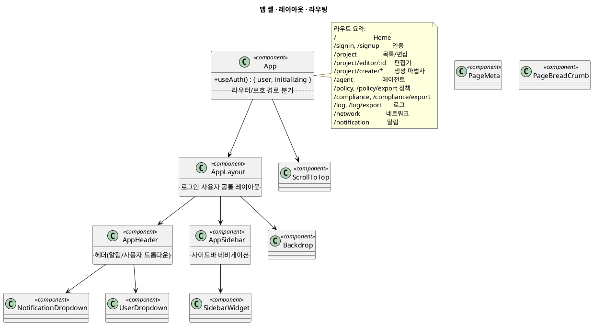
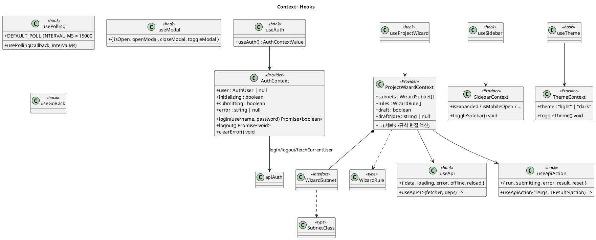
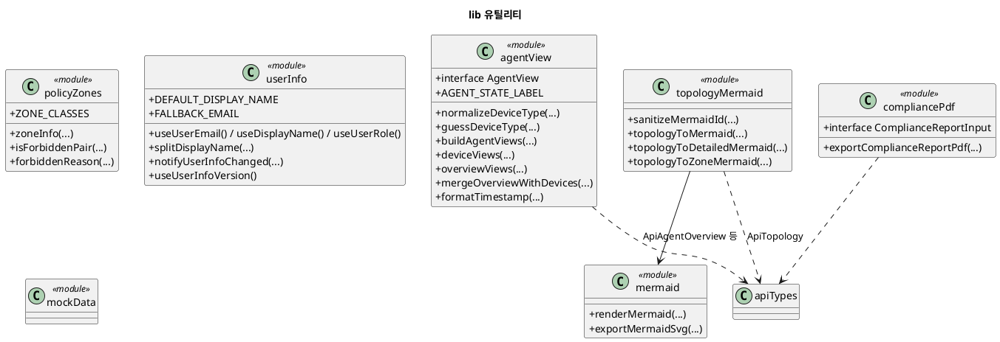

# Frontend (SonarValidator_Frontend) 클래스 다이어그램

`SonarValidator_Frontend` (React + TypeScript + Vite + Tailwind)의 **전체 컴포넌트/모듈 구조**를
PlantUML로 정리한 문서입니다. React 함수 컴포넌트이므로 "클래스"는 컴포넌트/훅/모듈 단위로 표현했습니다.

- **기술 스택**: React 18, TypeScript, react-router, Tailwind CSS, mermaid, jsPDF
- **소스 루트**: `src/`
- **렌더링**: PlantUML 코드블록을 지원하는 뷰어에서 확인

---

## 1. 전체 개요

브라우저는 백엔드와 **REST**로만 통신합니다. (에이전트 전용 WebSocket Envelope 채널은 브라우저가 쓰지 않습니다.)

```plantuml
@startuml Frontend_Overview
title Frontend 전체 개요

skinparam classAttributeIconSize 0
skinparam shadowing false

package "진입점 / 셸" {
  class main
  class App <<component>>
  class AppLayout <<component>>
  class AppHeader <<component>>
  class AppSidebar <<component>>
  class Backdrop <<component>>
  class SidebarWidget <<component>>
}

package "Context (전역 상태)" {
  class AuthContext
  class ProjectWizardContext
  class SidebarContext
  class ThemeContext
}

package "Hooks" {
  class useApi
  class useApiAction
  class usePolling
  class useModal
  class useGoBack
}

package "API 계층 (lib/api)" {
  class apiClient <<module>>
  class apiIndex <<module>>
  class apiTypes <<module>>
  class apiAuth <<module>>
  class apiProjects <<module>>
  class apiAiLogs <<module>>
  class apiNotifications <<module>>
  class apiOffline <<module>>
  class apiOpnsense <<module>>
  class apiPolicyAdvice <<module>>
}

package "도메인 컴포넌트" {
  class DashboardCards
  class ProjectComponents
  class PolicyComponents
  class ComplianceComponents
  class AgentComponents
  class LogComponents
  class OfflineComponents
}

package "페이지 (pages)" {
  class ProjectEditor
  class ProjectCreation
  class Agent
  class PolicyManagement
  class Compliance
  class LogManagement
  class NetworkManagement
  class Notification
  class DashboardHome
  class UserProfiles
}

package "lib 유틸" {
  class agentView <<module>>
  class mermaid <<module>>
  class topologyMermaid <<module>>
  class policyZones <<module>>
  class compliancePdf <<module>>
  class userInfo <<module>>
}

package "UI 킷 (TailAdmin)" {
  class UIKit <<grouped>>
}

main --> App : render
App --> AuthContext : useAuth()
App --> AppLayout : 보호 라우트
App --> ProjectEditor
App --> Agent
App --> PolicyManagement
App --> Compliance
App --> LogManagement
App --> DashboardHome
AppLayout --> AppHeader
AppLayout --> AppSidebar
AppLayout --> SidebarContext
App --> ThemeContext
App --> SidebarContext
App --> ProjectWizardContext

ProjectEditor --> ProjectComponents
ProjectEditor --> ProjectWizardContext
Agent --> AgentComponents
PolicyManagement --> PolicyComponents
Compliance --> ComplianceComponents
LogManagement --> LogComponents
DashboardHome --> DashboardCards

ProjectComponents --> apiProjects
AgentComponents --> apiIndex
PolicyComponents --> apiIndex
PolicyComponents --> apiPolicyAdvice
LogComponents --> apiAiLogs
ComplianceComponents --> apiIndex
OfflineComponents --> apiOffline

apiProjects --> apiClient
apiIndex --> apiClient
apiAiLogs --> apiClient
apiNotifications --> apiClient
apiOffline --> apiClient
apiOpnsense --> apiClient
apiPolicyAdvice --> apiClient
apiAuth --> apiClient
apiTypes ..> apiClient : 타입 계약

useApi --> apiClient
useApiAction --> apiClient
ProjectWizardContext --> useApi
ProjectWizardContext --> apiProjects
ProjectWizardContext --> apiIndex
AuthContext --> apiAuth
topologyMermaid --> mermaid
compliancePdf --> apiTypes
agentView ..> apiTypes
@enduml
```

---

## 2. 앱 셸 · 레이아웃 · 라우팅

---

## 3. Context · Hooks

---

## 4. API 계층

```plantuml
@startuml Frontend_Api
title API 계층 (lib/api)

skinparam classAttributeIconSize 0
skinparam shadowing false

class apiClient <<module: client.ts>> {
  + API_BASE_URL : string
  + class ApiError extends Error
  + apiRequest<T>(path, options) Promise<T>
}

class apiIndex <<module: index.ts>> {
  + listAgents()
  + getAgentTelemetry(agentId)
  + getAgentConfigs()
  + listAgentOverview(projectId?)
  + registerExpectedAgent(...)
  + deleteExpectedAgent(agentId)
  + removeAgentTelemetry(...)
  + pruneStaleAgents(...)
  + getAgentBundleInfo(...)
  + downloadAgentBundle(...)
  + getPolicyViolations(projectId)
  + getPolicyForbiddenPairs(projectId)
  + pushPolicy(...)
  + getTopology(projectId)
  + getDiscoveredDevices(projectId)
  + getAllDiscoveredDevices()
  + listRouteTables(protocol?)
  + getRouteTable(agentId, protocol?)
  + listComplianceChanges(options?)
  + quarantineAgent(...) / releaseQuarantine(...)
  + listQuarantined(...) / getQuarantineStatus(agentId)
}

class apiAuth <<module: auth.ts>> {
  + interface AuthUser / LoginResponse / ManagedUser
  + login(username, password)
  + logout()
  + fetchCurrentUser()
  + changePassword(...)
  + listUsers() / createUser() / setUserEnabled()
}

class apiProjects <<module: projects.ts>> {
  + interface SubnetInput / RuleInput
  + listProjects() / getProject(id)
  + createProject() / updateProject() / deleteProject()
  + validateProject() / validateDraft()
  + getForbiddenPairs()
  + toSubnetInput() / toRuleInput()
}

class apiAiLogs <<module: aiLogs.ts>> {
  + interface ApiAiProvider / ApiDeviceLog / ApiLogAnalysis ...
  + listAiProviders() / listEnabledAiProviders()
  + listLogs() / analyzeLogs() ...
}

class apiNotifications <<module: notifications.ts>> {
  + interface NotificationQuery
  + listNotifications() / getNotificationSummary()
  + listUnreadNotifications()
  + markNotificationRead() / markAllNotificationsRead() / deleteNotification()
}

class apiOffline <<module: offline.ts>> {
  + interface ApiOfflineSchema / ApiOfflineImportResult ...
  + getOfflineSchema() / getOfflineImported()
  + downloadSnapshot() / importSnapshots() / importSnapshotJson()
  + precheckFile() / formatBytes()
}

class apiOpnsense <<module: opnsense.ts>> {
  + interface OPNsenseCredential / OPNsenseProbeResult ...
  + listCredentials() / getCredential()
  + saveCredential() / deleteCredential()
  + verifyCredential() / verifyAllCredentials() / probeCredential()
}

class apiPolicyAdvice <<module: policyAdvice.ts>> {
  + interface ApiPolicyAdvice / ApiPolicyAdviceOption ...
  + requestPolicyAdvice() / listPolicyAdvices() / getPolicyAdvice()
  + adviceRiskColor()
}

class apiTypes <<module: types.ts>> {
  + type SubnetClass / ViolationSeverity / RuleOrigin
  + interface ApiSubnet / ApiRule / ApiProject / ApiProjectSummary
  + interface ApiViolation / ApiValidationReport / ApiPolicyViolations
  + interface ApiForbiddenPair(s)
  + interface ApiTopologyNode / ApiTopologyEdge / ApiTopology
  + interface ApiDiscoveredInterface / ApiDiscoveredVlan / ApiDiscoveredDevice(s)
  + interface ApiAgentSummary / ApiAgentList / ApiAgentOverview(List)
  + interface ApiRoute / ApiRouteTable
  + interface ApiNotification(List/Summary)
  + interface ApiComplianceChange(s)
  + interface ApiQuarantineState / ApiQuarantineRelease / ApiQuarantineList / ApiQuarantineStatus
}

apiIndex --> apiClient
apiAuth --> apiClient
apiProjects --> apiClient
apiAiLogs --> apiClient
apiNotifications --> apiClient
apiOffline --> apiClient
apiOpnsense --> apiClient
apiPolicyAdvice --> apiClient
apiIndex ..> apiTypes
apiProjects ..> apiTypes
apiAuth ..> apiTypes

note bottom of apiClient
  base URL 결정:
  VITE_API_BASE_URL > 개발 기본값(현재 호스트:3000).
  localhost 하드코딩 금지. 404를 "데이터 없음"으로
  조용히 넘기지 않도록 규칙을 한 곳에서 관리.
end note
@enduml
```

---

## 5. 도메인 컴포넌트

```plantuml
@startuml Frontend_DomainComponents
title 도메인 컴포넌트

skinparam classAttributeIconSize 0
skinparam shadowing false

package "dashboard" {
  class AgentTableCard <<component>>
  class LatestTopologyCard <<component>>
  class LogStatusCard <<component>>
  class ProjectListCard <<component>>
}

package "project" {
  class AgentDeployCard <<component>> {
    + AgentDeviceType
    + AGENT_DEVICE_TYPES
    + AgentDeployCardProps
  }
  class RuleEditor <<component>>
  class SubnetEditor <<component>>
  class ViolationSummary <<component>>
  class AgentList <<component>>
}

package "policy" {
  class PolicyAdviceCard <<component>>
  class PolicyAdviceModal <<component>>
}

package "compliance" {
  class Compliance <<component>>
}

package "ai" {
  class AiProviderSettings <<component>>
}

package "offline" {
  class OfflineImportCard <<component>>
}

package "opnsense" {
  class OPNsenseConfigModal <<component>>
}

package "auth" {
  class SignInForm <<component>>
  class SignUpForm <<component>>
}

package "UserProfile" {
  class AccountManagementCard <<component>>
  class UserAddressCard <<component>>
  class UserInfoCard <<component>>
  class UserMetaCard <<component>>
}

package "common" {
  class MermaidDiagram <<component>>
  class Branch_Divider <<component>>
  class ChartTab <<component>>
  class ComponentCard <<component>>
}

package "header" {
  class NotificationDropdown <<component>>
  class UserDropdown <<component>>
}

PolicyAdviceModal ..> apiPolicyAdvice : requestPolicyAdvice
AgentDeployCard ..> apiIndex : downloadAgentBundle
AgentList ..> apiIndex : listAgents
OfflineImportCard ..> apiOffline : importSnapshots
OPNsenseConfigModal ..> apiOpnsense : save/verifyCredential
AiProviderSettings ..> apiAiLogs : listAiProviders
SignInForm ..> apiAuth : login
SignUpForm ..> apiAuth
AccountManagementCard ..> apiAuth : changePassword
LatestTopologyCard ..> apiIndex : getTopology
ViolationSummary ..> apiIndex : getPolicyViolations
MermaidDiagram --> mermaid : render
@enduml
```

---

## 6. 페이지 (pages)

```plantuml
@startuml Frontend_Pages
title 페이지 (라우트 컴포넌트)

skinparam classAttributeIconSize 0
skinparam shadowing false

package "대시보드/프로젝트" {
  class Home
  class Project
  class ProjectCreation
  class ProjectEditor
  class DetectedNetworkNodes
  class SubnetAdvanceConfiguration
  class NetworkSegmentationRule
  class TopologyRulePreview
}

package "정책/컴플라이언스" {
  class PolicyManagement
  class PolicyExporter
  class Compliance
  class ComplianceExporter
}

package "운영" {
  class Agent
  class NetworkManagement
  class NetworkTopologyMermaid
  class LogManagement
  class Notification
  class UserProfiles
}

package "인증/기타" {
  class AuthLayout
  class SignIn
  class SignUp
  class NotFound
  class Calendar
  class Blank
  class FormElements
  class BasicTables
  class Alerts
  class Avatars
  class Badges
  class Buttons
  class Images
  class Videos
  class LineChart
  class BarChart
}

ProjectEditor --> ProjectComponents : RuleEditor/SubnetEditor/ViolationSummary
ProjectCreation --> ProjectWizardContext
SubnetAdvanceConfiguration --> ProjectWizardContext
NetworkSegmentationRule --> ProjectWizardContext
TopologyRulePreview --> ProjectWizardContext
DetectedNetworkNodes --> apiIndex : getAllDiscoveredDevices
PolicyManagement --> PolicyComponents
PolicyExporter --> compliancePdf : exportComplianceReportPdf
Compliance --> ComplianceComponents
ComplianceExporter --> compliancePdf
Agent --> AgentComponents
NetworkManagement --> apiIndex : getTopology
NetworkTopologyMermaid --> topologyMermaid
LogManagement --> LogComponents
Notification --> apiNotifications
UserProfiles --> UserProfileComponents
SignIn --> SignInForm
SignUp --> SignUpForm
@enduml
```

---

## 7. lib 유틸

---

## 8. UI 킷 (TailAdmin 템플릿 컴포넌트)

프로젝트 특화가 아니라 재사용 UI 프리미티브입니다. (개별 나열 대신 그룹으로 정리)

```plantuml
@startuml Frontend_UIKit
title UI 킷 그룹

skinparam classAttributeIconSize 0
skinparam shadowing false

package "components/ui" {
  class Alert <<Alert.tsx>>
  class Avatar <<Avatar.tsx>>
  class Badge <<Badge.tsx>>
  class Button <<Button.tsx>>
  class Dropdown <<Dropdown.tsx>>
  class DropdownItem <<DropdownItem.tsx>>
  class Modal <<modal/index.tsx>>
  class Table <<table/index.tsx>>
  class Images <<ResponsiveImage / 2·3 Column Grid>>
  class Videos <<AspectRatio / 4:3 / 1:1 / 16:9 / 21:9>>
}

package "components/form" {
  class Form <<Form.tsx>>
  class Label <<Label.tsx>>
  class InputField <<input/InputField.tsx>>
  class Checkbox <<input/Checkbox.tsx>>
  class Radio <<input/Radio.tsx / RadioSm.tsx>>
  class TextArea <<input/TextArea.tsx>>
  class Select <<form/Select.tsx>>
  class MultiSelect <<MultiSelect.tsx>>
  class Switch <<switch/Switch.tsx>>
  class FileInput <<input/FileInput.tsx>>
  class DatePicker <<date-picker.tsx>>
  class FormElements <<form-elements/*>>
}

package "components/charts" {
  class BarChartOne <<charts/bar>>
  class LineChartOne <<charts/line>>
}

package "components/ecommerce (샘플)" {
  class DemographicCard
  class EcommerceMetrics
  class MonthlySalesChart
  class MonthlyTarget
  class RecentOrders
  class StatisticsChart
  class CountryMap
}

package "components/tables" {
  class BasicTableOne
}

package "components/common" {
  class MermaidDiagram
  class ComponentCard
  class PageBreadCrumb
  class PageMeta <<AppWrapper>>
  class ScrollToTop
  class ThemeToggleButton
  class ThemeTogglerTwo
  class GridShape
  class Branch_Divider
  class ChartTab
}
@enduml
```

---

## 9. 디렉터리 요약

| 경로                | 주요 모듈                                                                                                                            | 역할             |
| ------------------- | ------------------------------------------------------------------------------------------------------------------------------------ | ---------------- |
| `src/App.tsx`     | `App`                                                                                                                              | 라우터/인증 분기 |
| `src/layout/`     | `AppLayout`, `AppHeader`, `AppSidebar`, `Backdrop`, `SidebarWidget`                                                        | 공통 레이아웃    |
| `src/context/`    | `AuthContext`, `ProjectWizardContext`, `SidebarContext`, `ThemeContext`                                                      | 전역 상태        |
| `src/hooks/`      | `useApi`, `useApiAction`, `usePolling`, `useModal`, `useGoBack`                                                            | 데이터/상태 훅   |
| `src/lib/api/`    | `client`, `index`, `types`, `auth`, `projects`, `aiLogs`, `notifications`, `offline`, `opnsense`, `policyAdvice` | REST 계층        |
| `src/lib/`        | `agentView`, `mermaid`, `topology/mermaid`, `policy/zones`, `pdf/compliancePdf`, `userInfo`, `mockData`                | 도메인 유틸      |
| `src/components/` | dashboard, project, policy, compliance, ai, offline, opnsense, auth, UserProfile, common, header                                     | 도메인 컴포넌트  |
| `src/components/ui  | form                                                                                                                                 | charts           |
| `src/pages/`      | 약 35개 화면                                                                                                                         | 라우트 컴포넌트  |

---

## 10. 주요 계약 / 주의점

- **REST 우선**: 브라우저는 Agent용 WebSocket(`/api/v1/management`, `/api/v1/telemetry`)을 쓰지 않고, 동일 데이터를 REST로 읽습니다.
- **타입 = 서버 snake_case**: `lib/api/types.ts`는 서버 응답 필드명(snake_case)을 그대로 유지합니다. 화면 표기(camelCase)로의 변환은 Context/컴포넌트 경계에서 합니다.
- **등급은 추측하지 않음**: 수집 초안의 서브넷 등급은 항상 `Open` + `manually_edited=false`이며, 등급 결정은 사람이 합니다.
- **`useApi`의 404 규칙**: 404를 "데이터 없음"으로 조용히 넘기지 않도록 `client.ts`에서 한 번만 규칙을 정합니다.
