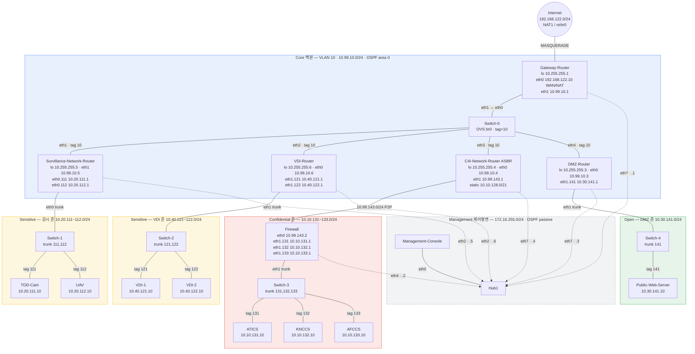

# PoC 네트워크 구성도

GNS3 프로젝트 `D-AI-PBL-PoC-Network`의 전체 망 구성도입니다.
IP/VLAN 상세는 [네트워크_구성_요약.md](네트워크_구성_요약.md)를 참고하세요.

## 전체 토폴로지

## 범례

| 표기 | 의미 |
|------|------|
| 실선 | 데이터평면 (10.x 대역, OSPF area 0) |
| 점선 | 제어평면 (172.16.255.0/24, OSPF passive) |
| 파랑 | Core 백본 (VLAN 10) |
| 빨강 | Confidential 존 (C4I, Firewall 뒤 VLAN 131/132/133) |
| 노랑 | Sensitive 존 (감시 VLAN 111/112, VDI VLAN 121/122) |
| 초록 | Open/DMZ 존 (VLAN 141) |
| 회색 | Management 제어평면 (Hub1) |

## 핵심 구성 요약

- **Core**: Switch-0(VLAN 10)에 5개 라우터 접속. Gateway-Router가 OSPF DR + 인터넷 NAT + `default-information originate always`
- **Confidential**: C4I-R ↔ Firewall P2P(10.99.143.0/24). FW 뒤 VLAN 131/132/133 — C4I-R이 ASBR로 `10.10.128.0/21` 집계 광고
- **Sensitive**: 감시 존(VLAN 111/112, Surv-R) + VDI 존(VLAN 121/122, VDI-R)
- **Open/DMZ**: DMZ-R → Switch-4 → Public-Web-Server (VLAN 141)
- **Management**: 전 라우터/Firewall/스위치가 Hub1 경유 172.16.255.0/24, OSPF passive로 데이터평면과 분리
