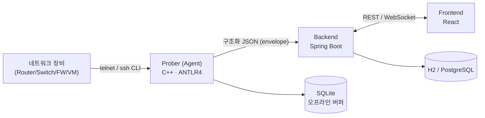

# SonarValidator

망분리 환경을 위한 오픈소스 네트워크 정책 검증 도구입니다.

네트워크 장비(Router / Switch / Firewall / VM / OVS)에서 설정과 상태를 수집한 뒤,
**의도한 정책대로 실제로 동작하는지**를 검증하고 위반 사항을 알려 줍니다.

## 구성 요소

| 구성 요소 | 역할 | 기술 |
| --- | --- | --- |
| **Prober (Agent)** | 장비에 붙어 CLI 출력·설정을 수집하고 파싱해 서버로 전송 | C++23, ANTLR4, SQLite |
| **Backend** | 수집 데이터 수신·저장, 정책 검증, REST/WebSocket API | Java 26, Spring Boot 4.1, H2/PostgreSQL |
| **Frontend** | 정책 편집, 토폴로지 시각화, 검증 결과 대시보드 | React + TypeScript, Vite |
| **Docs** | 설계 문서 사이트 | Docusaurus |



## 저장소 구조

```
.
├── SonarValidator_Prober/     # C++ 수집 에이전트
│   ├── components/            # 재사용 부품 (parser, device, policy, terminal …)
│   ├── module/                # 오케스트레이션 (수집 / 초기화 / 관리 / 내보내기)
│   ├── database/              # SQLite 계층 (schema, telemetry_store)
│   └── workers/               # 워커 스레드
├── SonarValidator_Backend/    # Spring Boot 서버
│   └── src/main/antlr4/       # Java 쪽 ANTLR 문법 (.g4)
├── SonarValidator_Frontend/   # React 프론트엔드
├── docs/docs/                 # Docusaurus 문서 사이트
└── docker/                    # 이미지 / 컴포즈 정의
```

## 빠른 시작

### 1. Backend

Java 26 과 Maven Wrapper 를 사용합니다. 시스템 `mvn` 은 필요하지 않습니다.

```bash
cd SonarValidator_Backend
./mvnw spring-boot:run -Dspring-boot.run.arguments=--server.port=3300
```

- 기본 포트는 3000 이지만 Docker 로 띄운 백엔드가 3000 을 점유하는 경우가 많아,
  개발 중에는 **3300** 을 권장합니다.
- H2 콘솔과 actuator 는 각각 `/h2-console`, `/actuator` 에서 확인할 수 있습니다.

### 2. Prober

ANTLR 툴체인(jar + C++ 런타임)이 필요합니다. 경로는 환경변수로 지정할 수 있습니다.

```bash
cd SonarValidator_Prober
ANTLR4_JAR=$HOME/tools/antlr.jar \
ANTLR4_RUNTIME_ROOT=$HOME/tools/antlr4-install \
./build.sh          # 구성 → 빌드 → 테스트 → 실행
```

수동으로 빌드/테스트만 할 때:

```bash
cd SonarValidator_Prober
cmake -S . -B build -DANTLR4_JAR=... -DANTLR4_RUNTIME_ROOT=...
cmake --build build
ctest --test-dir build --output-on-failure
```

### 3. Frontend

```bash
cd SonarValidator_Frontend
npm install
npm run dev
```

### 4. 전체 스택 (Docker)

```bash
docker compose up --build
```

## 테스트

| 대상 | 명령 | 현재 상태 |
| --- | --- | --- |
| Backend | `cd SonarValidator_Backend && ./mvnw test` | **183 tests, 0 failures** |
| Prober | `cd SonarValidator_Prober && ctest --test-dir build --output-on-failure` | **12 tests, 100% passed** |

## CLI 출력 파서 (ANTLR)

장비 출력은 벤더마다 형식이 다릅니다. 두 구현(Prober / Backend)이 **같은 문법 5종**을 공유하고
**같은 JSON 계약**을 만들어 내도록 맞춰져 있습니다. Prober 가 보낸 JSON 이 그대로 백엔드로
넘어가기 때문에, 양쪽 계약이 어긋나면 데이터가 조용히 사라집니다.

| 문법 | 대상 | 예시 명령 |
| --- | --- | --- |
| `IpAddr` | 인터페이스 / 주소 / 라우트 / 이웃 | `ip a`, `ip route show`, `ip neigh` |
| `FrrRouter` | FRR vtysh 출력 (라우트 코드 포함) | `show ip route` |
| `SwitchTopology` | 스위치 토폴로지 · 포트 · VLAN | `show vlan brief`, `show interfaces switchport` |
| `OvsTopology` | OpenVSwitch 브리지 | `ovs-vsctl show` |
| `NftablesRule` | 방화벽 규칙 | `nft list ruleset` |

문법을 고칠 때는 **Visitor 를 손보지 말고 `.g4` 를 고칩니다.** Visitor / BaseVisitor 는
ANTLR 이 자동 생성합니다.

- Java: `src/main/antlr4/.../grammar/*.g4` → `./mvnw antlr4:antlr4`
- C++: `components/parser/grammar/*.g4` → `cmake --build build --target regenerate_parser`
  (생성물은 저장소에 커밋되므로 **재생성 결과를 함께 커밋**해야 합니다)

자세한 내용은 [`SonarValidator_Backend/README.md`](SonarValidator_Backend/README.md) 와
[`SonarValidator_Prober/README.md`](SonarValidator_Prober/README.md) 를 참고하세요.

## 문서

Docusaurus 로 만든 문서 사이트가 `docs/docs` 에 있습니다.

```bash
cd docs/docs
npm run start
```

## 라이선스

[LICENSE](LICENSE) 참고.
