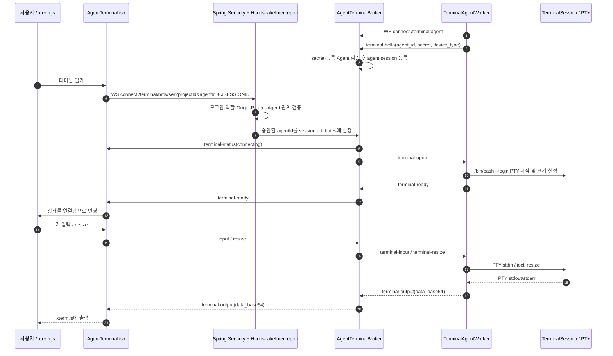

# SonarValidator 터미널 구조와 동작 원리

이 문서는 SonarValidator의 브라우저 터미널을 구성하는 Frontend, Backend, Prober Agent, 로컬 PTY의 책임과 연결 절차를 기록합니다. 일반 정책 수집/관리 채널과 대화형 터미널 채널은 같은 Agent를 사용하더라도 별도 WebSocket입니다.

## 핵심 요약

- 브라우저는 Backend의 `/api/v1/terminal/browser` WebSocket에 연결합니다.
- Agent는 Backend의 `/api/v1/terminal/agent` WebSocket에 먼저 연결해 세션을 유지합니다.
- Backend는 두 연결 사이에서 terminal 제어/입출력 메시지를 중계합니다. Backend가 셸이나 PTY를 실행하지 않습니다.
- 실제 `/bin/bash --login` PTY는 Agent 프로세스가 열고 읽고 씁니다.
- 브라우저의 `연결됨`은 Agent가 `terminal-ready`를 반환한 뒤에만 표시해야 합니다.

## 구성도

```mermaid
flowchart LR
    subgraph Browser[브라우저]
      UI[Project 화면 / AgentTerminal.tsx]
      XTERM[xterm.js 입력·출력]
      AUTH[AuthContext / JSESSIONID]
      UI <--> XTERM
      AUTH -. 세션 쿠키 .-> UI
    end

    subgraph Server[SonarValidator Backend]
      SECURITY[Spring Security]
      INTERCEPT[TerminalBrowserHandshakeInterceptor\n권한·Origin·Project 소속 검증]
      BROWSER_WS[/api/v1/terminal/browser]
      BROKER[AgentTerminalBroker\nagentId별 WebSocketSession map]
      AGENT_WS[/api/v1/terminal/agent]
      DB[(PostgreSQL\nProject / ExpectedAgent)]
      BROWSER_WS --> INTERCEPT --> BROKER
      AGENT_WS <--> BROKER
      INTERCEPT --> DB
    end

    subgraph Host[Agent가 실행되는 VM 또는 네트워크 장비]
      WORKER[TerminalAgentWorker\n재접속·WebSocket 메시지 처리]
      PTY[TerminalSession\n/bin/bash --login PTY]
      WORKER <--> PTY
    end

    UI <-->|WSS/WS: browser handshake, input, resize, output| BROWSER_WS
    WORKER <-->|WSS/WS: terminal-hello, open, ready, input/output| AGENT_WS
```

> 보안 경계: Browser 경로는 Spring Security 필터에서 WebSocket upgrade가 가능하도록 허용되더라도, `TerminalBrowserHandshakeInterceptor`에서 인증된 ROLE_ADMIN/ROLE_OPERATOR, 허용 Origin, Project 존재, Agent의 Project 소속을 검사해야 합니다. Agent 경로는 `terminal-hello` 메시지에서 공유 secret과 등록된 Agent를 확인합니다. secret 값은 로그/문서에 기록하지 않습니다.

## 연결 시퀀스



## 레이어 및 패키지 책임

### Frontend: `SonarValidator_Frontend/src`

| 경로 | 책임 |
| --- | --- |
| `components/project/AgentTerminal.tsx` | xterm.js 생성, Browser WebSocket 연결, resize/input 전송, output 렌더링, 재시도 버튼 제공 |
| `pages/Project.tsx` 및 프로젝트 컴포넌트 | Project/Agent 목록에서 터미널을 열고 닫는 UI 연결 |
| `context/AuthContext.tsx` | 시작 시 `/api/v1/auth/me`로 세션 복원, 로그인/로그아웃 상태 관리 |
| `lib/api/auth.ts` | 로그인·현재 사용자·로그아웃 REST API |
| `lib/api/client.ts` | API base URL, `credentials: include`, 요청/오류 처리 |
| `App.tsx`, `main.tsx` | 라우팅 및 AuthProvider 구성. 보호된 화면은 세션 상태가 확정된 뒤 렌더링 |

Frontend는 Agent 주소를 직접 사용하지 않습니다. 사용자 입력은 브라우저→Backend로만 갑니다. Compose 배포에서는 브라우저가 `http://<host>/api/...`로 요청하고 `docker/frontend/nginx.conf`가 `/api/`를 `backend:3000`으로 reverse proxy하므로 같은 origin입니다. Nginx는 WebSocket Upgrade 헤더를 전달하고 buffering을 끄도록 설정돼 있습니다. 반면 현재 `SonarValidator_Frontend/vite.config.ts`에는 dev proxy 설정이 없고 `API_BASE_URL`은 기본적으로 현재 hostname의 3000 포트를 가리킵니다. 그래서 Vite 개발 실행에서는 브라우저가 `http://<host>:3000/api/...`로 직접 연결하며 backend CORS와 session cookie 조건이 적용됩니다. `JSESSIONID`는 HttpOnly이므로 `document.cookie`에서 보이지 않는 것이 정상입니다. 인증 여부는 `/api/v1/auth/me` 응답으로 확인합니다.

### Backend: `SonarValidator_Backend/src/main/java/org/sonar/sonarvalidator_backend`

| 패키지/클래스 | 책임 |
| --- | --- |
| `Config/WebSocketConfig` | `/api/v1/terminal/agent`, `/api/v1/terminal/browser` WebSocket handler 등록 및 Browser handshake interceptor 연결 |
| `Config/SecurityConfig` | HTTP 요청의 인증/권한 정책. Browser WebSocket upgrade 경로가 필터에서 차단되지 않게 하되 interceptor 검증은 유지 |
| `Config/TerminalBrowserHandshakeInterceptor` | 인증 역할, 허용 Origin, query의 `projectId`/`agentId`, Project 존재, Agent-Project 소속 확인 |
| `Config/TerminalAgentWebSocketHandler` | Agent `terminal-hello` 검증, Agent 세션 등록, Agent 메시지 타입 검증 및 Broker 전달 |
| `Config/TerminalBrowserWebSocketHandler` | Browser 연결 시 Broker에 열기 요청, input/resize 수신, Browser 종료 처리 |
| `Service/AgentTerminalBroker` | `agentId`별 Agent/Browser `WebSocketSession` 관리 및 메시지 양방향 중계 |
| `Repository/ExpectedAgentRepository`, `ProjectRepository` | handshake/Agent 등록 시 DB에서 Agent 및 Project 관계 확인 |
| `Model`, `Model/dto` | JPA 엔티티와 API 계약 모델 |
| `Controller` | 로그인, 프로젝트, Agent 등 REST API. 터미널 데이터 경로 자체는 WebSocket handler가 담당 |

Broker의 두 연결 map은 Backend 프로세스 메모리에만 존재합니다. Backend를 재시작하면 모든 WebSocket이 끊기며 Agent가 재접속하고 Browser도 다시 열어야 합니다. 수평 확장 시에는 단일 인스턴스 메모리 map으로 충분하지 않으므로 sticky routing 또는 별도 session/message broker 설계가 필요합니다.

### Prober Agent: `SonarValidator_Prober`

| 경로 | 책임 |
| --- | --- |
| `main.cpp` | 프로세스 진입점 및 worker 시작 |
| `module/initializing_module/` | 설정 읽기 및 Prober 초기화 |
| `module/configuration_module/prober_config.*` | `SONAR_CONFIG_PATH` 또는 기본 설정에서 Server endpoint, Agent ID/name, 공유 secret 읽기 |
| `workers/TerminalAgentWorker.cpp` | Backend Agent WebSocket에 연결, hello 전송, 메시지 처리, 재접속, PTY 데이터 전달 |
| `components/terminal/terminal_session.*` | 로컬 PTY 생성·종료, read/write, terminal 크기 변경 |
| `components/backend_communication/` | Backend 네트워크 연결 및 공통 통신 코드 |
| `workers/` | Management, telemetry, terminal 등 장기 실행 worker |
| `module/management_module/` | Agent 관리/정책 수신 및 관리 명령 처리 |
| `module/telemetry_module/` | Agent 상태/네트워크 telemetry 수집 및 전송 |
| `module/offline_export_module/` | 연결 불가 시 로컬 데이터 보관/내보내기 지원 |
| `database/` | SQLite 로컬 저장 계층 |
| `components/parser/` | ANTLR 생성 Parser 및 장비 CLI 출력 파싱 |
| `components/device/`, `components/policy/` | 장비 타입/정책 관련 도메인 코드 |

Prober 전체 구조에는 장비별 수집·파서·정책 코드가 있지만, 대화형 터미널 데이터 경로의 최소 핵심은 `TerminalAgentWorker`와 `TerminalSession`입니다.

### 저장소 최상위

| 경로 | 용도 |
| --- | --- |
| `SonarValidator_Frontend/` | React + TypeScript + Vite 브라우저 앱 |
| `SonarValidator_Backend/` | Spring Boot REST/WebSocket 서버 및 영속성 계층 |
| `SonarValidator_Prober/` | C++ Agent/수집기, parser, PTY, SQLite 및 worker |
| `docker/`, `docker-compose.yml` | 서비스별 Dockerfile 및 통합 로컬 스택 |
| `mock_API/` | Frontend/API 작업용 mock 구현 |
| `docs/` | Docusaurus 설계·사용 문서 사이트 |
| `Agent_Test/` | Agent/배포 실험 파일 및 시나리오 |
| `dev.sh` | 로컬 Frontend/Backend 개발 실행 스크립트 |

## 관련 라이브러리와 런타임

아래는 현재 manifest/build 설정에서 확인한 라이브러리입니다. Frontend 버전은 `package.json`의 범위 지정 버전(`^`, `~`)이며, 실제 설치 버전은 lockfile을 기준으로 합니다. Backend의 Spring Boot BOM이 관리하는 transitive 버전과 Prober 시스템 라이브러리 버전은 각 빌드/설치 환경에 따라 달라질 수 있습니다.

### 터미널 경로에서 직접 사용

| 계층 | 라이브러리 | 확인된 버전/출처 | 터미널에서 맡는 역할 |
| --- | --- | --- | --- |
| Frontend | React / React DOM | `^19.0.0` | 화면과 터미널 컴포넌트 lifecycle |
| Frontend | `@xterm/xterm` | `^6.0.0` | 브라우저 내 terminal emulator, 키 입력/화면 출력 |
| Frontend | `@xterm/addon-fit` | `^0.11.0` | terminal 영역 크기에 맞춰 rows/columns 계산 |
| Frontend | Native WebSocket API | 브라우저 내장 | Browser↔Backend WebSocket transport. Socket.IO는 사용하지 않음 |
| Frontend | React Router | `react-router ^7.1.5`, `react-router-dom ^7.18.3` | 프로젝트 화면/인증 라우팅. WebSocket transport 자체는 담당하지 않음 |
| Backend | Spring Boot WebSocket | `spring-boot-starter-websocket`; parent `4.1.1` | Agent/Browser WebSocket endpoint와 handler |
| Backend | Spring Security | `spring-boot-starter-security`; parent `4.1.1` | HTTP session 인증 및 URL 접근 정책. WS Browser 권한은 handshake interceptor도 검증 |
| Backend | Jackson | Spring Boot 관리 `tools.jackson.databind` | JSON WebSocket message parse/serialize |
| Agent | Boost.Asio | system/header dependency, CMake `find_package(Boost)` 또는 include 탐색 | TCP resolver/socket 및 event loop |
| Agent | Boost.Beast | Boost headers | HTTP WebSocket handshake와 비동기 frame read/write |
| Agent | nlohmann/json | CMake `find_package(nlohmann_json 3.11)` 또는 FetchContent fallback `3.11.3` | hello/control/output message JSON encode/decode |
| Agent | OpenSSL Crypto | CMake `find_package(OpenSSL REQUIRED COMPONENTS Crypto)` | Prober 공통 암호/해시 기능. WebSocket TLS 사용 여부는 별도 SSL stream 설정을 확인해야 함 |
| Agent | POSIX PTY/process APIs | Linux/POSIX OS API | `/bin/bash --login` PTY spawn, terminal I/O 및 resize. 별도 terminal emulator 라이브러리는 아님 |

### 주변 기반 라이브러리

| 계층 | 라이브러리 | 확인된 버전/출처 | 프로젝트 내 역할 |
| --- | --- | --- | --- |
| Frontend | Vite | `^6.1.0` | Frontend dev server 및 production bundling |
| Backend | Spring Web MVC / WebFlux | `spring-boot-starter-webmvc`, `spring-boot-starter-webflux`; parent `4.1.1` | REST 및 reactive web 지원. Terminal relay는 등록된 Spring WebSocket handler/Broker 경로 |
| Backend | Spring Data JPA / Hibernate | `spring-boot-starter-data-jpa`; Boot 관리 버전 | Project/ExpectedAgent 관계 조회 및 영속화 |
| Backend | PostgreSQL JDBC | `org.postgresql:postgresql`, runtime scope, Boot 관리 버전 | Backend PostgreSQL 접속 |
| Agent | SQLite3 | CMake `find_package(SQLite3 REQUIRED)` | Agent 로컬 database/store |
| Agent | ANTLR4 C++ Runtime | 설치 prefix 탐색, generated parser 사용 | 장비 CLI 텍스트 parsing. Terminal WebSocket transport에는 직접 관여하지 않음 |

이 구조에서 WebSocket framing은 Browser에서는 브라우저 표준 API, Backend에서는 Spring WebSocket, Agent에서는 Boost.Beast가 각각 담당합니다. 세 구간 사이에 Socket.IO나 별도 message broker가 끼어 있지 않습니다. Backend의 `AgentTerminalBroker`는 애플리케이션 메모리에서 두 WebSocket session 사이의 JSON message를 전달합니다.

## React xterm 사용법

현재 React 터미널 구현은 `SonarValidator_Frontend/src/components/project/AgentTerminal.tsx`에 있습니다. xterm은 terminal 화면과 키 입력을 제공할 뿐, Agent에 직접 연결하거나 셸을 실행하지 않습니다. 연결 전제 조건은 사용자가 프로젝트 화면에 로그인되어 있고, Backend의 browser WebSocket이 인증/Origin/프로젝트 소속 검사를 통과하며, 같은 Agent의 terminal WebSocket session이 Backend broker에 등록된 상태입니다.

### 의존성

```bash
cd SonarValidator_Frontend
npm install
```

터미널 UI는 `@xterm/xterm`과 `@xterm/addon-fit`을 사용합니다. `@xterm/xterm/css/xterm.css`도 컴포넌트에서 import해야 기본 terminal 렌더링 스타일이 적용됩니다. 프로젝트에서는 `npm run dev`로 Vite 개발 서버를 실행하고, `npm run build`로 타입 검사와 production bundle 생성을 확인합니다.

### 컴포넌트 연결 순서

1. `Terminal`을 만들고 `FitAddon`을 등록한 다음 `terminal.open(container)`를 호출합니다.
2. `API_BASE_URL`을 WebSocket scheme으로 바꾸고 `/api/v1/terminal/browser?projectId=...&agentId=...`에 브라우저 기본 `WebSocket`으로 접속합니다. Compose frontend build에서는 base URL이 비어 있으므로 브라우저는 같은 origin의 `/api/...`를 호출하고 nginx가 Backend로 전달합니다. Vite dev에서는 `API_BASE_URL` 기본값이 `http://<현재 호스트>:3000`이므로 브라우저가 Backend에 직접 접속합니다.
3. `open` 이벤트는 Browser↔Backend handshake 완료만 뜻하므로 상태를 “Agent 연결 대기”로 둡니다. Agent 셸 연결 성공으로 표시하면 안 됩니다.
4. WebSocket이 열릴 때와 terminal container 크기가 바뀔 때 `FitAddon.fit()`으로 `cols`/`rows`를 얻어 `resize` 메시지를 보냅니다.
5. `terminal.onData`에서 받은 키 입력은 `{type: "input", data}`로 보냅니다. Backend가 Agent 프로토콜인 `terminal-input`으로 변환합니다.
6. 수신 message를 JSON으로 파싱합니다. `terminal-ready`는 셸 준비 완료, `terminal-output`은 base64 decode 후 `terminal.write(bytes)`, `terminal-error`는 오류 상태/문구 표시입니다.
7. component cleanup에서 `ResizeObserver`, terminal input subscription, WebSocket, xterm 인스턴스를 정리합니다. 재연결 버튼은 component 연결 시도를 다시 실행합니다.

`terminal-ready`를 받기 전의 `open` 이벤트는 handshake 신호일 뿐입니다. 화면에서 WebSocket `open`은 발생했는데 `terminal-ready`가 오지 않는다면 xterm 렌더링보다 Backend broker→Agent의 `terminal-open` 전달이나 Agent PTY 시작을 먼저 확인해야 합니다.

### Wire message 예시

아래 예시는 secret 없이 terminal 세션이 열린 뒤 오가는 메시지만 보여줍니다.

```json
{"type":"resize","cols":100,"rows":30}
{"type":"input","data":"whoami\r"}
{"type":"terminal-output","data_base64":"dXNlcg0K"}
{"type":"terminal-ready"}
```

Browser handshake는 로그인 cookie를 사용하는 인증 연결입니다. WebSocket URL에 secret을 넣거나 secret을 React 코드에 전달하지 않습니다. Frontend와 Backend가 서로 다른 origin인 개발 환경에서는 API client의 credential 정책, CORS 허용 origin, cookie의 SameSite/Secure 설정이 모두 맞아야 합니다.

### 오류 판별

| 관찰 결과 | 의미 및 다음 확인 |
| --- | --- |
| Network에 browser WS 요청이 없고 xterm도 생성되지 않음 | Project UI에서 component mount 조건, React console error, xterm CSS/container 크기 확인 |
| WS upgrade가 401/403 또는 101이 아님 | Browser 인증 cookie, ROLE_ADMIN/ROLE_OPERATOR, Origin, `projectId`와 `agentId`의 project 관계 확인 |
| WS 101 이후 `terminal-error`로 종료 | Backend broker 로그를 확인. `no open agent`는 Agent terminal session 미등록, `browser session already active`는 이미 열린 browser session을 뜻함 |
| WS 101 후 `terminal-status: connecting`만 오고 ready가 안 옴 | Agent가 `terminal-open`을 받았는지, `/bin/bash --login` PTY 생성 여부, Agent→Backend `terminal-ready` 송신 확인 |
| `terminal-ready`가 왔지만 화면이 비거나 키 입력 무반응 | xterm `terminal.write`, base64 decode, `terminal.onData`, Backend broker 전달, Agent PTY read/write 확인 |
| 브라우저 닫기/재렌더 후 재접속이 `already active`로 거절됨 | 이전 WS close event와 Backend `browserClosed` 처리를 확인. 개발자 도구에서 Network WS의 close status도 확인 |

같은 Agent에는 현재 Browser terminal session 하나만 허용됩니다. 빠른 재연결에서 이전 WebSocket close가 Backend에 도착하기 전에 새 연결을 만들면 일시적으로 `browser session already active`가 발생할 수 있습니다. 동시에 열린 여러 탭에서 같은 Agent terminal을 열어도 두 번째 탭은 거절됩니다.

## 디버깅 계획

목표는 실패가 Browser handshake, Broker 전달, Agent PTY 중 어디에 있는지 실제 한 번의 시도로 구분하는 것입니다. 순서대로 증거를 남기고, 한 단계가 확인되면 다음 단계로 넘어갑니다.

| 순서 | 작업 | 성공 기준 / 기록 |
| --- | --- | --- |
| 1. Browser 재현 | 로그인된 프로젝트 페이지에서 `test-vm` 터미널을 한 번만 열고 DevTools Network의 WS 요청/응답/Frames/close status 및 Console을 확인 | Browser WS가 101인지, 첫 수신 frame이 무엇인지 기록. `terminal-hello` frame은 secret이 포함되므로 저장/공유 금지 |
| 2. Backend handshake | 같은 시각의 Backend 로그에서 `/api/v1/terminal/browser` handshake, interceptor 승인/거절, broker open/reject/close를 대조 | 거절 이유가 인증/Origin/Project/Agent offline/중복 세션 중 하나로 분류됨 |
| 3. Agent 등록 | Backend 로그에서 `terminal agent connected: test-vm` 이후 socket close가 없는지 확인하고 broker가 Agent session을 유지하는지 점검 | Browser 연결 시점에 열린 Agent session이 있음 |
| 4. PTY 요청/응답 | Agent 로그의 `terminal-open` 처리, PTY open 결과, `terminal-ready` 송신과 Backend relay 순서를 확인 | Backend가 `terminal-ready`를 Browser에 relay함 |
| 5. 데이터 왕복 | Browser에서 `whoami`를 입력하고 input frame, Agent PTY write, Agent output frame, Browser terminal render 순으로 확인 | 명령 출력이 xterm에 나타남 |
| 6. 최소 수정/회귀 | 확인된 첫 실패 지점만 수정하고 Frontend build, Backend 해당 테스트, Prober Debug build를 실행 | 수정된 계층의 검증 통과 및 재현 절차 성공 |

현재 관찰된 `browser session already active`는 Backend가 두 번째 브라우저 연결을 거절한 직접 원인입니다. 첫 세션의 생성 로그와 이후 close 로그를 같은 session ID로 짝지어 확인해야 합니다. 화면의 refresh/re-render가 두 번 연결을 만드는지, 첫 WebSocket이 정리되지 않는지, Backend close callback이 실행되지 않는지를 위 순서로 검증합니다. xterm 자체가 원인이라고 단정하지 않습니다. xterm은 WS handshake 이후의 입력/출력 렌더링 계층이므로, 101 후 `terminal-ready`를 받기 전에는 backend broker와 Agent/PTy 경로가 우선 조사 대상입니다.

Frontend `main.tsx`는 React `StrictMode`로 앱을 감쌉니다. 개발 모드 StrictMode는 effect setup/cleanup을 추가로 실행합니다. 2026-10-09 조사에서 기존 cleanup이 `OPEN` 소켓만 닫고 `CONNECTING` 소켓은 남기는 결함을 확인했습니다. 첫 effect의 소켓이 나중에 연결되어 Broker를 점유하고, 다음 effect의 연결은 중복 세션으로 거절됐습니다. cleanup에서 `CONNECTING`과 `OPEN` 모두 닫도록 수정했으며 StrictMode는 유지합니다.

### 2026-10-09 test-vm 복구 및 검증

- Backend 로그에서 첫 Browser 세션 생성 직후 두 번째 세션이 `browser session already active for test-vm`으로 거절되는 것을 확인했습니다. Agent의 `terminal agent connected: test-vm` 등록도 확인했습니다.
- `TerminalBrowserWebSocketHandler`는 `openBrowser()`의 모든 실패에 같은 offline/shared-secret 문구를 표시합니다. 따라서 이 문구만으로 Agent 인증 실패를 단정하지 말고 Broker 로그의 실제 거절 이유를 확인해야 합니다.
- 수정 전에 이미 누수된 소켓은 HMR로 회수되지 않을 수 있습니다. 이번 실행에서는 페이지 reload 이후에도 기존 세션이 남아 Backend를 재시작하여 메모리 세션을 정리했습니다. Backend 재시작은 다른 연결과 로그인 세션도 끊으므로 Agent 재접속과 Browser 재로그인이 필요합니다.
- 실제 Debug Prober를 실행한 상태에서 Browser의 `연결됨`, `whoami` 결과 `osboxes`, 재연결 후 `printf` 출력 왕복을 확인했습니다. 이 셸은 별도 SSH 대상이 아니라 Prober가 실행 중인 호스트의 사용자 권한으로 실행됩니다.
- Frontend 폴더의 `npm test`는 기존 React/jsdom/TypeScript 의존성으로 실제 `AgentTerminal`을 StrictMode에서 실행해 폐기된 연결 중 소켓, 재연결 시 열린 소켓, unmount 시 연결 중 소켓이 닫히는지 검사합니다. `terminal-ready` 수신 후 상태 변경과 resize 전송도 확인합니다.
- `npm test` 및 `npm run build` 통과. 빌드에는 기존 CSS 최소화 및 번들 크기 경고가 남아 있습니다. Backend와 Prober 소스는 이번 수정에서 변경하지 않았습니다.

### 테스트 공백과 수정 후보

- `AgentTerminalBrokerTest`의 테스트 이름은 닫힌 browser session 대체를 말하지만, 실제 assertion은 `openBrowser()`가 `isOpen() == false`인 session을 수락하는 동작을 전제합니다. 현재 구현은 `putIfAbsent()` 뒤 기존 세션이 closed일 때 `replace()`로 교체하므로, 테스트가 검증하는 정확한 세션 객체 상태와 송신 성공 여부를 재검토해야 합니다.
- `TerminalBrowserWebSocketHandler`의 handshake 이후 실패 경로를 검증하는 통합 테스트가 필요합니다. 특히 Agent 미연결, 이미 활성 browser session, terminal-open 전송 실패, browser close 후 재연결을 구분해야 합니다.
- React 쪽은 WebSocket constructor를 감싼 transport hook이 없어 component lifecycle과 socket lifecycle 테스트가 어렵습니다. 먼저 중복 mount/reconnect 원인을 재현하고, 필요할 때만 socket 생성/정리 로직을 작은 hook으로 분리해 테스트합니다.
- 진단 로그에는 session ID, agent ID, frame type와 close code를 기록하되 cookie, shared secret, 입력 데이터, terminal 출력 내용은 기록하지 않습니다.

## Wire message 계약

| 방향 | 타입 | 주요 필드 | 의미 |
| --- | --- | --- | --- |
| Agent → Backend | `terminal-hello` | `agent_id`, `secret`, `device_type` | Agent 인증/등록. 이후 Agent session에 agentId 연결 |
| Backend → Agent | `terminal-open` | 없음 | PTY 시작 요청 |
| Agent → Backend → Browser | `terminal-ready` | 없음 | PTY 시작 완료 신호 |
| Backend → Browser | `terminal-status` | `status` | 연결/셸 시작 상태 |
| Browser → Backend → Agent | `input` → `terminal-input` | `data` | 키 입력 전달 |
| Browser → Backend → Agent | `resize` → `terminal-resize` | `cols`, `rows` | PTY 크기 변경 |
| Agent → Backend → Browser | `terminal-output` | `data_base64` | PTY 출력 전달 |
| Agent ↔ Backend | `terminal-error`, `terminal-exit`, `terminal-close` | `message` 등 | 오류 및 종료 알림 |

Browser 입력은 8192자 이하, resize는 열 20–300/행 5–100으로 제한됩니다. Agent 출력은 base64로 전송하여 임의의 terminal byte를 JSON으로 안전하게 전달합니다.

## 장애 계층 판별

1. `GET /api/v1/auth/me`가 401이면 Browser 세션 인증 문제입니다. Project UI가 화면에 남아 있더라도 REST 응답이 권위 있는 상태입니다.
2. Browser handshake가 HTTP 401이면 Spring Security 필터, `beforeHandshake`에서 거절되면 세션/역할/Origin/Project-Agent 검증을 확인합니다.
3. Browser WebSocket이 열리고 `Agent terminal is offline...`이면 Broker에 사용 가능한 Agent session이 없거나 Browser 중복 세션 정책에 걸린 것입니다.
4. Browser WebSocket은 열렸지만 `terminal-ready`가 오지 않으면 Agent 메시지 전달, PTY 시작, Agent 프로세스 로그를 확인합니다.
5. `terminal-ready` 뒤 화면에 출력이 없으면 Browser input/output handler, base64 변환, PTY read/write를 확인합니다.
6. Management의 `온라인` 상태는 terminal Agent WebSocket 등록을 증명하지 않습니다. Management, telemetry, terminal은 별도 worker/channel입니다.

### 화면의 오류 문구를 코드 경로에 연결하기

화면에서 `Agent terminal is offline or not configured with the shared secret`가 보이고 이어서 `Terminal connection closed. Refresh to reconnect.`가 표시되면, 이는 한 가지 원인으로 확정된 진단 메시지가 아니라 Browser handler가 `openBrowser()` 실패를 전달한 결과입니다. 현재 Broker 구현에서는 보통 다음 조건에서 실패합니다.

- 해당 agentId가 map에 없거나 저장된 Agent WebSocket session이 닫혀 있음: `no open agent session` 로그
- `terminal-open`을 Agent WebSocket으로 보낼 수 없음: `could not send terminal-open` 로그
- 같은 agentId의 이전 Browser session이 아직 열려 있음: `browser session already active` 로그

공유 secret 불일치는 별도 경로입니다. Agent가 `terminal-hello`를 보냈을 때 Backend가 secret 길이/값 또는 등록 여부를 거절하고 WebSocket을 닫습니다. 이 경우 Agent 로그의 handshake/read error와 Backend의 Agent socket close 상태를 함께 확인해야 합니다. secret 값을 로그로 남기거나 비교 출력하지 말고, 양쪽 설정이 동일한 비밀값을 사용하고 있는지만 안전하게 확인합니다.

### 개발자용 재현 및 확인 순서

이 순서는 UI 오류를 각 연결 단계로 나눕니다. Browser/WebSocket 확인은 개발자 도구 Network의 WS 항목에서 하며, `terminal-hello`에는 secret이 포함되므로 payload를 공유하거나 복사하지 않습니다.

| 단계 | 확인할 것 | 정상일 때 | 비정상일 때 볼 위치 |
| --- | --- | --- | --- |
| 1. 인증 | `GET /api/v1/auth/me` | 200 및 사용자 반환 | 로그인 상태, `AuthContext.tsx`, cookie/CORS/credentials 설정 |
| 2. Agent 프로세스 | Prober 실행 상태 및 terminal log | worker가 실행 중이고 반복 접속 오류 없음 | `main.cpp` worker 시작 경로, `TerminalAgentWorker.cpp`, 프로세스 환경 변수 |
| 3. Agent endpoint | Agent의 설정 host/port로 Backend 접근 | TCP 연결 후 `/api/v1/terminal/agent` WS upgrade 성공 | `SERVER_IP`, `SERVER_PORT`, Docker port publish, route/firewall, Agent의 `/api/v1/terminal/agent` path |
| 4. Agent 인증/등록 | Backend 로그의 새 `terminal agent connected: <agentId>` | hello 검증 뒤 Broker에 session 등록 | Backend `sonar.terminal.shared-secret`, Agent 설정 `TERMINAL_SHARED_SECRET`, ExpectedAgent 등록/project 연결 |
| 5. Browser handshake | Network의 `/api/v1/terminal/browser` WS status | HTTP 101 Switching Protocols | `projectId`/`agentId`, `JSESSIONID`, Origin, role, interceptor 로그 |
| 6. Broker→Agent | Browser 연결 직후 Backend 로그 및 Agent 수신 | `terminal-open`을 받고 Agent가 `terminal-ready` 전송 | Broker의 `no open agent`, `already active`, `send failed` 중 실제 사유 |
| 7. PTY/output | 화면에 prompt가 뜬 뒤 `whoami` 실행 | Agent host의 사용자명이 출력 | `TerminalSession::Open/ReadAvailable/WriteRaw`, Agent terminal error/output 처리 |

### 설정과 로그 위치

- Agent 설정 파일 기본 경로는 `/etc/sonar_validator_prober/default.conf`이며, `SONAR_CONFIG_PATH` 환경 변수가 있으면 해당 파일을 사용합니다.
- Agent에서 확인할 키는 `SERVER_IP`, `SERVER_PORT`, `AGENT_NAME`/`AGENT_ID`, `TERMINAL_SHARED_SECRET`입니다. secret을 명령행 인자나 로그로 출력하지 않습니다.
- Backend shared secret은 `sonar.terminal.shared-secret` 설정에서 공급됩니다. 배포 환경에서는 secret store 또는 보호된 환경설정에서 주입하고, Frontend에는 절대 전달하지 않습니다.
- Agent 연결 재시도 간격은 현재 `TerminalAgentWorker.cpp`에서 2초이며, TCP connect timeout은 5초입니다. `Connection refused`는 해당 시점에 TCP 연결 대상이 연결을 거절했다는 뜻이지, secret mismatch를 뜻하지 않습니다.
- Agent가 실행되는 위치와 Backend가 실행되는 위치를 먼저 구분합니다. `localhost`는 각 프로세스가 실행되는 자기 host/container를 가리키므로, Docker 내부 주소와 host에서 실행하는 Agent의 목적지 주소를 혼동하지 않습니다.
- Backend health HTTP 200은 HTTP endpoint의 응답만 증명합니다. Agent WebSocket의 upgrade, hello 인증, Broker 등록까지는 각 단계 로그로 따로 확인해야 합니다.

### 수정 책임 경계

- Browser 인증/URL/재시도 UI 문제: Frontend `AgentTerminal.tsx`, `AuthContext.tsx`, API client와 Backend CORS/session 설정을 함께 확인합니다.
- 인증 이후 Browser upgrade 거절: Backend `SecurityConfig`, `TerminalBrowserHandshakeInterceptor`, Origin 및 Project-Agent 소속 검증을 확인합니다. 보안 검증을 우회하는 방식으로 고치지 않습니다.
- Agent가 Backend에 접속하지 못함: 먼저 프로세스 실행 위치, endpoint IP/port, Docker publish, 네트워크 route/firewall을 확인합니다. HTTP health만으로 WS 경로가 검증된 것으로 취급하지 않습니다.
- Agent가 접속하지만 등록되지 않음: hello의 agent ID/project 등록/shared-secret 설정을 확인합니다. secret은 출력하지 않고 설정 출처와 배포 시점만 대조합니다.
- Agent 등록 후 PTY가 시작되지 않음: `terminal-open` 수신, PTY 시작 성공, `terminal-ready` 전송 순으로 Prober 로그와 코드 경로를 확인합니다.
- Agent와 Browser가 모두 연결됐는데 데이터가 오가지 않음: Backend Broker의 agentId 매핑 및 양쪽 handler의 허용 message type/필드명을 대조합니다.

## 현재 장애 기록 (2026-10-08)

### 확인한 사실

- Backend 컨테이너는 healthy이고 호스트 포트 3000은 loopback 및 Agent 설정 IP 모두에서 HTTP health 응답을 반환했습니다.
- Backend 로그에서 Agent WebSocket 최초 연결과 `test-vm` 등록이 확인됐지만, 그 이후 재접속 등록 로그는 보이지 않았습니다.
- 실행 중인 Agent 프로세스의 `/tmp/sonar-validator-agent/agent.log`에는 terminal channel의 반복 `Connection refused`가 기록되었습니다.
- 설정 파일의 endpoint IP/port는 host의 네트워크 인터페이스 및 공개된 Backend 포트와 일치했습니다. Secret 값은 기록하지 않았습니다.
- 공유 브라우저의 `/api/v1/auth/me`는 401을 반환했고 browser cookie jar에 session cookie가 없는 상태였습니다. 따라서 최근 Browser 요청들은 정상 인증 사용자 세션으로 검증되지 않았습니다.
- Browser에서 받은 `Agent terminal is offline or not configured with the shared secret` 오류는 Backend가 Agent 세션을 찾지 못할 때도 출력됩니다. 문구만으로 secret mismatch라고 단정할 수 없습니다.
- 현재 공유 화면에는 Project List에서 `test-vm`이 `온라인`으로 보이는 동시에 terminal 상태는 `연결 종료`이며, xterm 영역에 위 Agent offline 오류와 재연결 안내가 표시됩니다. 이 조합은 관리 channel의 상태와 terminal channel의 상태가 서로 다른 것을 보여줍니다.

### 해석

현재 화면 오류는 Browser만의 연결 설정 문제가 아닙니다. 동시에 두 가지가 관측됐습니다.

1. Browser 인증 세션이 없어 Browser handshake를 유효한 사용자 세션으로 시험할 수 없는 상태였습니다.
2. 더 직접적인 terminal 가용성 단서는 Agent terminal worker의 `Connection refused` 반복과 Backend의 최초 Agent 등록 이후 재등록 부재입니다. 즉 Browser가 Backend에 연결되어도 Agent 세션이 없으면 PTY를 열 수 없습니다.

`172.16.255.245:3000`의 HTTP health 성공은 해당 주소가 Backend와 통신 가능하다는 증거이지만, 그 순간 Agent terminal WebSocket upgrade/hello가 성공한다는 보장은 아닙니다. WebSocket 경로와 프로세스 lifecycle을 별도로 확인해야 합니다. 이 문서는 관측된 상태를 기록하며, 터미널 end-to-end 복구 완료를 주장하지 않습니다.

### 다음 확인 순서

1. 브라우저에서 `/signin`을 열어 사용자 자격 증명으로 로그인합니다. 비밀번호는 채팅/로그/터미널에 복사하지 않습니다.
2. `/api/v1/auth/me`가 200이고 인증 사용자를 반환하는지 확인합니다.
3. Backend 로그에서 `terminal agent connected: test-vm`이 새로 찍히고, 직후 socket close가 없는지 확인합니다.
4. Browser terminal WebSocket을 한 번만 열어 Broker 거절 로그 원인을 확인합니다.
5. `terminal-ready`와 셸 prompt를 확인한 뒤 `whoami`를 입력해 PTY 왕복을 검증합니다.
6. Backend 재시작 시 Agent 재접속 및 이전 broker session 정리를 각각 확인합니다.

## 개발 검증 위치

- Backend unit tests: `SonarValidator_Backend/src/test/java/.../Service/AgentTerminalBrokerTest.java`, `.../TerminalBrowserHandshakeInterceptorTest.java`
- Prober CMake/CTest: `SonarValidator_Prober/CMakeLists.txt`와 `SonarValidator_Prober/build-debug/`
- Frontend type/lint/build: `SonarValidator_Frontend/package.json`

실제 운영/개발 포트와 endpoint는 환경 설정에 따라 다를 수 있습니다. 문서에 비밀번호, shared secret, session cookie 등 credential 값을 넣지 않습니다.
