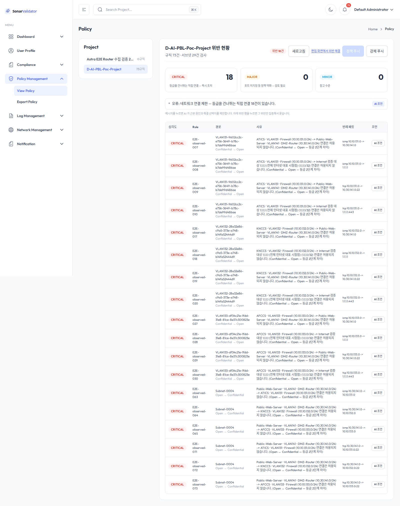
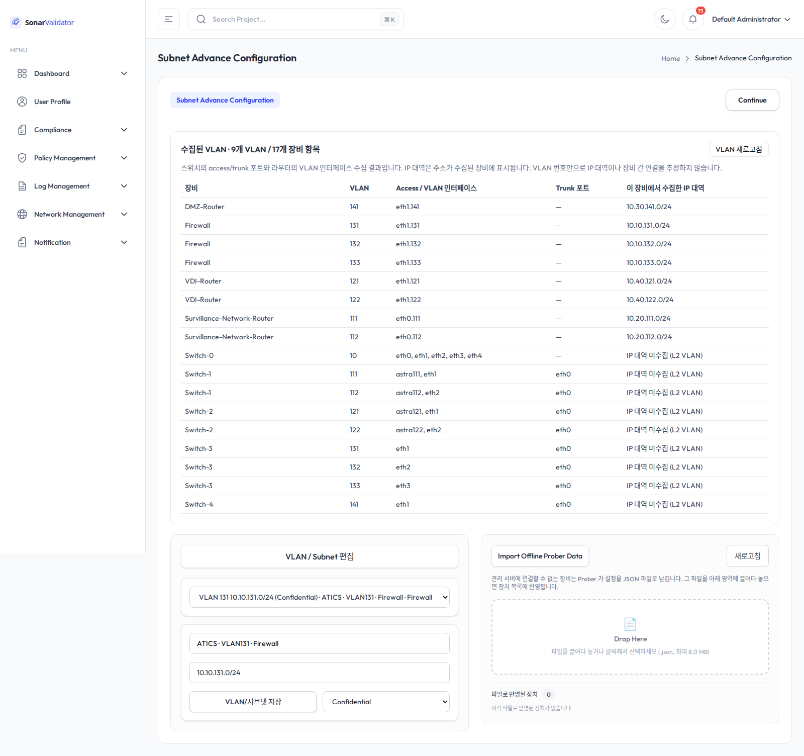
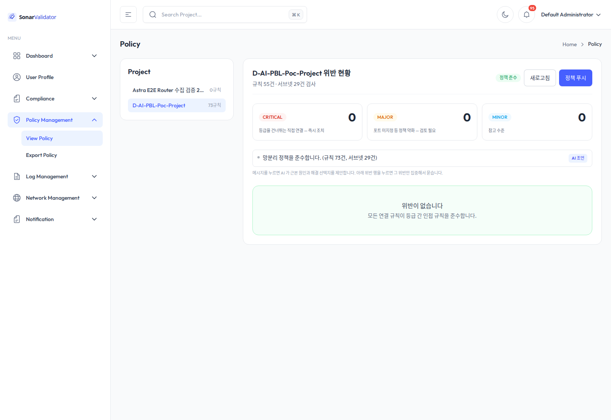

# CSO 등급 적용과 실제 망분리 E2E

2026-10-09 KST. 대상 프로젝트 `PRJ-D488B7A4` / D-AI-PBL-Poc-Project. 이전 단계의 “방화벽 에이전트만 배포” 범위 이후, 사용자가 VLAN·라우팅·방화벽 규칙 적용과 재기동 회귀 검증을 새로 요청하여 수행했다.

## 현재 확인된 결과

| 단계 | 실제 통신 | BDD |
| --- | --- | --- |
| VLAN 복구 후, ACL 적용 전 | 73건 모두 연결 성공. 그중 금지 연결 18건도 통과 | 활성 연결 73개에서 CRITICAL 18건 |
| ACL 적용 후 | 금지 18건 모두 차단, 허용 55건 모두 통과 | 실제 허용 연결 55개에서 위반 0건 |

ICMP 64건과 TCP 9건을 같은 출발지·목적지로 전후 비교했다. TCP는 실제 열린 DMZ/C4I SSH 22 및 인터넷 443을 사용했다. 단순 ping 실패만으로 성공이라고 하지 않고, 같은 목적지가 적용 전에 응답했는지와 허용 경로가 계속 응답하는지도 확인했다.

## 등급 분류

| VLAN / 망 | CIDR | 등급 | 근거 |
| --- | --- | --- | --- |
| ATICS / 131 | 10.10.131.0/24 | Confidential | PoC 문서의 C4I 존 |
| KNCCS / 132 | 10.10.132.0/24 | Confidential | PoC 문서의 C4I 존 |
| AFCCS / 133 | 10.10.133.0/24 | Confidential | PoC 문서의 C4I 존 |
| TOD-Cam / 111 | 10.20.111.0/24 | Sensitive | 문서의 감시 존 |
| UAV / 112 | 10.20.112.0/24 | Sensitive | 문서의 감시 존 |
| VDI-1 / 121 | 10.40.121.0/24 | Sensitive | 문서의 VDI 존 |
| VDI-2 / 122 | 10.40.122.0/24 | Sensitive | 문서의 VDI 존 |
| Public-Web-Server / 141 | 10.30.141.0/24 | Open | 문서의 DMZ 존 |
| Core / 10 | 10.99.10.0/24 | Sensitive | 이번 검증의 운영 인프라 분류 |
| C4I-Firewall 전송망 | 10.99.143.0/24 | Confidential | C4I 전용 연결, WAN 방어 규칙에도 포함 |
| 관리망 | 172.16.255.0/24 | Sensitive | 운영 인프라 분류. 시험 트래픽/업무망 규칙 생성 대상에서 제외 |
| Management-Console Docker 망 | 172.17.0.0/16, 172.18.0.0/16 | Sensitive | 운영 인프라 분류. 업무망 규칙 생성 대상에서 제외 |
| WAN NAT 전송망 | 192.168.122.0/24 | Open | 인터넷 측 전송망 |
| 인터넷 시험점 | 1.1.1.1/32 | Open | 실제 ICMP/TCP 443 검증 대상 |

업무망 등급의 근거는 `docs/blog/2026-09-22-poc-network-summary.md`다. 문서에서 CSO 등급이 없는 관리·Core·Docker 망은 사용자가 위임한 분류 범위 안에서 운영 인프라로 명시하여 분류했다. 이 인프라 등급은 조직의 공식 보안 등급을 확정한 것이 아니다.

스위치의 IP 없는 L2 VLAN은 문서의 실제 배선·VLAN·게이트웨이 대역을 확인하여 CIDR을 수동 보완했다. 같은 번호라는 이유만으로 자동 추측한 것은 아니다. 장비별 VLAN 항목을 보존했으며, 방화벽 VLAN 3개와 인터넷 시험점까지 총 29개 편집 항목을 저장했다.

## 실제 시험 경로

Confidential은 실제 ATICS·KNCCS·AFCCS VM의 `10.10.131/132/133.10`에서 실행했다. Open은 실제 Public-Web-Server `10.30.141.10`을 사용했다. GNS3 콘솔을 경유했지만 ping/TCP 트래픽은 각 VM의 업무 NIC에서 발생한다.

기존 TOD-Cam/UAV/VDI-1/VDI-2 컨테이너는 종료 상태였다. 이 노드의 통신 성공으로 오인하지 않도록 Switch-1/2에 임시 network namespace와 OVS access 포트를 만들고 각 VLAN의 `.250` 주소로 시험했다. 따라서 Sensitive 결과는 실제 스위치·트렁크·라우터 경로에 대한 시험이며, 종료된 업무 컨테이너의 애플리케이션 가용성 시험은 아니다. 임시 포트와 namespace는 시험 종료 때 제거한다.

## BDD 검증 범위

현재 제품의 BDD 입력은 저장된 서브넷·연결 규칙이다. 모든 장비의 임의 nftables/iptables 설정을 자동으로 합성해 실제 도달성을 증명하는 엔진은 아니다. 이번에는 **실측한 흐름을 DISCOVERED 규칙으로 기록**하고 BDD에 넣어 실제 패킷 시험과 대조했다.

적용 전 통과한 금지 흐름 18개가 모두 CRITICAL로 검출됐고, 반례 IP·프로토콜·포트가 해당 금지 대역 안에 있는지 확인한다. ACL 적용 후 차단된 18개는 삭제하지 않고 비활성으로 보존하며 차단 사유를 남겼다. 실제로 계속 통과한 55개만 활성 허용 규칙으로 검증한다. 실제 차단 없이 화면의 위반만 숨긴 것은 아니다.

BDD가 선택한 반례에는 서브넷의 `.0` 주소가 나올 수 있다. 이는 패킷 집합의 수학적 증거이며 실제 시험 호스트 주소는 별도 matrix JSON에 기록되어 있다.

추가 경계 시험에서 `Sensitive 10.10.0.0/16` 안의 `Confidential 10.10.131.0/24`가 Open으로 나가는 연결을 보고서가 누락하는 버그를 재현했다. 내부 `violating_combinations=65536`인데 `compliant=true`였던 원본 응답을 보존했다. 등급 라벨만 보고 제외하던 조건을 제거하고 실제 BDD 반례에 해당하는 금지 대역을 보고하도록 수정했다.

## 증거

- [ACL 적용 전 73개 실측 결과](before-matrix.json)
- [ACL 적용 후 73개 실측 결과](after-matrix.json)
- [전후 기대 결과 비교](matrix-comparison.json)
- [적용 전 BDD 18개 위반](before-bdd.json)
- [적용 후 BDD 결과](after-bdd.json)
- [중첩 대역 누락 버그 원본 재현](bdd-CIDR-overlap-before-fix.json)
- [수정 후 BDD 경계 테스트](bdd-cases-summary.json)
- [Prober가 전송한 nftables 원본 JSON](native-firewall-wire.json)
- [장비별 적용 규칙과 복구 방법](%EC%A0%81%EC%9A%A9-%EA%B7%9C%EC%B9%99.md)
- [Backend·Prober·Frontend 수정 내역](%EC%88%98%EC%A0%95%EC%82%AC%ED%95%AD.md)

## 한계

- 인터넷 시험은 `1.1.1.1`의 ICMP/TCP 443을 사용했다. ACL 자체는 특정 시험 IP가 아니라 Confidential의 C/S 이외 목적지 전체를 차단한다.
- C↔C, C↔S와 S↔Open은 문서의 CSO 인접 등급 정책에 따라 유지한다. 애플리케이션 프록시를 통한 우회·침해된 Sensitive 호스트·전체 포트의 서비스별 최소 권한 정책은 이번 판정 범위가 아니다.
- IPv4 CSO BDD다. IPv6은 C4I VLAN의 routed forward를 차단하여 우회 경로를 제한했으며 IPv6 허용 정책을 BDD로 검증한 것은 아니다.
- Gateway의 iptables 규칙은 CLI와 실제 트래픽으로 검증한다. 현재 FRR 수집기는 Gateway iptables 전체를 BDD 입력으로 자동 변환하지 않는다.
