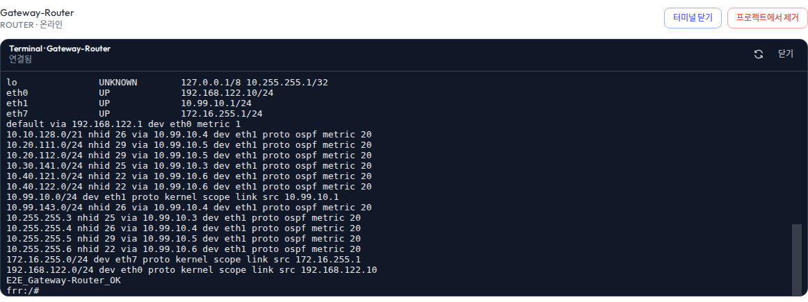
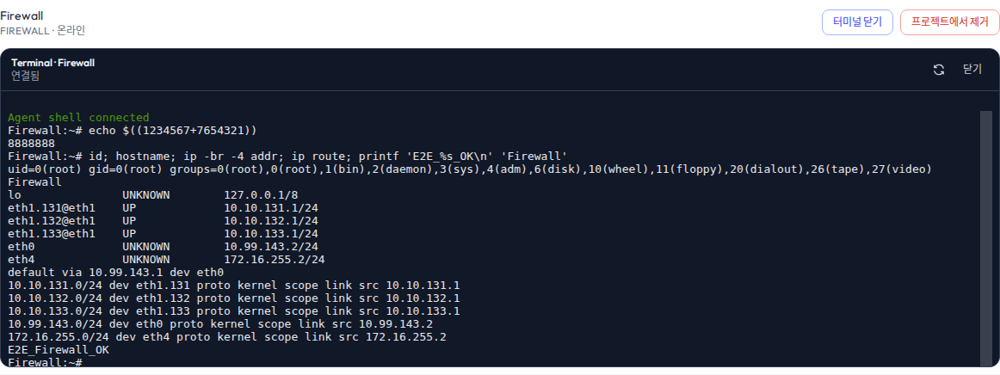
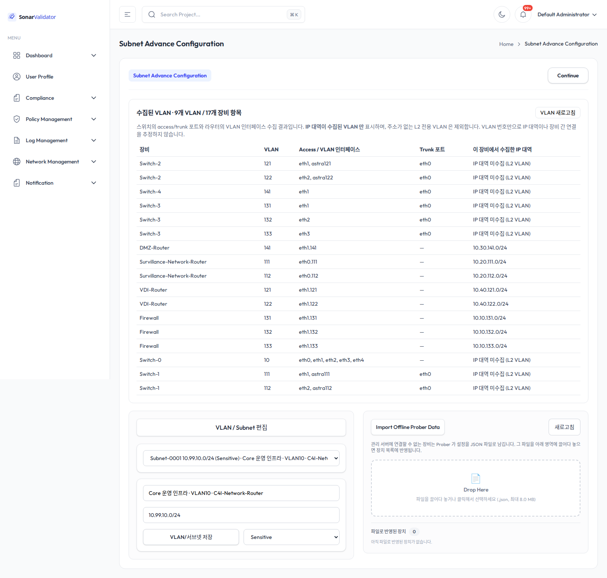
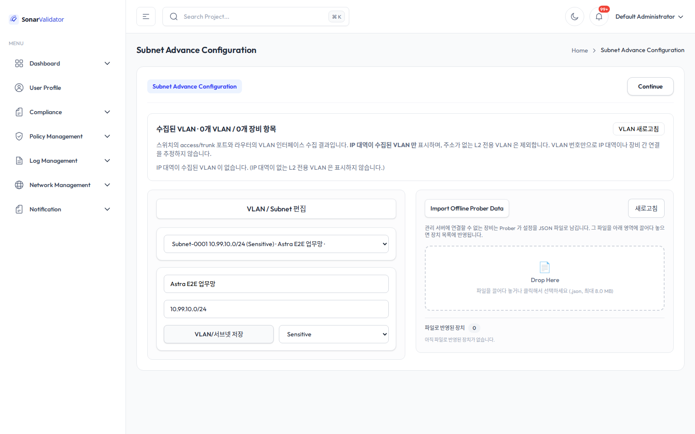
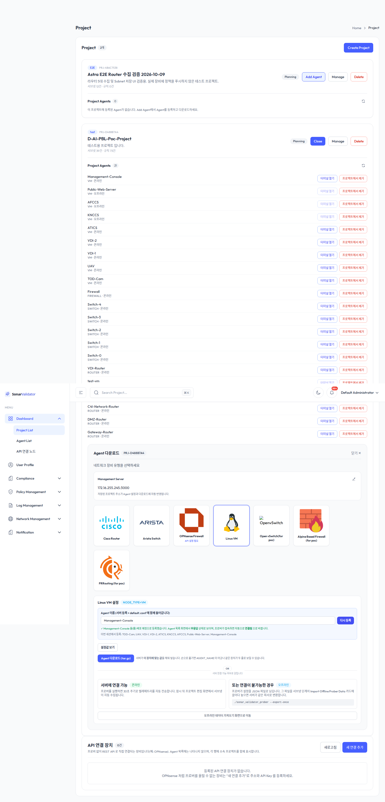

# Astra E2E (D-AI-PBL-POC) 재배포 · 프론트엔드 검증 결과

실행 환경: Management-Console `172.16.255.245` (Frontend `http://172.16.255.245`, Backend `:3000`).
GNS3 프로젝트 `D-AI-PBL-POC` (`5a790fe8-a6eb-4251-b21e-010258ac0241`) 의 노드에 에이전트를 재배포하고,
프론트엔드/백엔드를 기동한 뒤 브라우저에서 터미널·프로젝트/VLAN/CSO·로그 화면을 모두 검증했다.
2026-10-10 KST 기준이며, 실제 장비 수집값·API 응답·Playwright 브라우저 조작을 교차 검증했다.

## 최종 결과

| 항목 | 결과 |
| --- | --- |
| 인프라 재배포 (라우터 5 · 스위치 5 · 방화벽 1) | 11/11 성공, 동일 실행 파일 SHA-256 |
| VM 노드 배포 (TOD-Cam · UAV · VDI-1 · VDI-2 · ATICS) | 5/5 성공 (Management-Console 은 기존 실행 파일이 동일) |
| 설정·시크릿 감사 | 15/15 통과 (NODE_TYPE · SERVER_IP · AGENT_NAME · MANAGEMENT_PREFIX · 시크릿 일치) |
| 프론트엔드 터미널 14개 노드 | 14/14 통과 (`uid=0(root)` · 완료 마커) |
| 프론트엔드 UI 시나리오 | 8/8 단계 통과, page error 0 |
| 에이전트 연결 | 17/17 재접속, 표본 2회 사이 17/17 수집 시각 갱신 |
| 방화벽 네트워크 상태 | 재배포 전후 `nft`·주소·라우팅 완전 동일 |
| 프론트엔드 단위 테스트 | 3/3 통과 |
| 프론트엔드 TypeScript·production build | 통과 |
| 프론트엔드 lint | 오류 0, 기존 경고 7 |

배포 실행 파일 SHA-256: `1bfd3fa78e5080537c8d9b9c34d8900dba73475b53f83edb01e8863bc1321373`

## 배포 대상 노드

라우터는 OpenRC 서비스, 스위치·방화벽은 컨테이너의 `/etc/sonar_validator_prober/start.sh`(supervisor),
QEMU VM 은 systemd 로 실행한다. 컨테이너 VM 은 방화벽 뒤 GNS3 호스트(`192.168.122.1`)의 컨테이너로 배포했다.

| 주소 | 이름 | 유형 | 실행 방식 | 확인 |
| --- | --- | --- | --- | --- |
| 172.16.255.1 | Gateway-Router | Router / FRR | OpenRC | 배포·수집·터미널 통과 |
| 172.16.255.3 | DMZ-Router | Router / FRR | OpenRC | 배포·수집·터미널 통과 |
| 172.16.255.4 | C4I-Network-Router | Router / FRR | OpenRC | 배포·수집·터미널 통과 |
| 172.16.255.5 | Survillance-Network-Router | Router / FRR | OpenRC | 배포·수집·터미널 통과 |
| 172.16.255.6 | VDI-Router | Router / FRR | OpenRC | 배포·수집·터미널 통과 |
| 172.16.255.101 | Switch-0 | Switch / Open vSwitch | 컨테이너 | 배포·수집·터미널 통과 |
| 172.16.255.102 | Switch-1 | Switch / Open vSwitch | 컨테이너 | 배포·수집·터미널 통과 |
| 172.16.255.103 | Switch-2 | Switch / Open vSwitch | 컨테이너 | 배포·수집·터미널 통과 |
| 172.16.255.104 | Switch-3 | Switch / Open vSwitch | 컨테이너 | 배포·수집·터미널 통과 |
| 172.16.255.105 | Switch-4 | Switch / Open vSwitch | 컨테이너 | 배포·수집·터미널 통과 |
| 172.16.255.2 | Firewall | Firewall / Alpine nftables | 컨테이너 | 배포·수집·터미널 통과 |
| 192.168.122.58 경유 | Management-Console | VM / Ubuntu | systemd | 기존 실행 파일 동일, 터미널 통과 |
| 192.168.122.58 경유 | TOD-Cam, UAV, VDI-1, VDI-2 | VM / Ubuntu | 컨테이너 | 배포·수집·터미널 통과 |
| QEMU 콘솔 | ATICS | VM / Ubuntu | systemd | 콘솔 배포·systemd active·수집 통과 |

- 방화벽 뒤 컨테이너 VM 은 관리망 대신 `SERVER_IP=192.168.122.58` 로 백엔드에 접속한다.
- GNS3 에서 전원이 꺼져 있는 `KNCCS` · `AFCCS` · `Public-Web-Server` 는 이번 배포 대상에서 제외하고
  프론트엔드의 **등록 예정 Agent** 로만 등록했다(아래 "남은 범위" 참고).
- 기존 `test-vm` 은 이전 실행 파일로 동작하는 레거시이며 이번 배포 대상이 아니다.

## 재배포 절차

1. 백엔드 이미지가 번들(`/tmp/sonar_stage`)에 Prober 정적 바이너리·서비스 파일을 담고, 배포 번들을
   `http://172.16.255.245:8099/bundle.tar.gz` 로 제공한다. 번들 안의 `rc-service` 는
   OpenRC 용 실행 스크립트(아래 수정 항목 포함)를 담는다.
2. 라우터·스위치·방화벽은 Management-Console 에서 SSH/SFTP 로 배포했다
   (`scripts/deploy-infrastructure.py`). 실행 전 기존 파일은 `/root/sonar-backup-e2e2-<시각>` 에 보관한다.
3. 컨테이너 VM 은 GNS3 호스트를 경유해 `docker cp` + `deploy-node.sh container` 로 배포했다
   (`scripts/deploy-container-vm.py`).
4. ATICS(QEMU) 는 직렬 콘솔에서 번들을 내려받아 `deploy-node.sh systemd` 로 배포했다
   (`scripts/deploy-qemu.py`).

## 재배포 중 수정한 항목

**OpenRC 서비스 스크립트의 `supervise-daemon` 옵션 충돌.** 라우터 배포가 처음에는
`sonar_validator_prober: option is ambiguous: respawn` 으로 실패했다. 원인은
`supervise_daemon_args="--respawn"` 이 `--respawn-delay/-max/-period` 와 접두사가 겹치기 때문이다.
`--respawn-delay 5` 로 바꾸자 5대 라우터가 모두 정상 기동했고, 이 스크립트는
`Dockerfile.backend.bundle-fix` 를 통해 배포 번들에도 반영돼 있다.

**프론트엔드 터미널 테스트의 FRR pager 처리.** 라우터 터미널은 로그인 프로필에서 `vtysh` 를 실행하고,
그 출력이 `less` pager 로 표시되어 첫 키 입력이 pager 에 먹혔다. 테스트를 다음처럼 고쳤다.
초기 pager 를 Enter 로 걷어 `frr#` 프롬프트를 확인하고, `terminal length 0` 으로 paging 을 끈 뒤
`show ip route` 로 경로를 조회하고 `exit` 으로 shell 에 들어간다. shell 진입은 vtysh 가 입력을 그대로
에코하는 특성을 피해 `echo $((1234567+7654321))` 의 **계산 결과(8888888)** 가 보이는지로 판정한다.
이 수정으로 라우터 5대가 모두 `uid=0(root)` 를 반환했다.

**브라우저 로그인 판정의 타이밍 경합.** 검증 스크립트의 로그인 분기가 URL 에 `signin` 이 있는지를
한 번만 검사해서, SPA 가 `/api/v1/auth/me` 응답을 기다렸다가 `/signin` 으로 이동하는 사이에
검사를 통과하면 로그인을 건너뛰었다. 그러면 이후 API 호출이 401(빈 본문)로 돌아와
`Unexpected end of JSON input` 으로 중단됐다. 로그인 폼이 나타날 때까지 기다렸다가
입력·제출하고, 마지막에 `/auth/me` 200 을 확인해 실패 시 즉시 원인이 드러나게 고쳤다.

## 프론트엔드 검증

### 터미널 (14/14)

`AgentTerminal` WebSocket 으로 각 노드에 접속해 `id; hostname; ip -br -4 addr; ip route` 실행 후
`uid=0(root)` 와 완료 마커(`E2E_<이름>_OK`)를 확인했다. 라우터는 `show ip route` 로 FRR 경로를 조회한 뒤
shell 명령을 실행했다.

- [14대 터미널 결과](evidence/terminals-Gateway-Router_DMZ-Router_C4I-Network-Router_Survillance-Network-Router_VDI-Router_Switch-0_Switch-1_Switch-2_Switch-3_Switch-4_Firewall_TOD-Cam_UAV_Management-Console.json)
- [브라우저 오류 로그](evidence/terminals-Gateway-Router_DMZ-Router_C4I-Network-Router_Survillance-Network-Router_VDI-Router_Switch-0_Switch-1_Switch-2_Switch-3_Switch-4_Firewall_TOD-Cam_UAV_Management-Console-errors.json)

Gateway-Router: FRR 경로 조회 후 root shell(`frr:/#`)에서 `id`·hostname·완료 마커 확인.

Firewall: 실제 프론트엔드 터미널에서 root·hostname·완료 마커 확인.

### UI 시나리오 (8/8)

Playwright 로 실제 프론트엔드 화면을 조작하며 단계별 캡처와 assertion 을 남겼다.

| 단계 | 확인 내용 |
| --- | --- |
| dashboard | 로그인 후 대시보드 렌더 |
| project-list | 프로젝트 2개(실 프로젝트 `PRJ-D488B7A4`, fixture `PRJ-4B6C7538`) 표시 |
| agent-screen | `agents/overview` 연결 17/전체 21, Agent 화면 렌더 |
| project-editor | `/project/editor/PRJ-D488B7A4` Manage 화면 렌더 |
| subnet-advance-real | 실 프로젝트 편집 드롭다운 39행 · VLAN 행 23개 · `수집된 VLAN` 표 렌더 |
| subnet-edit-persist | fixture 에서 이름·CSO(Sensitive) 저장 → 새로고침 후 유지 → 원상 복구 |
| log-page | `/log` 화면 + `GET /api/v1/logs` HTTP 200 |
| compliance-policy | `/compliance` · `/policy` 렌더 |

- page error 0. 기록된 HTTP 401 1건은 로그인 전 세션 확인(`GET /api/v1/auth/me`)으로 정상 동작이다.
- [UI E2E 결과](evidence/ui-e2e-results.json)

실 프로젝트 Subnet Advance Configuration: 39개 서브넷/VLAN 행과 수집된 VLAN 표가 함께 표시된다.

fixture 프로젝트에서 이름·CSO 저장 후 새로고침해도 유지되는지 검증했다(이후 원상 복구).

### 단위 테스트 · 빌드 · lint

| 검사 | 명령 | 결과 |
| --- | --- | --- |
| 단위 테스트 | `npm test` | 3 통과, 실패 0 ([로그](logs/frontend-tests.log)) |
| production build | `npm run build` | 통과 ([로그](logs/frontend-build.log)) |
| lint | `npm run lint` | 오류 0, 기존 경고 7 ([로그](logs/frontend-lint.log)) |

## 설정 감사와 수집

배포 후 각 노드의 `/etc/sonar_validator_prober/default.conf` 를 읽어
`AGENT_NAME` · `NODE_TYPE` · `SERVER_IP` · `SERVER_PORT` · `MANAGEMENT_PREFIX` 와
공유 시크릿의 SHA-256 일치를 확인했다. 시크릿 원문은 보고서에 넣지 않고 일치 여부만 기록했다.
HTML 엔티티가 섞이지 않았음도 확인했다.

- [설정·시크릿 감사 (15/15)](evidence/config-audit.json)
- [최종 API 스냅샷](evidence/final-api.json)

백엔드가 파싱한 장치(17대): 라우터 5(FRRRouter) · 스위치 5(OpenvSwitch) · 방화벽 1(AlpineFirewall) ·
Linux VM 6. 방화벽은 인터페이스 11 · VLAN 3 · 라우트 6 · nft 규칙 20 을 보고한다.

[에이전트 수집 시각 표본 1](evidence/telemetry-sample-1.json) 과
[표본 2](evidence/telemetry-sample-2.json) 사이에 연결된 17대 전부의 `last_seen` 이 갱신돼
반복 수집이 계속되고 있음을 확인했다.
[재배포 후 에이전트 개요](evidence/agents-after-redeploy.json), [배포 결과](evidence/infrastructure-deployment.json).

## 방화벽 네트워크 상태 불변

에이전트 재배포는 `/etc/sonar_validator_prober` · `/usr/local/bin` · `/root/start.sh` 만 바꾸고
네트워크 설정은 건드리지 않는다. 이를 확인하기 위해 방화벽에서 재배포 **직전**과 **직후**의
`nft list ruleset` · IPv4 주소 · 라우팅을 그대로 비교했다. 카운터(패킷/바이트)를 제외하면 완전히 동일했다.

- [재배포 전](evidence/Firewall-before.txt) · [재배포 후](evidence/Firewall-after.txt)
- 방화벽에는 VLAN 131·132·133 인터페이스와 `astra_cso` 격리 체인이 이미 적용돼 있었고,
  이번 재배포가 그 상태를 유지했다(수집 VLAN 3개, nft 규칙 20개).

## VM 등록

프론트엔드 **Add Agent → Linux VM** 으로 `TOD-Cam · UAV · VDI-1 · VDI-2 · ATICS · KNCCS · AFCCS ·
Public-Web-Server · Management-Console` 을 등록 예정 Agent 로 등록했다(전부 HTTP 200).
등록은 같은 식별자를 갱신하는 멱등 동작이다.

## 남은 범위와 주의해서 해석할 항목

- GNS3 에서 전원이 꺼져 있는 `KNCCS` · `AFCCS` · `Public-Web-Server` 에는 에이전트를 배포하지 않았다.
  등록 예정 Agent 로만 존재하며, 수집·터미널 검증 대상이 아니다.
- 실제 패킷 송수신에 대한 CSO 분리·차단 정책의 **적용 효과**는 검증하지 않았다. 방화벽의 `astra_cso`
  규칙은 존재·활성 상태이고 카운터가 증가하지만, 이번 통과 범위는 배포·수집·터미널·화면 편집이다.
- 컨테이너/장비 **콜드 재부팅** 후 자동 실행은 이번에 다시 시도하지 않았다.
- `test-vm` 은 레거시로 남아 있다.
- 자동 수집 VLAN 초안은 사람이 이름·CIDR·CSO를 확인해야 한다. VLAN 번호만으로 CIDR 을 만들지 않는다.
- fixture 프로젝트(`PRJ-4B6C7538`)의 저장 테스트는 원래 값으로 복구했다.

## 증거 폴더 안내

- `screenshots/` — 터미널 14장, UI 10장, VM 등록 1장.
- `evidence/` — 배포·설정 감사·터미널·UI·수집·API·방화벽 전후 결과 JSON/텍스트.
- `logs/` — 배포, 설정 감사, 백엔드/프론트엔드 기동, 프론트엔드 테스트·빌드·lint, 터미널·UI 실행 로그.
- `scripts/` — 재배포·검증 스크립트(`deploy-infrastructure.py`, `deploy-container-vm.py`,
  `deploy-qemu.py`, `config-audit.py`, `terminals.mjs`, `ui-e2e.mjs`, `register-vms.mjs`, `browser.mjs`).

실행 전 세 단계(`01-배포-중간` 등)는 이번 결과에 포함하지 않았다. 최종 판정은 이 보고서와
`screenshots/ui-*`, `screenshots/terminal-*` 를 기준으로 한다.
