# Astra E2E 재배포 · 프론트엔드 검증 전체 화면

[검증 결과 보고서](README.md)

터미널 14장과 UI 10장, VM 등록 1장을 순서대로 수록했다.

## ui-01-dashboard.png

대시보드 (로그인 후)

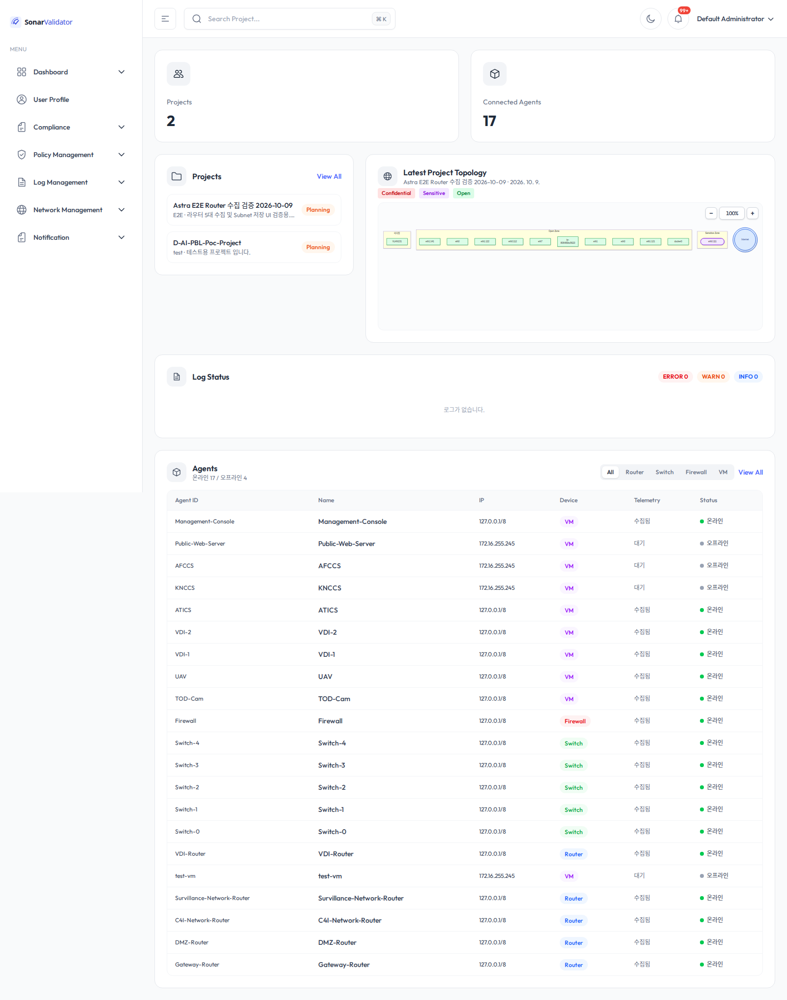

## ui-02-project-list.png

프로젝트 목록: D-AI-PBL-Poc-Project 와 E2E fixture

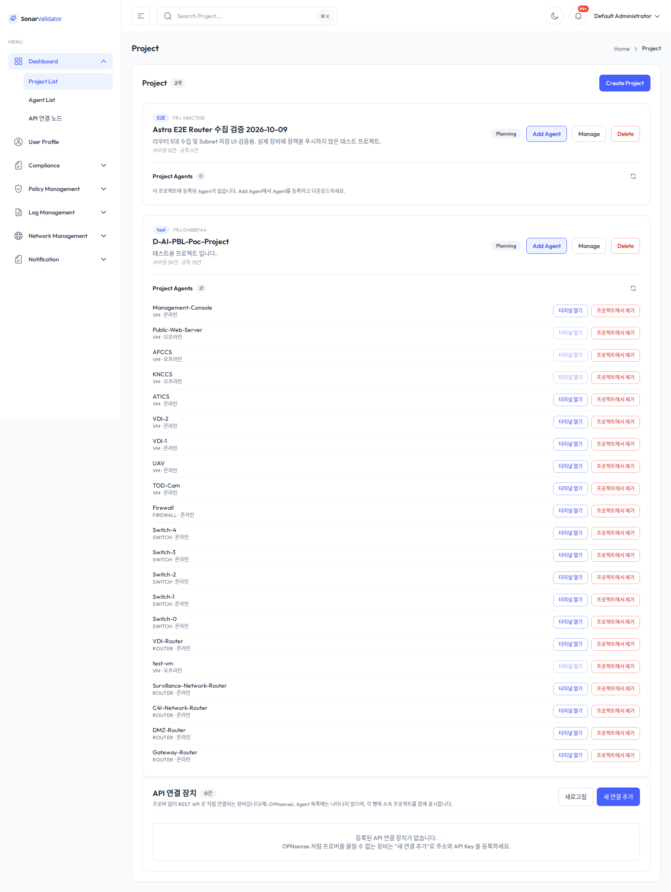

## ui-03-agents.png

Agent 화면: 연결 17 / 전체 21

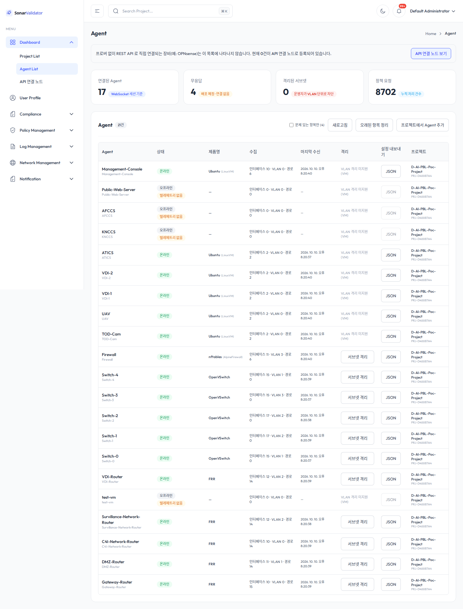

## ui-04-project-editor.png

Manage(프로젝트 에디터) 화면

## ui-05-subnet-advance.png

Subnet Advance Configuration: 39개 행 · VLAN 23개 · 수집된 VLAN 표

## ui-06-subnet-edit-saved.png

fixture 이름·CSO(Sensitive) 저장

## ui-07-subnet-restored.png

fixture 원상 복구 후

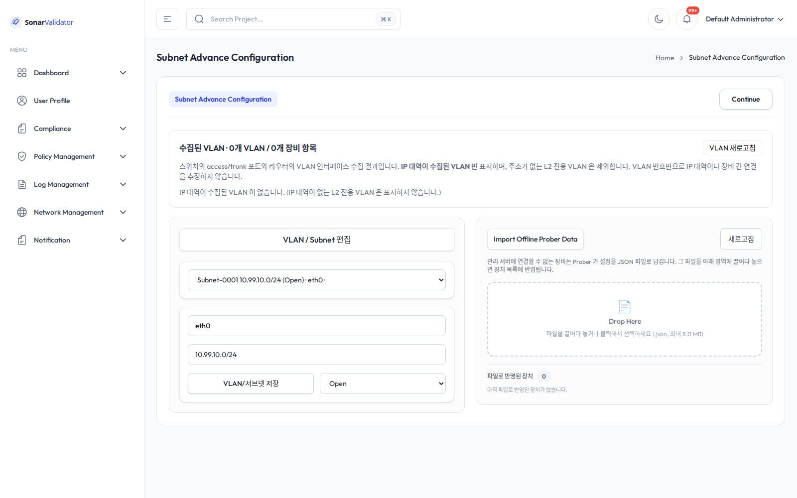

## ui-08-logs.png

로그 화면 (GET /api/v1/logs HTTP 200)

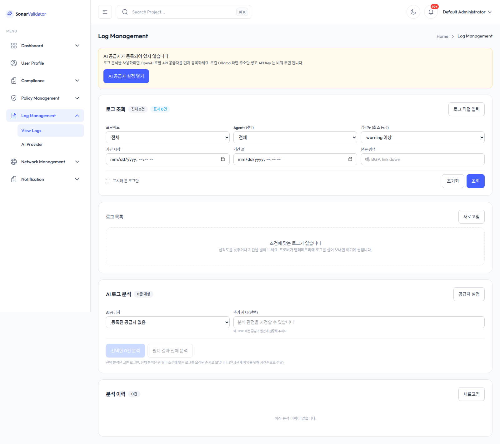

## ui-09-compliance.png

컴플라이언스 화면

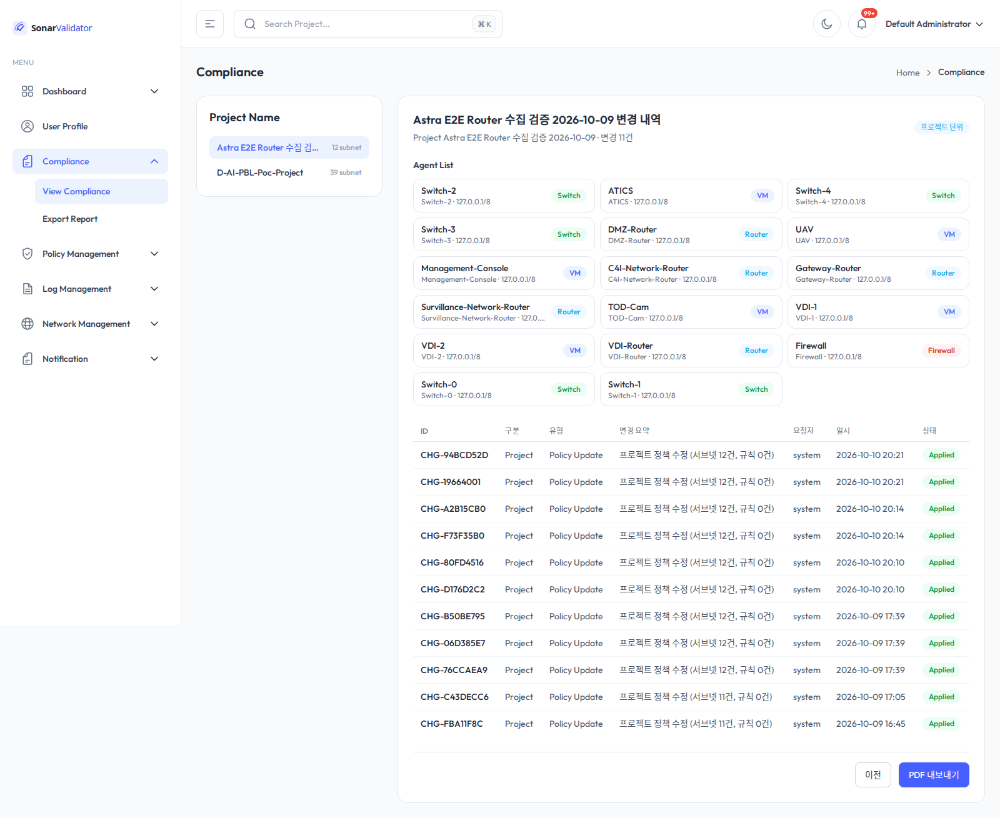

## ui-10-policy.png

정책 화면

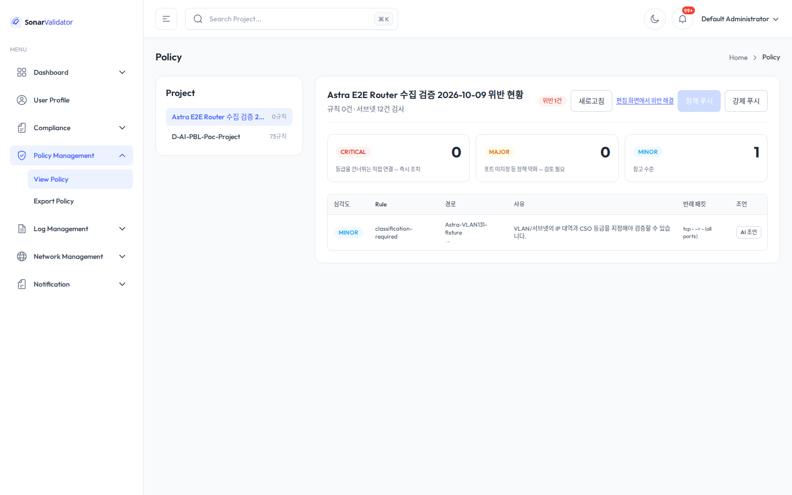

## 02-vm-registration.png

Add Agent → Linux VM 9개 등록 예정 Agent 등록

## 프론트엔드 터미널 (14개 노드)

### C4I-Network-Router

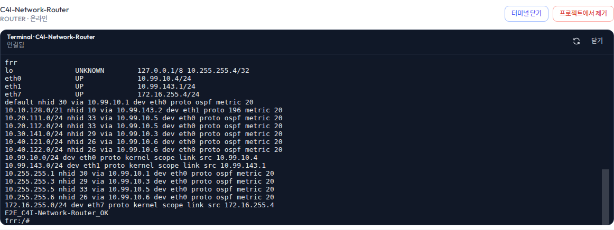

### DMZ-Router

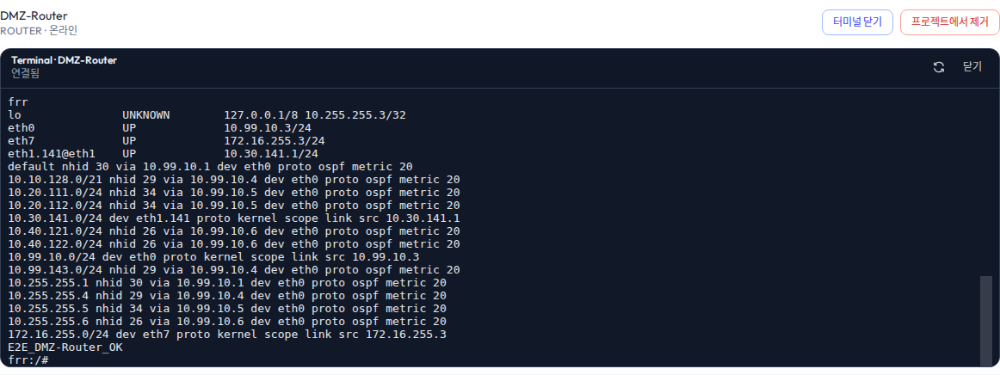

### Firewall

### Gateway-Router

### Management-Console

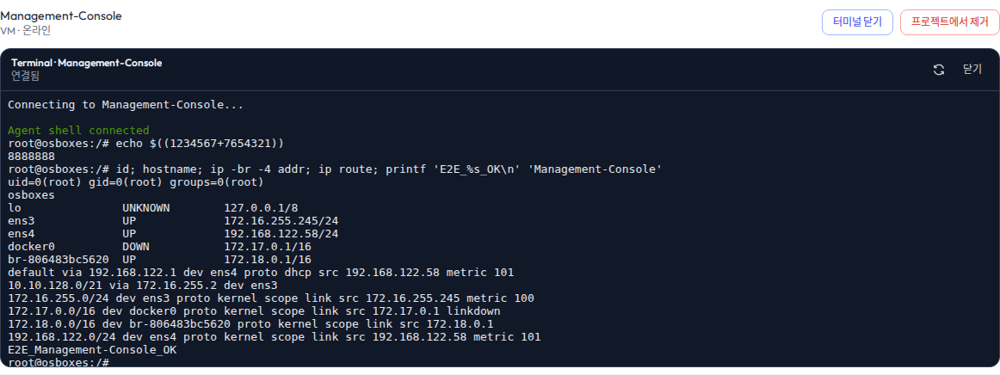

### Survillance-Network-Router

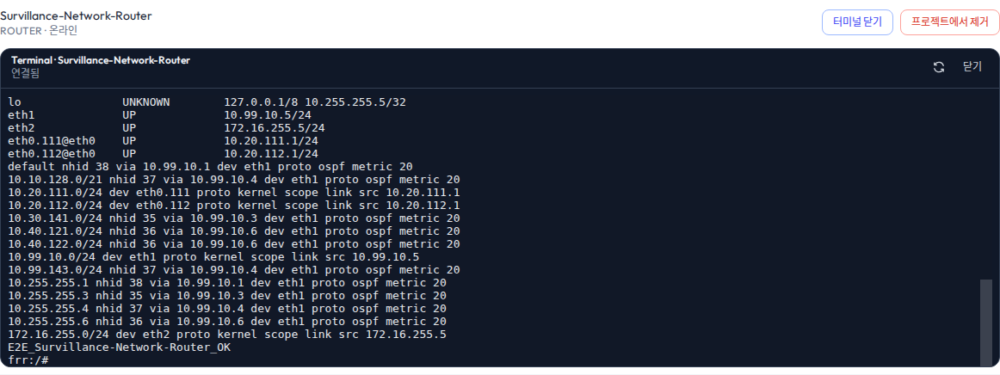

### Switch-0

### Switch-1

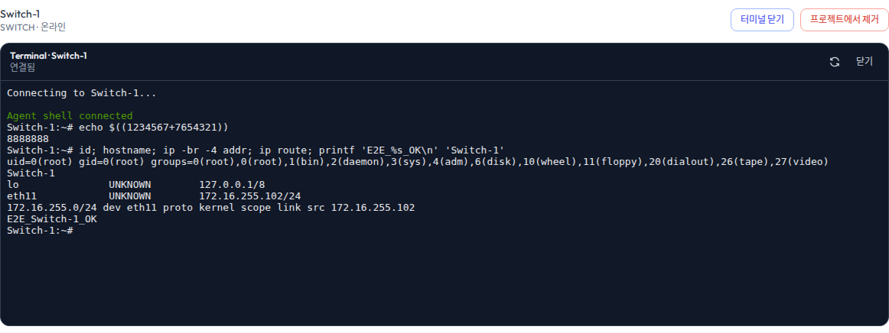

### Switch-2

### Switch-3

### Switch-4

### TOD-Cam

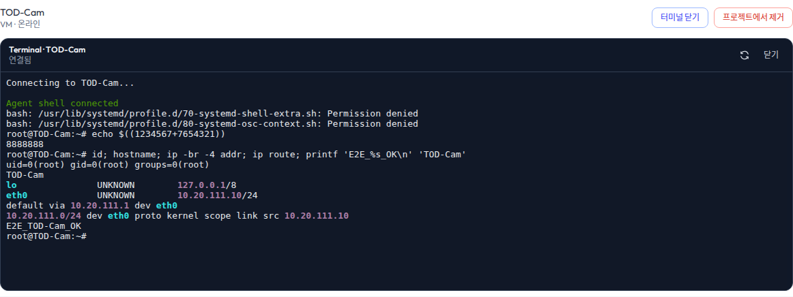

### UAV

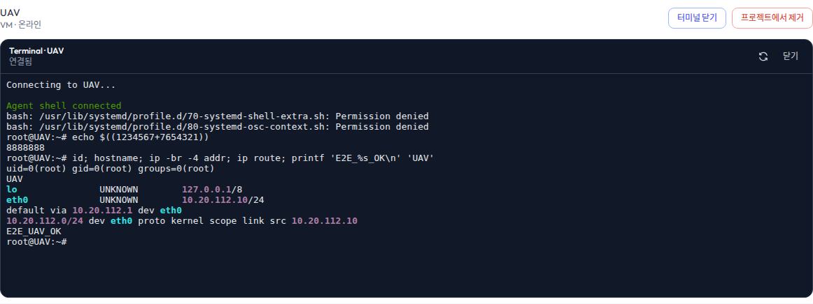

### VDI-Router

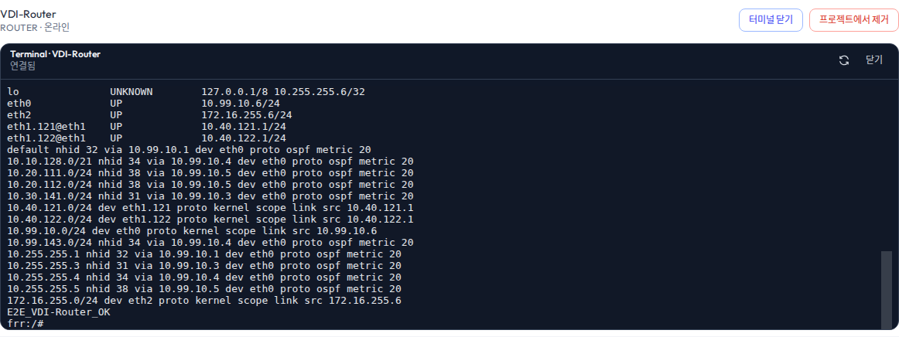
