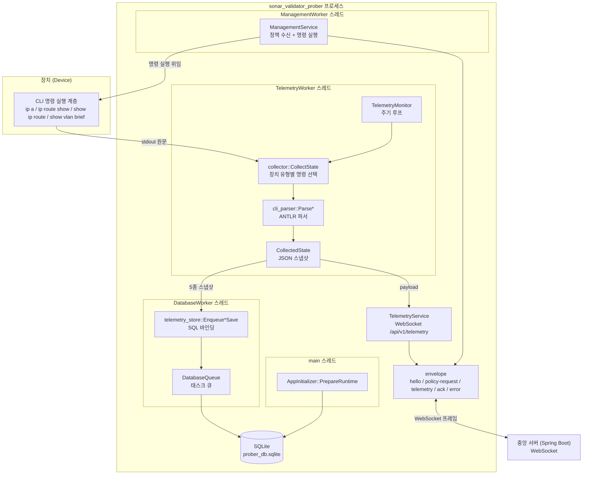
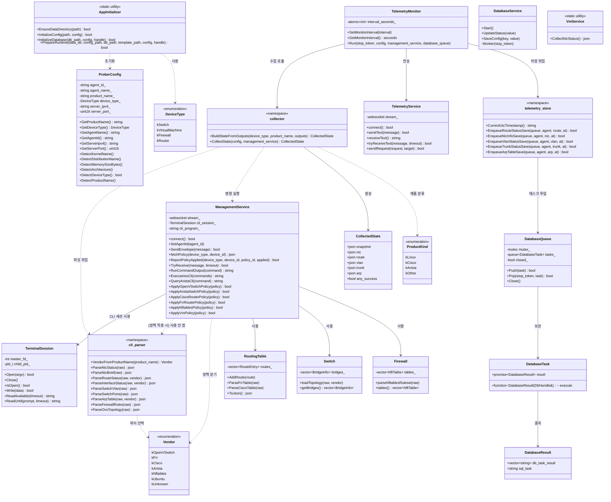
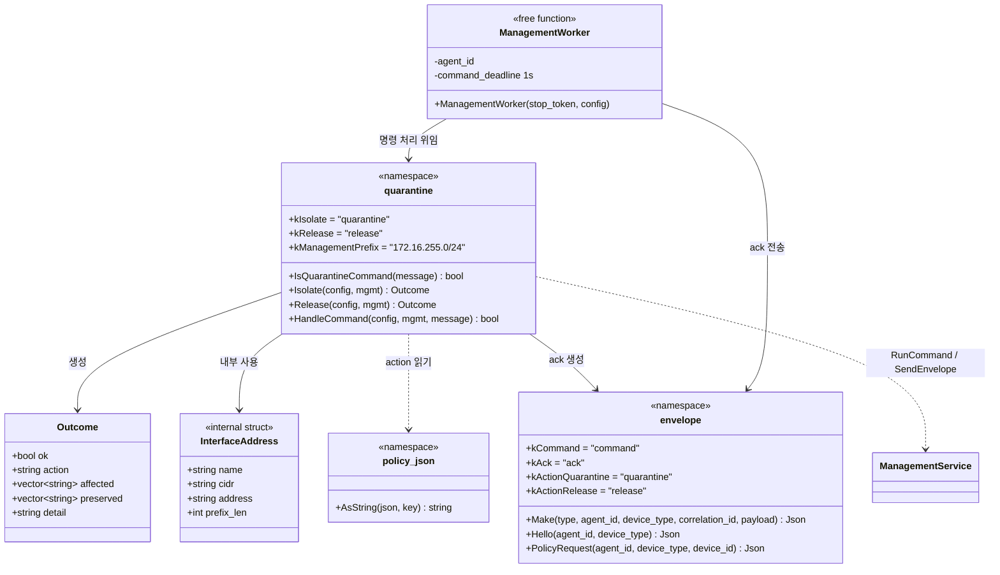
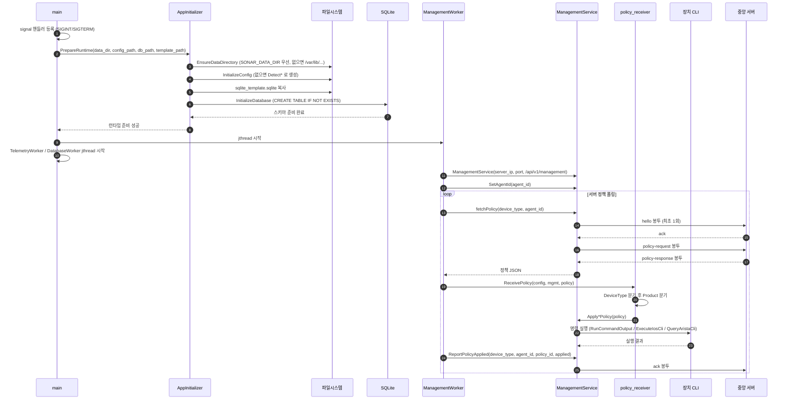
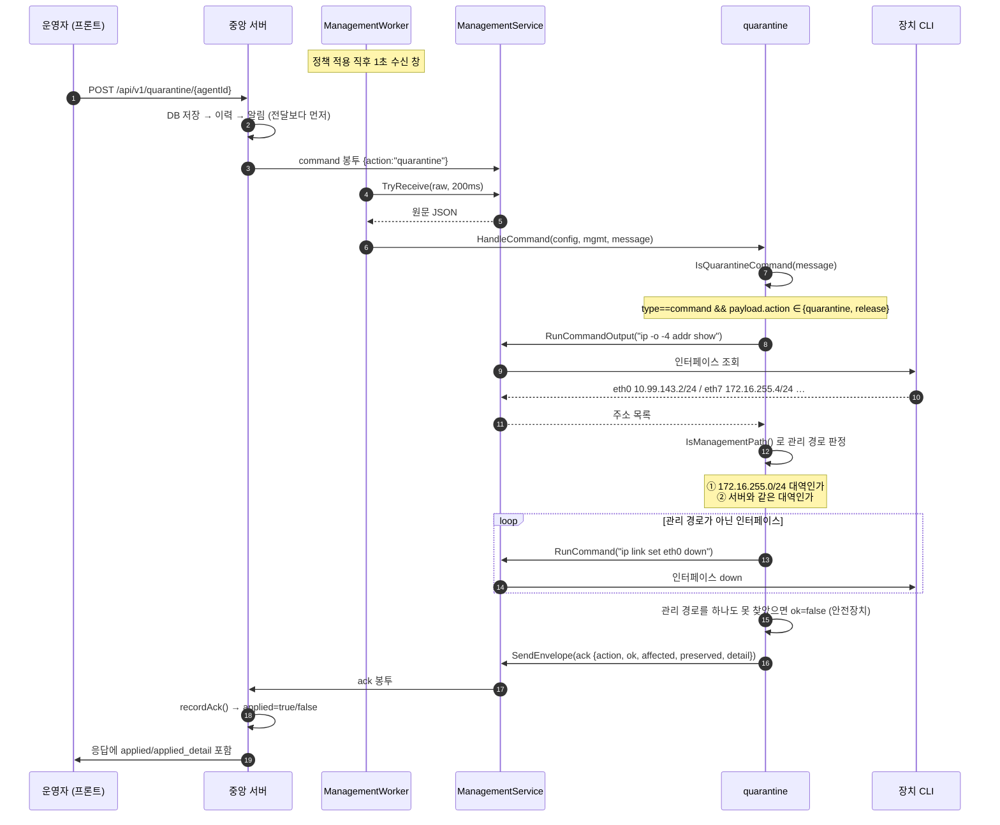
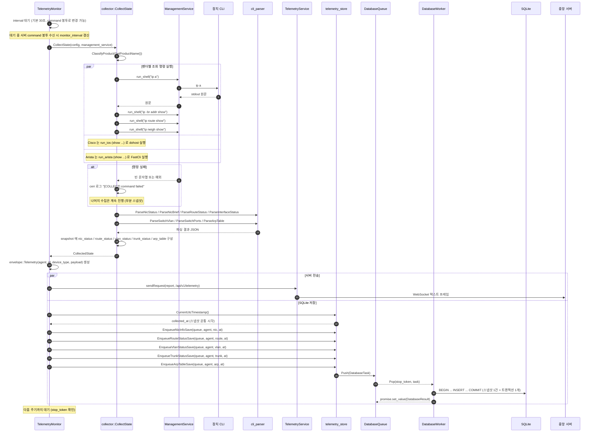
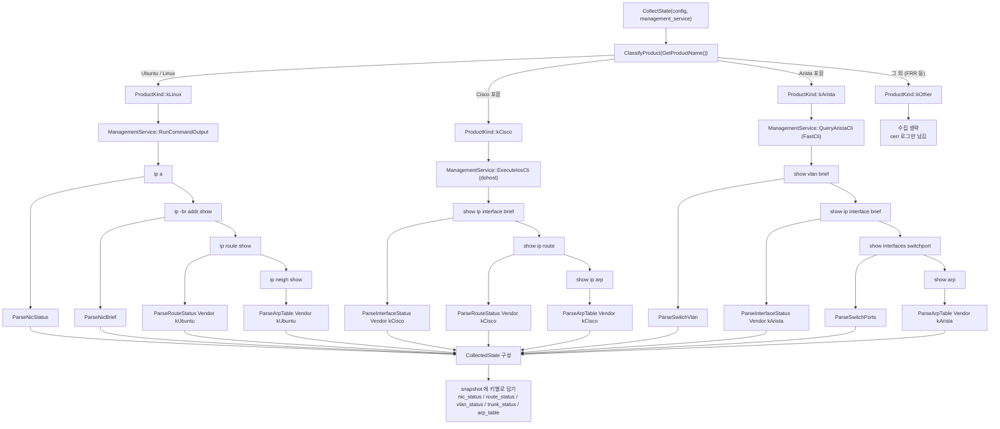
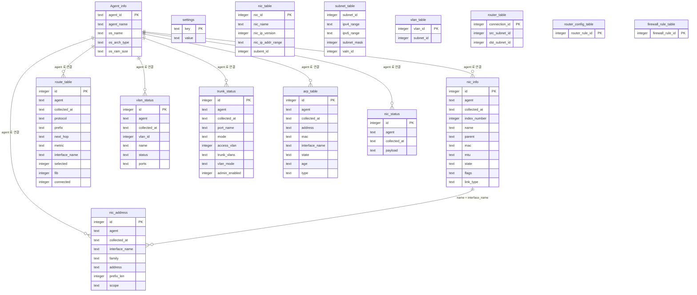
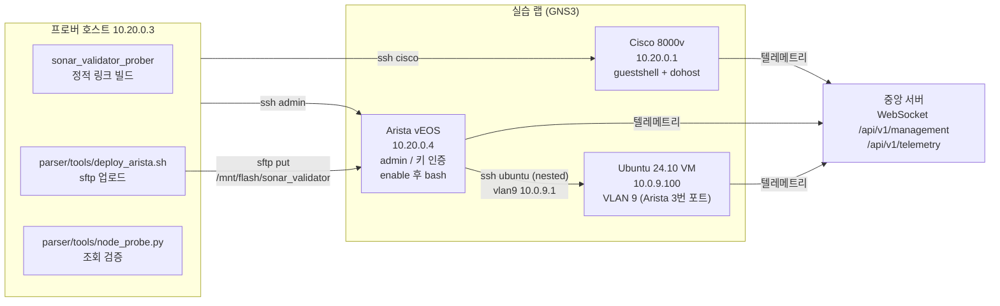

# Agent 아키텍처 다이어그램

`SonarValidator_Prober` (C++23 프로버 에이전트)의 구조를 다이어그램으로 정리한 문서입니다.
모든 내용은 실제 소스 코드를 기준으로 작성했습니다.

**범위**: Linux VM (Ubuntu), Cisco 8000v (IOS-XE), Arista vEOS, Alpine 컨테이너.
Open vSwitch 와 nftables/Alpine 방화벽은 이 문서의 범위가 아닙니다.

> **v1.0 (2026-09-25)** — 격리(quarantine) 기능이 추가되었습니다.
> §2 에 `quarantine` 네임스페이스와 `ManagementWorker`, §3.1 에 격리 명령 수신
> 시퀀스가 더해졌습니다. `ctest` 기준은 **13/13** 입니다.

---

## 1. 컴포넌트 개요

장치 CLI 출력이 수집기 → 파서 → JSON 스냅샷을 거쳐 **서버 전송**과 **SQLite 저장** 두 경로로 흐릅니다.



---

## 2. 클래스 다이어그램



### 2.1 격리(Quarantine) 클래스

`quarantine_handler` 는 **네임스페이스 + 자유 함수**입니다. 클래스를 만들지 않은
이유는 상태를 갖지 않기 때문입니다 — 격리 상태의 소유자는 **서버**이고, Agent 는
명령을 받아 적용한 뒤 결과만 ack 로 돌려줍니다. 상태를 두면 서버와 어긋납니다.



**⚠️ 문자열 계약**: `quarantine::kIsolate` 는 `envelope::kActionQuarantine` 과,
그것은 다시 서버 `QuarantineService.ACTION_QUARANTINE` 과 **정확히 같아야**
합니다. 한 글자만 달라도 격리 버튼은 "명령을 보냈는데 아무 일도 안 일어나는"
상태가 됩니다. `quarantine_handler_test` 가 이 계약을 못 박습니다.

### 2.2 격리가 실제로 하는 일

```
격리 전                              격리 후
  eth0  10.99.143.2/24  (데이터)        ↓ down
  eth1.131 10.10.131.1/24 (데이터)      ↓ down
  eth1.132 10.10.132.1/24 (데이터)      ↓ down
  eth7  172.16.255.4/24  (관리)         — 유지  ← 해제 명령이 들어올 유일한 길
```

`Isolate()` 는 `ip -o -4 addr show` 로 주소를 가진 인터페이스를 모두 찾고,
**관리 경로가 아닌 것만** `ip link set <name> down` 합니다.

**⚠️ 안전장치**: 원격 서버인데 관리 경로를 **하나도 찾지 못하면** 격리를
성공으로 보고하지 않습니다(`ok=false`). 전부 내려버리면 해제 명령이 도달할
길이 없어 운영자가 콘솔로 들어가야 하기 때문입니다.

**⚠️ nftables 규칙이 아니라 인터페이스를 내리는 이유**: 규칙은 지우면
되돌아가지만, 그 규칙이 실제로 트래픽을 막는지는 벤더 구현에 의존합니다.
인터페이스를 내리면 그 위의 모든 트래픽이 **구조적으로** 끊깁니다.
그리고 서버는 격리된 장치에 차단본 정책도 함께 내려줍니다
(`PolicyRegistryService.quarantineOverride`) — 재부팅 후 재접속하면
명령이 아니라 정책으로 다시 격리되는 **두 겹의 안전장치**입니다.

### 열거형 요약

| 열거형 | 정의 위치 | 값 | 용도 |
|---|---|---|---|
| `DeviceType` | `device_type.hpp` | `kSwitch`, `kVirtualMachine`, `kFirewall`, `kRouter` | 정책 분기 기준 |
| `cli_parser::Vendor` | `parser/cli_output_parser.hpp` | `kOpenVSwitch`, `kFrr`, `kCisco`, `kArista`, `kNftables`, `kUbuntu`, `kUnknown` | 파서 출력 형식 선택 |
| `collector::ProductKind` | `collector/command_collector.cpp` (내부) | `kLinux`, `kCisco`, `kArista`, `kOther` | 조회 명령 선택 |
| `SwitchVendor` | `switch/switch.hpp` | `OpenVSwitch`, `CiscoCatalyst9000v`, `AristavEOS` | 토폴로지 파서 선택 |

---

## 3. 시퀀스 — 최초 기동 및 정책 적용



---

## 3.1 시퀀스 — 격리 명령 수신 및 적용

**⚠️ 왜 `fetchPolicy` 대기 루프가 아니라 별도 수신 창인가**

서버는 격리 명령을 `command` 봉투로 **비동기**로 밀어 넣습니다. 그런데
`fetchPolicy` 의 대기 루프는 **같은 `correlation_id` 가 아닌 봉투를 버립니다**.
그래서 명령을 받지 못하고, 다음 정책 요청까지 **최대 3초** 동안 아무도
처리하지 않습니다. 격리는 "즉시" 가 생명이므로 `ManagementWorker` 가 정책
적용 직후 **1초짜리 수신 창**을 엽니다.



**격리 ack 의 두 값**

| 필드 | 의미 |
|---|---|
| `ok` | 격리가 실제로 적용됐는가. `false` 면 서버가 **critical** 알림을 띄웁니다 |
| `affected` | down 시킨 인터페이스 목록 (`eth0 (10.99.143.2/24)`) |
| `preserved` | 관리 경로라 **살려 둔** 인터페이스 목록 |

서버 응답의 `delivered`(소켓에 썼나)와 `applied`(ack 로 확인됐나)는
**다른 값**입니다. 두 값이 다른 상태가 "장치는 살아 있는데 서버는 격리됐다고
믿는" 최악의 상태이므로 화면에서 구분해 보여줍니다.

---

## 4. 시퀀스 — 주기적 텔레메트리 수집 / 전송 / 저장

가장 핵심이 되는 흐름입니다. **전송(서버)** 과 **저장(SQLite)** 이 같은 스냅샷을 공유합니다.



---

## 5. 벤더별 수집 분기

`collector::CollectState` 는 `ProberConfig::GetProductName()` 을 `ProductKind` 로 분류한 뒤
문자열 비교로 명령 실행기를 고르고, `BuildStateFromOutputs` 가 `DeviceType` + 제품명으로
`cli_parser::Vendor` 를 정해 파서를 선택합니다.



### 명령 → 파서 → JSON 키 매핑

| 벤더 | 실행 명령 | 실행기 | 파서 함수 | Vendor | 결과 JSON 키 |
|---|---|---|---|---|---|
| Ubuntu / Alpine | `ip a` | `RunCommandOutput` | `ParseNicStatus` | `kUbuntu` | `nic_status` |
| Ubuntu / Alpine | `ip -br addr show` | `RunCommandOutput` | `ParseNicBrief` | `kUbuntu` | `nic_status` (폴백) |
| Ubuntu / Alpine | `ip route show` | `RunCommandOutput` | `ParseRouteStatus` | `kUbuntu` | `route_status` |
| Ubuntu / Alpine | `ip neigh show` | `RunCommandOutput` | `ParseArpTable` | `kUbuntu` | `arp_table` |
| Cisco 8000v | `show ip interface brief` | `ExecuteIosCli` | `ParseInterfaceStatus` | `kCisco` | `interface_status`, `nic_status` |
| Cisco 8000v | `show ip route` | `ExecuteIosCli` | `ParseRouteStatus` | `kCisco` | `route_status` |
| Cisco 8000v | `show ip arp` | `ExecuteIosCli` | `ParseArpTable` | `kCisco` | `arp_table` |
| Arista vEOS | `show vlan brief` | `QueryAristaCli` | `ParseSwitchVlan` | `kArista` | `vlan_status` |
| Arista vEOS | `show ip interface brief` | `QueryAristaCli` | `ParseInterfaceStatus` | `kArista` | `interface_status`, `nic_status` |
| Arista vEOS | `show interfaces switchport` | `QueryAristaCli` | `ParseSwitchPorts` | `kArista` | `trunk_status` |
| Arista vEOS | `show arp` | `QueryAristaCli` | `ParseArpTable` | `kArista` | `arp_table` |

> Cisco/Arista 는 `show ip interface brief` 결과에 서브넷 마스크가 없어 `prefix_len` 을 만들지 않습니다.
> (값을 추정하지 않고 비워 두는 것이 의도된 동작입니다.)

---

## 6. 데이터베이스 ER 다이어그램

`database/schema.cpp` 의 DDL 과 기존 설계 테이블을 함께 표시합니다.



### 테이블 구분

| 구분 | 테이블 | 설명 |
|---|---|---|
| **런타임 스냅샷** (agent + collected_at) | `nic_info`, `nic_address`, `route_table`, `vlan_status`, `trunk_status`, `arp_table`, `nic_status` | 수집 주기마다 새 행 추가. 시계열 조회 가능 |
| **설계 시점 스키마** | `Agent_info`, `nic_table`, `subnet_table`, `vlan_table`, `router_table`, `router_config_table`, `firewall_rule_table` | 프로젝트 설계 데이터. 수집기가 덮어쓰지 않음 |
| **설정 저장** | `settings` | key-value 형태의 프로버 설정 |

> `vlan_table` (설계용, `vlan_id` PK) 과 `vlan_status` (런타임 수집) 는 의도적으로 분리되어 있습니다.
> 수집 데이터가 설계 데이터를 덮어쓰지 않게 하기 위함입니다.

---

## 7. 배포 토폴로지



### 노드별 접속/배포 방식

| 노드 | 주소 | 접속 방식 | 배포 방식 | 비고 |
|---|---|---|---|---|
| Arista vEOS | 10.20.0.4 | SSH `admin` (키 인증) → `enable` → `bash` | `sftp` 로 `/mnt/flash/sonar_validator` 에 업로드 (`deploy_arista.sh`) | CentOS 7 / glibc 2.17 → **정적 링크 필수** |
| Cisco 8000v | 10.20.0.1 | SSH → guestshell → `dohost` (인증 불필요 IPC) | 바이너리를 guestshell 에 배치 | 조회는 `show ...` 를 `dohost` 로 실행 |
| Ubuntu VM | 10.0.9.100 | Arista 경유 nested SSH | Arista 라우팅 경유 업로드 | 프로버 호스트에서 직접 라우팅되지 않음 |
| Alpine 컨테이너 | 컨테이너 내부 | 로컬 실행 | 바이너리 + `default.conf` + `sqlite_template.sqlite` 배치 | `ip ...` 명령 사용 (Linux 와 동일 경로) |

### Arista 배포 시 확인된 제약

배포 경로를 찾는 과정에서 다음이 확인되었습니다.

- **SFTP**: 동작함 (초기 시도에서는 실패했으나 이후 정상 확인). `deploy_arista.sh` 의 기본 모드.
- **`scp -O`**: 레거시 SCP 프로토콜로 동작. SFTP 가 막힌 환경을 위한 대안(`SCP_MODE=1`).
- **EOS `copy http://`**: default VRF 를 사용해 관리 호스트(10.20.0.3)에 도달하지 못함.
- **base64 heredoc**: SSH 대화형 채널로 전송 가능. 단 pty 라인 버퍼 한계(측정: 16384B 까지 안전, 32768B 유실) 때문에 청크 분할이 필요.
- **`ip netns exec ns-MGMT`**: bash 가 비root 라 `Operation not permitted` 로 차단됨.

---

## 8. 검증 상태

### 8.1 단위 테스트 (`ctest`, 13/13 통과)

| 테스트 | 대상 | 검사 수 |
|---|---|---|
| `cli_output_parser_test` | ANTLR 파서 9종 (NIC/Brief/Route/Interface/VLAN/SwitchPort/ARP/nftables/OVS) | 153 |
| `command_collector_test` | 수집기 벤더 분기 (Linux VM / Cisco / Arista / 견고성) | 67 |
| `telemetry_store_test` | DB 스키마 및 저장 헬퍼 5종 | - |
| `database_service_test` | DB 큐/서비스 | - |
| `envelope_test` | 봉투 직렬화 | - |
| `quarantine_handler_test` | **격리 명령 수신 판정 / 문자열 계약 / 오인 방지** | **17** |
| `routing_table_test`, `prober_config_test`, `telemetry_service_test`, `offline_export_test`, `firewall_test`, `switch_test`, `management_service_integration_test` | 라우팅 테이블 / 설정 / 텔레메트리 / 오프라인 스냅샷 / 방화벽 / 스위치 / 관리 통합 | - |

#### `quarantine_handler_test` 가 지키는 것

| 검사 | 이유 |
|---|---|
| `kIsolate == envelope::kActionQuarantine == "quarantine"` | 세 곳의 문자열이 어긋나면 격리가 조용히 무시됨 |
| 서버가 보내는 모양(`payload.action`) 인식 | `QuarantineService.sendCommand()` 와의 계약 |
| 최상위 `action` 폴백 인식 | 운영자가 손으로 만든 디버깅 봉투 |
| `telemetry`/`policy-response` 는 **절대** 명령으로 안 봄 | 오인 = 정상 장치 인터페이스를 내리는 사고 |
| 오타(`quarantin`) / 비문자열 action 거부 | `get<string>` 예외 방지 |
| `Outcome.ok` 기본값 `false` | 초기화 누락 시 거짓 성공 보고 방지 |
| `kManagementPrefix == "172.16.255.0/24"` | 이 대역을 놓치면 해제 명령이 도달 못 함 |

> ⚠️ `Isolate()`/`Release()` 자체는 테스트에서 호출하지 않습니다.
> 실제 `ip link set ... down` 을 실행하므로 **테스트 머신의 인터페이스가
> 내려갑니다.** 판정 로직만 검증합니다.

### 8.2 실제 장비 검증 (Arista vEOS 10.20.0.4)

`sftp` 로 배포(sha256 일치) 후 실행. SQLite 에 실제 수집 데이터가 저장됨을 확인했습니다.

| 테이블 | 건수 | 실제 저장 값 |
|---|---|---|
| `vlan_status` | 4 | VLAN 1/default, 8/VLAN8, 9/VLAN9, 99/TRANSIT (모두 active) |
| `trunk_status` | 11 | Et2 → access vlan 8, Et3 → access vlan 9, 나머지 vlan 1 |
| `arp_table` | 3 | 172.18.10.1/0c:ae:21:dd:00:01, 10.0.8.100/0c:87:2f:1f:00:00, 10.0.9.100/0c:ae:dc:fd:00:00 |
| `nic_info` | 4 | Ethernet1, Management1, Vlan8, Vlan9 (모두 up) |
| `nic_address` | 4 | 각 인터페이스의 IPv4 주소 |
| `route_table` | 0 | L2 스위치라 `show ip route` 미실행 (의도된 동작) |

> **MAC 정규화 확인**: 실제 장비의 점 표기(`0cae.21dd.0001`)가 콜론 표기(`0c:ae:21:dd:00:01`)로 변환되어 저장되었습니다.

### 8.3 서버 전송 검증

`parser/tools/ws_collector.py` (경량 WebSocket 수신기) 로 프로버의 실제 전송을 확인했습니다.

```
[type 분포]
  policy-request     4
  hello              1
  telemetry          1
[경로 분포]
  /api/v1/management       5
  /api/v1/telemetry        1
[telemetry payload 키]
  agent, agent_name, device_type, kernel,
  nic_status, route_status, arp_table      <- 신규 수집 데이터 포함 확인
[결과] 텔레메트리 수신 성공
```

### 8.4 Linux VM 경로 검증 (호스트에서 실행)

| 테이블 | 건수 | 실제 저장 값 |
|---|---|---|
| `nic_info` | 7 | lo, ens3, ens4, ens5 ... (state/mac/mtu 포함) |
| `nic_address` | 6 | 127.0.0.1/8, ::1/128, 10.20.0.3/24, fe80::.../64 |
| `route_table` | 4 | 0.0.0.0/0 via 192.168.122.1 (dhcp), 0.0.0.0/0 via 10.20.0.1 (static), 10.20.0.0/24, 192.168.122.0/24 |
| `arp_table` | 4 | 192.168.122.1, 10.20.0.2, 10.20.0.4, 10.20.0.1 (state 포함) |

### 8.5 미검증 항목

| 항목 | 사유 |
|---|---|
| Cisco 8000v 실제 조회 | SSH 인증 실패 (문서상 `cisco` 계정으로 접속 불가). guestshell `dohost` 경로는 코드에 구현되어 있음 |
| Alpine 컨테이너 배포 | 실제 컨테이너 미확보. `ip ...` 명령 경로는 Linux VM 과 동일하여 동작 예상 |
| Ubuntu VM 배포 | Arista 경유 nested SSH 로 조회는 검증됨. 프로버 상주 배포는 미실시 |
| 실제 Spring 백엔드 연동 | mock 수신기로 대체 검증 (봉투 형식은 일치) |

---

## 9. 구현 중 발견한 문제와 수정

실제 장비 검증 과정에서 드러난 문제들입니다.

| 문제 | 원인 | 수정 |
|---|---|---|
| Linux `ip route show` 가 0건 파싱 | FRR/Cisco 문법은 라우트 코드(`O>*`)를 요구하는데 Linux 출력에는 없음 | `ParseRouteStatus` 에서 `Vendor::kUbuntu` 면 `IpAddr` 문법의 `routeDocument` 사용 |
| `route_table.prefix`/`next_hop` 이 NULL | DB 저장부는 `prefix`/`next_hop` 키를, Linux 파서는 `destination`/`via` 키를 사용 | `FirstOf()` 헬퍼로 두 표기 모두 허용 |
| Arista 수집이 모두 빈 결과 (`any_success=false`) | `FastCli` pty 대화형 세션의 프롬프트 타이밍 의존 (300ms 대기 부족) | `printf 'enable\n<cmd>\n' \| timeout 20 FastCli` 파이프 방식으로 전환 |
| Arista 출력에 잡음 혼입 | 명령 에코(`> show ...`), `% Internal error at line N`, `Pagination disabled.` | `CleanAristaOutput()` 으로 걸러낸 뒤 파서에 전달 |
| `Runtime initialization failed` (비root 환경) | 데이터/템플릿 경로가 `/var/lib`, `/etc` 로 하드코딩 | `SONAR_DATA_DIR`, `SONAR_TEMPLATE_PATH`, `SONAR_CONFIG_PATH` 환경변수 오버라이드 추가 + 실행 파일 옆 템플릿 자동 탐색 |
| Release 빌드에서 `database_service_test` 가 무한 대기 | `assert(database_queue.Push(...))` 처럼 assert 안에 부작용을 넣어 `-DNDEBUG` 에서 통째로 제거됨 | 부작용을 assert 밖으로 분리 |

### 배포 제약 (Arista vEOS)

배포 경로를 찾는 과정에서 확인된 사실입니다.

- **SFTP**: 동작함 (`deploy_arista.sh` 기본 모드)
- **`scp -O`**: 레거시 SCP 프로토콜로 동작 (`SCP_MODE=1` 대안)
- **EOS `copy http://`**: default VRF 를 써서 관리 호스트에 도달하지 못함
- **base64 heredoc**: 가능하나 pty 라인 버퍼 한계(16384B 까지 안전, 32768B 유실) 때문에 청크 분할 필요
- **`ip netns exec ns-MGMT`**: bash 가 비root 라 차단 (`Operation not permitted`)
- **glibc 2.17** (CentOS 7 기반): 정적 링크 필수 (`-static -static-libgcc -static-libstdc++`, openssl 제외)

