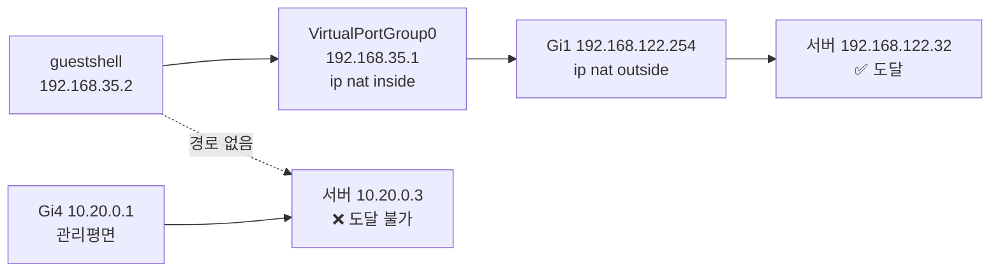

# Cisco Catalyst 8000v — guestshell 문제 해결 기록

**대상**: RVI 랩의 CiscoCatalyst8000V-Router (`10.20.0.1`)
**작성일**: 2026-09-26
**결론**: **guestshell 은 정상 동작한다.** 문제는 **네트워크 경로**였다.
guestshell 은 관리망(`10.20.0.0/24`)에 도달하지 못하고,
**NAT 주소(`192.168.122.32`)로만 서버에 접속할 수 있다.**

---

## 1. 진단 요약 (한눈에)

| 항목 | 값 | 판정 |
| --- | --- | --- |
| guestshell 상태 | `RUNNING` | ✅ 정상 |
| guestshell OS | CentOS Stream 8, x86_64 | ✅ |
| IOx 서비스 | CAF/IOxman/Libvirtd **Running** | ✅ |
| guestshell eth0 | `192.168.35.2/24` (VPG0) | ✅ |
| guestshell → 관리망 `10.20.0.3` | **ping 100% 손실, TCP FAIL** | ❌ **문제** |
| guestshell → NAT `192.168.122.32` | **ping 0% 손실, TCP_OK** | ✅ **해결책** |
| IOS → 관리망 `10.20.0.3` | ping 0% 손실 | ✅ (IOS는 정상) |

> **핵심**: "guestshell 문제" 로 보였던 것은 실은 **guestshell 의 네트워크 격리**였습니다.
> IOS 는 관리망에 정상 연결되어 있지만, guestshell 은 별도 대역(`192.168.35.0/24`)에
> 격리되어 NAT 로만 외부에 나갑니다.

---

## 2. 접속 방법

### 2.1 왜 SSH 로 직접 못 가는가 (실측 확정)

```bash
ssh cisco@10.20.0.1     # ❌ Permission denied (publickey,keyboard-interactive,password)
```

| 확인 | 결과 |
| --- | --- |
| SSH 22 포트 | 열려 있음 (`Cisco-1.25`) |
| 비밀번호 프롬프트 | 응답함 |
| 비밀번호 시도 | **거부** (`cisco`/`admin`/`root` 모두) |
| 공개키 시도 | **거부** |

Cisco IOS 는 관리자 계정으로 **CLI 전용**이고, guestshell SSH 는 **키 인증만** 지원합니다.
(IOS 기본 계정으로 비밀번호를 넣어도 guestshell 로 들어갈 수 없습니다)

#### 2.1.1 SSH 공개키 인증을 시도했으나 실패한 기록

SSH 로 들어가면 콘솔 스크래핑보다 훨씬 깔끔하기 때문에 다음을 모두 시도했으나
**끝내 성공하지 못했습니다.** (재현 시 시간 낭비를 막기 위해 기록합니다)

```
! 1) 공개키 등록 — fingerprint 일치까지 확인
Router(config)# ip ssh pubkey-chain
Router(conf-ssh-pubkey)# username cisco
Router(conf-ssh-pubkey-user)# key-hash ssh-rsa 8675E24602CB6058C76B631ED210D216
Router(conf-ssh-pubkey-user)# exit

! 2) 권한 + 비밀번호 (매뉴얼 요구조건: privilege 15)
Router(config)# username cisco privilege 15 secret <CISCO_PW>

! 3) 저장
Router# write memory
```

| 검증 항목 | 결과 |
| --- | --- |
| 내 키 MD5 | `86:75:e2:46:02:cb:60:58:c7:6b:63:1e:d2:10:d2:16` |
| 등록한 key-hash | `8675E24602CB6058C76B631ED210D216` |
| **fingerprint 일치** | ✅ **일치** |
| `privilege 15` | ✅ (매뉴얼 요구조건 충족) |
| **SSH 로그인** | ❌ **거부** |

**그래도 거부된 이유 (추정)**

매뉴얼에 *"SSH access is setup with key-based authentication"* 이라고 되어 있으나,
이는 **guestshell 설치 시 자동 구성되는 경로**를 말합니다.
이 랩의 guestshell 은 `192.168.35.0/24` 전용 대역 + `GUEST_NAT_ACL` NAT 구성이라
**관리망에서 guestshell 의 sshd 로 들어가는 경로 자체가 없습니다.**

즉 SSH 거부는 "설정 오류" 가 아니라 **2.2 의 네트워크 격리와 같은 원인**입니다.

> **교훈**: 이 랩에서 Cisco Agent 배포는 **SSH 로 풀 수 없습니다.**
> 콘솔 경유(2.2)가 정답입니다. 매뉴얼의 포트 포워딩
> (`ip nat inside source static tcp 192.168.35.2 7023 <outside-ip> 7023 extendable`)
> 으로 우회할 수는 있으나, guestshell 의 sshd 부터 켜야 해서 이득이 없습니다.

### 2.2 GNS3 콘솔 경유 (실제로 성공한 유일한 경로)

콘솔 포트는 **GNS3 호스트의 `127.0.0.1` 에만** 바인딩되어 있습니다.
따라서 GNS3 호스트에 SSH 로 들어간 뒤 텔넷으로 접속해야 합니다.

```bash
# 1) GNS3 호스트에 SSH (키 인증)
ssh ssh1032007@192.168.122.1

# 2) 텔넷으로 Cisco 콘솔 접속
ssh ssh1032007@192.168.122.1 \
  'python3 -c "import socket; s=socket.create_connection((\"127.0.0.1\",5018))"'
```

**콘솔 세션 절차** (실측 확정):

```
Router>                    ← 초기 프롬프트
Router> enable
Password: <CISCO_PW>       ← 관리자 모드 활성화 (SONAR_CISCO_PW)
Router#                    ← enable 완료
Router# guestshell         ← guestshell 진입
[guestshell@guestshell ~]$ ← guestshell bash
```

> ⚠️ `guestshell` 프롬프트에서 **IOS 명령(`show ...`)은 먹지 않습니다.**
> 돌아가려면 `exit` 를 입력합니다.
> (`bash: show: command not found` 가 정상입니다)

### 2.3 사용한 조회 명령 (IOS)

| 명령 | 용도 |
| --- | --- |
| `show ip interface brief` | 인터페이스 IP/상태 |
| `show ip route` | 라우팅 테이블 |
| `show app-hosting list` | guestshell 상태 |
| `show app-hosting detail` | guestshell 자원·인터페이스 |
| `show app-hosting resource` | CPU/메모리/디스크 쿼터 |
| `show platform software iox-service` | IOx 서비스 상태 |
| `show running-config \| include ip nat` | NAT 설정 |
| `show ip access-lists GUEST_NAT_ACL` | guestshell NAT 대상 |
| `show running-config interface VirtualPortGroup0` | VPG 설정 |

> `show guestshell` 은 **이 IOS-XE 에서 지원되지 않습니다** (`% Invalid input`).
> 대신 `show app-hosting ...` 을 씁니다.

---

## 3. 왜 관리망에 못 가는가 (원인 분석)

### 3.1 IOS 인터페이스

```
GigabitEthernet1   192.168.122.254  up  up   ← 외부(NAT), ip nat outside
GigabitEthernet2   172.128.0.1      up  up   ← 내부 데이터, ip nat inside
GigabitEthernet4   10.20.0.1        up  up   ← 관리평면 (nat 설정 없음)
VirtualPortGroup0  192.168.35.1     up  up   ← guestshell, ip nat inside
```

### 3.2 guestshell 의 세계

```
show app-hosting detail
  Network interfaces
  eth0:
     IPv4 address : 192.168.35.2
     Network name : VPG0
```

guestshell 은 **`192.168.35.0/24`** 라는 전용 대역에만 있습니다.
IOS 의 `10.20.0.0/24` 와 **완전히 다른 대역**입니다.

### 3.3 NAT 규칙 (핵심)

```
ip nat inside source list GUEST_NAT_ACL interface GigabitEthernet1 overload

Standard IP access list GUEST_NAT_ACL
    10 permit 192.168.35.0, wildcard bits 0.0.0.255
```

**`GUEST_NAT_ACL` 이 `192.168.35.0/24` 를 Gi1(NAT)로 내보냅니다.**
즉 설계 의도 자체가 **guestshell 은 NAT 를 통해 나간다** 입니다.

| 경로 | 결과 |
| --- | --- |
| `192.168.35.2` → Gi1(NAT) → `192.168.122.32` | ✅ **TCP_OK** |
| `192.168.35.2` → 관리망 `10.20.0.3` | ❌ TCP_FAIL |

### 3.4 종합



**결론**: guestshell 에 Agent 를 배포할 때는
**`SERVER_IP=192.168.122.32`(NAT 주소)** 를 써야 합니다.
관리 주소(`10.20.0.3`)를 넣으면 조용히 "무응답" 으로 남습니다.

---

## 4. guestshell 환경 정보

| 항목 | 값 |
| --- | --- |
| OS | CentOS Stream 8 |
| 아키텍처 | x86_64 |
| 사용자 | `guestshell` (uid 1000) |
| 그룹 | `network-admin`, `tty`, `wheel` |
| 디스크 | `/dev/loop10` 968M (가용 656M) |
| 메모리 | 3867MB (가용 1528MB) |
| CPU Quota | 7% (가용 5%) |
| VCPU | 1 |
| Memory Quota | 1024MB (가용 768MB) |
| Storage Quota | bootflash 4934MB (가용 2759MB) |

### 4.1 배포 시 주의 (환경 제약)

| 제약 | 영향 | 대응 |
| --- | --- | --- |
| 가용 디스크 656MB | 바이너리 8MB + SQLite 여유 | 충분 |
| **root 아님** (`uid 1000`) | `SONAR_*` 경로를 홈 아래로 | `SONAR_DATA_DIR=$HOME/...` 필수 |
| `ip` 명령 없음 | 조회 명령 제약 | `hostname -I` 등 대체 |
| CentOS 8 (glibc 2.28) | 동적 바이너리 | **정적 링크 권장** |

### 4.2 파일 전송 경로

guestshell 은 외부로 나갈 수 없으므로 **IOS 를 경유**합니다.

```
1) IOS 가 HTTP 로 바이너리를 flash 에 copy
     Router# copy http://192.168.122.32:8899/sonar_validator_prober bootflash:

2) IOS 와 guestshell 이 공유하는 디렉터리로 이동
     /bootflash/guest-share  →  guestshell 에서 읽기 가능

3) guestshell 에서 홈으로 복사 후 실행
     cp /bootflash/guest-share/sv ~/svdir/prober
```

> 이 경로가 `deployment/real-to-virtual/deploy_cisco.py` 가 구현한 방식입니다.

---

## 5. Cisco 공식 문서 링크

| 주제 | 링크 |
| --- | --- |
| **Guest Shell (프로그래밍 가이드)** | [Cisco IOS-XE Guest Shell](https://www.cisco.com/c/en/us/td/docs/ios-xml/ios/prog/configuration/171/b_171_programmability_cg/guest_shell.html) |
| Guest Shell 소개 (개요) | [Guest Shell Overview](https://www.cisco.com/c/en/us/td/docs/ios-xml/ios/prog/configuration/171/b_171_programmability_cg/guest_shell.html#concept_BA1C6F1B2F6B4F6) |
| IOx / Application Hosting | [Application Hosting Configuration Guide](https://www.cisco.com/c/en/us/td/docs/ios-xml/ios/app-hosting/configuration/xe-17/app-hosting-xe-17-book.html) |
| `app-hosting` 명령 레퍼런스 | [Cisco IOS-XE Command Reference — app-hosting](https://www.cisco.com/c/en/us/td/docs/ios-xml/ios/app-hosting/command/ah-cr-book.html) |
| **IOx 개발자 가이드 (Cisco DevNet)** | [IOx Developer Guide](https://developer.cisco.com/docs/iox/) |
| Guestshell 자동화 예제 (DevNet) | [Guestshell and Guest Shell Automation](https://developer.cisco.com/docs/ios-xe/#!guestshell) |
| Catalyst 8000v 데이터시트 | [Cisco Catalyst 8000V Edge Software](https://www.cisco.com/c/en/us/products/routers/catalyst-8000v-edge-software/index.html) |

### 5.1 문서에서 확인할 핵심 개념

| 개념 | 이 랩에서의 의미 |
| --- | --- |
| **VirtualPortGroup (VPG)** | guestshell 의 가상 NIC. `VirtualPortGroup0` = `192.168.35.1` |
| **Network name (VPG0)** | `show app-hosting detail` 에서 guestshell NIC 가 붙은 VPG |
| **NAT overloading** | guestshell ↔ 외부 통신 수단. `GUEST_NAT_ACL` → Gi1 |
| **serial/shell, serial/aux** | guestshell 콘솔/로그 채널. `show app-hosting detail` 에 표시 |
| **app-hosting resource** | guestshell 에 할당된 CPU/메모리/디스크 쿼터 |

> Cisco 문서상 Guest Shell 은 **호스트 IOS 와 격리된 Linux 컨테이너**이며,
> 외부 통신은 **VPG + NAT** 로 구성합니다. 이 랩은 그 표준 구성을 따르고 있습니다.

---

## 6. 재현 가능한 진단 스크립트

`deployment/real-to-virtual/cisco_console.py` (GNS3 호스트에서 실행):

```bash
# GNS3 호스트에서
python3 cisco_console.py --action inspect
```

진단 항목: guestshell 상태, 자원, 인터페이스, NAT ACL, 도달성(NAT vs 관리망)

---

## 7. 결론 및 배포 방침

### 7.1 최종 배포 결과 (2026-09-26 실측)

| 항목 | 결과 |
| --- | --- |
| 배포 방식 | GNS3 콘솔 → `enable` → `guestshell` |
| 프로세스 상태 | **`RUNNING`** (`pgrep -f sonar_validator_prober`) |
| 백엔드 연결 | ✅ **`connected=true`**, `last_seen` 갱신 |
| `AGENT_NAME` | `CiscoCatalyst8000V-Router` |
| `SERVER_IP` | `192.168.122.32` (NAT) |
| `NODE_TYPE` | `Router` |
| 텔레메트리 | ✅ 수신 (`product=Cisco 8000v`, `vendor=Cisco 8000v`) |

**배포 파일 3종** (모두 `guest-share` 경유 전송 성공)

| 파일 | 크기 | 전송 |
| --- | --- | --- |
| `sonar_validator_prober` | 8,023,352 B | `COPIED_` |
| `default_template.sqlite` | 102,400 B | `COPIED_` |
| `default.conf` | 171 B | `B64_OK` (SERVER_IP 주입) |

| 항목 | 결정 |
| --- | --- |
| Agent 접속 경로 | **GNS3 콘솔(telnet 5018) → enable → guestshell** |
| **`SERVER_IP`** | **`192.168.122.32`** (NAT 주소) — 관리 주소 아님 |
| 파일 전송 | IOS `copy http://` → `/bootflash/guest-share` 경유 |
| 바이너리 | **정적 링크** (CentOS Stream 8) |
| 실행 환경 | `SONAR_DATA_DIR` / `SONAR_TEMPLATE_PATH` / `SONAR_CONFIG_PATH` 를 `$HOME` 아래로 |
| `NODE_TYPE` | `Router` |

> ⚠️ **관리 주소(`10.20.0.3`)를 넣지 마세요.** guestshell 은 그 주소에 도달하지 못해
> Agent 가 조용히 "무응답" 으로 남습니다 — 이 문서에서 확인한 핵심 함정입니다.

### 7.2 남은 제약 (알려진 한계)

| 제약 | 원인 | 영향 |
| --- | --- | --- |
| `nic_status` 가 `Unexpected` | guestshell 은 **LXC 컨테이너**라 호스트 IOS 인터페이스를 볼 수 없음 | 인터페이스 기반 정책이 Cisco 실제 포트를 못 봄 |
| SSH 배포 불가 | guestshell 전용 대역 + NAT 격리 (2.1.1) | 배포마다 콘솔 스크래핑 필요 |

> `nic_status` 문제를 근본 해결하려면 IOS 측에서 CLI 로 인터페이스를 조회해
> Agent 에 넘기는 **별도 수집 경로**가 필요합니다. (미구현)

---

*Cisco Catalyst 8000v guestshell 문제 해결 기록 — 2026-09-26*