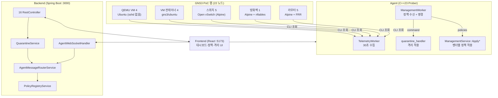
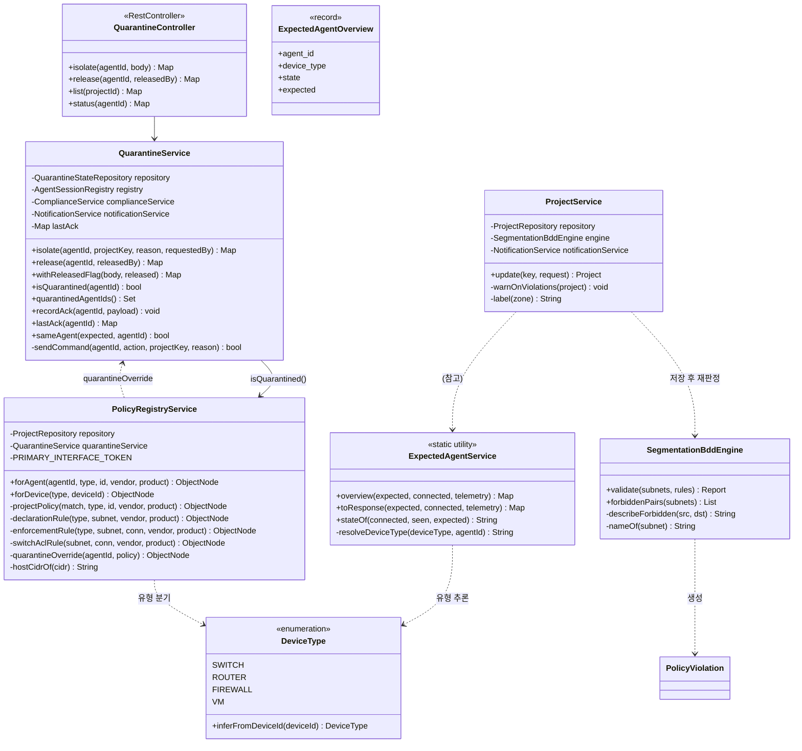
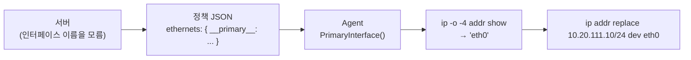
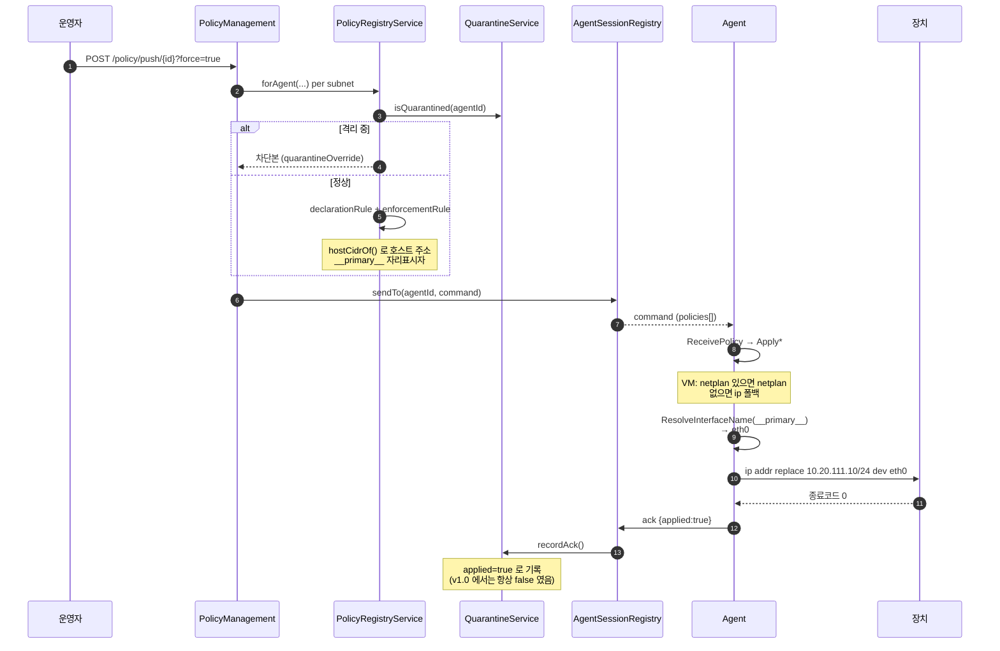
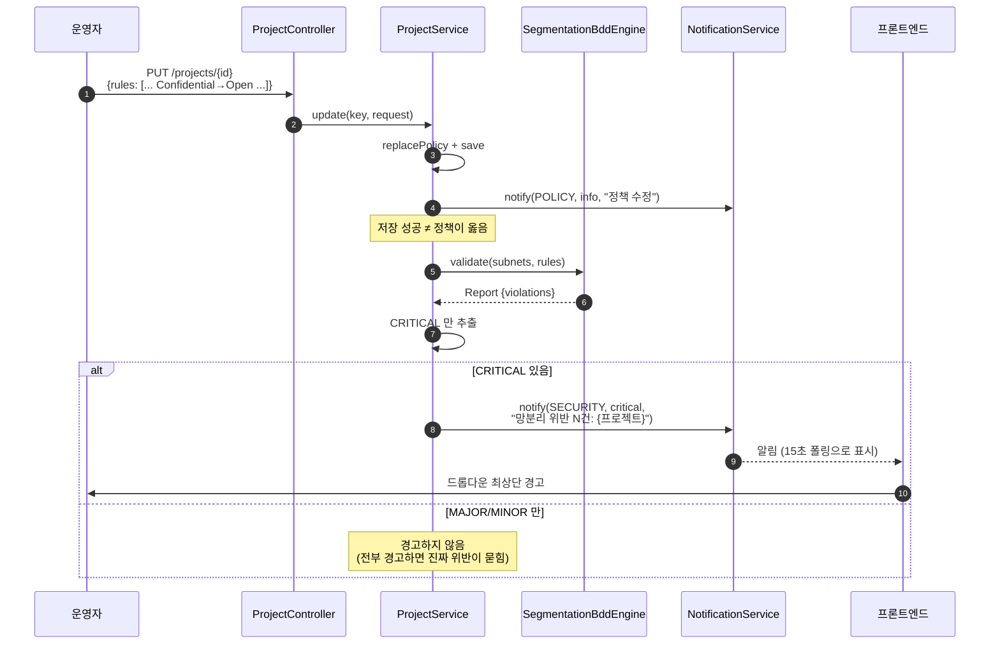
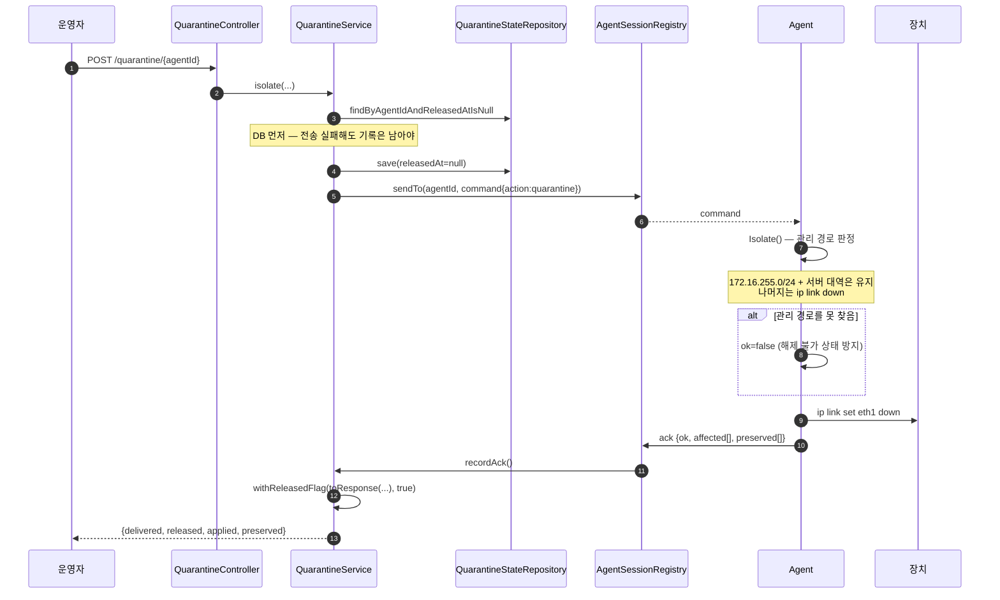
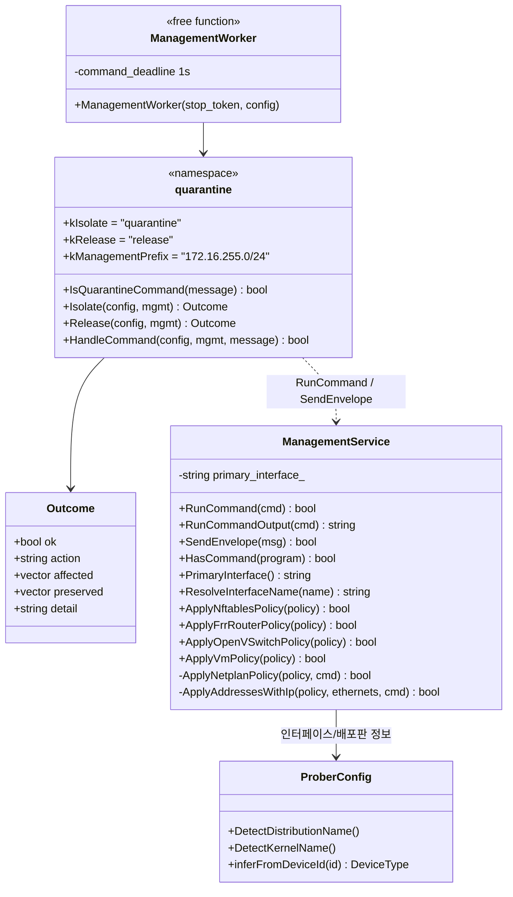
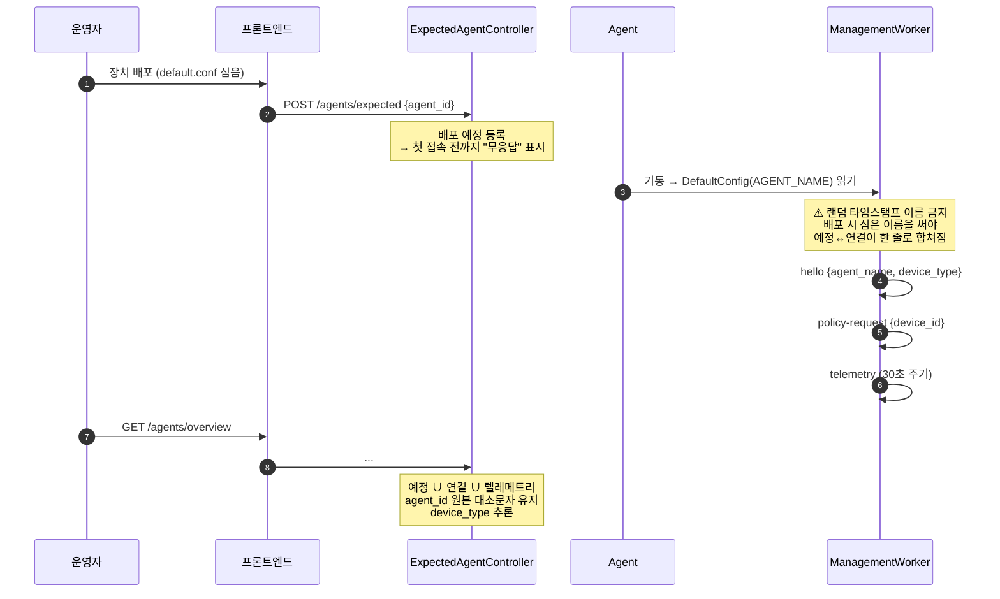

# SonarValidator 아키텍처 다이어그램 v2.0

`SonarValidator` 3계층(Agent · Backend · Frontend)의 구조를 다이어그램으로 정리한
문서입니다. 모든 내용은 실제 소스 코드와 **GNS3 PoC 랩 실측**을 기준으로 작성했습니다.

> **v2.0 (2026-09-26)** — GNS3 랩(22 노드)에 실제 배포하면서 발견한 결함을 모두
> 반영했습니다. **14대 연결** 실측. v1.0 대비 주요 변경:
> - 격리/정책 적용의 ack 판정을 **종료코드 기반**으로 수정
> - **VM netplan → ip 폴백** (랩 이미지에 netplan 없음)
> - **호스트 주소 계산** (네트워크 주소를 인터페이스에 넣던 버그)
> - **인터페이스 자리표시자** (`__primary__`) — `ens33` 하드코딩 제거
> - **CSO 위반 경고** 생성 경로 신규 (`ProjectService.warnOnViolations`)
> - 위반 메시지를 **연결 경로 형식**으로 변경
> - `DeviceType` 추론이 이름의 **끝**도 판정
> - 배포판 이름 없는 이미지에서 **프로버 기동 실패** 수정

---

## 1. 계층 개요



---

## 2. 클래스 다이어그램 — 격리 + 정책 (v2.0)



### 2.1 정책 적용 — `__primary__` 자리표시자



**⚠️ 왜 이름을 서버가 정하지 않는가**

| 후보 | 랩 컨테이너 VM | 다른 배포판 |
|---|---|---|
| `ens33` | ❌ 없음 | 문서 예제(VMware) |
| `eth0` | ✅ 사용 | — |
| `ens3` | — | 클라우드 |
| `enp0s3` | — | VirtualBox |

이름을 고정하면 `Cannot find device "ens33"` 으로 **모든 VM 정책이 실패**합니다.
장치가 자기 인터페이스를 아는 쪽이 정확하므로 서버는 자리표시자만 보냅니다.

### 2.2 호스트 주소 계산 — 왜 `.0` 을 쓰면 안 되는가

```
서브넷 CIDR      10.20.111.0/24   ← 네트워크 주소 (.0)
장치 호스트 주소  10.20.111.10/24  ← 실제 할당 가능

네트워크 주소를 인터페이스에 넣으면:
  → 자기 대역 판정이 깨짐 (모든 주소가 "다른 대역" 으로 보임)
  → 게이트웨이/ARP 어긋남 → 통신 두절
  → 프로버가 서버에 보고 못 함 = 스스로 고립
```

`hostCidrOf()` 가 네트워크 + 오프셋(랩 관례 `.10`)으로 계산합니다.
자리올림이 생겨 대역을 벗어나면 **계산을 포기**합니다(틀린 주소를 넣느니 안 넣음).

---

## 3. 시퀀스 — 정책 적용 (ack 검증 포함)



### 3.1 ⚠️ v1.0 의 ack 판정 버그 (수정됨)

```cpp
// v1.0 — 성공을 실패로 뒤집음
return !CliCommand({"nft", "-i"}, script).empty();
//      ^^^^^^^^^^^^^^^^^^^^^^^^^^^^^^^^^^^^^^
//      nft -i / vtysh 는 성공 시 <출력이 없음>
//      → empty() == true → !true == false (실패로 기록)
```

```cpp
// v2.0 — 종료코드를 봅니다
return RunCommand(VtyshCommand(lines));      // vtysh -c '...' 순차 실행
return RunCommand(NftScript(script));        // nft -i '<script>'
```

`CliCommand`(pty 세션)는 **대화형 상태가 필요한 경우**에만 남기고, 설정 적용은
종료코드로 판정합니다. 이 수정으로 격리/정책의 `applied` 가 비로소 의미를 가집니다.

---

## 4. 시퀀스 — CSO 위반 감지 → 경고 (v2.0 신규)



### 4.1 위반 사유 문장 (v2.0 변경)

```
v1.0:  Confidential ↔ Open 직접 연결은 허용되지 않습니다.
       → 등급만 말함. 어느 서브넷을 고칠지 알 수 없음

v2.0:  VLAN 131 ATICS (10.10.131.0/24) -> VLAN 141 Public-Web-Server (10.30.141.0/24)
       연결은 허용되지 않습니다. (Confidential ↔ Open — 등급 2단계 차이)
       → 출발/도착 서브넷 지목 + 이유(등급 차이)
```

### 4.2 경고 심각도를 나눈 기준

| 위반 | 심각도 | 경고 |
|---|---|---|
| 등급 2단계 이상 건너뛰기 (Confidential↔Open) | CRITICAL | ✅ SECURITY/critical |
| 포트 미지정 (`any` — 모든 포트 허용) | MAJOR | ❌ 검토 대상 |
| 규칙이 서브넷을 못 찾음 | MINOR | ❌ 참고 |

> 랩의 모든 규칙에 `any` 포트를 쓰면 MAJOR 가 매 저장마다 쏟아집니다.
> 그것까지 경고하면 진짜 CRITICAL 이 알림 목록에 묻힙니다.

---

## 5. 시퀀스 — 격리 (v2.0)



### 5.1 ⚠️ `released` 키 부재 버그 (수정됨)

```
v1.0: 실패 경로만 released:false 를 넣고 성공 경로는 빠뜨림
      → 클라이언트가 undefined 를 "실패" 로 해석
      → 해제 성공을 "격리 중이 아니었다" 로 정반대 표시

v2.0: 두 경로 모두 명시 + 프론트는 `=== false` 로만 판정
```

### 5.2 격리가 실제로 하는 일

```
격리 전                              격리 후
  eth0   10.99.143.2/24  (데이터)       ↓ down
  eth1.131 10.10.131.1/24 (데이터)      ↓ down
  eth7   172.16.255.4/24  (관리)        — 유지  ← 해제 명령이 들어올 유일한 길
```

**두 겹의 안전장치**: (1) 즉시 `command`, (2) `quarantineOverride` 차단본 정책 →
재부팅 후 재접속해도 정책으로 다시 격리됩니다.

---

## 6. 클래스 다이어그램 — Agent 격리 (v2.0)



### 6.1 ⚠️ 배포판 이름 없는 이미지에서 기동 실패 (수정됨)

```cpp
// v1.0 — 배포판 이름이 비면 초기화 거부
if (initial_config.GetDistributionName().empty() || ...) {
    return false;      // → "Runtime initialization failed"
}
```

**원인**: Open vSwitch 스위치 컨테이너(`openvswitch-container`)에
`/etc/os-release` 가 없습니다. 배포판 이름은 **표시용 정보**일 뿐인데
필수값으로 검사해서 **스위치 5대가 전부 기동하지 못했습니다.**

```cpp
// v2.0 — 커널명으로 폴백
if (distribution_name_.empty() && !kernel_name_.empty()) {
    distribution_name_ = "Unknown (" + kernel_name_ + ")";
}
```

---

## 7. 시퀀스 — Agent 배포 및 연결



### 7.1 `state` 판정

| state | 조건 | 화면 |
|---|---|---|
| `connected` | WebSocket 세션 살아 있음 | 초록 "연결됨" |
| `telemetry-only` | 세션 없지만 텔레메트리 이력 있음 | 회색 "연결 끊김" |
| `silent` | 등록됐지만 접속/수신 없음 | 노랑 "무응답" |
| `unregistered` | 예정에 없이 붙은 장치 | 파랑 "예정에 없음" |

### 7.2 ⚠️ overview 가 이름을 소문자로 덮어쓰던 버그 (수정됨)

```
v1.0: "예정에 없음" 분기가 내부 매칭 키(소문자)를 agent_id 로 내보냄
      → Gateway-Router 가 gateway-router 로 표시
      → 프로젝트 서브넷의 agent_id 와 매칭 실패 → 정책이 기본값으로

v2.0: canonical 맵으로 원본 표기 복원
      + device_type 도 추론 (v1.0 은 null)
```

### 7.3 `DeviceType` 추론 — 접두사만 보면 틀린다

```
v1.0 (접두사만):
  Gateway-Router            → VM ❌
  Survillance-Network-Router → VM ❌
  DMZ-Router                → VM ❌

v2.0 (마지막 토큰도):
  마지막 토큰이 ROUTER/SWITCH/FIREWALL 이면 그 유형
  Gateway-Router    → ROUTER ✅
  GNS3.Firewall     → FIREWALL ✅ (점 구분자도 처리)
```

---

## 8. 실측 검증 결과 (v2.0)

### 8.1 랩 배포 현황 — **14대 연결**

| 유형 | 장치 | 상태 |
|---|---|---|
| 라우터 | Gateway-Router, DMZ-Router, C4I-Network-Router, Survillance-Network-Router, VDI-Router | ✅ 5 |
| 방화벽 | Firewall | ✅ 1 |
| 스위치 | Switch-0, Switch-1, Switch-3, Switch-4 | ✅ 4 |
| VM | TOD-Cam, UAV, VDI-1, VDI-2 | ✅ 4 |
| VM(QEMU) | ATICS, KNCCS, AFCCS, Public-Web-Server | ⚠️ 미연결 |
| 스위치 | Switch-2 | ⚠️ Hub1 링크 부재 |

### 8.2 텔레메트리 파싱 (실측)

```
Switch-1-agent        format=OpenvSwitch   ifaces=15 vlans=2
C4I-Network-Router    format=FRRRouter     ifaces=10 routes=14
DMZ-Router            format=FRRRouter     ifaces=11 routes=14
Firewall-agent        format=AlpineFirewall ifaces=8 routes=3
```

### 8.3 정책 적용 (실측 — v2.0 수정 확인)

```
[POLICY] netplan not installed; applying addresses via ip
[POLICY] primary interface resolved: eth0
[POLICY] address 10.20.111.10/24 on eth0      ← 호스트 주소 (.0 아님)
```

### 8.4 CSO 위반 경고 (실측)

```
PUT /api/v1/projects/poc-dai-pbl
  + Rule-9001: Confidential(Subnet-0131) → Open(Subnet-0141) :8080

결과:
  compliant=false  violation_count=6
  by_severity={CRITICAL:1, MAJOR:5, MINOR:0}

  CRITICAL 사유:
    VLAN 131 ATICS (10.10.131.0/24) -> VLAN 141 Public-Web-Server (10.30.141.0/24)
    연결은 허용되지 않습니다. (Confidential ↔ Open — 등급 2단계 차이)

  SECURITY/critical 알림 생성:
    "망분리 위반 1건: D-AI-PBL PoC Network"
```

### 8.5 테스트

| 대상 | 결과 |
|---|---|
| Backend | **212 tests, 0 failures** |
| Prober | **13/13 ctest** |
| Frontend | tsc + eslint clean |

신규 회귀 테스트:
- `QuarantineServiceTest` (15) — 격리/해제/ack/`released` 키/`sameAgent`
- `ExpectedAgentOverviewTest` (7) — 대소문자 보존, 유형 추론
- `CsoViolationWarningTest` (7) — CRITICAL 판정, 경고 생성, MAJOR 제외
- `quarantine_handler_test` (17) — 문자열 계약, 오인 방지

---

## 9. 알려진 제약 (실측)

| 항목 | 원인 | 영향 |
|---|---|---|
| Switch-2 미연결 | 토폴로지에 Hub1 링크 없음 | 수집은 되나 서버 전송 불가 (GNS3 GUI 필요) |
| ATICS/KNCCS/AFCCS/PWS 미연결 | VM 이 Confidential 존, Firewall 에 `eth1.131~133` VLAN 없음 → 게이트웨이 부재 | NAT 망 도달 불가 |
| netplan 부재 | `gns3/ubuntu` 이미지에 미설치 | `ip` 폴백으로 대응 (런타임 적용, 재부팅 시 소멸) |
| 라우터에 `curl` 없음 | Alpine 이미지 | 배포 스크립트가 `wget` 사용 |
| Firewall SSH 키 미등록 | 운영자 환경 | `docker exec` 로 우회 |

---

## 10. v1.0 → v2.0 변경 요약

| # | 결함 | 원인 | 수정 |
|---|---|---|---|
| 1 | ack 가 항상 실패 | `!CliCommand().empty()` — 성공 시 출력 없음 | `RunCommand` 종료코드 |
| 2 | 스위치 5대 기동 실패 | 배포판 이름 없으면 초기화 거부 | 커널명 폴백 |
| 3 | 라우터가 VM 으로 표시 | `inferFromDeviceId` 가 접두사만 | 마지막 토큰도 판정 |
| 4 | 이름이 소문자로 변환 | overview 가 매칭 키를 반환 | canonical 맵 |
| 5 | VM 정책 전부 실패 | `interface` 필수 검사 | netplan 경로 분기 |
| 6 | 네트워크 주소를 인터페이스에 | CIDR 을 그대로 사용 | `hostCidrOf()` |
| 7 | `Cannot find device ens33` | 인터페이스 이름 하드코딩 | `__primary__` 자리표시자 |
| 8 | 해제 성공을 실패로 표시 | `released` 키가 성공 경로에 없음 | 두 경로 모두 명시 |
| 9 | 위반 경고 없음 | 감지→경고 경로 부재 | `warnOnViolations()` |
| 10 | 위반 사유가 등급만 | 서브넷 미지목 | `describeForbidden()` |
| 11 | 빈 차트 구문 오류 | `""` 을 Mermaid 에 전달 | 빈 차트 차단 + DOM 정리 |
| 12 | API 401 (127.0.0.1) | `localhost` 하드코딩 → cross-site | `window.location.hostname` |

> **12건 모두 단위 테스트로는 잡히지 않았고, 실제 랩에 배포하고 브라우저로
> 버튼을 눌렀을 때 드러났습니다.**

---

*v2.0 — 2026-09-26*