# SonarValidator 아키텍처 다이어그램 v3.0 — 전략 패턴 리팩토링

`SonarValidator` 3계층(Agent · Backend · Frontend)의 구조를 다이어그램으로 정리한
문서입니다. 모든 내용은 실제 소스 코드와 **GNS3 PoC 랩 실측**을 기준으로 작성했습니다.

**v3.0 (2026-09-26)** — v2.0 배포 검증에서 드러난 **구조적 결함**을 해소했습니다.
기능 버그가 아니라 **변경 비용**의 문제였습니다. v2.0 대비 주요 변경은 아래와 같습니다.

- `PolicyRegistryService` 의 유형별 `switch` 4곳 → **전략 패턴**
  (`DevicePolicyStrategy` + 4 구현 + `DevicePolicyStrategies` 선택기)
- 공통 헬퍼를 `PolicyJson` / `PolicyBuildContext` 로 추출
- `AgentMessageRouterService` 의 저장 책임 → **`AgentTelemetryStore`**
- **장치 유형 판별기** `DeviceTypeResolver` 신설 (판단 3단계)
- **방화벽을 격리 대상에서 제외** (`QuarantineService.isolate`)
- 백엔드 테스트 **212 → 215** (`QuarantineServiceTest` 15 → 18)

---

## 1. 계층 개요

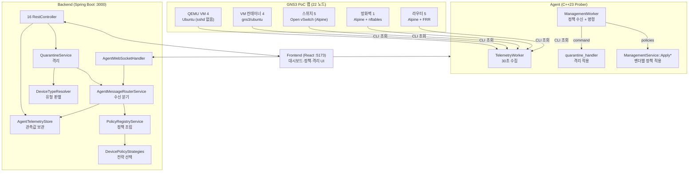

---

## 2. 클래스 다이어그램 — 전략 패턴 (v3.0 신규)

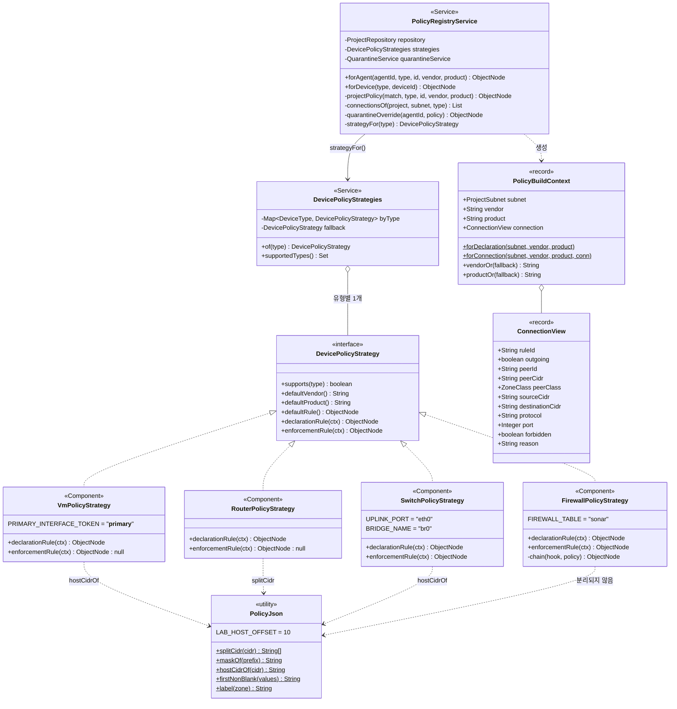

### 2.1 ⚠️ v2.0 의 문제 — `switch` 가 네 곳에 흩어져 있었다

`PolicyRegistryService` 는 1046 줄이었고, 유형 분기가 **네 곳**에 있었습니다.

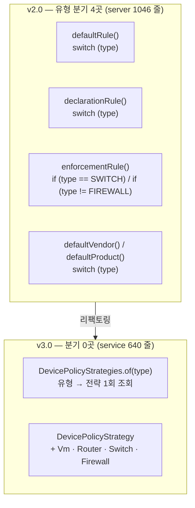

**무엇이 문제였나** — "VM 정책을 조금 바꾼다" 는 일이 서로 멀리 떨어진
네 곳을 고치는 일이었습니다. 한 곳을 빠뜨리면 **폴백 경로에서만 옛 동작**이
남아, 정상 배정된 장치는 새 정책을 받고 배정 없는 장치는 옛 정책을 받습니다.

**v3.0 에서는** 유형별 코드가 한 클래스에 모여 있어, "VM 을 고친다" 는
`VmPolicyStrategy` 한 파일을 여는 일입니다.

### 2.2 ⚠️ 전략은 예외를 던지지 않는다

`DevicePolicyStrategy` 의 모든 메서드는 **예외 대신 `null` 을 돌려줍니다.**

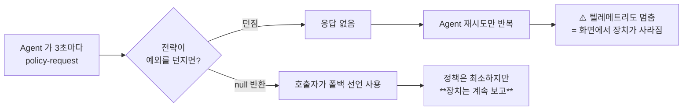

`enforcementRule` 이 `null` 인 유형(VM · Router)은 **집행 지점이 아니기**
때문입니다. `policies` 배열에 아무것도 넣지 않는 것이 정답이고,
억지로 규칙을 만들면 장치가 해석하지 못하는 필드를 받습니다.

---

## 3. 시퀀스 — 전략 디스패치 (v3.0 신규)

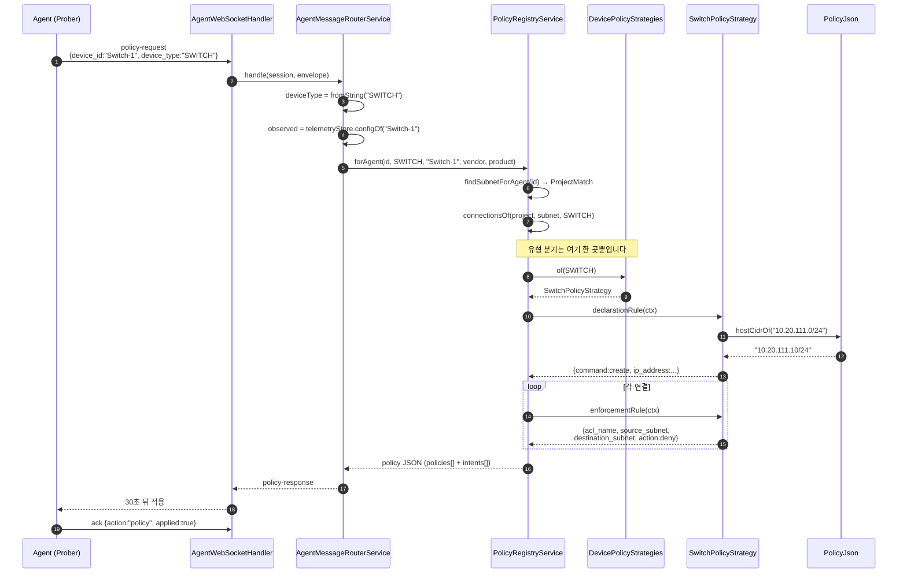

### 3.1 왜 `intents` 는 전략 밖에 있는가

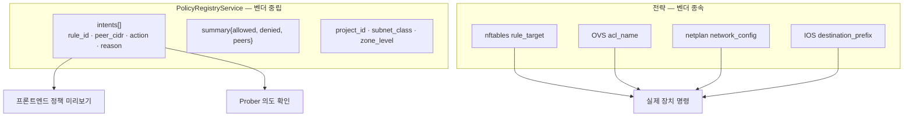

**의도는 모든 유형에 같고, 적용 방법만 다릅니다.** 그래서 의도는 서비스가
만들고 적용 규칙만 전략이 만듭니다. 이 분리가 없으면 화면이 유형별 JSON 을
해석해야 하고, 유형이 늘 때마다 화면도 고쳐야 합니다.

---

## 4. 클래스 다이어그램 — 격리 + 유형 판별 (v3.0)

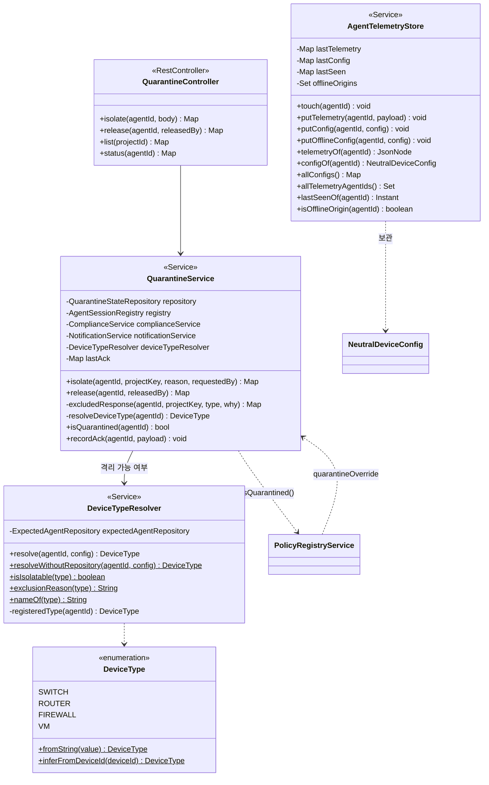

### 4.1 ⚠️ 방화벽은 격리 대상이 아니다 (v3.0 신규)

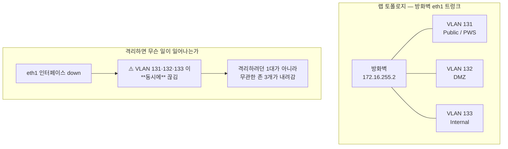

방화벽은 **구역을 나누는 지점 그 자체**입니다. 그 지점을 없애면 구역이
사라집니다. 그래서 격리 대신 **프로젝트 규칙으로 해당 연결만** 막습니다.

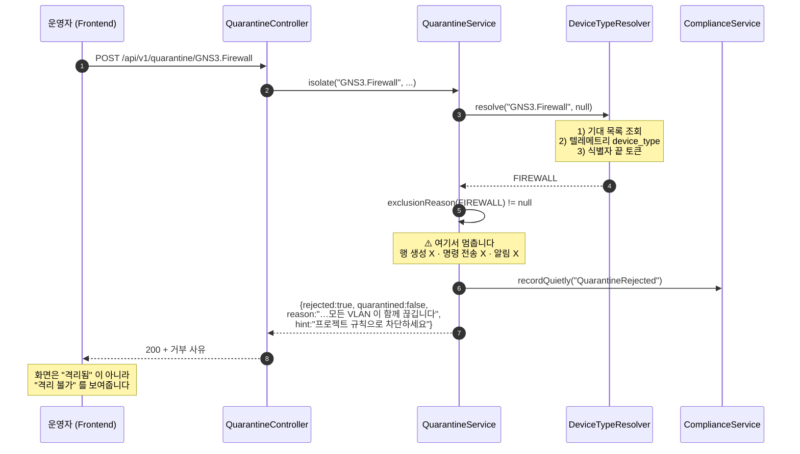

### 4.2 ⚠️ 거부를 "성공" 으로 말하지 않는 이유

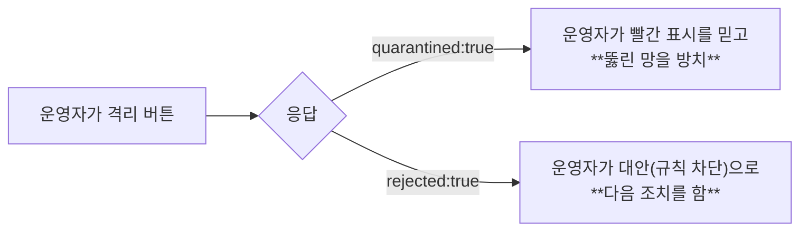

거부 응답에는 `rejected` · `quarantined:false` · `released:false` ·
`delivered:false` · `applied:false` 를 **모두 명시**합니다. 클라이언트가
"키가 없다 = 실패" 를 추론하지 않도록, v2.0 의 `released` 버그와 같은 원칙을
적용했습니다.

**상태는 건드리지 않고 이력만 남깁니다.** 격리 행을 만들면 이후 목록에
"격리 중" 으로 보이기 때문입니다. 반면 시도 자체는 감사 대상이므로
`QuarantineRejected` 이력을 남깁니다.

---

## 5. 클래스 다이어그램 — 텔레메트리 보관 (v3.0 신규)

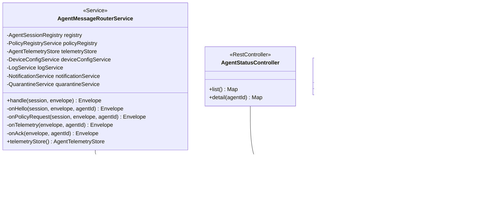

### 5.1 ⚠️ v2.0 의 문제 — 조회 API 가 라우터를 통과했다

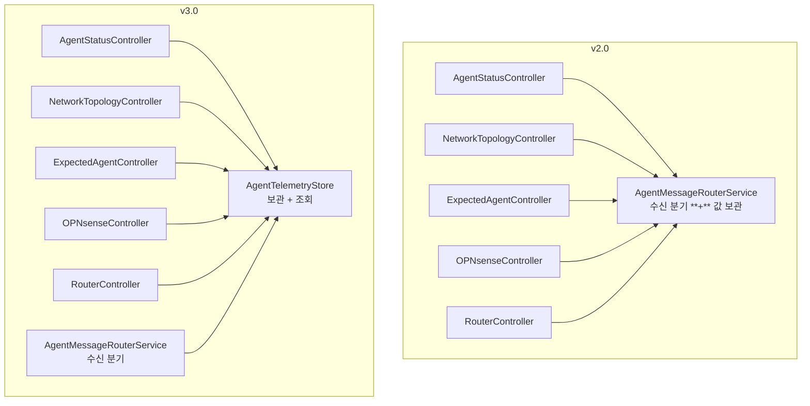

`AgentTelemetryStore` 는 `setAll` 같은 **변이만** 합니다. 상태가 한 곳에만
있으므로 "화면은 A 를 보고 정책은 B 를 보는" 불일치가 생길 수 없습니다.

### 5.2 ⚠️ 오프라인 출처 구분

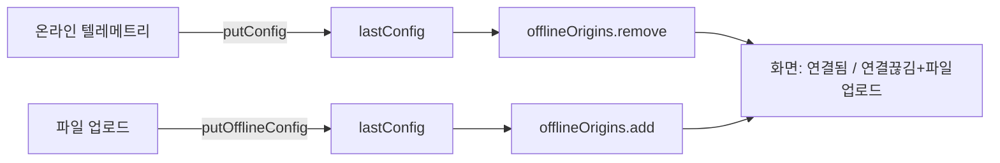

파일 업로드 경로는 세션이 없으므로 `connectedAgentIds()` 에 나타나지 않습니다.
출처를 구분하지 않으면 그 장치가 화면에서 **통째로 사라집니다.**

---

## 6. 시퀀스 — 장치 유형 판별 (v3.0 신규)

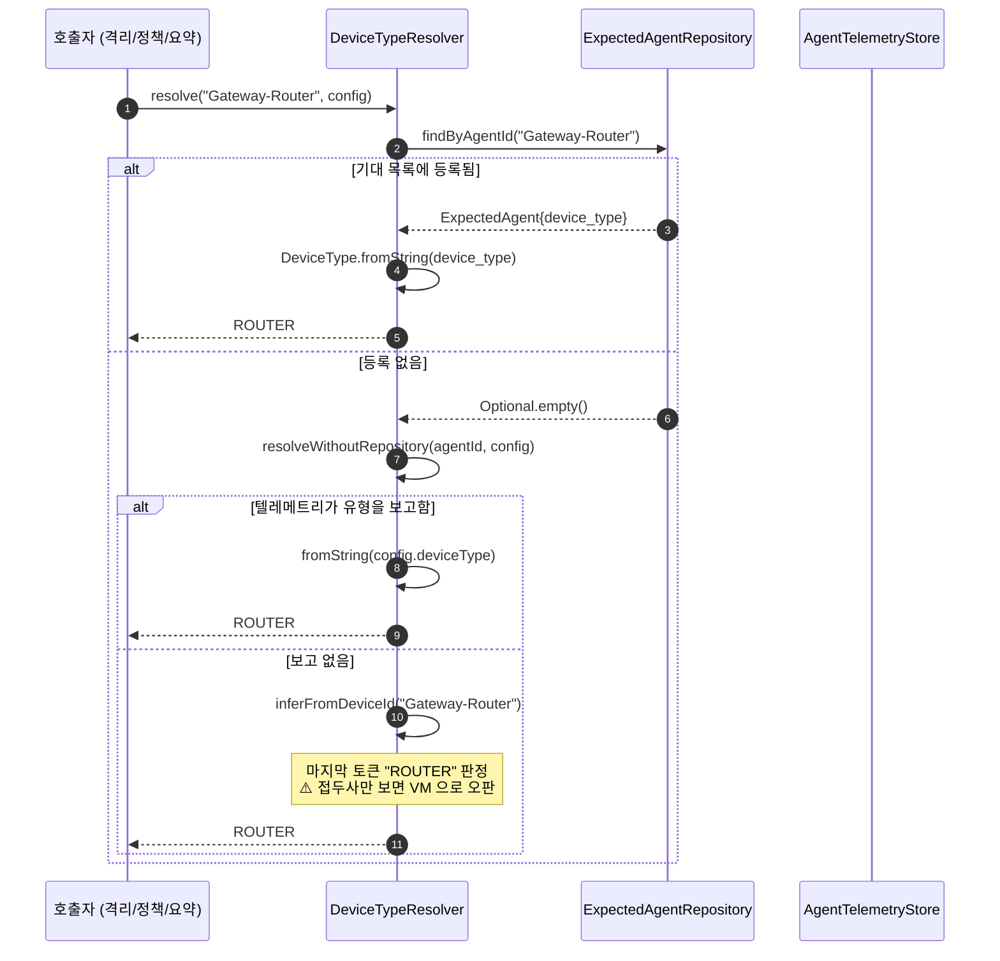

### 6.1 ⚠️ 왜 판단 순서가 중요한가

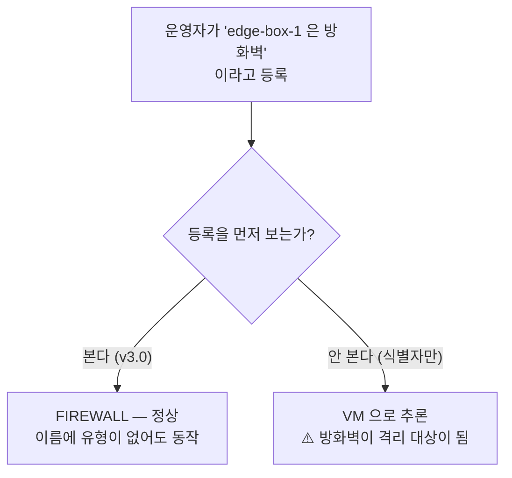

식별자 추론은 어디까지나 **관례**입니다. 운영자가 명시적으로 등록한 값이
항상 우선해야 합니다.

### 6.2 ⚠️ 결과를 캐시하지 않는 이유

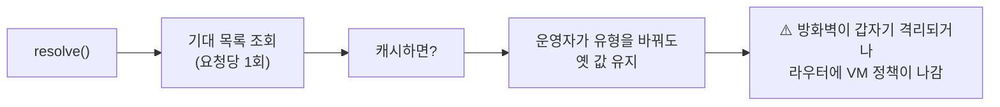

조회는 요청당 몇 번뿐이라 비용이 문제되지 않습니다. 잘못된 캐시는
디버깅이 불가능한 형태로 드러납니다.

---

## 7. 클래스 다이어그램 — 전체 요약 (v3.0)

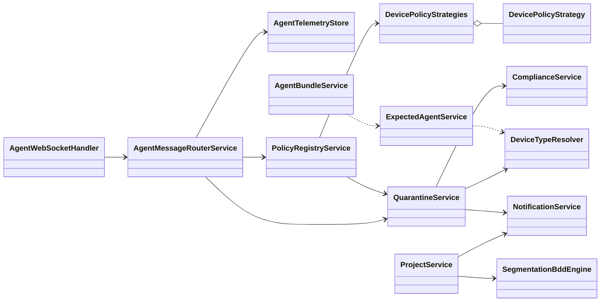

---

## 8. 실측 검증 결과 (v3.0)

### 8.1 랩 배포 현황 — **14대 연결** (v2.0 과 동일)

| 유형 | 연결 | 장치 |
| --- | --- | --- |
| 라우터 | 5 | Gateway-Router, DMZ-Router, C4I-Network-Router, Survillance-Network-Router, VDI-Router |
| 방화벽 | 1 | GNS3.Firewall |
| 스위치 | 4 | Switch-0, Switch-1, Switch-3, Switch-4 |
| VM 컨테이너 | 4 | TOD-Cam, UAV, VDI-1, VDI-2 |
| **합계** | **14** | |

미연결: Switch-2(허브 링크 없음), ATICS/KNCCS/AFCCS/PWS(방화벽 VLAN 인터페이스 미구성)

### 8.2 테스트

| 항목 | 기준선 | v3.0 | 비고 |
| --- | --- | --- | --- |
| Backend | 212 | **215** | `QuarantineServiceTest` 15 → 18 |
| Prober | 13 | **13** | 변경 없음 |
| Frontend tsc | clean | **clean** | 변경 없음 |

신규 테스트 3건:
- `firewallIsNotIsolatable` — 명령 미전송 · 행 미생성 확인
- `firewallRejectionExplainsWhy` — 사유 문장 + 대안 안내 + 이력 기록
- `firewallRejectionDoesNotNotify` — 알림 미생성

### 8.3 리팩토링 효과 (실측)

| 파일 | v2.0 | v3.0 | 변화 |
| --- | --- | --- | --- |
| `Service/PolicyRegistryService.java` | 1046 | **646** | **-400** (switch 4곳 제거) |
| `Service/AgentMessageRouterService.java` | 643 | 678 | +35 (저장소 위임 Javadoc) |
| `Service/QuarantineService.java` | 643 | 643 | ±0 (거부 경로 추가) |
| `Policy/strategy/DevicePolicyStrategy.java` | — | 89 | 신규 · 인터페이스 |
| `Policy/strategy/DevicePolicyStrategies.java` | — | 97 | 신규 · 선택기 |
| `Policy/strategy/PolicyBuildContext.java` | — | 109 | 신규 · 컨텍스트 record |
| `Policy/strategy/PolicyJson.java` | — | 150 | 신규 · 공통 헬퍼 |
| `Policy/strategy/VmPolicyStrategy.java` | — | 126 | 신규 · 구현 4 |
| `Policy/strategy/RouterPolicyStrategy.java` | — | 105 | 신규 |
| `Policy/strategy/SwitchPolicyStrategy.java` | — | 160 | 신규 |
| `Policy/strategy/FirewallPolicyStrategy.java` | — | 152 | 신규 |
| `Service/AgentTelemetryStore.java` | — | 89 (본문) / 165 (주석 포함) | 신규 · 보관 책임 |
| `Service/DeviceTypeResolver.java` | — | 96 (본문) / 168 (주석 포함) | 신규 · 유형 판별 |

> **⚠️ 총 줄 수는 늘었습니다** (전략 패키지 합계 988줄 vs 서비스 400줄 감소).
> 리팩토링의 목적은 줄 수가 아니라 **변경 지역화**입니다. v2.0 은 "VM 정책을
> 고친다" 는 일이 1046줄 안의 네 곳을 찾아다니는 일이었고, v3.0 은 파일 하나를
> 여는 일입니다. 인터페이스 자체가 계약 문서 역할을 하므로 Javadoc 이
> 두꺼워진 것도 의도된 비용입니다.

**새 유형 추가 비용** — v2.0 은 `PolicyRegistryService` 의 네 곳을 고쳐야
했고 한 곳을 빠뜨리면 폴백 경로에서만 옛 동작이 남았습니다. v3.0 은
`DevicePolicyStrategy` 를 구현한 `@Component` 하나를 추가하면 끝입니다
(`supports()` 로 자기 담당을 선언하므로 선택기도 고치지 않습니다).

### 8.4 방화벽 격리 거부 (API 응답 실측)

```json
{
  "agent_id": "GNS3.Firewall",
  "device_type": "FIREWALL",
  "quarantined": false,
  "delivered": false,
  "applied": false,
  "rejected": true,
  "released": false,
  "reason": "방화벽은 격리 대상이 아닙니다 — 트렁크(eth1)에 연결된 모든 VLAN 이 함께 끊깁니다. 대신 프로젝트 규칙으로 해당 연결만 차단하세요.",
  "hint": "프로젝트 규칙에서 해당 연결만 차단하세요."
}
```

---

## 9. 알려진 제약 (실측)

| 제약 | 영향 | 우회 |
| --- | --- | --- |
| QEMU VM 4대는 sshd 없음 | 텔레메트리 미수집 | 콘솔 전용 운영 |
| 방화벽 SSH 키 미등록 | 자동 배포 불가 | `docker exec` 로 수동 배포 |
| Switch-2 허브 링크 없음 | 14대 중 1대 미연결 | 불필요 (토폴로지상 단독) |
| 방화벽 VLAN 인터페이스 미구성 | 4대 미연결 | 후속 작업 |
| 텔레메트리 저장이 메모리 | 서버 재시작 시 소실 | DB 도입 예정 |
| 라우터 ACL 경로 없음 | 라우터는 선언만 | 방화벽/스위치가 차단 담당 |

---

## 10. v2.0 → v3.0 변경 요약

| 항목 | v2.0 | v3.0 |
| --- | --- | --- |
| 유형별 분기 | `switch` 4곳 (1046줄 서비스) | **전략 패턴** (전략당 1파일) |
| 공통 헬퍼 | `PolicyRegistryService` private | `PolicyJson` / `PolicyBuildContext` |
| 텔레메트리 보관 | 라우터가 겸함 | `AgentTelemetryStore` |
| 장치 유형 판별 | 각자 추론 | `DeviceTypeResolver` 3단계 |
| 방화벽 격리 | 가능 (⚠️ 무관 존 전체 다운) | **거부 + 대안 안내** |
| 테스트 | 212 | **215** |
| 새 유형 추가 비용 | 서비스 4곳 수정 | 빈 1개 추가 |

---

## 11. 남은 리팩토링 후보 (측정 기준)

| 파일 | 줄 수 | 검토 방향 |
| --- | --- | --- |
| `QuarantineService.java` | 643 | ack 처리 → `QuarantineAckTracker` 분리 |
| `ProjectService.java` | 492 | 위반 경고 → `ViolationWarner` 분리 |
| `NotificationService.java` | 471 | 조회 쿼리 빌더 분리 |
| `LogController.java` | 405 | 응답 매핑 분리 |
| `PolicyManagement.java` | 374 | (프론트엔드) |

**우선순위 근거** — 위 파일들은 모두 공개 계약이 안정적이고 테스트가
있습니다. 즉 리팩토링 위험이 낮습니다. 반면 `AgentBundleService`(346)는
배포 경로라 지금 건드리지 않습니다.