# SonarValidator 아키텍처 다이어그램 v4.0 — 서비스·컨트롤러 전략 패턴 확대

`SonarValidator` 3계층(Agent · Backend · Frontend)의 구조를 다이어그램으로 정리한
문서입니다. 모든 내용은 실제 소스 코드와 **GNS3 PoC 랩 실측**을 기준으로 작성했습니다.

> **v4.0 (2026-09-26)** — v3.0 에서 정책 계층에만 적용했던 전략 패턴을
> **서비스·컨트롤러 전반으로 확대**했습니다. 그리고 그 과정에서 **실제 결함 2건**을
> 발견해 고쳤습니다.
>
> v3.0 대비 주요 변경은 아래와 같습니다.
>
> - CLI 조회 대상 분기(`switch` 2곳 + 중복 별칭표) → **11개 전략 + 선택기**
> - OPNsense 진단 대상 분기 → **5개 전략 + 선택기** (+ 대상 목록 API 신설)
> - 정책 푸시 결과 분기(3갈래 + 여덟 인자 알림 4회) → **결과 전략 4개**
> - 로그 줄 쪼개기(두 곳에 복사된 `split("\\R")`) → **입력 전략 3개**
> - 알림 분류/심각도 문자열 집합 → **enum + 필터 값 객체**
> - 안내 문구 `switch` + 표기 `switch` → **`AgentNodeType` enum**
> - 🐛 **`brief_count` 누락** 발견·수정 (파싱 성공이 "0건" 으로 뒤집히던 버그)
> - 🐛 **필터 공백 미제거** 발견·수정 (`= 비교` 라 조용히 결과가 비던 버그)
> - 백엔드 테스트 **215 → 261**

---

## 1. 무엇을 바꿨는가 — 한눈에

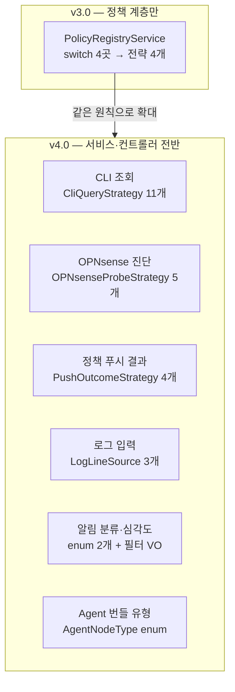

**공통 원칙** — v3.0 에서 세운 규칙을 그대로 적용했습니다.

| 원칙 | 이유 |
| --- | --- |
| 전략은 **예외 대신 `null`/`empty`** | 수집 경로에서 예외는 곧 데이터 유실 |
| 선택기는 **정규화를 한 번만** | 구현체마다 다듬으면 어떤 구현체에도 안 걸림 |
| 이름 하나 = 전략 하나 | 두 전략이 겹치면 **등록 순서가 곧 정확성**이 됨 |
| 계약 키를 전략이 함께 소유 | 따로 계산하면 **파싱은 되는데 화면은 빈** 상태가 됨 |

---

## 2. CLI 조회 대상 — `switch` 2곳과 중복 별칭표 제거

### 2.1 이전 구조

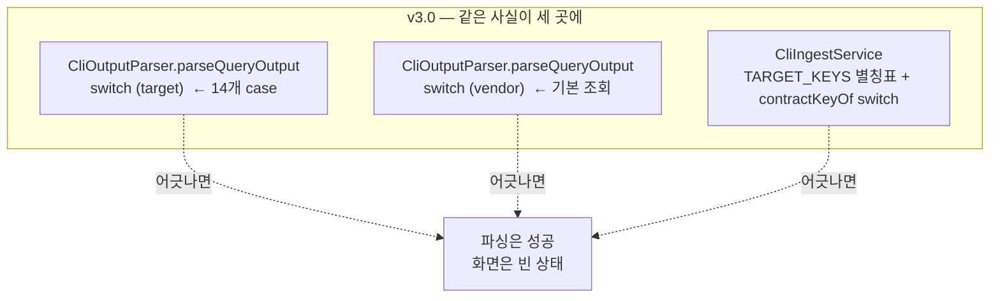

**무엇이 문제였나** — 대상 하나(`"interface-brief"`)를 추가하려면 세 곳을
고쳐야 했습니다. 별칭표에만 넣고 파서에 안 넣으면 파싱이 폴백되고,
파서에만 넣고 별칭표에 안 넣으면 **파싱은 되는데 소비자가 다른 키를 읽습니다.**

### 2.2 이후 구조

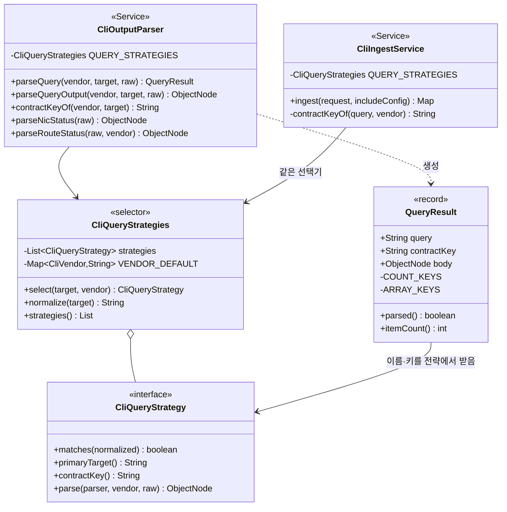

### 2.3 전략 11개

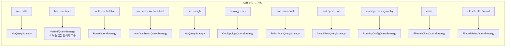

### 2.4 ⚠️ 시행착오 — `brief` 를 두 전략으로 나눴다가 되돌린 기록

처음에는 `brief` 하나가 두 출력(`ip -br addr show`, `show ip interface brief`)을
받으므로 **전략을 둘로 나누고** 선택기에 `accepts(raw)` 훅을 넣었습니다.

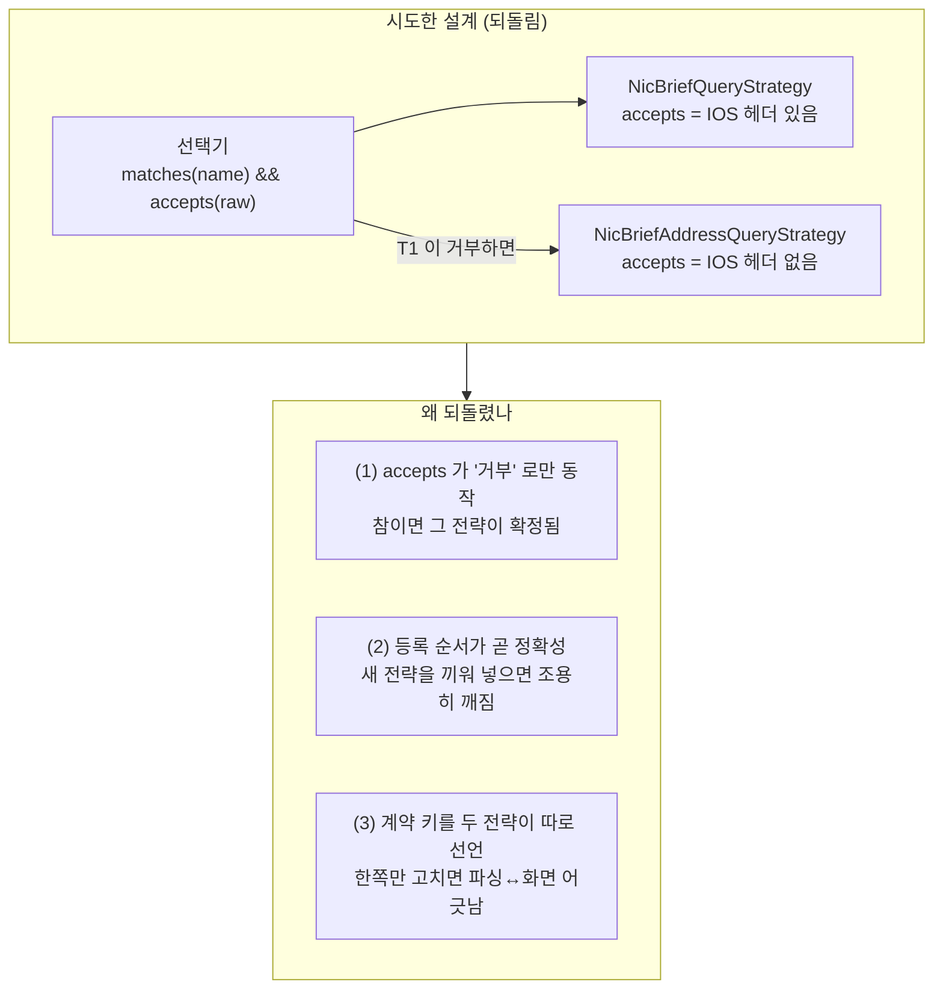

**테스트가 이 결함을 잡았습니다.** 제가 쓴 두 테스트가 실패했습니다.

- `briefSplitsByRawContent` — IOS 헤더를 줬는데 **주소 요약 전략**이 선택됨
- `primaryTargetsAreSelfSelecting` — `brief` 가 자기 자신을 선택하지 못함

**고친 방법** — 한 전략이 두 문법을 모두 알고 **`parse` 안에서 원문을 보고**
고르게 했습니다. `accepts` 훅은 아예 제거했습니다.

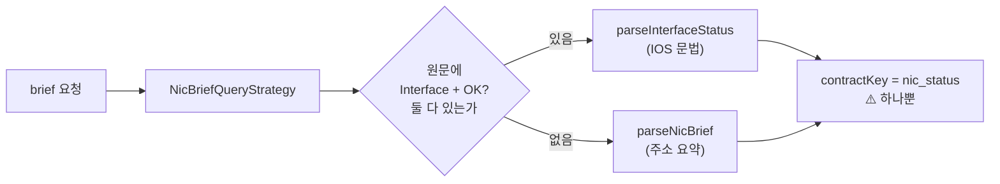

> **⚠️ IOS 헤더 판정은 두 표식을 함께 봅니다.** `Interface` 하나만 보면
> `ip -br addr` 출력과 구분되지 않아 **주소 출력을 IOS 문법으로 파싱**합니다.
> ANTLR 의 catch-all 규칙이 통과시켜 `parsed:true, 항목 0건` 이 되고,
> 호출자는 "조회했는데 없다" 로 해석합니다. **예외가 나지 않는 것이 무서운 점입니다.**

### 2.5 🐛 `brief` 결과가 통째로 버려지던 버그

`brief` 로 파싱한 본문은 `brief_count` 를 만드는데, "항목 수" 판정 목록에
**그 키가 없었습니다.**

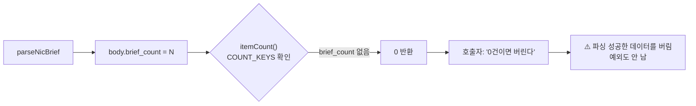

이 경로는 **CLI 폴백 적재**(구버전 Prober 가 원문만 보낼 때)에서 실제로
데이터를 버립니다. v4.0 에서 두 가지를 함께 넣었습니다.

1. `COUNT_KEYS` 에 `brief_count` 추가 (누락 수정)
2. **안전망** — 개수 키가 없으면 알려진 배열 키를 직접 세어
   "개수 키를 빠뜨린 문법" 이 다시는 조용히 데이터를 잃지 않게 함

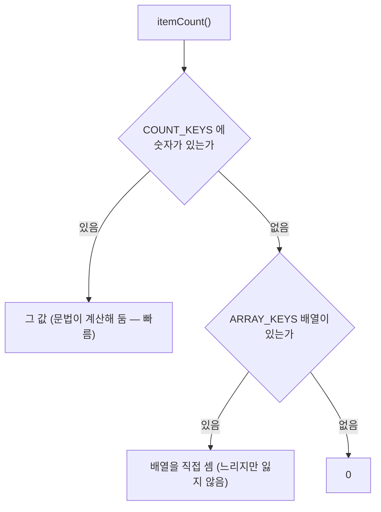

---

## 3. OPNsense 진단 대상 — 컨트롤러의 `switch` 제거

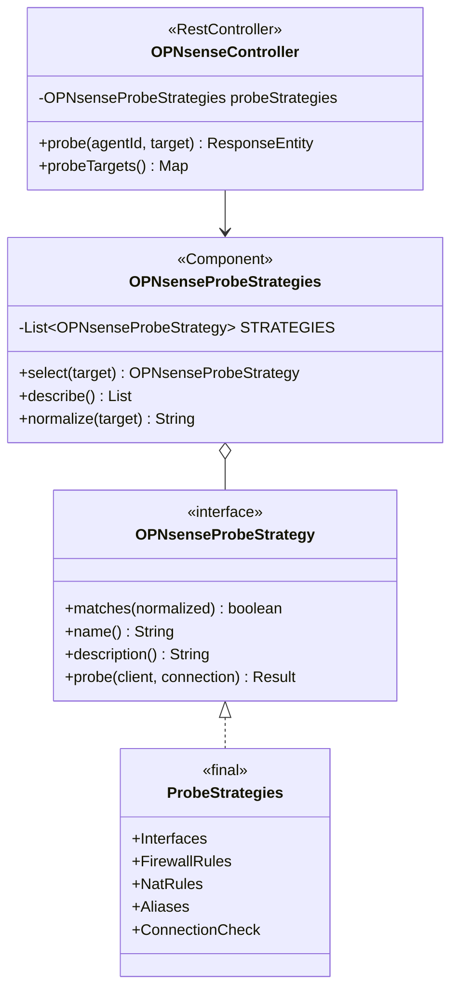

**이전** — 컨트롤러가 API 클라이언트의 메서드 다섯 개를 `switch` 로 골랐고,
그래서 **HTTP 계층이 "인터페이스/규칙/NAT/별칭" 이라는 도메인 개념**을 갖고
있었습니다.

**이후** — 컨트롤러는 이름을 넘기고 결과를 응답으로 감쌉니다.
새 대상은 구현체 하나를 추가하면 끝입니다.

### 3.1 왜 5개를 한 파일에 넣었나

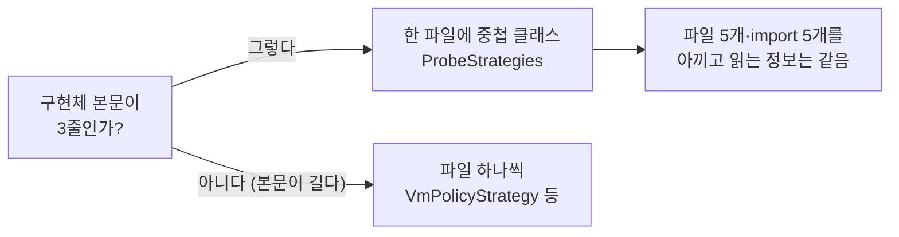

인터페이스는 그대로라, 나중에 본문이 자라면 파일로 빼면 됩니다.

### 3.2 부수 효과 — 대상 목록 API 신설

프론트엔드가 대상 목록을 하드코딩하면 **서버가 대상을 늘렸을 때 화면이
뒤처집니다.** 그러면 운영자는 새 대상을 쓸 방법을 알 수 없습니다.
`GET /api/v1/opnsense/probe-targets` 로 서버가 자기 능력을 알려줍니다.

```json
{
  "targets": [
    { "target": "interfaces", "description": "인터페이스 목록과 주소 — 어느 대역에 붙어 있는지 확인", "default": false },
    { "target": "rules", "description": "방화벽 필터 규칙 — 우리가 넣은 규칙이 실제로 있는지 확인", "default": false },
    { "target": "nat", "description": "NAT 규칙 — 주소 변환이 격리 판정에 영향을 주는지 확인", "default": false },
    { "target": "aliases", "description": "별칭(주소 그룹) — 규칙이 대역 대신 별칭을 쓰는지 확인", "default": false },
    { "target": "firmware", "description": "접속 확인과 펌웨어 버전 — API Key/Secret 이 유효한지 확인", "default": true }
  ]
}
```

---

## 4. 정책 푸시 결과 — 170줄 컨트롤러의 끝부분을 걷어냄

### 4.1 문제

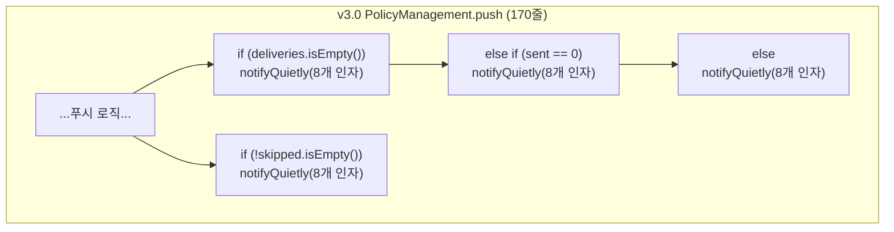

**두 가지 문제** — (1) HTTP 계층이 "어떤 결과에 어떤 문구를 남길 것인가" 라는
정책을 갖고 있었고, (2) 여덟 인자가 **모두 `String`** 이라 순서를 바꿔도
컴파일러가 막지 못했습니다. 링크와 출처를 바꿔 넣으면 **클릭하면 엉뚱한
화면**이 열립니다.

### 4.2 이후

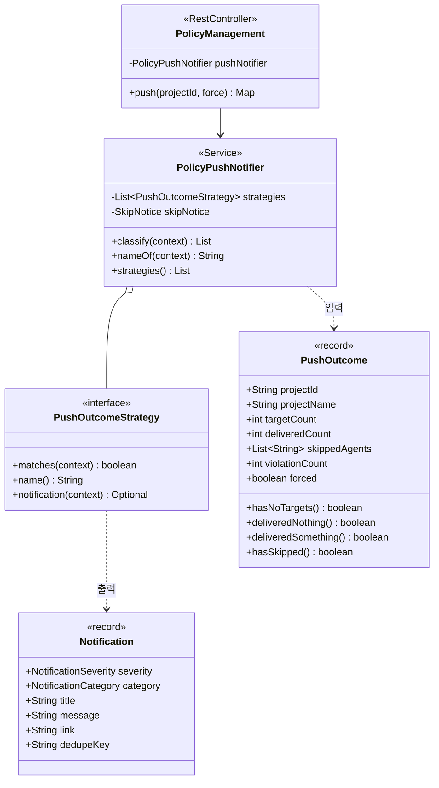

### 4.3 결과 분기 4개

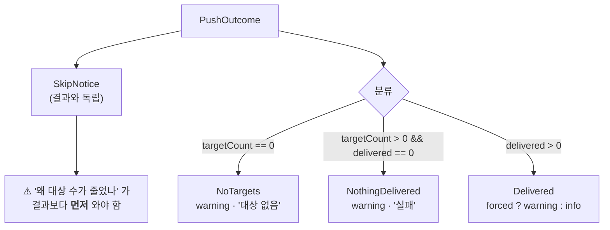

**⚠️ 조건을 겹치지 않게 갈랐습니다.** `hasNoTargets` 는 `targetCount == 0`,
`deliveredNothing` 은 `targetCount > 0` 조건을 함께 봅니다. 그래서
**등록 순서가 바뀌어도 결과가 달라지지 않습니다.** (순서에 의존하는 목록은
새 전략을 끼워 넣을 때 조용히 깨집니다)

**⚠️ 제외 알림은 분류와 독립입니다.** "격리된 장치를 뺐다" 는 결과 종류가
아니라 부가 정보이므로, 전달이 성공했든 실패했든 알려야 합니다.

### 4.4 심각도를 결과가 정한다

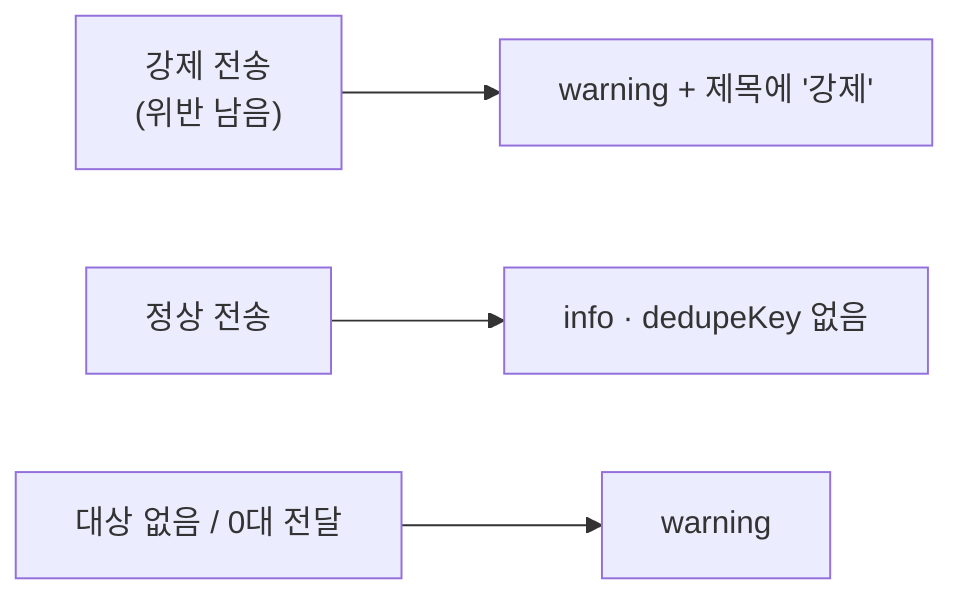

호출자가 심각도를 넘기면 "강제 전송은 warning" 같은 규칙이 호출부로 새어
나갑니다. **위반이 남은 채로 정책이 내려갔다는 사실은 결과의 성질**이므로
전략이 정합니다.

정상 전송의 `dedupeKey` 를 `null` 로 두는 이유: 반복 푸시가 정상 운영이므로
합치면 "언제 마지막으로 푸시했나" 를 잃습니다.

### 4.5 ⚠️ 분류 실패를 조용히 넘긴다

어떤 전략도 매칭되지 않으면 알림을 만들지 **않고** 경고 로그만 남깁니다.
예외를 던지면 **정책은 이미 장치에 전달됐는데 서버가 500 을 돌려주는**
상황이 됩니다. 알림은 부가 정보이므로 본 작업을 막지 않아야 합니다.

---

## 5. 로그 입력 — 두 곳에 복사된 쪼개기 제거

```mermaid
flowchart TB
    subgraph BEFORE["v3.0 — split 이 두 곳에"]
        I1["POST /ingest<br/>lines 배열 처리 + text split"]
        U1["POST /upload<br/>파일 읽기 + split"]
    end

    subgraph RISK["무엇이 위험한가"]
        R1["같은 파일을 붙여넣기와 업로드로 넣으면<br/>줄 수가 다를 수 있음"]
        R2["빈 줄 처리 규칙이 경로마다 달라짐"]
    end

    I1 -.-> RISK
    U1 -.-> RISK

    subgraph AFTER["v4.0 — 한 곳"]
        LR["LogLineReader"]
        LS1["UploadedFile"]
        LS2["LineArray"]
        LS3["TextBlock"]
        LS4["Unsupported"]
    end

    RISK -->|수정| AFTER
    LR o-- LS1 & LS2 & LS3 & LS4
```

### 5.1 결과 값 객체

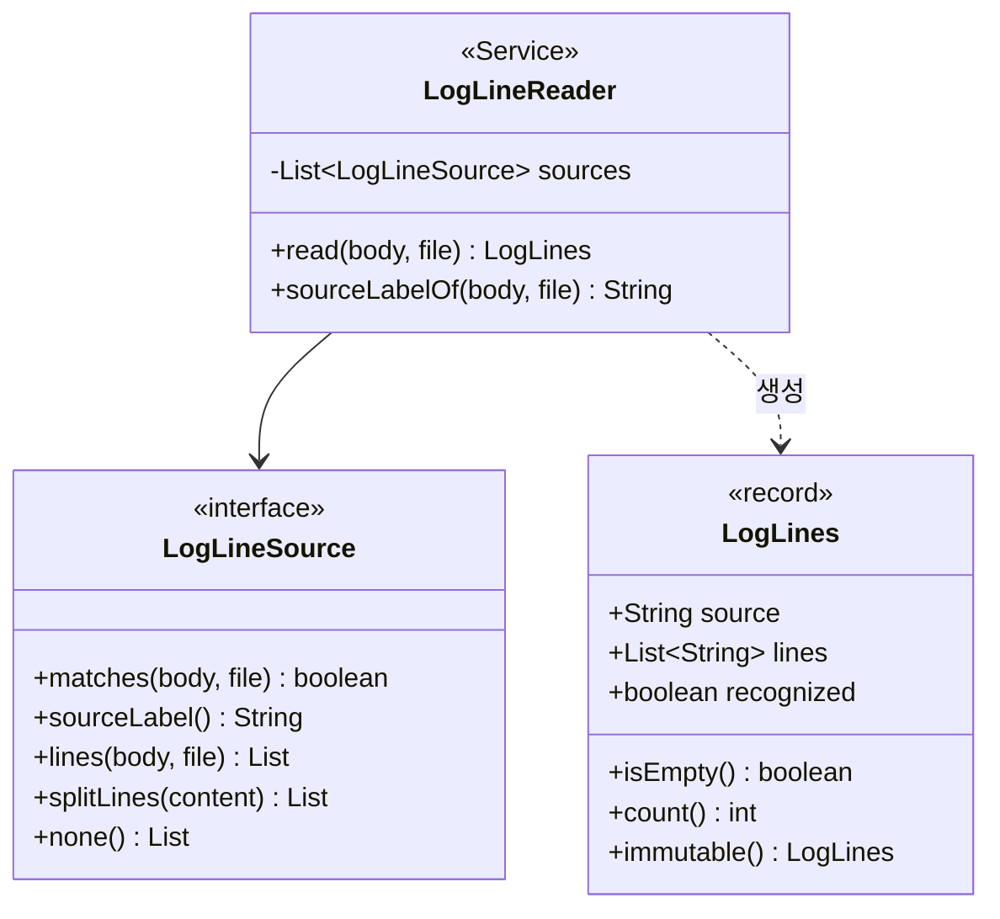

**⚠️ `recognized` 가 필요한 이유** — 줄이 0건인 경우가 두 가지입니다.

| 상황 | `recognized` | 응답 |
| --- | --- | --- |
| 요청 모양은 알겠는데 내용이 빔 | `true` | `accepted:false` + "내용이 비었습니다" |
| 요청 모양 자체를 모르겠음 | `false` | 400 + "lines 또는 text 가 필요합니다" |

둘을 구분하지 않으면 운영자가 **어느 쪽을 고쳐야 할지** 알 수 없습니다.

**⚠️ 빈 줄을 버리지 않습니다.** 장비 로그에서 빈 줄은 구분자 역할을 합니다.
버리면 "설정 블록 A" 와 "설정 블록 B" 가 붙어 한 덩어리로 보입니다.
대신 **개수**는 정확히 보고합니다.

---

## 6. 알림 — 문자열 집합에서 enum + 필터 값 객체로

### 6.1 문제

```mermaid
flowchart TB
    subgraph BEFORE["v3.0 NotificationService"]
        S1["Set~String~ CATEGORIES"]
        S2["Set~String~ SEVERITIES"]
        S3["normalizeCategory(String)"]
        S4["normalizeSeverity(String)"]
        S5["search(7개 String 인자)"]
        S6["호출부 문자열 리터럴<br/>\"SECURITY\" \"POLICY\" ..."]
    end

    S6 -.->|"오타"| BAD["컴파일 통과<br/>조용히 SYSTEM 으로 강등<br/>운영자는 한참 뒤에 발견"]
```

### 6.2 이후

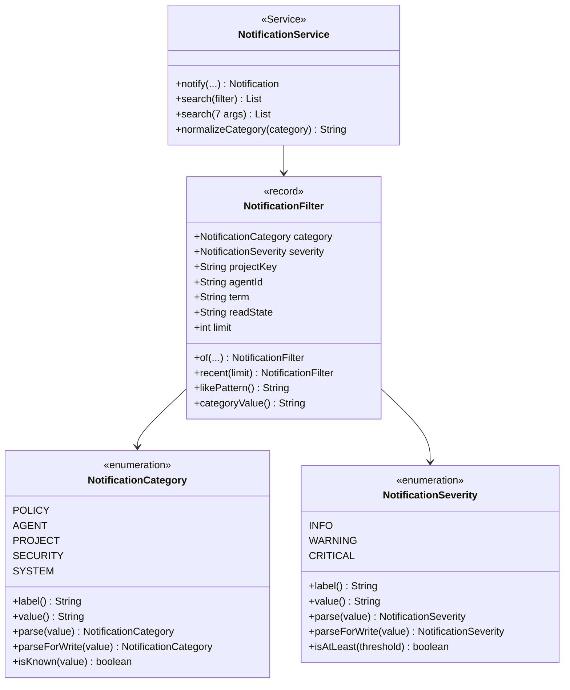

### 6.3 ⚠️ 기록과 필터의 요구가 다르다

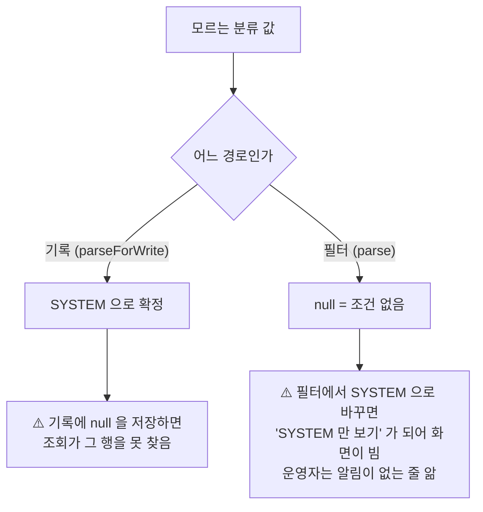

**심각도도 같은 원칙** — 기록은 모르는 값을 `INFO` 로 **내립니다**.
`CRITICAL` 로 올리면 잘못된 입력 하나가 화면을 빨갛게 만들고, `WARNING` 으로
두면 "조치 필요" 로 오해됩니다.

**⚠️ 순서가 곧 의미** — `INFO < WARNING < CRITICAL` 선언 순서 덕분에
`isAtLeast` 를 `ordinal()` 비교로 구현합니다.

### 6.4 값 객체로 인자 7개를 줄인다

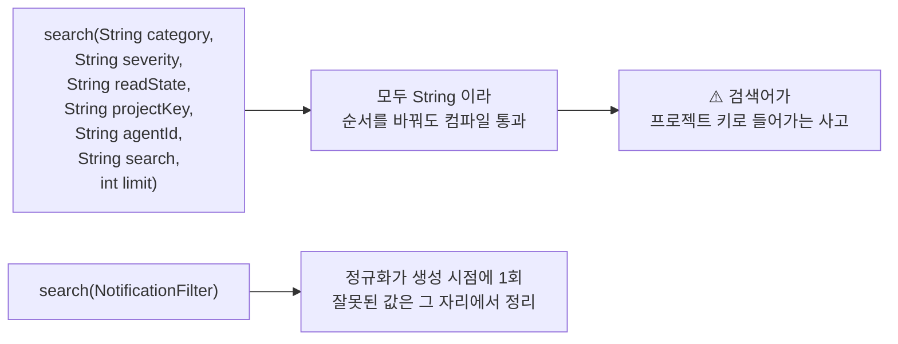

### 6.5 🐛 필터 공백이 조용히 결과를 비우던 버그

`NotificationFilter` 를 만들면서 제가 쓴 테스트가 실패했습니다.

```
filterNormalizesAtConstruction:132 공백 제거 ==> expected: <PRJ-1> but was: <  PRJ-1  >
```

**왜 위험한가** — 식별자 비교는 저장소에서 `=` 입니다.
`"  PRJ-1  "` 는 `"PRJ-1"` 과 같지 않으므로 **결과가 비고**, 운영자는
"알림이 없다" 로 해석합니다. **오류가 나지 않는 것이 이 버그의 무서운 점입니다.**

```mermaid
flowchart LR
    A["@RequestParam<br/>= '  PRJ-1  '"] --> B["blankToNull"]
    B -->|"수정 전: isBlank 만 확인"| C["'  PRJ-1  ' 그대로 저장소로"]
    C --> D["= 비교 실패"]
    D --> E["결과 0건<br/>⚠️ 오류 없음"]
    B -->|"수정 후: trim"| F["'PRJ-1'"]
    F --> G["정상 조회"]
```

---

## 7. Agent 번들 — 유형 `switch` 2곳 제거

```mermaid
flowchart TB
    subgraph BEFORE["v3.0 AgentBundleService"]
        A1["normalizeNodeType()<br/>switch (nodeType)"]
        A2["readme()<br/>switch (nodeType) ← 안내 문구"]
    end

    subgraph PROBLEM["같은 유형 목록이 두 곳"]
        P1["한쪽만 고치면<br/>'VM 번들인데 라우터 안내'"]
        P2["프로버 표기 'Router' 와<br/>정책 표기 'ROUTER' 가 달라<br/>비교마다 equalsIgnoreCase"]
    end

    BEFORE --> PROBLEM

    subgraph AFTER["v4.0"]
        E["AgentNodeType enum"]
        E1["ROUTER · SWITCH · FIREWALL · VM"]
        E2["canonical() · label() · prepareNote()"]
        E3["matches(value) — 모든 표기 흡수"]
        E4["parse(value) — 모르면 VM"]
    end

    PROBLEM -->|수정| AFTER
```

### 7.1 ⚠️ 미지의 유형을 VM 으로 두는 이유

```mermaid
flowchart LR
    A["번들 생성"] --> B["운영자가 지금<br/>무언가를 설치하려는 상황"]
    B --> C{"유형을 모르면?"}
    C -->|"거부"| D["⚠️ 운영자가 아무것도 못 함"]
    C -->|"VM 안내"| E["리눅스 컨테이너/VM 안내가 가장 일반적<br/>설정 배치·실행 절은 여전히 유효"]
```

### 7.2 방화벽 안내에 격리 제외 사실을 넣음

```
방화벽은 nftables 로 ACL 을 적용합니다.
정책은 기본 `filter` 테이블을 건드리지 않고 `sonar` 테이블을 씁니다.

⚠️ 이 장치는 격리 대상이 아닙니다. eth1 트렁크로 여러 VLAN 을
   들고 있어 인터페이스를 내리면 무관한 존이 함께 끊깁니다.
```

README 를 읽는 운영자가 이 사실을 모르면 위험한 조치를 합니다.

---

## 8. 실측 검증 결과 (v4.0)

### 8.1 테스트

| 항목 | v3.0 | v4.0 | 비고 |
| --- | --- | --- | --- |
| Backend | 215 | **261** | 신규 46건 |
| Prober | 13 | **13** | 변경 없음 |
| Frontend tsc | clean | **clean** | 변경 없음 |

신규 테스트 파일 2개:

- `CliQueryStrategiesTest` (20건) — 이름→키 매핑, `brief` 두 문법, 벤더 기본,
  폴백, **중복 담당 이름 불변식**
- `StrategyExtractionTest` (26건) — 유형 표기, 알림 enum 기록 vs 필터,
  푸시 결과 4분기, 로그 쪼개기 경로 독립성, OPNsense 대상 해석

### 8.2 리팩토링 효과 (실측)

| 파일 | v3.0 | v4.0 | 변화 |
| --- | --- | --- | --- |
| `Controller/PolicyManagement.java` | 374 | **355** | -19 (결과 분기 제거) |
| `Controller/LogController.java` | 405 | 413 | +8 (해석기 위임 Javadoc) |
| `Controller/OPNsenseController.java` | 340 | 366 | +26 (대상 목록 API 신설) |
| `Service/NotificationService.java` | 471 | 472 | ±0 (enum 위임) |
| `Service/cli/CliOutputParser.java` | 555 | 551 | -4 |
| `Service/cli/CliIngestService.java` | 203 | **187** | -16 (별칭표 삭제) |
| `Service/AgentBundleService.java` | 346 | 329 | -17 |

신규 파일 26개 (약 2,550줄):

| 영역 | 파일 | 줄 수 |
| --- | --- | --- |
| CLI 조회 | `CliQueryStrategies` + 전략 11개 + `QueryResult` + 인터페이스 | 1,024 |
| 정책 푸시 | `PushOutcomeStrategy` + `PushOutcomes` + `PolicyPushNotifier` | 458 |
| 알림 | `NotificationCategory` + `NotificationSeverity` + `NotificationFilter` | 381 |
| 로그 | `LogLineSource` + `LogLineSources` + `LogLineReader` | 377 |
| OPNsense | `OPNsenseProbeStrategy` + `OPNsenseProbeStrategies` + `ProbeStrategies` | 295 |
| 번들 | `AgentNodeType` | 158 |

> **⚠️ 총 줄 수는 늘었습니다** (약 2,550줄 추가 vs 서비스 55줄 감소).
> v3.0 과 같은 이유로 목적은 줄 수가 아니라 **변경 지역화**입니다.
> 인터페이스와 Javadoc 이 계약 문서 역할을 하므로 두꺼워진 것도 의도된 비용입니다.
> 다만 이번에는 **줄 수 자체도 요약됩니다** — `switch` 8곳이 사라졌습니다.

### 8.3 제거된 분기 (실측)

| 위치 | 이전 | 이후 |
| --- | --- | --- |
| `CliOutputParser` 대상 분기 | `switch` 14 case | 전략 11개 |
| `CliOutputParser` 벤더 폴백 | `switch` 6 case | `VENDOR_DEFAULT` map |
| `CliIngestService` 별칭표 + 키 분기 | `List<String[]>` 7행 + `switch` 6 case | 선택기 위임 |
| `OPNsenseController` 대상 분기 | `switch` 5 case | 전략 5개 |
| `PolicyManagement` 결과 분기 | `if/else if/else` 3갈래 + 알림 4회 | 전략 3개 + 제외 알림 |
| `AgentBundleService` 유형 분기 | `switch` 2곳 | `AgentNodeType` |
| `LogController` 쪼개기 | `split("\\R")` 2곳 | `LogLineSource` 3개 |
| `NotificationService` 정규화 | `Set` 2개 + 메서드 2개 | enum 2개 |

### 8.4 발견·수정한 결함 2건

| 결함 | 증상 | 위험도 |
| --- | --- | --- |
| `brief_count` 가 개수 키 목록에 없음 | `brief` 파싱 결과가 **항상 0건** → CLI 폴백 데이터 유실 | 높음 (조용함) |
| 필터가 공백을 제거하지 않음 | `"  PRJ-1  "` 가 `=` 비교 실패 → **알림 0건** | 중간 (조용함) |

**둘 다 제가 쓴 테스트가 잡았습니다.** 리팩토링이 아니라 **테스트**가
결함을 찾았고, 그것이 이번 작업의 실제 성과입니다. 결함의 공통점은
**예외가 나지 않는다**는 것입니다 — 그래서 "잘 동작한다" 와 구분되지 않습니다.

```mermaid
flowchart LR
    A["리팩토링"] --> B["계약을 명시적으로 진술"]
    B --> C["그 계약을 테스트로 검증"]
    C --> D["⚠️ 계약 위반이 드러남"]
    D --> E["결함 수정"]
```

---

## 9. 남은 리팩토링 후보 (측정 기준)

| 파일 | 줄 수 | 검토 방향 |
| --- | --- | --- |
| `QuarantineService.java` | 643 | ack 처리 → `QuarantineAckTracker` 분리 |
| `Service/cli/IpAddrVisitor.java` | 684 | 문법 방문자는 분기 구조가 본질이라 대상 아님 |
| `Service/ai/LogAnalysisEngine.java` | 592 | 프롬프트 조립 → `AnalysisPromptBuilder` |
| `Service/ai/OpenAiCompatibleClient.java` | 569 | 재시도/오류 해석 → `RetryPolicy` |
| `ProjectService.java` | 492 | 위반 경고 → `ViolationWarner` |
| `Service/log/LogService.java` | 417 | 조회 필터 → `LogFilter` 값 객체 |

**우선순위 근거** — 앞의 세 개(Quarantine·LogAnalysis·OpenAiClient)는
**재시도/오류 해석이라는 분기**를 갖고 있어 전략 패턴이 맞습니다.
반면 `IpAddrVisitor` 같은 ANTLR 방문자는 방문 대상마다 메서드를 오버라이드하는
구조 자체가 이미 분산이므로 건드리지 않습니다.

---

## 10. v3.0 → v4.0 변경 요약

| 항목 | v3.0 | v4.0 |
| --- | --- | --- |
| 전략 패턴 적용 범위 | 정책 계층 | **정책 + CLI + 진단 + 푸시 + 로그 + 알림** |
| CLI 대상 분기 | `switch` 2곳 + 별칭표 | 전략 11개 + 선택기 |
| 계약 키 출처 | 파서와 적재서비스에 각각 | **전략 하나가 단독 소유** |
| OPNsense 대상 | 컨트롤러 `switch` | 전략 5개 + **대상 목록 API** |
| 푸시 결과 | 컨트롤러 `if/else` 3갈래 | 결과 전략 4개 |
| 알림 분류 | `Set<String>` + 정규화 메서드 | **enum 2개 + 필터 VO** |
| 로그 쪼개기 | `split` 2곳 | 입력 전략 3개 |
| 번들 유형 | `switch` 2곳 | `AgentNodeType` |
| 백엔드 테스트 | 215 | **261** |
| 발견한 결함 | — | **2건** |