# SonarValidator 아키텍처 다이어그램 v5.0 — AI 정책 조언 (SONAR-43)

`SonarValidator` 3계층(Agent · Backend · Frontend)의 구조를 다이어그램으로 정리한
문서입니다. 모든 내용은 **실제 소스 코드와 로컬 실기동 실측**을 기준으로 작성했습니다.

> **v5.0 (2026-09-26)** — 망분리 위반을 탐지·조치하는 데서 멈추지 않고,
> **"어떻게 고칠 것인가" 를 AI 가 제안**하도록 닫았습니다. (SONAR-43)
>
> 이전 문서: v4.0 (서비스·컨트롤러 전략 패턴 확대)
>
> v4.0 대비 주요 변경은 아래와 같습니다.
>
> - 위반 **메시지 카드에 "AI 조언" 동선** 신설 (누르면 조언 모달)
> - 새 API 3개 — 조언 요청 / 이력 / 상세 (`/api/v1/policy/advice/**`)
> - 새 테이블 1개 — `policy_advice` (조언도 실패도 저장)
> - 새 프롬프트 계층 — **등급 규칙 · 서브넷 대장 · 선택지 비교** 요구
> - 🐛 **트랜잭션 오염 결함** 발견·수정 — "공급자 없음" 안내가 **500** 으로 나가던 문제
>   (기존 로그 분석 경로에도 같은 결함이 있었습니다)
> - 백엔드 테스트 **261 → 293**

---

## 1. 무엇을 추가했는가 — 한눈에

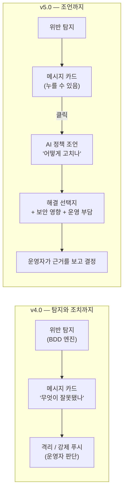

**핵심 문제** — 위반 카드는 *무엇이* 잘못됐는지만 말합니다. 운영자는 *어떻게*
고칠지를 스스로 판단해야 하고, 그 판단이 틀리면 **보안을 약화시키는 방향**으로
갑니다. (예: "규칙 삭제" 하나만 떠올림)

**해결** — 등급 체계·서브넷 구성·위반 목록을 함께 주고, **선택지 여러 개와 각각의
트레이드오프**를 요구합니다.

| 영역 | v4.0 | v5.0 |
| --- | --- | --- |
| 위반 카드 | 읽기 전용 텍스트 | **클릭 가능 (AI 조언)** |
| 조언 근거 | — | 판정 리포트를 **서버가 다시 계산** |
| 프롬프트 | 로그 원문 중심 | **등급 규칙 + 서브넷 대장 + 위반 목록** |
| 출력 | 원인 + 권장 조치 | **선택지 + 보안 영향 + 운영 부담** |
| 저장 | — | `policy_advice` (실패도 저장) |
| 기존 결함 | — | 🐛 **트랜잭션 오염 1건** 수정 |

---

## 2. 계층별 책임

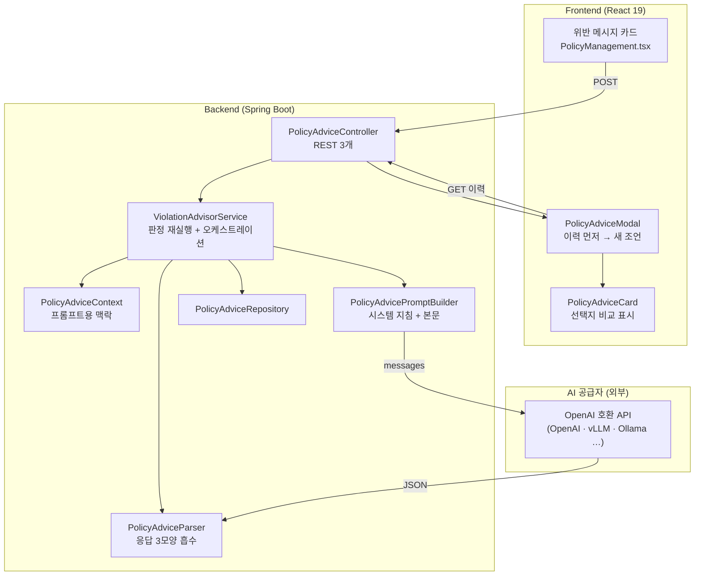

**책임 분리가 중요한 지점 두 가지**

| 컴포넌트 | 책임 | 분리한 이유 |
| --- | --- | --- |
| `PolicyAdviceContext` | 등급·서브넷·위반을 **프롬프트용 표현**으로 | 판정 엔진의 센티널(`-1`)과 표시 문자열 규칙을 한 곳에 모음 |
| `PolicyAdviceParser` | 모델 응답 → 구조화 객체 | **순수 함수**라 네트워크·DB 없이 3가지 모양을 전부 테스트 가능 |

---

## 3. 클래스 다이어그램 — 조언 계층

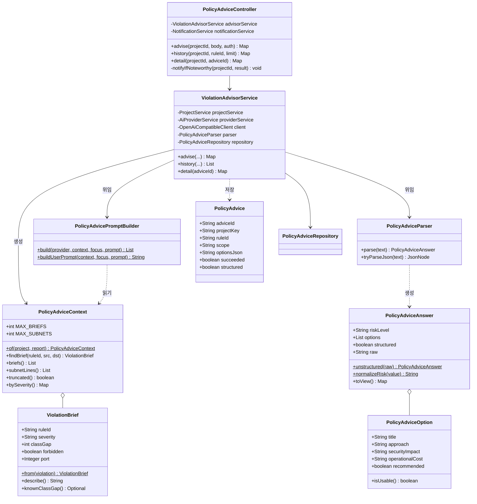

### 3.1 ⚠️ 왜 판정 리포트를 **직접** 받는가 (응답 맵이 아니라)

v4.0 의 `PolicyManagement.violations()` 는 화면용 **맵**을 만듭니다. 조언 서비스가
그 맵을 되받아 파싱하면 **타입을 잃습니다.**

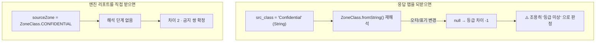

그래서 `PolicyAdviceContext.of(project, report)` 는 `SegmentationBddEngine.Report`
를 받습니다. **화면 계약과의 일치**는 `ViolationBrief.from()` 을 양쪽이 함께 쓰는
것으로 보장합니다 — 화면의 `sampled_packet` 과 프롬프트의 문장이 같은 규칙에서
나옵니다.

---

## 4. 프롬프트 설계 — 4가지 결정

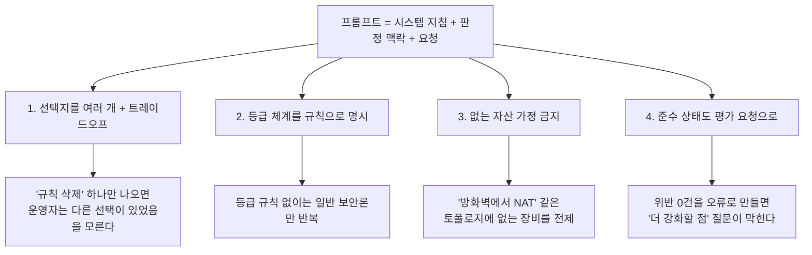

### 4.1 시스템 지침의 핵심 — 등급 규칙 **본문**

```
## 이 시스템이 적용하는 등급 규칙 (고정)
- 등급은 세 단계입니다.
  Confidential(레벨 3) · Sensitive(레벨 2) · Open(레벨 1)
- 두 서브넷의 등급 레벨 차이가 1 이하면 직접 연결을 허용합니다.
- 차이가 2 이상이면 한 단계를 건너뛰는 연결이므로 금지입니다.
  (예: Confidential(3) ↔ Open(1) 은 차이 2 → 금지)
- 즉 등급 간 이동은 반드시 인접 등급을 거쳐야 합니다.
```

⚠️ **등급 규칙을 사용자 메시지에도 넣지 않습니다.** 시스템 지침에 한 번만 둡니다.
두 곳에 같는 문단을 넣으면 **토큰만 두 배**로 쓰고 얻는 것이 없습니다. 대신
사용자 메시지에는 "그 규칙으로 판정했다" 는 사실만 확인시켜 줍니다.
(테스트 `systemPromptCarriesRules` 가 시스템 지침에 규칙이 있는지 검증합니다 —
처음에 규칙을 사용자 메시지에만 두어 이 테스트가 실패했고, 그때 바로잡았습니다)

### 4.2 출력 스키마 — 선택지가 곧 계약

```json
{
  "risk_level": "CRITICAL | HIGH | MEDIUM | LOW",
  "summary": "전체 위반 상황 한두 문장 요약",
  "root_cause": "근본 원인 판단. 근거가 약하면 '근거 부족'이라 명시",
  "policy_advice": "정책 관점의 핵심 조언 (한 줄)",
  "options": [
    {
      "title": "선택지 이름 (예: 등급 재분류)",
      "approach": "구체적으로 무엇을 어떻게 바꾸는지",
      "security_impact": "보안에 미치는 영향",
      "operational_cost": "운영 부담 (재작업·중단·비용)",
      "recommended": true
    }
  ],
  "evidence": ["판단 근거가 된 위반/서브넷 (최대 5개)"],
  "needs_more_data": false
}
```

`security_impact` 와 `operational_cost` 를 **스키마에 못 박은 이유**: 화면이 두
값을 **나란히** 보여줘야 운영자가 트레이드오프를 봅니다. 한쪽만 있으면 "쉬운 안"
만 고르게 됩니다.

---

## 5. 시퀀스 — 위반 카드를 눌러 조언을 받기까지

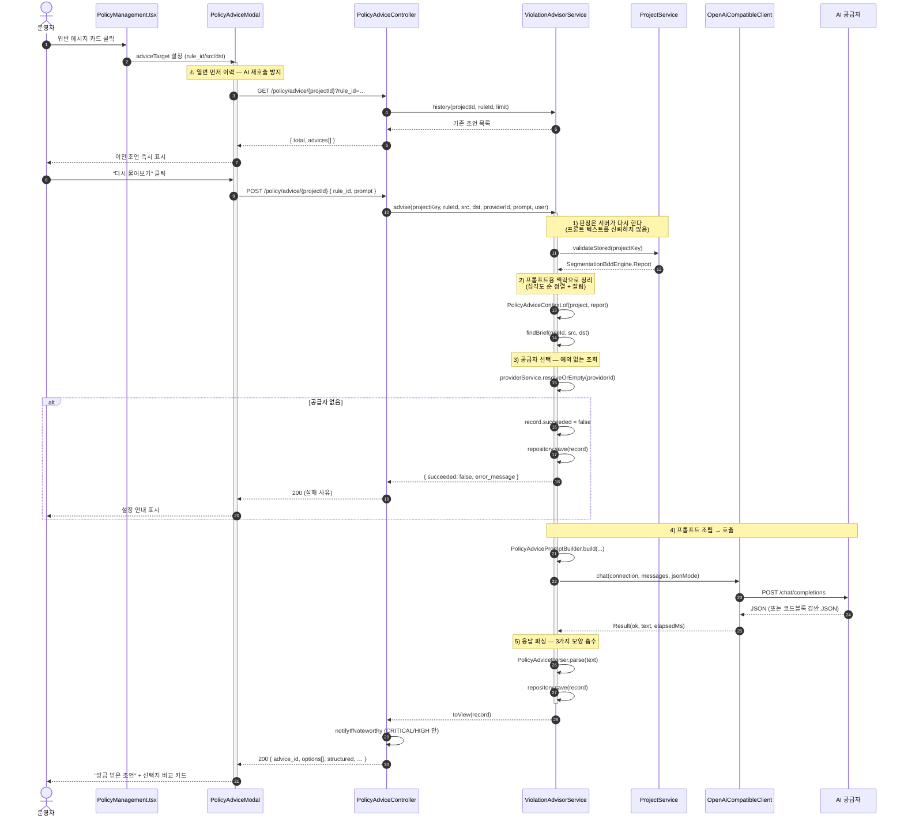

### 5.1 ⚠️ 왜 "열면 이력 먼저" 인가

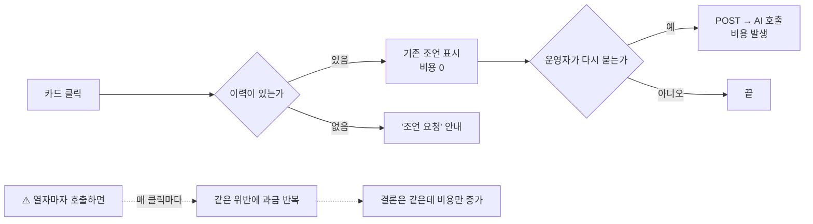

같은 입력으로 AI 를 여러 번 부르면 **비용만 쓰고 결론은 같습니다.**
그래서 v4.0 의 `LogAnalysisEngine` 과 같은 순서를 지킵니다.

---

## 6. 시퀀스 — 🐛 트랜잭션 오염 결함 (발견 → 수정)

이번 작업에서 **실제 결함 1건**을 찾았습니다. 기존 로그 분석 경로에도 **같은
결함**이 있었습니다.

### 6.1 증상

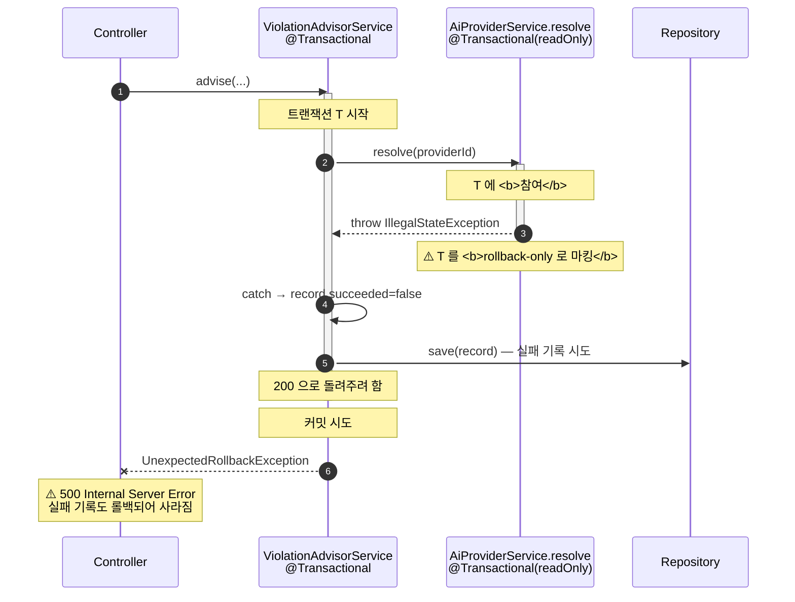

### 6.2 핵심 — "예외를 잡아도 마킹은 되돌릴 수 없다"

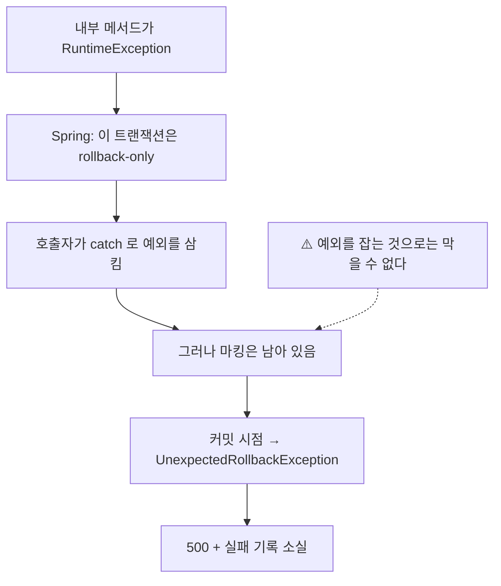

**영향 범위** — AI 공급자를 아직 등록하지 않은 **모든 신규 설치**가 이 경로를
밟습니다. "설정에서 공급자를 등록하세요" 라는 **친절한 안내가 500 으로** 나갑니다.

### 6.3 수정

| 변경 | 내용 |
| --- | --- |
| 조회 전파 | `resolve` / `resolveOrEmpty` → **`Propagation.NOT_SUPPORTED`** |
| 예외 없는 조회 | `resolveOrEmpty` **신설** (`Optional` 반환, 예외를 만들지 않음) |
| 호출자 2곳 | `LogAnalysisEngine` · `ViolationAdvisorService` → `resolveOrEmpty` 사용 |

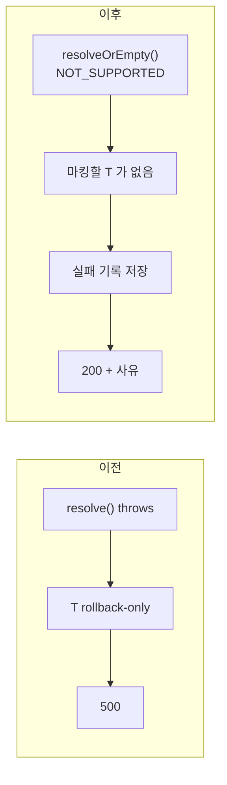

**실측 확인**

```text
이전: POST /api/v1/policy/advice/{id}  → 500 UnexpectedRollbackException
이후: HTTP=200
      {"succeeded": false,
       "error_message": "사용 가능한 AI 공급자가 없습니다.
                         설정에서 AI 공급자를 등록하고 '사용' 을 켜세요.",
       "advice_id": "PADV-DA42B6F5", "elapsed_ms": 30}
```

**회귀 방지** — `AiProviderTransactionSafetyTest` 가 **전파 수준을 리플렉션으로**
검증합니다. 런타임 프록시 동작이라 단위 테스트로 재현하기 어렵기 때문에, 대신
**결함을 만든 설정값**을 직접 확인합니다. `REQUIRED` 로 되돌아가면 즉시 실패합니다.

---

## 7. 클래스 다이어그램 — 값 객체와 파싱

### 7.1 ⚠️ 센티널 누출을 막는다

판정 엔진의 `sampledPort` 는 `ANY_PORT` = **-1** 로 "전체 포트" 를 나타냅니다.
이 값을 그대로 프롬프트에 넣으면 모델이 **"포트 -1" 을 실제 포트로 읽고**
없는 문제를 지어냅니다.

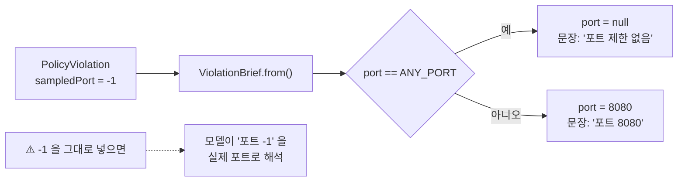

같은 원칙으로 **등급 미상**을 차이 `0` 으로 만들지 않습니다.

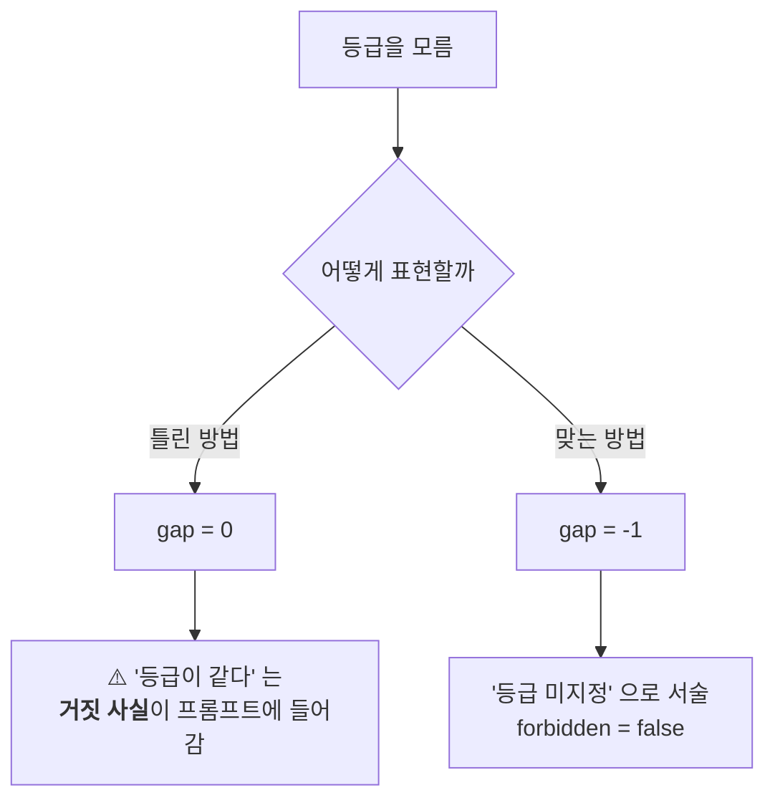

### 7.2 파싱 — 모델 응답 3가지 모양

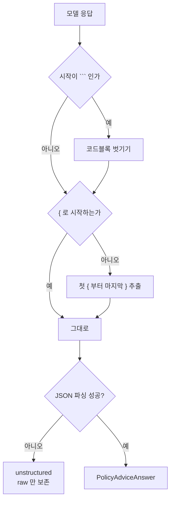

**스키마 이탈도 살립니다.**

| 이탈 | 처리 |
| --- | --- |
| `options` 대신 `recommendations` 사용 | 키 목록으로 흡수 |
| `options` 를 문자열 배열로 | 제목만 있는 선택지로 **승격** |
| `evidence` 를 문자열 하나로 | 1개짜리 배열로 승격 |
| `policy_advice` 대신 `advice`/`note` | 키 목록으로 흡수 |
| 제목이 빈 선택지 | **버림** (내용 없는 카드 방지) |

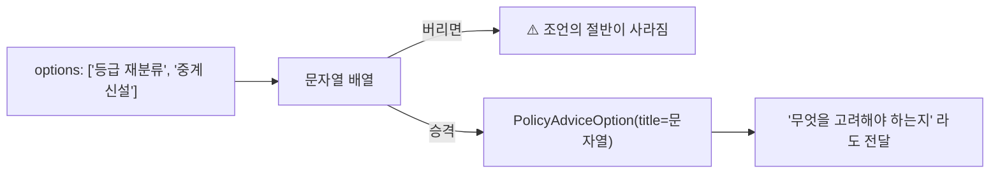

---

## 8. 데이터 모델 — `policy_advice`

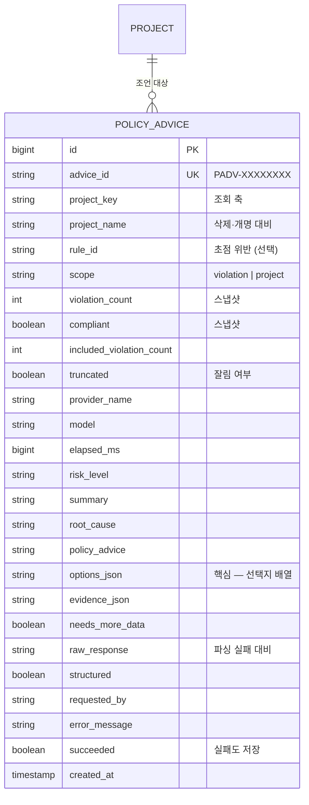

### 8.1 왜 로그 분석 테이블에 합치지 않았나

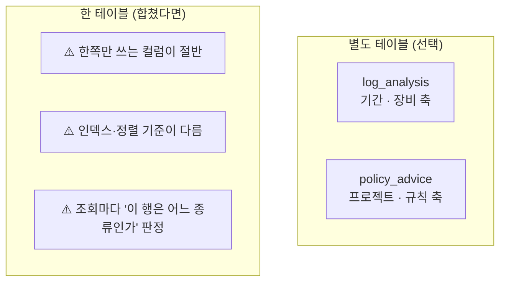

| | `log_analysis` | `policy_advice` |
| --- | --- | --- |
| 대상 | 로그 줄 | 위반 / 프로젝트 |
| 조회 축 | 기간 · 장비 | 프로젝트 · 규칙 |
| 핵심 필드 | `summary`, `root_cause` | `policy_advice`, **`options_json`** |
| 선택지 비교 | 없음 (조치 나열) | **있음 (트레이드오프)** |

### 8.2 ⚠️ 스냅샷을 함께 저장하는 이유

`violation_count` · `compliant` 를 조언 시점 값으로 남깁니다. 나중에 프로젝트가
바뀌어도 **"그때 몇 건을 보고 이 조언을 했나"** 를 되짚을 수 있어야 합니다.
조언을 근거로 정책을 바꾸는 결정을 **감사(audit)** 할 때 필요합니다.

---

## 9. API 계약

| 메서드 | 경로 | 설명 |
| --- | --- | --- |
| POST | `/api/v1/policy/advice/{projectId}` | 조언 요청 |
| GET | `/api/v1/policy/advice/{projectId}` | 이력 (`?rule_id=`, `?limit=`) |
| GET | `/api/v1/policy/advice/{projectId}/{adviceId}` | 상세 |

```json
// POST 요청
{ "rule_id": "Rule-0001",        // 없으면 프로젝트 전체
  "src_subnet": "Subnet-0001",   // 같은 규칙의 다른 쌍 구분
  "dst_subnet": "Subnet-0002",
  "provider_id": 3,              // 없으면 기본 공급자
  "prompt": "군사 규정 관점에서 봐줘" }
```

### 9.1 ⚠️ POST 이지 PUT 이 아닌 이유

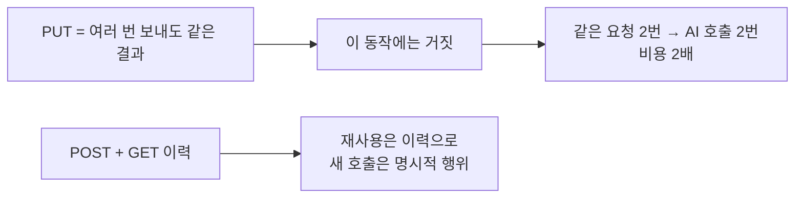

### 9.2 ⚠️ 실패도 200 을 돌려준다

AI 호출 실패(키 만료·모델명 오타·서버 미기동)는 **사유가 담긴 정상 응답**입니다.
(`succeeded=false`, `error_message`) 5xx 로 만들면 화면이 사유를 보여주기 어렵고
이력에도 남기기 어렵습니다. — `LogController.analyze` 와 같은 규칙입니다.

### 9.3 알림 연동

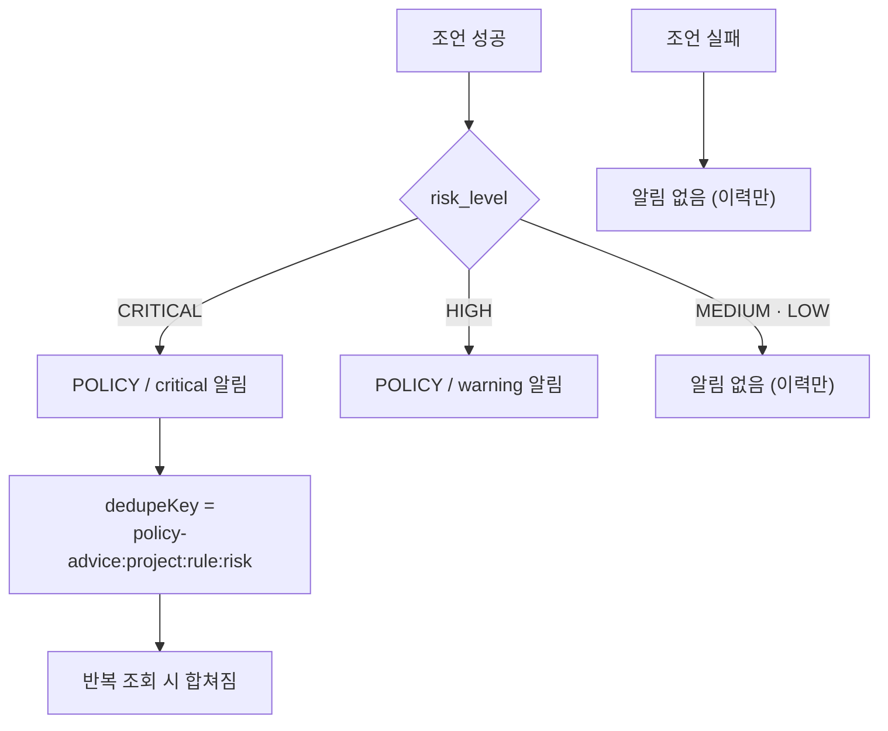

⚠️ **알림 실패가 조언 응답을 막지 않습니다.** 조언은 이미 만들어졌고 이력에도
남았으므로, 알림 실패가 500 을 만들면 "조언은 성공했는데 화면은 오류" 라는
모순이 생깁니다.

---

## 10. 프론트엔드 — 조언 표시

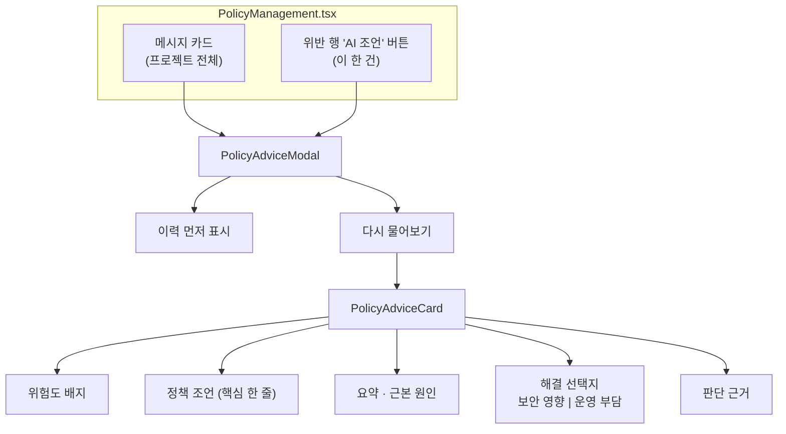

### 10.1 ⚠️ 실패와 빈 응답을 구분한다

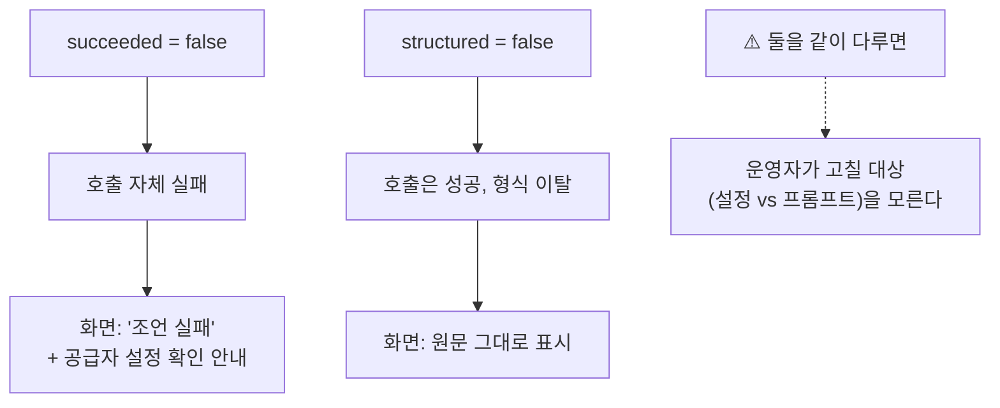

### 10.2 트레이드오프를 나란히 보여준다

```mermaid
flowchart LR
    A["선택지 카드"] --> B["보안 영향"]
    A --> C["운영 부담"]
    B --> D["⚠️ 한쪽만 보이면<br/>'쉬운 안' 만 고른다"]
    C --> D
```

`recommended=true` 인 선택지는 브랜드 색으로 강조하되, **다른 선택지를 숨기지
않습니다** — 운영자가 상황에 따라 덜 권장되는 안을 골라야 할 수 있습니다.

---

## 11. 실측 검증 결과 (v5.0)

### 11.1 테스트

| 항목 | v4.0 | v5.0 | 비고 |
| --- | --- | --- | --- |
| Backend | 261 | **293** | 신규 32건 |
| Prober | 13 | 13 | 변경 없음 |
| Frontend tsc | clean | **clean** | 신규 파일 포함 |
| Frontend eslint | 0 errors | **0 errors** | 신규 파일 포함 |

신규 테스트 파일 2개:

- `PolicyAdviceTest` (27건) — 센티널 누출, 등급 미상, 응답 3모양, 스키마 이탈,
  프롬프트 계약, 심각도 정렬/잘림, 규칙+쌍 매칭
- `AiProviderTransactionSafetyTest` (5건) — 트랜잭션 전파, 예외 없는 조회,
  관리자 경로 계약 유지

### 11.2 실기동 E2E (HTTP, 포트 3000 + 브라우저 클릭)

| # | 검증 | 결과 |
| --- | --- | --- |
| 1 | 공급자 없이 조언 요청 | ✅ **200** `succeeded=false` + 설정 안내 (이전: 500) |
| 2 | 테이블 자동 생성 | ✅ `policy_advice` 26 컬럼 |
| 3 | 위반 1건 집중 조언 | ✅ `scope=violation`, 선택지 **2개**, 근거 1건 |
| 4 | 프로젝트 전체 조언 | ✅ `scope=project`, 선택지 2개 |
| 5 | 이력 (rule_id 필터) | ✅ 2건 반환 (그 규칙만) |
| 6 | 이력 (전체) | ✅ 4건, 실패 건도 포함 |
| 7 | 알림 연동 | ✅ `POLICY / critical` 2건 (CRITICAL 조언) |
| 8 | 브라우저 — 카드 클릭 | ✅ 모달 열림, 이력 3건 즉시 표시 |
| 9 | 브라우저 — 다시 물어보기 | ✅ "방금 받은 조언" + 이력 4건 |
| 10 | 콘솔 오류 | ✅ **0건** |
| 11 | 선택지 트레이드오프 표시 | ✅ 보안 영향 · 운영 부담 나란히 |
| 12 | 코드블록 감싼 응답 파싱 | ✅ 실제 모델 이탈 재현 → 정상 파싱 |

### 11.3 🐛 발견·수정한 결함

| 결함 | 증상 | 위험도 |
| --- | --- | --- |
| 공급자 조회가 호출자 트랜잭션을 오염 | "공급자 없음" 안내가 **500** 으로 나가고 실패 기록도 소실 | **높음** (신규 설치 전부 해당) |

```mermaid
flowchart LR
    A["실기동 E2E"] --> B["공급자 없이 조언 요청"]
    B --> C["⚠️ 500 UnexpectedRollbackException"]
    C --> D["원인 추적"]
    D --> E["내부 readOnly 조회가<br/>호출자 T 를 rollback-only 로 마킹"]
    E --> F["NOT_SUPPORTED + resolveOrEmpty"]
    F --> G["200 + 사유"]
    G --> H["기존 로그 분석 경로에도<br/>같은 결함 → 함께 수정"]
```

---

## 12. v4.0 → v5.0 변경 요약

| 항목 | v4.0 | v5.0 |
| --- | --- | --- |
| 위반 카드 | 읽기 전용 | **클릭 → AI 조언** |
| 조언 API | — | **3개** (요청/이력/상세) |
| 조언 테이블 | — | `policy_advice` |
| 프롬프트 | 로그 원문 | **등급 규칙 + 서브넷 대장 + 위반 목록** |
| 출력 스키마 | 원인 + 조치 | **선택지 + 보안 영향 + 운영 부담** |
| 조언 재사용 | — | **이력 우선** (AI 재호출 방지) |
| 트랜잭션 안전 | — | **`NOT_SUPPORTED`** (결함 수정) |
| 백엔드 테스트 | 261 | **293** |
| 발견한 결함 | — | **1건** (기존 경로 포함) |