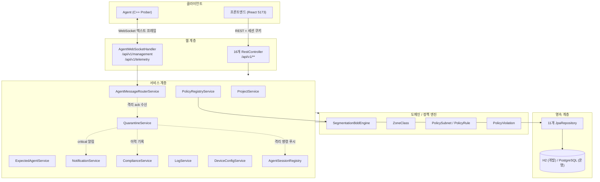
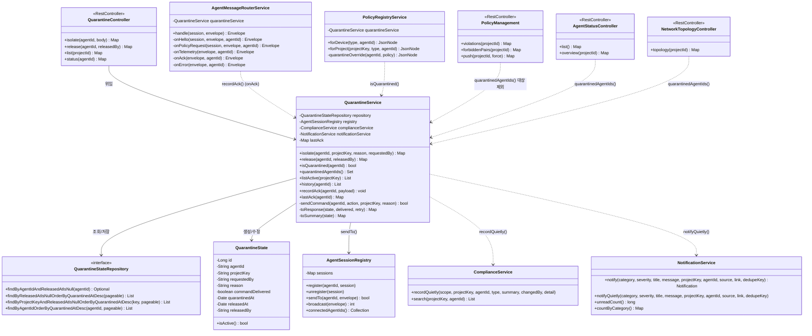
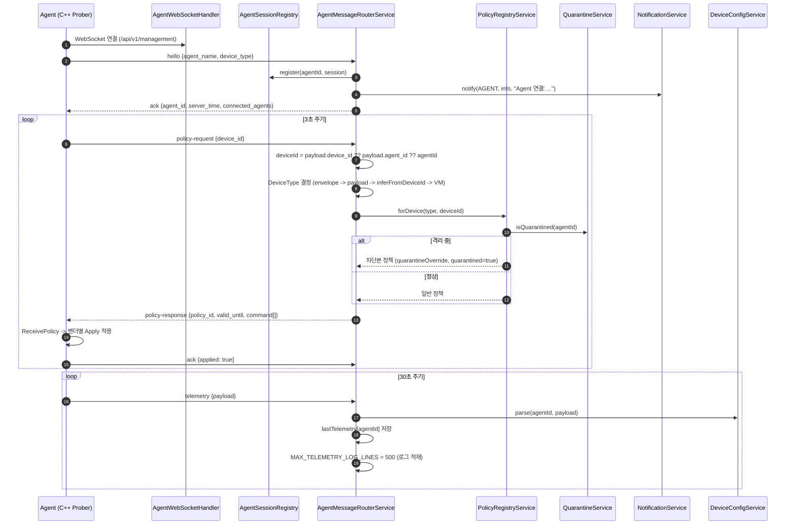
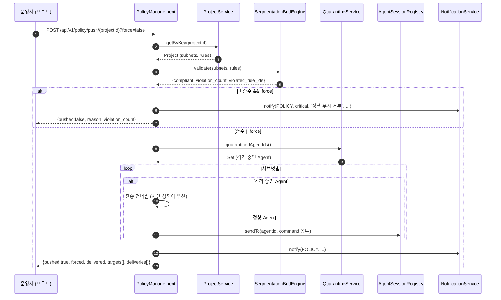
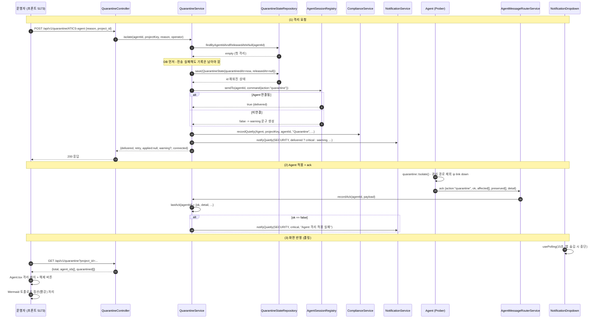
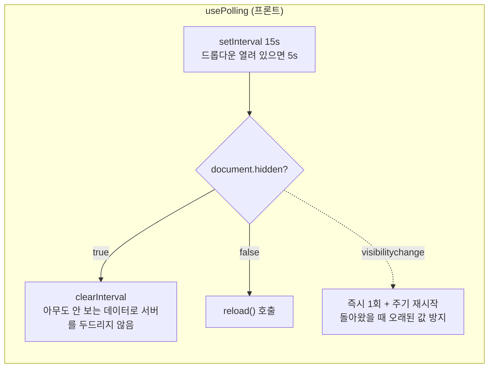
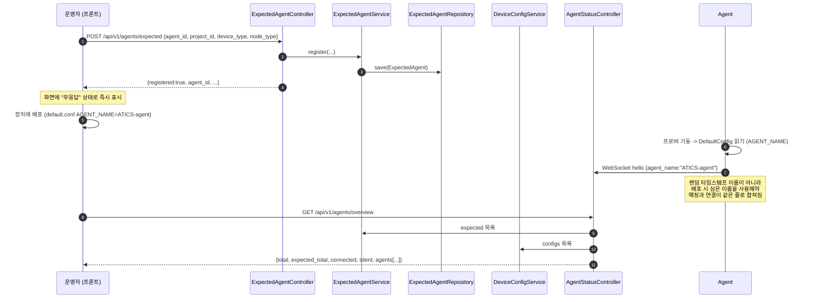

# Sonar Validator Backend — 아키텍처 다이어그램 v1.0

`SonarValidator_Backend` (Spring Boot 4.1 / Java 26)의 구조를 다이어그램으로
정리한 문서입니다. 모든 내용은 실제 소스 코드를 기준으로 작성했습니다.

> **v1.0 (2026-09-25)** — 격리 기능(`QuarantineService` / `QuarantineController` /
> `QuarantineState`), 배포 예정 장치 등록(`ExpectedAgent*`), 폴링 기반 경고
> 전파가 추가되었습니다. 테스트 기준 **197 통과** (기존 183 + 신규 14).

---

## 1. 계층 개요



---

## 2. 클래스 다이어그램 — 격리 기능 (v1.0 핵심)

격리는 **세 계층에 걸쳐** 있습니다.



### 2.1 왜 라우터가 생성자 주입이 아니라 `@Autowired(required=false)` 인가

`AgentMessageRouterService` 는 `QuarantineService` 를 **생성자로 받지 않고**
setter 로 받습니다.

```java
@Autowired(required = false)
public void setQuarantineService(QuarantineService quarantineService) { ... }
```

`QuarantineService` 가 다시 `AgentSessionRegistry` / `ComplianceService` /
`NotificationService` 에 의존하므로, 생성자로 엮으면 **라우터 단위 테스트**가
불필요하게 무거워집니다. `required = false` 덕분에 `AgentMessageRouterTest` 는
격리 서비스 없이 그대로 돕니다 (실측 8 통과).

`PolicyRegistryService` 도 같은 이유로 setter 주입을 씁니다.

### 2.2 격리 명령이 지나는 길

```
운영자 클릭
  → POST /api/v1/quarantine/{agentId}
      QuarantineController.isolate()
        → QuarantineService.isolate()
            ① DB 저장 (QuarantineState, released_at = null)
            ② AgentSessionRegistry.sendTo(agentId, command 봉투)
            ③ ComplianceService.recordQuietly(...)   ← 감사
            ④ NotificationService.notifyQuietly(...) ← 경고
        ← {delivered, retry, applied, applied_detail, warning}

Agent 적용 후 ack
  → AgentMessageRouterService.handle() → onAck()
      → QuarantineService.recordAck(agentId, payload)
          → lastAck 에 저장 (+ ok=false 이면 critical 알림)
```

### 2.3 ⚠️ 순서가 중요하다: DB 먼저, 전송 나중

전송을 먼저 하면, **전송은 성공했는데 DB 저장이 실패하는 순간** 장치는
격리됐는데 서버는 모르는 상태가 됩니다. 그러면 해제 버튼이 뜨지 않아
운영자가 장치를 되살릴 방법이 없습니다.

DB 를 먼저 하면, 전송이 실패해도 **"격리하려 했으나 전달 실패"** 라는
사실이 남습니다. 위험한 방향(장치는 살아 있는데 서버는 격리됐다고 믿는 것)이
아닙니다.

### 2.4 ⚠️ 자동 격리는 하지 않는다

오탐 한 번으로 정상 장비를 끊으면 서비스가 마비됩니다. 격리는 반드시
**사람이 누릅니다.** `QuarantineService` 는 요청받은 격리를 수행할 뿐,
스스로 판단해 격리하지 않습니다. `grep -r "Scheduled|ApplicationEvent"`
결과가 0건인 것이 이 원칙의 물증입니다.

### 2.5 `delivered` 와 `applied` 는 다른 값이다

| 필드 | 의미 | 누가 아는가 |
|---|---|---|
| `delivered` | 소켓에 써 넣었는가 | 서버 (`sendTo` 반환값) |
| `applied` | 인터페이스가 실제로 내려갔는가 | **Agent 만** (ack 로 보고) |

서버는 장치 내부를 볼 수 없습니다. 그래서 `applied` 는 ack 가 도착해야
채워지며, 도착 전에는 `null`("모름")이지 `false`("실패")가 아닙니다.

---

## 3. 클래스 다이어그램 — 전체 (v1.0)

```mermaid
classDiagram
    direction LR

    class ProjectController {
        <<RestController>>
        +list() Map
        +get(projectId) Map
        +create(body) Map
        +update(projectId, body) Map
        +delete(projectId) Map
        +validation(projectId) Map
        +draftValidation(body) Map
    }
    class PolicyManagement {
        <<RestController>>
        +violations(projectId) Map
        +forbiddenPairs(projectId) Map
        +push(projectId, force) Map
    }
    class NetworkTopologyController {
        <<RestController>>
        +topology(projectId) Map
        +discovered(projectId) Map
        +routes(protocol) Map
    }
    class AgentStatusController {
        <<RestController>>
        +list() Map
        +overview(projectId) Map
        +telemetry(agentId) Map
        +configs() Map
    }
    class ExpectedAgentController {
        <<RestController>>
        +register(body) Map
        +list() Map
        +delete(agentId) Map
    }
    class QuarantineController {
        <<RestController>>
        +isolate(agentId, body) Map
        +release(agentId, releasedBy) Map
        +list(projectId) Map
        +status(agentId) Map
    }
    class NotificationController {
        <<RestController>>
        +list(...) Map
        +summary(...) Map
        +unread(limit) Map
        +markRead(id) Map
        +markAllRead() Map
        +delete(id) Map
    }
    class ComplianceController {
        <<RestController>>
        +changes(projectId, agentId) Map
    }
    class AuthController {
        <<RestController>>
        +login(body, request) ResponseEntity
        +me(auth) ResponseEntity
        +logout()
    }
    class LogController {
        <<RestController>>
    }
    class RouterController {
        <<RestController>>
    }
    class OPNsenseController {
        <<RestController>>
    }
    class UserController {
        <<RestController>>
    }
    class AiProviderController {
        <<RestController>>
    }
    class CliIngestController {
        <<RestController>>
    }
    class OfflineImportController {
        <<RestController>>
    }

    class ProjectService {
        -ProjectRepository repository
        -ComplianceService complianceService
        +listAll() List
        +getByKey(key) Project
        +create(request) Project
        +update(key, request) Project
        +delete(key) void
    }
    class SegmentationBddEngine {
        +validate(subnets, rules) Report
        +forbiddenPairs(subnets) List
        +isForbidden(srcClass, dstClass) bool
    }
    class BddManager {
        +nodes() Map
        +apply(operation, node) BddNode
        +variables() PacketVariables
    }
    class BddNode {
        -bool terminal
        -bool allowed
        -BddNode low
        -BddNode high
        +isTerminal() bool
    }
    class PacketVariables {
        -int srcLevel
        -int dstLevel
        -int protocol
        -int port
    }
    class ZoneClass {
        <<enumeration>>
        OPEN
        SENSITIVE
        CONFIDENTIAL
        +label() String
        +level() int
        +allowsDirectConnection(a, b) bool
        +forbidsDirectConnection(a, b) bool
        +fromString(text) ZoneClass
    }
    class PolicyRegistryService {
        +forDevice(type, agentId) JsonNode
        +forProject(projectKey, type, agentId) JsonNode
        -projectPolicy(...) ObjectNode
        -quarantineOverride(agentId, policy) ObjectNode
    }
    class QuarantineService {
        +isolate(...) Map
        +release(...) Map
        +isQuarantined(agentId) bool
        +quarantinedAgentIds() Set
        +recordAck(agentId, payload)
    }
    class ExpectedAgentService {
        +register(...) ExpectedAgent
        +list(projectId) List
        +delete(agentId) bool
        +overview() Map
    }
    class AgentMessageRouterService {
        +handle(session, envelope) Envelope
        -onHello/-onPolicyRequest/-onTelemetry/-onAck/-onError
    }
    class AgentSessionRegistry {
        +register/unregister/sendTo/broadcast
    }
    class NotificationService {
        +notify(...) Notification
        +notifyQuietly(...)
        +unreadCount() long
        +countByCategory() Map
    }
    class ComplianceService {
        +recordQuietly(...)
        +search(projectKey, agentId) List
    }
    class DeviceConfigService {
        +parse(agentId, payload) NeutralDeviceConfig
        +get(agentId) NeutralDeviceConfig
    }
    class LogService {
        +ingest(agentId, lines) int
        +search(...) List
    }
    class CliIngestionService {
        +ingest(agentId, deviceType, payload) JsonNode
    }
    class OfflineSnapshotService {
        +importSnapshot(body) Map
        +exportSnapshot(agentId) Map
    }
    class UserService {
        +findByUsername(name) User
        +recordLoginSuccess(user)
        +recordLoginFailure(name)
    }

    class Project {
        -Long id
        -String projectKey
        -String name
        -String category
        -String description
        -String status
        -List subnets
        -List rules
        +toPolicySubnets() List
        +toPolicyRules() List
    }
    class ProjectSubnet {
        -Long id
        -Project project
        -String subnetId
        -String cidr
        -ZoneClass zoneClass
        -String name
        -String agentId
        -boolean manuallyEdited
    }
    class ProjectRule {
        -Long id
        -Project project
        -String ruleId
        -String source
        -String destination
        -Integer port
        -String protocol
        -boolean enabled
    }
    class QuarantineState {
        -Long id
        -String agentId
        -Date releasedAt
        +isActive() bool
    }
    class ExpectedAgent {
        -Long id
        -String agentId
        -String projectKey
        -String deviceType
        -String expectedIp
    }
    class Notification {
        -Long id
        -String notificationId
        -String category
        -String severity
        -String dedupeKey
        -int repeatCount
        -boolean read
    }
    class ComplianceChange {
        -Long id
        -String changeId
        -String scope
        -String projectKey
        -String agentId
        -String type
        -String summary
    }
    class User {
        -Long id
        -String username
        -Role role
        -boolean enabled
    }
    class DeviceLog {
        -Long id
        -String agentId
        -Date occurredAt
    }

    ProjectController --> ProjectService
    PolicyManagement --> ProjectService
    PolicyManagement --> PolicyRegistryService
    PolicyManagement --> AgentSessionRegistry
    PolicyManagement ..> QuarantineService
    PolicyManagement ..> NotificationService
    NetworkTopologyController --> ProjectService
    NetworkTopologyController ..> AgentMessageRouterService
    NetworkTopologyController ..> QuarantineService
    AgentStatusController ..> AgentMessageRouterService
    AgentStatusController ..> QuarantineService
    AgentStatusController ..> ExpectedAgentService
    ExpectedAgentController --> ExpectedAgentService
    QuarantineController --> QuarantineService

    ProjectService --> Project
    ProjectService ..> SegmentationBddEngine
    ProjectService ..> ComplianceService
    Project "1" --> "*" ProjectSubnet : subnets
    Project "1" --> "*" ProjectRule : rules
    ProjectSubnet ..> ZoneClass : zone_class
    SegmentationBddEngine --> BddManager
    BddManager --> BddNode
    BddManager ..> PacketVariables
    SegmentationBddEngine ..> ZoneClass

    QuarantineService --> QuarantineState
    QuarantineService --> AgentSessionRegistry
    QuarantineService ..> NotificationService
    QuarantineService ..> ComplianceService
    ExpectedAgentService --> ExpectedAgent

    AgentMessageRouterService --> AgentSessionRegistry
    AgentMessageRouterService --> DeviceConfigService
    AgentMessageRouterService --> LogService
    AgentMessageRouterService ..> NotificationService
    AgentMessageRouterService ..> CliIngestionService
    AgentMessageRouterService ..> QuarantineService
    PolicyRegistryService ..> QuarantineService

    UserService --> User
    NotificationService --> Notification
    ComplianceService --> ComplianceChange
```



---

## 4. 시퀀스 — Agent 연결 및 정책 수신



---

## 5. 시퀀스 — 정책 푸시 (격리 대상 제외 포함)



---

## 6. 시퀀스 — 격리 및 경고 전파 (v1.0 핵심)



### 6.1 ⚠️ 왜 WebSocket/SSE 가 아니라 폴링인가

백엔드는 이미 Agent 와 순수 WebSocket 으로 통신합니다. 하지만 그 채널은
**Agent ↔ 서버** 전용이고 **브라우저는 그 소켓에 붙을 수 없습니다.**
브라우저까지 밀어 넣으려면 STOMP 나 SSE 를 새로 열어야 합니다.

이 화면이 필요로 하는 신선도는 **10~15초** 입니다. 위반 알림은 사람이 읽고
판단하는 정보라 1초 차이가 의미가 없습니다. 반면 실시간 채널의 비용(프록시
설정, 재연결 로직, 인증 전파, 배포 설정)은 큽니다. **그래서 가벼운 쪽을
고릅니다.**



### 6.2 격리가 화면에 나타나는 방식

| 화면 | 표시 |
|---|---|
| `Agent.tsx` | 요약 카드 "격리 중 N", 행에 `격리 중` 오류 배지 + `해제` 버튼 |
| `NetworkTopologyMermaid.tsx` | 🛑 접두 라벨 + **점선** + 굵은 빨강 (`stroke-dasharray:5 3`) |
| `PolicyManagement.tsx` | 위반 목록 위에 격리 패널 + 사유/전달·적용 배지 + 해제 버튼 |
| `NotificationDropdown.tsx` | `SECURITY` 카테고리 알림, `usePolling` 으로 자동 갱신 |

**점선**을 쓴 이유: 등급 색(빨강/보라/초록)과 겹치므로 색만으로는 구분되지
않습니다. 점선은 **흑백 인쇄와 색각 이상에서도** "이 장치는 꺼졌다" 를
전달합니다.

---

## 7. 시퀀스 — 배포 예정 장치 등록

Agent 는 **연결되어야만** 서버에 나타납니다. 그래서 배포 직후 첫 접속 전까지
목록이 0건이고, 운영자는 배포 실패로 오해합니다. `ExpectedAgent` 가 그
공백을 메웁니다.



### `state` 값의 의미

| state | 조건 | 화면 |
|---|---|---|
| `connected` | WebSocket 세션 살아 있음 | 초록 "연결됨" |
| `telemetry-only` | 세션 없지만 텔레메트리 수신 이력 있음 | 회색 "연결 끊김" |
| `silent` | 등록됐지만 접속/수신 없음 | 노랑 "무응답" |
| `unregistered` | 예정에 없이 붙은 장치 | 파랑 "예정에 없음" |

---

## 8. 검증 상태

### 8.1 백엔드 테스트 (197 통과, 0 실패)

| 테스트 | 검사 수 | 대상 |
|---|---|---|
| `IpValueObjectTest` | 33 | Ip/Prefix 값 객체 (IPv4 11 / IPv6 10 / Prefix 11) |
| `AuthenticationTest` | 15 | 로그인/세션/RBAC |
| `NotificationServiceTest` | 15 | 중복 합치기(5분 창), 필터, LIKE null |
| `LogNormalizerTest` | 15 | 로그 정규화 |
| `QuarantineServiceTest` | **14** | **격리/해제/ack/조회 (v1.0 신규)** |
| `BddManagerTest` | 14 | BDD 노드 합치기/축약 |
| `OpenAiCompatibleClientTest` | 14 | AI 프로바이더 클라이언트 |
| `CliOutputParserTest` | 13 | ANTLR CLI 파서 (Java 측) |
| `OfflineSnapshotImportTest` | 12 | 오프라인 스냅샷 왕복 |
| `SegmentationBddEngineTest` | 10 | 망분리 판정 |
| `CliIngestServiceTest` | 9 | 구버전 CLI 주입 경로 |
| `AgentMessageRouterTest` | 8 | 봉투 라우팅 (**격리 서비스 없이** 통과) |
| `CliIngestionServiceTest` | 8 | CLI 주입 서비스 |
| `DeviceConfigParserTest` | 7 | 중립 구조 변환 |
| `ProjectDtoSerializationTest` | 6 | DTO ↔ JSON snake_case |
| `OPNSenseFirewallRepositoryTest` | 3 | OPNsense 연동 |
| `WebSocketBufferSizeTest` | 1 | 1MB 버퍼 (8KB 기본값 회피) |
| `SonarValidatorBackendApplicationTests` | 1 | 컨텍스트 로드 |

### 8.2 `QuarantineServiceTest` 가 지키는 것

| 검사 | 이유 |
|---|---|
| `command` 봉투의 `action == "quarantine"` | Agent `quarantine::kIsolate` 와의 문자열 계약 |
| 미연결 시 `delivered=false` + `warning` | **거짓 성공 금지** — 최악의 실패 모드 |
| 미연결 시 상태는 저장됨 | 재접속 시 차단 정책을 받아야 함 |
| 미전달 알림은 `warning` (critical 아님) | 심각도 왜곡 방지 |
| 재격리 시 행 중복 생성 안 함 | 격리 1건 = 행 1건 |
| 재격리 시 명령은 재전송 | 전달 누락 대비 |
| `Quarantine` vs `QuarantineRetry` 이력 구분 | 감사에서 최초/재시도 구분 |
| 격리 아닌 장치 해제 시 `released=false` | 거짓 성공 금지 |
| ack 없으면 `applied=null` (false 아님) | "모름" 과 "실패" 구분 |
| ack `ok=false` → critical 알림 | 적용 실패는 즉시 조치 필요 |
| 무관한 ack 무시 | 정책 적용 보고를 격리로 오인 금지 |

> **테스트 스텁**: `support/StubRepository` 가 **동적 프록시**로 저장소를
> 스텁합니다. `JpaRepository` 를 직접 구현하면 120여 개 메서드를 채워야 하고
> 그 boilerplate 가 정작 검증할 계약을 가립니다. (`AgentMessageRouterTest` 의
> 기존 방식도 같은 목적이지만 프록시 쪽이 훨씬 짧습니다.)

### 8.3 실측 E2E (curl, 포트 3000)

프로젝트 `poc-dai-pbl` (PoC 실제 대역 8 서브넷 / 8 규칙, `agent_id` 포함):

```
compliant: false
violation_count: 5
by_severity: {CRITICAL: 0, MAJOR: 5, MINOR: 0}
metrics: {bdd_nodes_total: 3294, bdd_nodes_forbidden: 87, violating_combinations: 0}
```

MAJOR 5건은 **포트 미지정(`any`)** 규칙입니다. 등급을 건너뛰는 조합이
애초에 없었으므로 CRITICAL 은 0건 — 판정이 데이터와 일치합니다.

격리 왕복 실측:

```
POST /api/v1/quarantine/ATICS-agent
  -> delivered=false, warning="장치가 연결되어 있지 않아...", applied=null

GET /api/v1/compliance/changes?project_id=poc-dai-pbl
  -> CHG-6EE860D8 | Quarantine | Applied | "Agent ATICS-agent 격리 - ... (명령 미전달)"

GET /api/v1/notifications?category=SECURITY
  -> warning | "Agent 격리: ATICS-agent"

GET /api/v1/network/topology/poc-dai-pbl
  -> VLAN 131 ATICS  quarantined=true  agent_id=ATICS-agent

GET /api/v1/agents
  -> quarantined_count=1, quarantined=["ATICS-agent"]

DELETE /api/v1/quarantine/ATICS-agent?released_by=tester
  -> released_at 채워짐, active=false
```

---

## 9. 환경 메모

### 9.1 기동

```bash
# docker compose 가 3000 을 점유하므로 먼저 내립니다.
docker compose down
cd SonarValidator_Backend
export JAVA_HOME=/home/osboxes/.sdkman/candidates/java/26.0.2-oracle
nohup ./mvnw spring-boot:run > /tmp/sonar-backend.log 2>&1 &
```

> `| tail -40` 파이프는 출력을 버퍼링해 **기동 진행 상황이 보이지 않습니다.**
> 파일 리다이렉트를 쓰세요.

### 9.2 인증이 필요한 API

모든 `/api/v1/**` 는 세션 쿠키를 요구합니다.

```bash
curl -s -c /tmp/sonar-cookies.txt -X POST \
  http://localhost:3000/api/v1/auth/login \
  -H 'Content-Type: application/json' \
  -d '{"username":"admin","password":"admin"}'
curl -s -b /tmp/sonar-cookies.txt http://localhost:3000/api/v1/agents
```

### 9.3 프로파일

| 프로파일 | DB | DDL |
|---|---|---|
| `local` (기본) | H2 파일 `./data/sonarvalidator` | `ddl-auto: update` |
| `postgres` | PostgreSQL | `${JPA_DDL_AUTO:validate}` |

운영 배포에서는 반드시 `SPRING_PROFILES_ACTIVE=postgres` 를 설정하세요.
빠뜨리면 H2 파일 DB 를 사용하게 됩니다.

### 9.4 프로젝트 검증 경로

⚠️ `/api/v1/projects/{id}/validate` 가 아니라 **`/validation`** 입니다.

```
GET  /api/v1/projects/{projectId}/validation   저장된 프로젝트 검증
POST /api/v1/projects/{projectId}/validation   저장 없이 검증
GET  /api/v1/projects/{projectId}/forbidden-pairs
POST /api/v1/projects/draft/validation         초안 검증
```