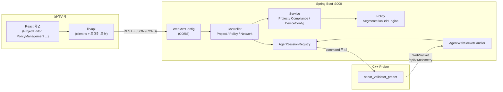

# 1. 프론트엔드 - 백엔드 연결

## 1.1 포트와 출처

| 구성 요소 | 포트 | 비고 |
| --- | --- | --- |
| 백엔드 (Spring Boot) | **3000** | Agent(C++ Prober)가 접속하는 포트와 동일해야 함 |
| 프론트엔드 (Vite dev) | **5173** | 개발 서버 |
| 프론트엔드 (Vite preview) | **4173** | 빌드 결과 미리보기 |

두 서버가 다른 포트이므로 브라우저 관점에서 **다른 출처(origin)** 입니다.
따라서 REST 호출에는 CORS 설정이 필요합니다.

> **주의**: WebSocket 은 CORS 의 영향을 받지 않습니다. 그래서 Agent 통신은
> 처음부터 잘 동작했고, REST 를 붙이는 시점에야 CORS 문제가 드러납니다.

## 1.2 CORS 설정 위치

`Config/WebMvcConfig.java`

```java
registry.addMapping("/api/**")
        .allowedOriginPatterns(allowedOriginPatterns)
        .allowedMethods("GET", "POST", "PUT", "DELETE", "OPTIONS")
        .allowedHeaders("*")
        .allowCredentials(true)
        .maxAge(3600);
```

허용 출처는 프로퍼티로 주입합니다.

```properties
# application.properties (기본값은 개발 편의용 localhost 계열)
sonar.cors.allowed-origins=http://localhost:5173,http://localhost:4173
```

`allowedOrigins("*")` + `allowCredentials(true)` 조합은 Spring 이 런타임에
거부하므로 `allowedOriginPatterns` 를 씁니다.

## 1.3 API base URL 결정 순서

`lib/api/client.ts`

1. `VITE_API_BASE_URL` 환경변수 (배포 시 주입)
2. 개발 기본값 `http://localhost:3000`

```bash
# 개발 시 백엔드를 다른 포트로 띄운 경우
VITE_API_BASE_URL=http://localhost:3100 npm run dev
```

## 1.4 연결 구조



## 1.5 왜 API 계층을 따로 두는가

화면마다 `fetch` 를 직접 쓰면 세 가지 문제가 생깁니다.

1. 오류 응답 처리가 제각각이 됩니다.
2. base URL 이 여러 곳에 하드코딩됩니다.
3. 404 를 "데이터 없음" 으로 조용히 넘기는 실수가 생깁니다.

그래서 `lib/api/client.ts` 에서 규칙을 한 번만 정하고, 도메인 모듈
(`projects.ts`, `index.ts`)이 경로를 감춥니다. 화면 코드에는 URL 문자열이
나타나지 않습니다.

```ts
// 화면 코드
const { data, loading, error, offline } = useApi(() => listProjects(), []);

// 경로와 오류 처리는 lib/api 안에 있음
export function listProjects(): Promise<ApiProjectList> {
  return apiRequest<ApiProjectList>("/api/v1/projects");
}
```

## 1.6 연결 실패 시 화면 동작

백엔드가 꺼져 있으면 화면이 그냥 비어 보입니다. 그래서 `ApiError.isNetworkError`
로 "서버에 닿지 못함" 을 구분하고, 실행 방법까지 안내합니다.

```
백엔드에 연결할 수 없습니다
cd SonarValidator_Backend && ./mvnw spring-boot:run
[다시 시도]
```

## 1.7 환경별 확인 방법

```bash
# 1) CORS 사전 요청(Preflight) 확인
curl -s -D - -o /dev/null -X OPTIONS http://localhost:3000/api/v1/projects \
  -H 'Origin: http://localhost:5173' \
  -H 'Access-Control-Request-Method: GET' | grep -i access-control-allow-origin
# 기대: Access-Control-Allow-Origin: http://localhost:5173

# 2) API 응답 확인
curl -s http://localhost:3000/api/v1/projects
```
