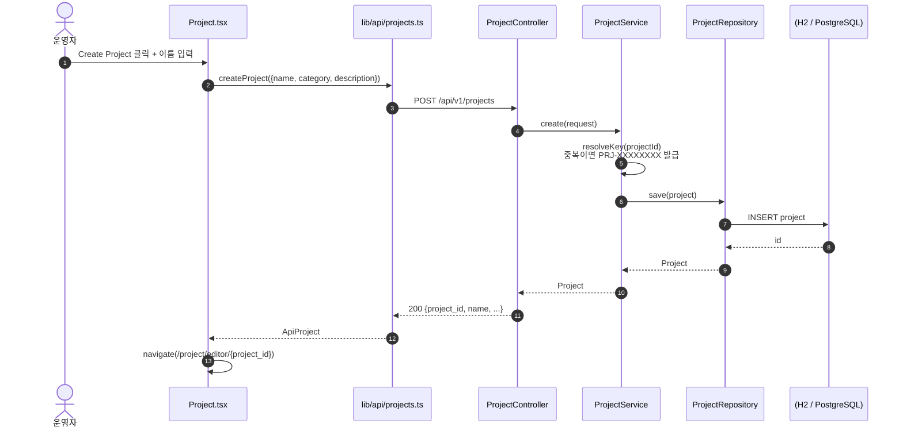
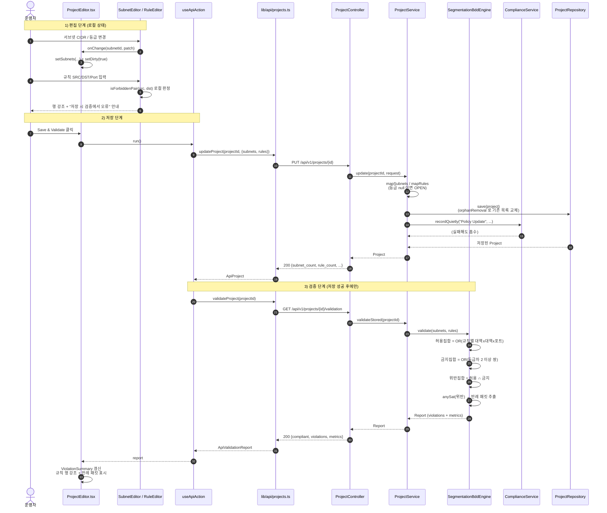
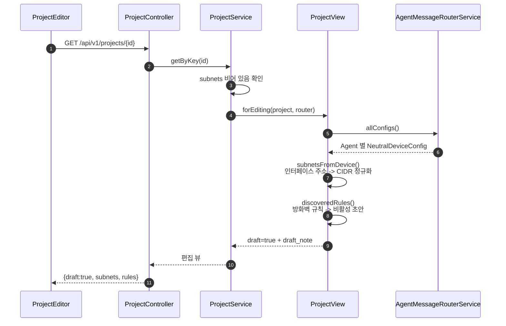

# 2. 프로젝트 편집 시퀀스 다이어그램

## 2.1 프로젝트 생성



**설계 의도**: 키 발급을 서버가 담당합니다. 프론트엔드가 만든 키는 신뢰할 수
없고(중복 가능), URL 에 그대로 노출되므로 서버가 확정합니다.

## 2.2 정책 편집 → 저장 → 검증 (핵심 흐름)



## 2.3 왜 저장 후에 검증하는가

검증은 **서버에 저장된 상태**를 기준으로 돌아갑니다. 이유는 두 가지입니다.

1. 자동 수집된 실제 설정(방화벽 규칙)을 반영해야 합니다.
   로컬 상태만 보면 수집 결과를 놓칩니다.
2. "화면에 보이는 상태 = 검증된 상태" 를 보장합니다.
   저장 전 검증을 허용하면, 사용자가 보고 있는 화면과 검증 대상이
   어긋날 수 있습니다.

저장 없이 미리보기만 필요하면 `POST /api/v1/projects/draft/validation` 을
쓰면 됩니다.

## 2.4 편집 상태 관리 방식

`ProjectEditor` 는 서버 응답을 로컬 `draft` 로 복사해 편집합니다.

```
서버 응답 (data) --useEffect--> 편집 상태 (subnets, rules, name ...)
                                      |
                                      | 사용자 편집
                                      v
                                  dirty = true
                                      |
                                      | 저장
                                      v
                              PUT /api/v1/projects/{id}
```

**목록 전체 교체 방식**을 쓴 이유: 편집기가 화면 상태를 통째로 보내므로
부분 수정 API 가 필요 없고, 계약이 단순해집니다. 서버는
`orphanRemoval = true` 로 기존 행을 정리하고 새로 넣습니다.

## 2.5 자동 수집 초안 흐름

프로젝트가 비어 있으면 서버가 수집 결과로 초안을 만듭니다.



**중요**: 자동 수집 초안의 등급은 모두 `Open` 이고
`manually_edited=false` 입니다. 또한 수집된 방화벽 규칙은 `enabled=false` 입니다.

주소 대역만 보고 등급을 추측하면 잘못된 경보가 쏟아지고, 그러면 운영자가
경보를 무시하게 됩니다. 등급 결정과 규칙 활성화는 항상 사람이 합니다.

## 2.6 상태별 화면 동작

| 상태 | 화면 표시 |
| --- | --- |
| 로딩 중 | "프로젝트를 불러오는 중..." |
| 연결 실패 | 오류 배너 + 실행 명령 + 다시 시도 |
| 편집 중 | "저장되지 않은 변경" 배지 |
| 자동 수집 초안 | "자동 수집 초안" 배지 + 안내 문구 |
| 검증 통과 | 초록 패널 + "정책 푸시" 활성 |
| 검증 실패 | 빨강 패널 + 심각도 집계 + 반례 패킷 표 + 푸시 비활성 |
