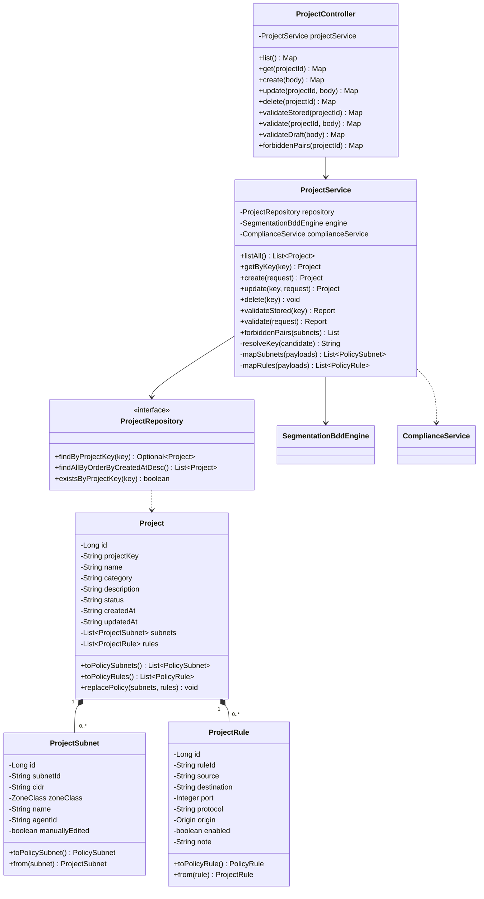
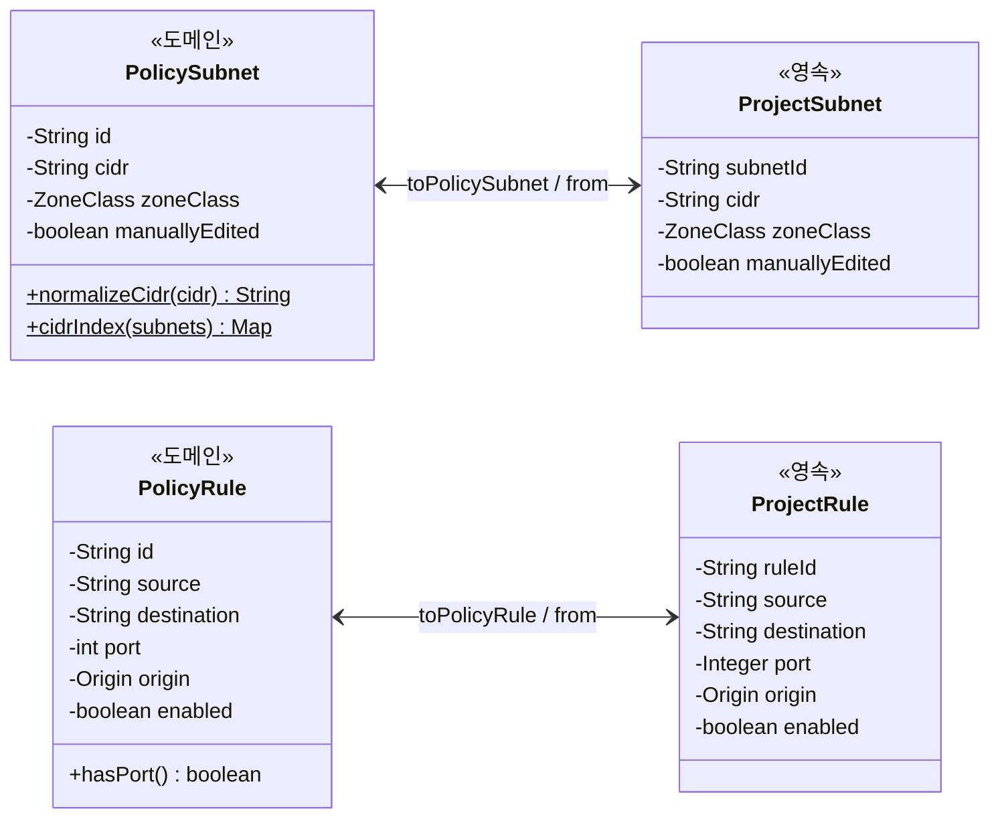
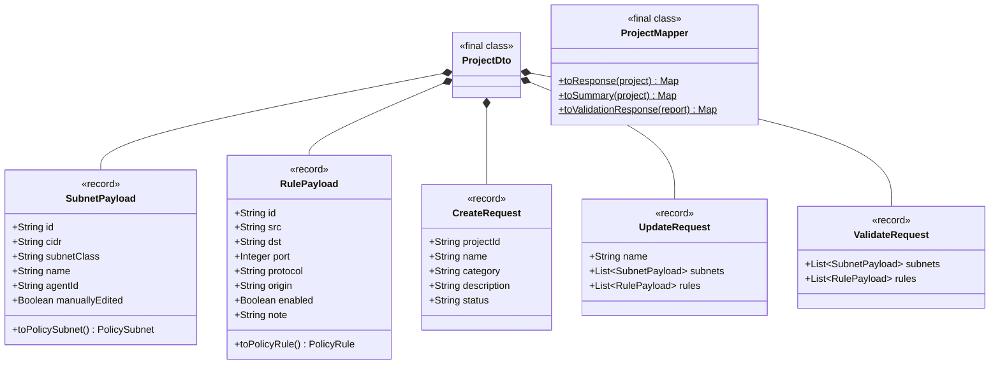
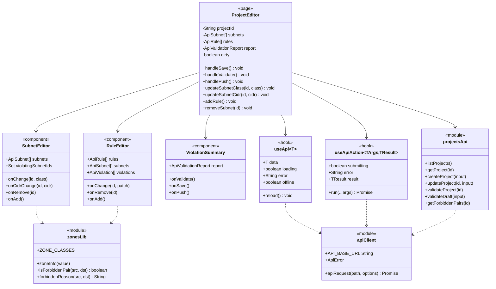

# 3. 프로젝트 편집 기능 클래스 다이어그램

## 3.1 백엔드 전체 구조



## 3.2 도메인 vs 영속 표현 (분리 이유)

같은 정보를 두 계층으로 나눠 표현합니다.

| 계층 | 클래스 | 역할 |
| --- | --- | --- |
| 도메인 | `PolicySubnet`, `PolicyRule` | 검증 엔진 입력. JPA 를 전혀 모름 |
| 영속 | `ProjectSubnet`, `ProjectRule` | DB 저장. 등급/출처를 컬럼으로 매핑 |
| 변환 | `Project.toPolicyXxx()` / `Xxx.from()` | 두 표현 사이 변환 |



이렇게 나누면:
- 검증 로직이 JPA 에 묶이지 않습니다 (`SegmentationBddEngine` 단위 테스트 가능).
- 스키마 변경이 엔진에 영향을 주지 않습니다.
- 포트의 "미지정" 표현 차이를 흡수할 수 있습니다
  (도메인은 `-1`, 영속은 `null`).

## 3.3 DTO 와 매퍼



### 필드 이름을 명시한 이유

`ProjectDto` 는 `record` 라서 **컴포넌트 이름이 곧 JSON 키**입니다.
`subnetClass` 라고 선언하면 프론트엔드가 보내는 `subnet_class` 를 읽지
못합니다.

```java
public record SubnetPayload(
        String id,
        String cidr,
        @JsonProperty("subnet_class") String subnetClass,   // 명시 필요
        String name,
        @JsonProperty("agent_id") String agentId,           // 명시 필요
        @JsonProperty("manually_edited") Boolean manuallyEdited) {
```

**실패가 조용하다는 점이 위험합니다.** 값이 `null` 로 들어오면 서비스가
기본 등급 `Open` 을 채우고, 검증은 "위반 없음" 이라고 잘못 보고합니다.
예외도 경고 로그도 없습니다. 그래서
`ProjectDtoSerializationTest` 가 snake_case 본문을 실제로 파싱해 이
계약을 왕복 검증합니다.

## 3.4 프론트엔드 구조



## 3.5 useApiAction 의 함정 (반드시 지킬 것)

`useApiAction` 은 `action` 을 **ref 에 담아** 호출합니다.

```ts
const actionRef = useRef(action);
actionRef.current = action;      // 매 렌더 최신값 유지
const submittingRef = useRef(false);

const run = useCallback(async (...args) => {
  if (submittingRef.current) return null;
  submittingRef.current = true;
  ...
  const value = await actionRef.current(...args);   // ref 를 통해 호출
  ...
}, []);                          // 의존성 비어 있음
```

만약 `useCallback([submitting])` 로 메모이즈하고 `action(...)` 을 직접
호출하면, 콜백이 **처음 렌더의 action 을 계속 붙잡습니다.** 호출자는 보통
`() => save(subnets, rules)` 처럼 화면 상태를 캡처한 화살표 함수를 넘기므로,
그 상태가 바뀌어도 **오래된 값이 전송**됩니다.

증상이 조용해서 위험합니다. 저장은 성공(200)하고 `updated_at` 도 갱신되지만
**내용은 항상 최초 값** 입니다. 서브넷을 추가해도 서버에는 빈 배열이 저장되어
검증이 "위반 0건" 이라고 잘못 보고합니다. (E2E 검증에서 실제로 발견)

## 3.6 라우팅

| 경로 | 컴포넌트 | 설명 |
| --- | --- | --- |
| `/project` | `Project.tsx` | 목록 + 생성 모달 |
| `/project/editor/:projectId` | `ProjectEditor.tsx` | 편집 + 검증 (신규) |
| `/project/editor?project_id=...` | `ProjectEditor.tsx` | 쿼리스트링 호환 |
| `/project/create/*` | 마법사 4단계 | 기존 경로 유지 |
| `/policy` | `PolicyManagement.tsx` | 위반 현황 + 푸시 |
| `/network` | `NetworkManagement.tsx` | 토폴로지 + 라우팅 |
| `/agent` | `Agent.tsx` | Agent 연결/수집 상태 |
