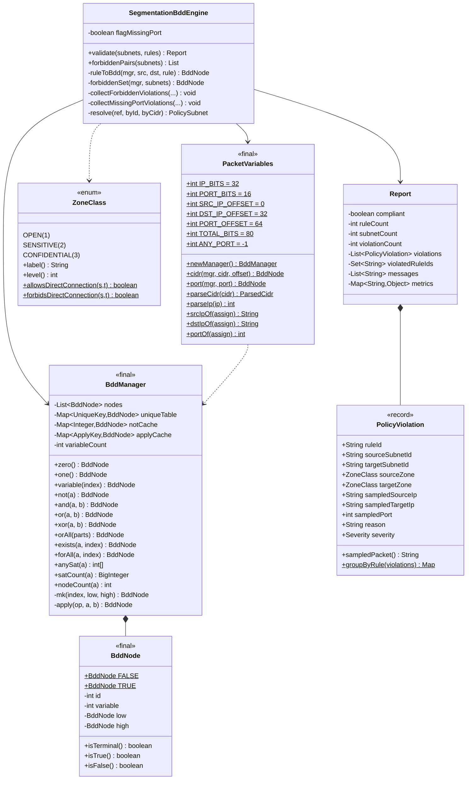

# 4. 망분리 검증 BDD 엔진

## 4.1 문제 정의

망분리 정책은 이렇게 표현됩니다.

> **Confidential 등급 서브넷과 Open 등급 서브넷은 직접 연결할 수 없다.**
> Sensitive 등급을 경유해야 한다.

여기에 연결 규칙 N개가 있습니다. 규칙이 그 정책을 위반하는지 어떻게 판정할까요?

### 순진한 방법의 문제

규칙과 서브넷 쌍을 하나씩 대조하는 방식은 세 가지 문제가 있습니다.

1. **규칙 수 x 서브넷 쌍 수** 로 계산량이 늘어납니다.
2. 규칙이 **부분적으로 겹치면** 판정이 틀리기 쉽습니다.
   (예: `10.10.0.0/16` 규칙이 `10.10.131.0/24` 금지 대역을 포함하는 경우)
3. "왜 위반인지" 를 설명할 **구체적 예시**를 만들기 어렵습니다.

## 4.2 BDD 접근

패킷을 **비트 벡터**로 보고, 규칙을 **집합**으로 표현합니다.

```
변수 배치 (총 80 비트)
+---------------+---------------+----------+
| 출발지 IP 32  | 목적지 IP 32  | 포트 16  |
+---------------+---------------+----------+
 0            31 32          63 64      79
```

비트 순서는 **MSB 먼저**입니다. 이렇게 두면 접두사 조건이 자연스럽게
"앞쪽 비트가 주어진 값과 같다" 로 표현됩니다.

### 집합 연산으로 판정

```
1) 허용 집합 A = OR (출발지 대역 x 목적지 대역 x 포트)     <- 규칙마다
2) 금지 집합 F = OR (Confidential 와 Open 의 모든 교차 곱)  <- 정책에서 생성
3) 위반 집합 V = A ∩ F                                    <- 교집합 한 번
4) V ≠ 공집합 이면 anySat(V) 로 반례 패킷 추출
```

BDD 는 동일 부분 함수를 **공유**하므로 이 계산이 규칙 수에 거의 선형으로
유지됩니다. 주소 공간이 2^80 이어도 실제 노드 수는 규칙 수준입니다.

## 4.3 구체적 예시

서브넷 3개, 규칙 2개인 경우:

| 서브넷 | 대역 | 등급 |
| --- | --- | --- |
| Subnet-0004 | 10.10.131.0/24 | Confidential (3) |
| Subnet-0002 | 10.20.111.0/24 | Sensitive (2) |
| Subnet-0001 | 192.168.0.0/24 | Open (1) |

| 규칙 | 출발 | 도착 | 포트 |
| --- | --- | --- | --- |
| Rule-0001 | Subnet-0001 | Subnet-0002 | 443 |
| Rule-0002 | Subnet-0004 | Subnet-0001 | 443 |

**금지 집합**: 등급 차이가 2 이상인 쌍은
(0004,0001), (0001,0004) 두 개뿐입니다. 따라서

```
F = (10.10.131.0/24 x 192.168.0.0/24)  U  (192.168.0.0/24 x 10.10.131.0/24)
```

**허용 집합**: Rule-0001 은 인접 등급이라 위반 후보가 아니고,
Rule-0002 가 금지 집합과 겹칩니다.

```
A ∩ F  ⊇  (10.10.131.0/24 x 192.168.0.0/24 x {443})
```

**반례 추출**: `anySat` 이 변수 할당을 하나 뽑으면
`10.10.131.0 -> 192.168.0.0:443` 같은 재현 가능한 패킷이 나옵니다.

이것이 BDD 를 쓰는 실질적 이점입니다. "위반 있음" 이 아니라
**"이 패킷이 위반입니다"** 를 알려줍니다.

## 4.4 클래스 구조



## 4.5 연산 알고리즘

### apply (이항 연산)

섀넌 전개를 씁니다.

```
f = (x AND f|x=1) OR (NOT x AND f|x=0)
```

두 피연산자의 최상위 변수 `x` 를 기준으로 자식을 나눠 재귀합니다.

```java
private BddNode apply(Op op, BddNode a, BddNode b) {
    if (a.isTerminal() && b.isTerminal()) { ... }   // 즉시 계산
    // 교환 법칙으로 캐시 적중률을 높임 (단말 id 0/1 이 앞으로)
    if (a.id() > b.id()) { swap a, b }
    if (cache has (op, a.id, b.id)) return cached;
    int index = min(topVariable(a), topVariable(b));
    result = mk(index,
                apply(op, cofactor(a, index, false), cofactor(b, index, false)),
                apply(op, cofactor(a, index, true),  cofactor(b, index, true)));
    cache.put(key, result);
    return result;
}
```

### 축약 규칙 (mk)

```java
private BddNode mk(int index, BddNode low, BddNode high) {
    if (low == high) return low;          // 변수에 무관 -> 자식 그대로
    key = (index, low.id, high.id);
    if (uniqueTable has key) return existing;   // 노드 공유
    ...
}
```

이 두 가지(축약 + 유일 테이블)가 BDD 를 압축하는 핵심입니다.

### anySat (반례 추출)

low(0) 를 먼저 시도해 0 을 선호합니다. 만족하는 경로를 따라가며 변수 값을
채우고, 방문하지 않은 변수는 -1(무관)로 남깁니다.

## 4.6 검사하는 두 가지

| 검사 | 방법 | 심각도 |
| --- | --- | --- |
| 등급을 건너뛰는 직접 연결 | `A ∩ F ≠ 공집합` | CRITICAL |
| 허용 포트 미지정 | 규칙 순회 (`port == ANY_PORT`) | MAJOR |
| 존재하지 않는 서브넷 참조 | 규칙 순회 | MINOR |

두 번째 검사를 별도로 두는 이유: 금지 대역을 건드리지는 않지만 정책을
약화시키기 때문입니다. `port` 가 비어 있으면 전체 포트가 열린 것으로
해석되므로 `MAJOR` 로 보고합니다.

## 4.7 성능 특성

실측 지표 (응답의 `metrics` 필드):

| 지표 | 의미 |
| --- | --- |
| `bdd_variables` | 변수 개수 (항상 80) |
| `bdd_nodes_allowed` | 허용 집합의 노드 수 |
| `bdd_nodes_forbidden` | 금지 집합의 노드 수 |
| `bdd_nodes_violating` | 위반 집합의 노드 수 |
| `allowed_combinations` | 허용 집합의 원소 수 (BigInteger) |
| `address_space` | 2^80 |

노드 수가 규칙 수에 비해 작으면 중복 함수가 잘 공유되었다는 뜻입니다.
운영자는 이 지표로 "검증이 실제로 집합 연산으로 돌았다" 를 확인할 수 있습니다.

> **주의**: `satCount` 는 매니저가 **아는 변수 개수** 를 기준으로 셉니다.
> 그래서 `PacketVariables.newManager()` 가 변수 80개를 미리 등록합니다.
> 등록하지 않으면 방문한 변수만 세어 "허용 조합 수" 비교가 어긋납니다.

## 4.8 테스트 전략

| 테스트 | 검증 내용 |
| --- | --- |
| `BddManagerTest` | BDD 자체의 수학적 정확성 |
| `SegmentationBddEngineTest` | 정책 판정 정확성 (랩 실제 대역 사용) |

`BddManagerTest` 가 확인하는 법칙:

- 드모르간: `NOT(a AND b) == NOT a OR NOT b`
- 분배: `a AND (b OR c) == (a AND b) OR (a AND c)`
- 존재 양화: `EXISTS x. (x AND y) == y`
- 노드 공유: 같은 함수는 같은 객체(`isSameAs`)
- 접두사 크기: `/24` 는 2^8 개 주소를 포함
- 접두사 밖 비트는 제약하지 않음

`SegmentationBddEngineTest` 가 확인하는 시나리오:

- 인접 등급은 허용
- Confidential -> Open 은 CRITICAL
- 반례 패킷이 위반 대역 안에서 추출됨
- 등급 차이 2 이상 쌍이 `forbiddenPairs` 에 나옴
- 포트 미지정은 MAJOR
- 비활성 규칙은 검증 제외
- CIDR 문자열 직접 참조도 해석
- BDD 노드 수가 규칙 수준에 머묾
