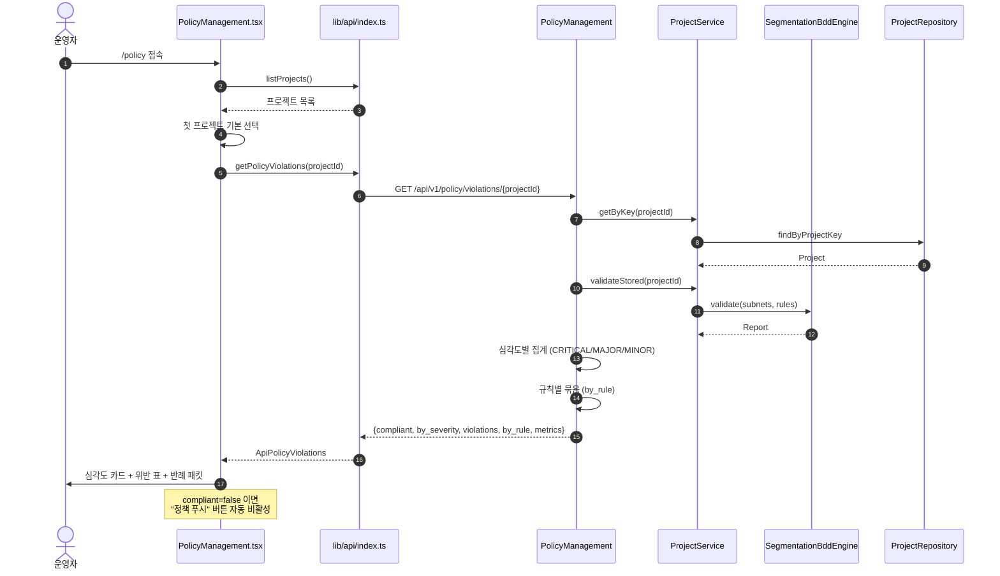
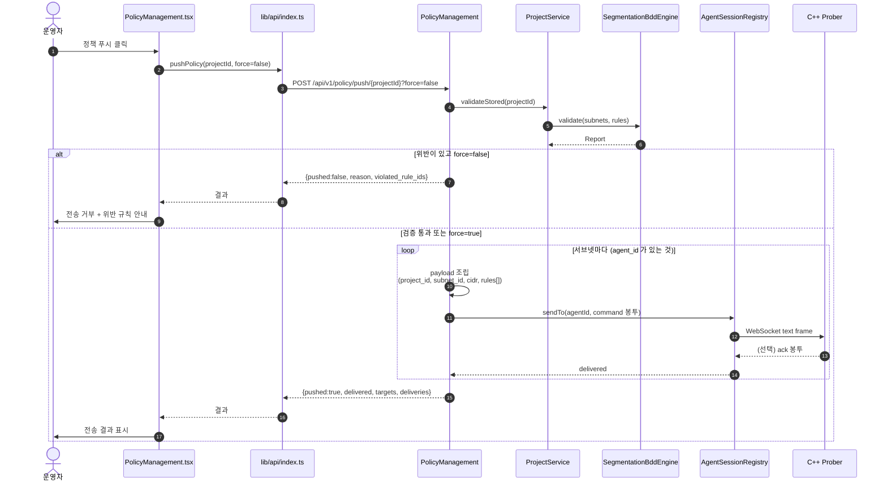
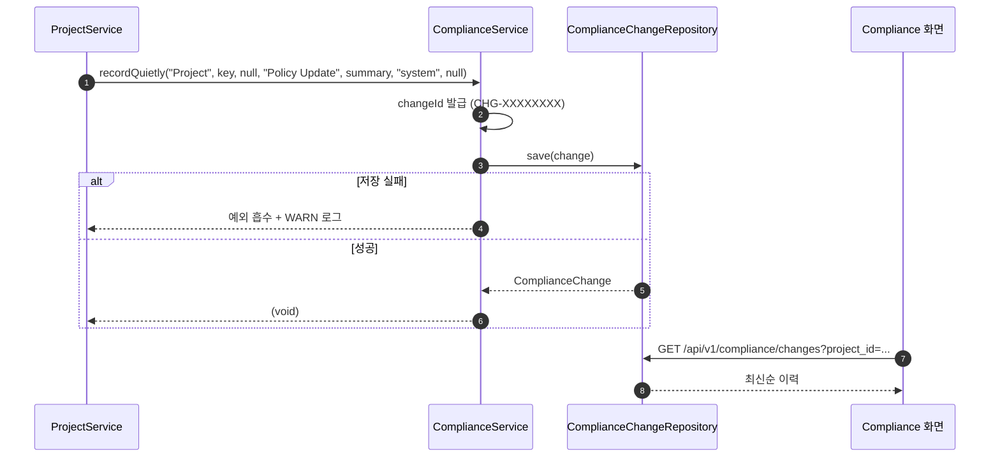
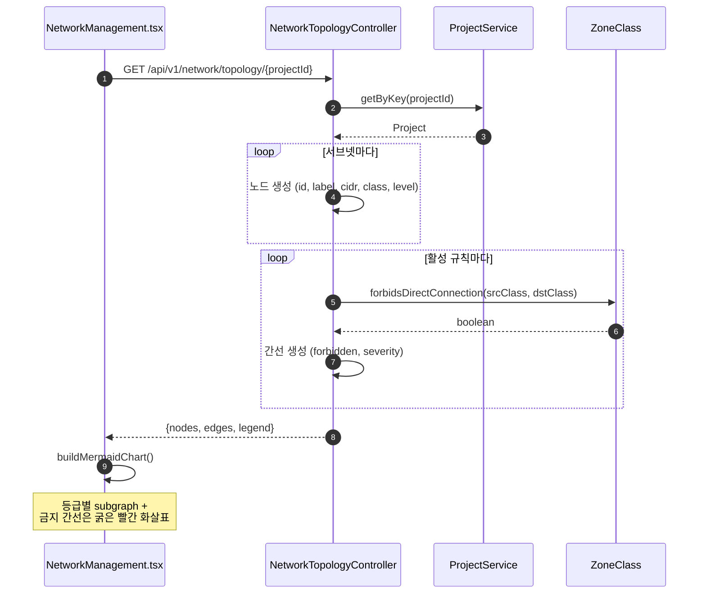

# 5. 정책 위반 조회 / 푸시 시퀀스

## 5.1 위반 현황 조회



## 5.2 정책 푸시 (검증 통과 시에만)



### 왜 위반 시 푸시를 거부하는가

위반 정책을 장치에 밀어 넣으면 **실제로 망분리가 깨집니다.** 그래서
기본 동작이 거부이고, `force=true` 로만 우회할 수 있습니다. 우회 시에도
`WARN` 로그가 남아 감사 추적이 가능합니다.

## 5.3 정책 봉투 구조

푸시되는 `command` 봉투의 payload:

```json
{
  "project_id": "PRJ-6067C1F4",
  "subnet_id": "Subnet-0004",
  "cidr": "10.10.131.0/24",
  "subnet_class": "Confidential",
  "rules": [
    {
      "rule_id": "Rule-0003",
      "destination": "Subnet-0002",
      "protocol": "tcp",
      "port": 443
    }
  ]
}
```

- `enabled=false` 규칙은 포함되지 않습니다.
- `port` 가 미지정이면 키 자체를 넣지 않습니다 (전체 포트 허용 의미).
- `agent_id` 가 없는 서브넷은 건너뜁니다 (푸시할 대상이 없음).

## 5.4 변경 이력 기록

정책을 저장할 때마다 이력이 남습니다.



**기록 실패가 본 작업을 막지 않습니다.** 감사 로그 때문에 정책 적용이
실패하는 것이 더 나쁘기 때문입니다. 그래서 `recordQuietly` 는 예외를
흡수하고 경고만 남깁니다.

## 5.5 토폴로지 조회



### 노드 모양으로 등급을 구분하는 이유

색만 다르면 흑백 인쇄나 색각 이상에서 구분이 어렵습니다. 등급별로 모양도
다르게 해서 색 없이도 읽히게 했습니다.

| 등급 | 노드 모양 |
| --- | --- |
| Confidential | `{{"..."}}` 육각형 |
| Sensitive | `(["..."])` 스타디움 |
| Open | `["..."]` 사각형 |
