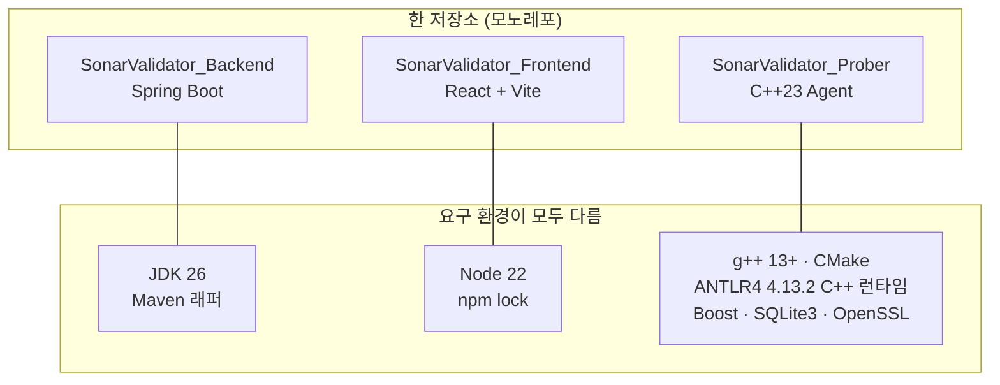
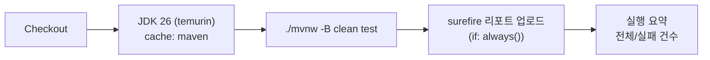
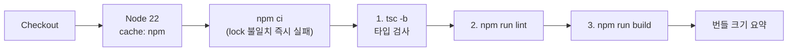
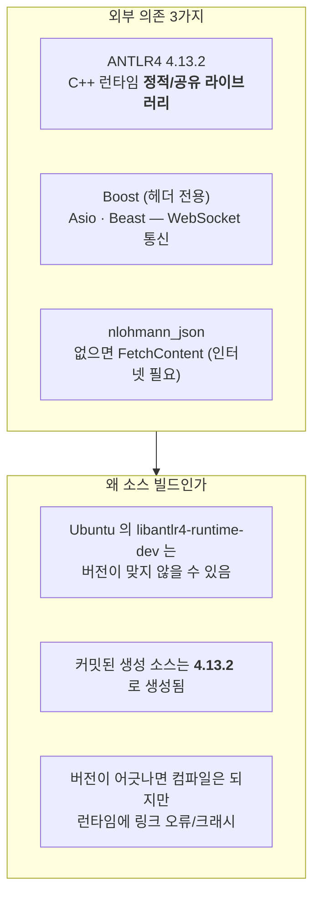
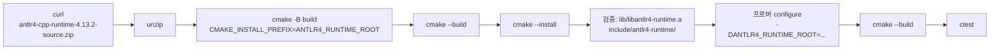
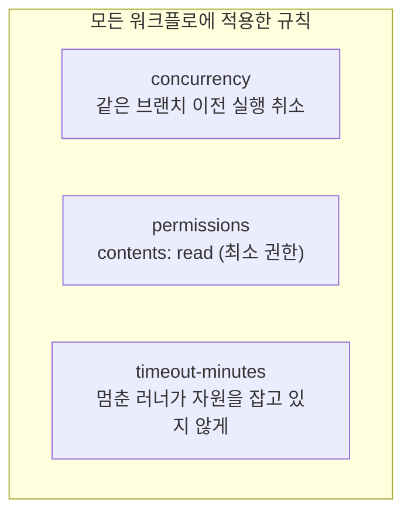
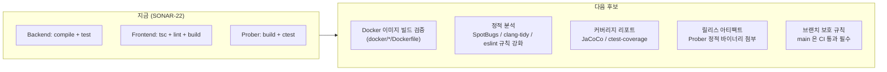

# SonarValidator CI/CD 구축 — GitHub Actions

`SonarValidator` 는 **3계층(Backend / Frontend / Prober)이 한 저장소**에 있습니다.
각 계층의 요구 환경이 완전히 달라, 하나의 워크플로로 묶으면 어느 계층이 깨졌는지
드러나지 않습니다. 그래서 **계층별로 워크플로를 분리**했습니다.

- **작성일**: 2026-09-26
- **이슈**: SONAR-22
- **검증**: 로컬에서 CI 와 **같은 조건**으로 재현 — Backend 261/261, Prober 13/13, Frontend tsc clean + lint 0 errors

---

## 1. 왜 계층별로 나누는가



**하나로 묶으면 생기는 문제**

1. **어느 계층이 깨졌는지 흐려집니다.** 실패 메시지가 "워크플로 실패" 로만 보입니다.
2. **필요 없는 빌드가 돕니다.** 문서 한 줄을 고쳐도 Prober 의 ANTLR 런타임 빌드(수 분)까지 돌아갑니다.
3. **캐시가 서로를 밀어냅니다.** Maven `~/.m2`, npm `node_modules`, ANTLR 런타임을 한 캐시 공간에 넣으면 적중률이 떨어집니다.

**그래서 `paths` 필터로 트리거를 계층별로 가릅니다.**

```yaml
on:
  pull_request:
    paths:
      - 'SonarValidator_Backend/**'
      - '.github/workflows/backend.yml'   # 워크플로 자신을 바꾼 PR 은 반드시 검증
```

> **⚠️ 워크플로 파일 자신을 필터에 포함합니다.** 빠뜨리면 워크플로를 고치는 PR 이
> 자기를 검증하지 않아, 다음 PR 에서야 처음 실행됩니다.

---

## 2. 워크플로 3개

### 2.1 Backend — `backend.yml`



| 결정 | 이유 |
| --- | --- |
| **JDK 26** | `pom.xml` 의 `<java.version>26</java.version>` 이 그대로 반영되어 컴파일 산출물이 **major version 70** 입니다. 21 로 낮추면 `class file version 70.0` 으로 즉시 실패합니다 |
| **`mvnw` 를 씀** | 러너 이미지의 Maven 버전이 바뀌어도 저장소가 커밋한 래퍼가 버전을 고정합니다 |
| **`-o` (오프라인) 를 안 씀** | 로컬에서는 `~/.m2` 캐시가 있어 빠르지만, CI 는 캐시가 비어 있습니다. `cache: maven` 이 두 번째 실행부터 복원합니다 |
| **`clean` 을 씀** | 증분 빌드는 이전 산출물이 남아 `NoClassDefFoundError`(`CliIngestService$1`)를 만들 수 있습니다 — 로컬에서 실제로 겪었습니다 |
| **리포트 업로드 (`if: always()`)** | 러너가 사라지면 로그만 남아 원인 추적이 어렵습니다 |

### 2.2 Frontend — `frontend.yml`



| 결정 | 이유 |
| --- | --- |
| **3단계 분리** | `npm run build` 는 `tsc -b && vite build` 라 타입 검사를 포함하지만, 실패 원인이 "빌드 실패" 로만 보입니다. 나눠야 어느 단계가 깨졌는지 드러납니다 |
| **`npm ci`** | `package.json` 과 lock 이 어긋나면 즉시 실패합니다. "내 컴퓨터에서는 되는데" 를 CI 에서 잡습니다 |
| **Node 22 명시** | 저장소에 `engines` 가 없어 러너 기본값에 기대면 Node 버전이 바뀔 때 조용히 달라집니다 |
| **lint 는 warning 을 통과** | `react-refresh/only-export-components` 경고는 개발 편의 규칙이고 런타임 영향이 없습니다. 이걸로 PR 이 막히면 개발자가 우회(`eslint-disable`)를 만들게 됩니다 |

> **⚠️ 왜 타입 검사가 별도 단계로 필요한가**
> `npm run dev` 는 **esbuild** 를 씁니다 — **타입 검사를 하지 않습니다.**
> 그래서 개발 중에는 멀쩡해 보여도 `tsc -b` 에서 깨지는 코드가 남습니다.
> 이 프로젝트에서 `device_type` 대소문자 불일치(SONAR-23)가 그런 유형이었습니다.

### 2.3 Prober — `prober.yml`

가장 까다로운 워크플로입니다. **외부 의존 3가지**가 있습니다.



**ANTLR4 C++ 런타임을 소스에서 빌드합니다.** 이 결정의 근거는 로컬에서 겪은 실패입니다 —
`tools/antlr.jar` 가 실제로는 4.13.1 스냅샷 fork 였고, 그것으로 재생성하자 **44개 파일이
뒤집히고 416줄이 재작성**됐습니다. 버전 불일치는 조용히 진행됩니다.



| 결정 | 이유 |
| --- | --- |
| **캐시 키에 ANTLR4_VERSION 포함** | 버전을 올렸는데 캐시가 남으면 옛 런타임으로 링크되어 "CI 는 통과하는데 로컬과 다르게 동작" 합니다 |
| **설치 레이아웃 사전 검증** | `find_package` 가 아니라 `ANTLR4_RUNTIME_ROOT` 로 찾습니다. 레이아웃이 다르면 CMake 오류의 원인이 흐려집니다 |
| **커밋된 파서 존재 확인 단계** | 없으면 CMake 가 `FATAL_ERROR` 로 멈추는데, 그 메시지만 보면 "문법을 안 커밋했다" 를 알기 어렵습니다 |
| **Ninja 를 안 씀** | 실측으로 기본 생성기(Unix Makefiles)에서 정상 구성됩니다. 생성기를 하나 더 늘리면 CI 에만 있는 변수가 생깁니다 |

> **⚠️ 압축 파일의 루트가 곧 C++ 런타임입니다.**
> 흔히 `runtime/Cpp` 를 기대하기 쉬운데, 이 배포판은 최상위에 `runtime/`·`cmake/`·
> `CMakeLists.txt` 를 담고 있습니다. (실측: 풀면 최상위에 `CMakeLists.txt` 와
> `VERSION=4.13.2` 가 바로 있습니다)
> 또 `ANTLR_BUILD_CPP_TESTS` 옵션은 **이 배포판에 정의되어 있지 않아** 넘겨도 무시됩니다.

---

## 3. 공통 규칙 3가지



**`concurrency`** — 같은 브랜치에서 새 커밋이 오면 이전 실행을 취소합니다.
남겨 두면 **오래된 커밋의 실패가 최신 상태를 가립니다.**

```yaml
concurrency:
  group: backend-${{ github.ref }}
  cancel-in-progress: true
```

**`permissions: contents: read`** — 기본 토큰은 쓰기 권한을 가질 수 있습니다.
이 워크플로들은 읽기만 필요하므로 최소 권한으로 낮춥니다.

**`timeout-minutes`** — 러너가 멈추면 기본 6시간까지 자원을 잡습니다.

---

## 4. ⚠️ CI 가 먼저 잡아낸 결함 2건

CI 를 넣기 **전에** 이미 린트 오류가 쌓여 있었습니다. 이 상태로 워크플로를 넣으면
**첫 PR 부터 빨간불**이 되고, 그 상태가 며칠 지나면 아무도 CI 를 보지 않게 됩니다.
그래서 함께 고쳤습니다.

| 파일 | 결함 | 규칙 |
| --- | --- | --- |
| `SonarValidator_Frontend/src/svg.d.ts` | `import React = require("react")` | `@typescript-eslint/no-require-imports` |
| `SonarValidator_Frontend/src/components/ecommerce/CountryMap.tsx` | `} as any` | `@typescript-eslint/no-explicit-any` |

### 4.1 `svg.d.ts`

```ts
// 변경 전
declare module "*.svg?react" {
  import React = require("react");
  export const ReactComponent: React.FC<React.SVGProps<SVGSVGElement>>;
  const src: string;
  export default src;
}

// 변경 후 — 타입 위치에서만 쓰는 형태로
declare module "*.svg?react" {
  import type { FC, SVGProps } from "react";
  export const ReactComponent: FC<SVGProps<SVGSVGElement>>;
  const src: string;
  export default src;
}
```

### 4.2 `CountryMap.tsx`

```tsx
// 변경 전 — any 는 오타도 통과시킵니다
markerStyle={{ initial: { fill: "#465FFF", r: 4 } as any }}

// 변경 후 — 키 이름은 검사되고, 추가 속성은 허용
markerStyle={{ initial: { fill: "#465FFF", ...({ r: 4 } as Record<string, number | string>) } }}
```

`r` 은 jvectormap 고유 속성이라 SVG CSS 타입에 없습니다. `as any` 대신
`Record` 로 "추가 속성 허용" 을 명시하면 값 타입은 검사됩니다.

---

## 5. 검증 — 로컬에서 CI 와 같은 조건으로

워크플로를 커밋하고 CI 가 도는지 기다리는 대신, **러너에서 벌어질 일을 로컬에서 재현**했습니다.

| 계층 | 재현 방법 | 결과 |
| --- | --- | --- |
| Backend | `./mvnw -B clean test` | **261/261 green** |
| Prober | ANTLR4 4.13.2 런타임을 **실제로 소스 빌드** → `cmake` → `ctest` | **13/13 green** |
| Frontend | `tsc -b` → `npm run lint` → `npm run build` | clean / **0 errors** / 성공 |

### 5.1 Prober 검증의 핵심 — 설치 레이아웃 일치

```bash
# 실제로 소스에서 빌드해 확인한 산출물
install/lib/libantlr4-runtime.a          ← CMake 가 기대하는 정적 라이브러리
install/lib/libantlr4-runtime.so         ← 공유 라이브러리도 함께 설치됨
install/include/antlr4-runtime/          ← CMake 가 기대하는 헤더 경로
```

이 상태에서 프로버 configure 로그가 기대대로 나오는 것을 확인했습니다.

```
-- ANTLR4: runtime=/tmp/antlr4-check/install/lib/libantlr4-runtime.so
-- ANTLR4: headers=/tmp/antlr4-check/install/include/antlr4-runtime
-- ANTLR4: 커밋된 생성 소스 20개
```

> **이 검증이 없었으면** 워크플로의 `cd runtime/Cpp` 경로 오류를 CI 에서 처음
> 발견했을 것입니다. 로컬 재현이 **왕복 한 번**을 아꼈습니다.

---

## 6. 앞으로의 확장



**우선순위 근거** — `Dockerfile` 3개(`docker/backend`, `docker/base`, `docker/frontend`)가
저장소에 있는데 지금은 검증되지 않습니다. 배포 경로이므로 CI 에서 한 번 도는 것이
가장 값어치가 큽니다.

---

## 7. 재현 방법 (운영자용)

```bash
# Backend — CI 와 같은 명령
cd SonarValidator_Backend
export JAVA_HOME=<JDK 26 경로>
./mvnw -B clean test

# Frontend — CI 와 같은 순서
cd SonarValidator_Frontend
npm ci && npx tsc -b && npm run lint && npm run build

# Prober — ANTLR4 런타임이 이미 있다면
cd SonarValidator_Prober
cmake -B build -DCMAKE_BUILD_TYPE=Release -DANTLR4_RUNTIME_ROOT=<경로>
cmake --build build --parallel "$(nproc)"
ctest --test-dir build --output-on-failure

# Prober — 런타임이 없다면 (CI 가 하는 일)
curl -fsSL -o /tmp/antlr4.zip \
  "https://www.antlr.org/download/antlr4-cpp-runtime-4.13.2-source.zip"
unzip -q /tmp/antlr4.zip -d /tmp/antlr4-src
cd /tmp/antlr4-src && cmake -B build -DCMAKE_INSTALL_PREFIX=/opt/antlr4
cmake --build build --parallel "$(nproc)" && cmake --install build
```

### 7.1 ⚠️ 로컬에서 자주 걸리는 함정

| 함정 | 증상 | 대응 |
| --- | --- | --- |
| 증분 빌드 | `NoClassDefFoundError` | `clean` 을 붙입니다 |
| `npm run dev` 로 확인 | 타입 오류가 안 보임 | `npx tsc -b` 를 반드시 함께 |
| ANTLR 버전 불일치 | 컴파일은 되지만 런타임 크래시 | `VERSION` 파일을 확인합니다 |
| 생성 파서 미커밋 | CMake `FATAL_ERROR` | `regenerate_parser.sh` 후 커밋 |

---

## 8. 요약

| 항목 | 값 |
| --- | --- |
| 워크플로 파일 | 3개 (`backend.yml`, `frontend.yml`, `prober.yml`) |
| 트리거 | `push` / `pull_request` (main, develop) + `workflow_dispatch` |
| 계층별 분리 근거 | 요구 환경이 모두 다름 (JDK 26 / Node 22 / g++13+ANTLR4+Boost) |
| Backend | JDK 26 + `mvnw -B clean test` → **261 tests** |
| Frontend | Node 22 + `tsc -b` + `lint` + `build` |
| Prober | ANTLR4 4.13.2 소스 빌드 + `ctest` → **13 tests** |
| 함께 고친 린트 오류 | **2건** (`svg.d.ts`, `CountryMap.tsx`) |
| 다음 후보 | Dockerfile 빌드 검증, 커버리지, 브랜치 보호 |