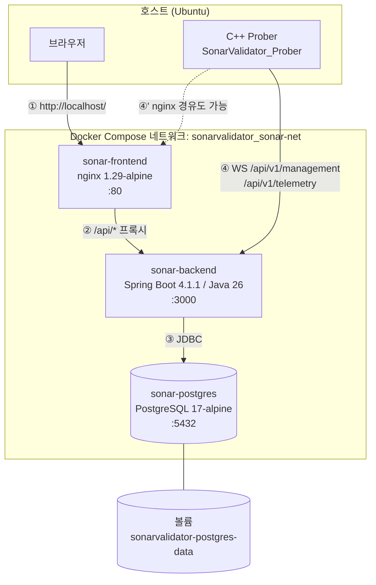

# SonarValidator Docker Compose 배포 가이드

Spring Boot 백엔드(Java 26) + React 프론트엔드(nginx) + PostgreSQL 을
Docker Compose 한 벌로 띄우는 방법입니다.

---

## 1. 초기 계정 정보 (로그인)

| 항목 | 값 |
| --- | --- |
| **아이디** | `admin` |
| **비밀번호** | `admin` (기본값) |
| **역할** | `ADMIN` |
| **계정 생성 시점** | 백엔드 **최초 기동 시 1회** (사용자 테이블이 비어 있을 때만) |

### ⚠️ 아이디는 고정, 비밀번호만 바꿀 수 있습니다

아이디 `admin` 은 코드에 하드코딩되어 있습니다.

`SonarValidator_Backend/src/main/java/.../Service/UserService.java`

```java
@Transactional
public boolean ensureDefaultAdmin(String defaultPassword) {
    if (repository.count() > 0) {   // ← 이미 사용자가 있으면 아무것도 안 함
        return false;
    }
    create("admin", defaultPassword, "Default Administrator", AppUser.Role.ADMIN);
    ...
}
```

`AccountInitializer` 가 기동 시 이 메서드를 호출하고, 비밀번호는
`sonar.admin.password` 프로퍼티로 주입됩니다.

`SonarValidator_Backend/src/main/resources/application.properties`

```properties
sonar.admin.password=${SONAR_ADMIN_PASSWORD:admin}
```

### 비밀번호 변경 방법

**방법 1 — 최초 기동 전에 지정 (권장)**

`.env` 를 만들고 값을 바꾼 뒤 기동합니다.

```bash
cp .env.example .env
# .env 에서 SONAR_ADMIN_PASSWORD=원하는비밀번호 로 수정
docker compose up -d
```

**방법 2 — 이미 기동한 뒤 변경**

화면 우측 상단 **[계정 설정] → 비밀번호 변경**을 사용합니다.
(`PATCH /api/v1/users/me/password`)

**방법 3 — DB 를 초기화하고 다시 만들기**

```bash
docker compose down -v      # ⚠️ 볼륨 삭제 = 모든 데이터 삭제
docker compose up -d
```

> ⚠️ `SONAR_ADMIN_PASSWORD` 를 바꿔도 **기존 계정의 비밀번호는 바뀌지 않습니다.**
> `ensureDefaultAdmin` 이 사용자 테이블이 비어 있을 때만 동작하기 때문입니다.

### 계정 잠금 정책

비밀번호를 5회 틀리면 계정이 잠깁니다. 잠금 시간은 실패가 반복될수록
지수적으로 늘어나며 최대 30분입니다.

잠금을 즉시 해제하려면:

```bash
docker compose exec postgres psql -U sonarvalidator -d sonarvalidator \
  -c "UPDATE app_user SET failed_attempts=0, locked_until=NULL WHERE username='admin';"
```

### 데이터베이스 접속 정보

| 항목 | 값 | 설정 위치 |
| --- | --- | --- |
| 호스트 (컨테이너 내부) | `postgres` (compose 서비스 이름) | `docker-compose.yml` |
| 포트 | `5432` | |
| DB 이름 | `sonarvalidator` | `.env` 의 `DB_NAME` |
| 사용자 | `sonarvalidator` | `.env` 의 `DB_USER` |
| 비밀번호 | `sonarvalidator` | `.env` 의 `DB_PASSWORD` |
| JDBC URL | `jdbc:postgresql://postgres:5432/sonarvalidator` | `application-postgres.yml` |

> ⚠️ 프로필은 반드시 `postgres` 여야 합니다. 누락하면 H2 파일 DB 로 뜹니다.
> compose 가 `SPRING_PROFILES_ACTIVE=postgres` 를 주입하므로 자동으로 적용됩니다.

---

## 2. 접속 주소

| 서비스 | 주소 | 비고 |
| --- | --- | --- |
| **웹 UI** | http://localhost/ | 브라우저는 여기로 접속 |
| 백엔드 API | http://localhost:3000/api/v1/... | C++ Prober 가 쓰는 포트 |
| 헬스 체크 | http://localhost/actuator/health | nginx 경유 |
| PostgreSQL | (내부 전용) | 호스트 노출 안 함 |

포트를 바꾸려면 `.env` 의 `FRONTEND_PORT`, `BACKEND_PORT` 를 수정합니다.

---

## 3. 아키텍처



### 요청 흐름

| # | 경로 | 설명 |
| --- | --- | --- |
| ① | 브라우저 → nginx | 정적 파일(React 빌드 산출물) |
| ② | nginx → backend | `/api/*` 를 프록시. **같은 출처가 되어 CORS 불필요** |
| ③ | backend → postgres | JDBC 커넥션 풀(HikariCP, 최대 10) |
| ④ | Prober → backend | WebSocket 직접 (기존 랩 구성 그대로) |
| ④' | Prober → nginx → backend | nginx 경유도 지원 (Upgrade 헤더 전달) |

### 왜 nginx 를 프록시로 두는가

프론트가 API 를 **상대 경로**(`/api/v1/...`)로 호출하면 브라우저 입장에서
프론트와 API 가 같은 출처가 됩니다. 그 결과:

- **CORS 설정이 아예 필요 없습니다.** (백엔드의 `WebMvcConfig` 는 개발용으로만 남겨 둠)
- **세션 쿠키(`JSESSIONID`)가 자연스럽게 오갑니다.** 로그인 방식이 세션 기반이라
  `credentials: "include"` 와 `SameSite` 를 신경 쓸 필요가 줄어듭니다.
- **프론트를 다시 빌드하지 않고도** 백엔드 주소를 바꿀 수 있습니다.
  (단, `VITE_API_BASE_URL` 을 비워 둔 경우에 한함)

---

## 4. 컨테이너 구성

### 4.1 `sonar-postgres`

| 항목 | 값 |
| --- | --- |
| 이미지 | `postgres:17-alpine` |
| 컨테이너 이름 | `sonar-postgres` |
| 볼륨 | `sonarvalidator-postgres-data` → `/var/lib/postgresql/data` |
| Healthcheck | `pg_isready` (10초 간격, 실패 12회까지, 시작 유예 40초) |
| 시간대 | `Asia/Seoul` |
| 인코딩 | UTF-8 |

> ⚠️ `POSTGRES_DB`, `POSTGRES_USER`, `POSTGRES_PASSWORD` 는 **컨테이너를 처음
> 만들 때만** 적용됩니다. 볼륨이 이미 있으면 무시되므로, 값을 바꾸려면
> `docker compose down -v` 로 볼륨을 지워야 합니다.

### 4.2 `sonar-backend`

| 항목 | 값 |
| --- | --- |
| 이미지 | `sonar-validator/backend:latest` (약 763MB) |
| 베이스 | 자체 빌드한 `sonar-validator/jdk26-base:26.0.2.1` |
| 컨테이너 이름 | `sonar-backend` |
| 실행 사용자 | `appuser` (UID/GID **10001**, 비root) |
| PID 1 | `tini` (SIGTERM 전달) |
| JVM | `-XX:MaxRAMPercentage=75 -XX:+ExitOnOutOfMemoryError` |
| Healthcheck | `curl /actuator/health` (15초 간격, 시작 유예 90초) |

**3단계 빌드입니다.**

1. `docker/base` 에서 구운 JDK 26 + Maven 이미지
2. `mvn package` 로 fat jar 생성 (`/build/target/*.jar`)
3. `ubuntu:24.04` + `/opt/java` 만 복사 + jar 82MB

런타임 이미지에는 **Maven 이 들어가지 않습니다.**

```bash
$ docker run --rm --entrypoint sh sonar-validator/backend:latest -c "which mvn"
mvn: 없음
```

### 4.3 `sonar-frontend`

| 항목 | 값 |
| --- | --- |
| 이미지 | `sonar-validator/frontend:latest` (약 125MB) |
| 베이스 | `nginx:1.29-alpine` |
| 컨테이너 이름 | `sonar-frontend` |
| 빌드 | `node:24-alpine` 에서 `npm ci` + `vite build` |
| Healthcheck | `wget --spider /` (alpine 에는 curl 이 없음) |

빌드 단계에만 Node.js 를 쓰고, **최종 이미지에는 nginx 만 남습니다.**

### 4.4 이미지 크기

| 이미지 | 크기 | 비고 |
| --- | --- | --- |
| `sonar-validator/jdk26-base:26.0.2.1` | 625MB | 중간 산출물 (배포 불필요) |
| `sonar-validator/backend:latest` | 763MB | JDK 309MB + jar 82MB + OS |
| `sonar-validator/frontend:latest` | 125MB | nginx + 정적 산출물 |
| `postgres:17-alpine` | 424MB | 공식 이미지 |

> JDK 를 JRE 대신 JDK 로 유지한 이유: 공개 배포되는 JDK 26 이미지 태그가
> 유동적이라 재현성이 떨어집니다. JRE 로 줄이면 약 100MB 를 아낄 수 있지만,
> 버전 고정과 재현성을 우선했습니다. 이미지 크기가 문제가 되면
> [부록 A](#부록-a-jre-로-줄이기)를 참고하세요.

---

## 5. 빌드 및 실행

### 최초 1회

```bash
# 1) 환경 파일
cp .env.example .env
#    필요하면 SONAR_ADMIN_PASSWORD, SONAR_SECRET_KEY 를 수정

# 2) 이미지 3개 빌드 (JDK 베이스 → 백엔드 → 프론트엔드 순서)
./docker/scripts/build-all.sh

# 3) 기동
docker compose up -d
```

> ⚠️ **순서가 중요합니다.** 백엔드 이미지가 `docker/base` 로 구운 베이스
> 이미지를 `FROM` 으로 참조하기 때문에, 베이스가 없으면 백엔드 빌드가
> `pull access denied` 로 실패합니다.
>
> 한 번에 하려면:
> ```bash
> docker compose --profile bootstrap build   # 베이스 + 백엔드 + 프론트
> docker compose up -d
> ```

### 상태 확인

```bash
docker compose ps                # 3개 모두 healthy 여야 함
docker compose logs -f backend   # 기동 로그
```

기동 성공 시 로그에 다음이 보입니다.

```
Tomcat started on port 3000 (http) with context path '/'
Started SonarValidatorBackendApplication in 12.042 seconds
user created: username=admin role=ADMIN
```

> ⚠️ `Default admin account created` 경고는 **최초 기동에만** 나와야 합니다.
> 재기동할 때마다 나오면 DB 볼륨이 사라진 것입니다.

### 종료

```bash
docker compose down        # 컨테이너만 종료 (DB 데이터 유지)
docker compose down -v     # ⚠️ 볼륨까지 삭제 (DB 데이터 소실)
docker compose stop        # 재시작이 빠름
```

---

## 6. 자주 쓰는 명령

```bash
# 로그 (특정 서비스, 실시간)
docker compose logs -f backend
docker compose logs -f frontend

# 컨테이너 안에서 셸
docker compose exec backend sh
docker compose exec frontend sh
docker compose exec postgres psql -U sonarvalidator -d sonarvalidator

# 재빌드 후 재기동 (코드 변경 반영)
docker compose build backend && docker compose up -d backend

# 이미지까지 다시 굽기
./docker/scripts/build-all.sh && docker compose up -d

# 설정 검증 (문법 오류 확인)
docker compose config --quiet && echo OK
docker compose exec frontend nginx -t

# DB 테이블 목록
docker compose exec postgres psql -U sonarvalidator -d sonarvalidator -c "\dt"

# 사용자 목록
docker compose exec postgres psql -U sonarvalidator -d sonarvalidator \
  -c "SELECT username, role, enabled, failed_attempts FROM app_user;"

# 자원 사용량
docker stats --no-stream
```

---

## 7. 환경 변수

`.env` 파일에서 관리합니다. 전체 목록은 `.env.example` 을 참고하세요.

| 변수 | 기본값 | 설명 |
| --- | --- | --- |
| `FRONTEND_PORT` | `80` | 웹 UI 포트 |
| `BACKEND_PORT` | `3000` | 백엔드 직접 노출 포트 (Prober 용) |
| `DB_NAME` | `sonarvalidator` | DB 이름 |
| `DB_USER` | `sonarvalidator` | DB 사용자 |
| `DB_PASSWORD` | `sonarvalidator` | DB 비밀번호 |
| `SONAR_ADMIN_PASSWORD` | `admin` | **최초 1회** 관리자 비밀번호 |
| `SONAR_SECRET_KEY` | (생성값) | OPNsense Secret 암호화 키 (AES-256-GCM) |
| `SONAR_CORS_ALLOWED_ORIGINS` | `localhost:5173,...` | 개발 서버용 CORS |
| `VITE_API_BASE_URL` | (빈 값) | 빈 값이면 상대 경로 → nginx 프록시 |
| `JAVA_OPTS` | `-XX:MaxRAMPercentage=75 ...` | JVM 옵션 |
| `SKIP_TESTS` | `true` | 이미지 빌드 시 테스트 실행 여부 |

> ⚠️ `SONAR_SECRET_KEY` 를 바꾸면 기존에 저장된 OPNsense Secret 을
> 복호화할 수 없습니다. 운영에서는 고정된 값을 쓰세요.

> ⚠️ `.env` 는 `.gitignore` 에 등록되어 있습니다. 커밋하지 마세요.

---

## 8. 검증 결과 (2026-09-20)

| 항목 | 결과 |
| --- | --- |
| 컨테이너 상태 | 3/3 **healthy** |
| `docker compose config` | 통과 |
| `nginx -t` | 통과 |
| 웹 UI (`GET /`) | 200 |
| SPA fallback (`/project/editor/1` 등) | 200 |
| `/actuator/health` (nginx 경유) | `{"status":"UP"}` |
| 로그인 (`admin`/`admin`) | 200, `role=ADMIN` |
| 잘못된 비밀번호 | 401 |
| 로그아웃 → 인증 필요 경로 | 401 |
| 세션 쿠키 유지 (`/api/v1/auth/me`) | 200 |
| **WebSocket (nginx 경유)** | 핸드셰이크 성공, `hello → ack` |
| **40KB telemetry 프레임** | 수락 (close 1009 **없음**) |
| **35초 idle 후 WebSocket** | 연결 유지 |
| telemetry 파싱 | 인터페이스·라우트·ARP 정상 |
| 한글 저장/반환 (`compose 검증`) | 정상 |
| 재기동 후 영속성 | 프로젝트·계정 유지 |
| 런타임 이미지에 Maven | **없음** (정상) |
| `:Zone.Identifier` 파일 | **0개** (제외됨) |

### 직접 다시 검증하기

```bash
# 1) nginx 프록시 경유 WebSocket + 큰 프레임 + close 1009 여부
#    Node 22+ 내장 WebSocket 을 쓰므로 추가 설치가 필요 없습니다.
node docker/scripts/ws-proxy-check.mjs ws://localhost/api/v1/management
node docker/scripts/ws-proxy-check.mjs ws://localhost:3000/api/v1/management
node docker/scripts/ws-proxy-check.mjs ws://localhost/api/v1/telemetry

# 2) 로그인 + 세션
curl -s -c /tmp/c.txt -X POST http://localhost/api/v1/auth/login \
  -H 'Content-Type: application/json' \
  -d '{"username":"admin","password":"admin"}'
curl -s -b /tmp/c.txt http://localhost/api/v1/auth/me

# 3) nginx 설정 문법
docker compose exec frontend nginx -t
```

### telemetry 파싱 상세

실제 C++ Prober payload 형식(`SonarValidator_Prober/database/telemetry_store.cpp`
기준)으로 전송한 결과입니다.

```json
{
  "interfaces": {
    "ens3": { "addresses": ["10.10.131.10/24"], "macAddress": "52:54:00:aa:bb:01",
              "mtu": 1500, "operState": "UP" }
  },
  "routes": [
    { "defaultRoute": true, "nextHop": "10.10.131.1", "nextHopInterface": "ens3",
      "prefix": "0.0.0.0/0", "metric": 100, "protocol": "static" }
  ],
  "arpEntries": [
    { "address": "10.10.131.1", "mac": "52:54:00:cc:dd:01", "state": "REACHABLE" }
  ]
}
```

> ⚠️ 필드명을 틀리면 **예외 없이 조용히 빈 값**이 됩니다.
> 실제 키는 `nic_status.interfaces[].addresses[].prefix_len`,
> `route_status.routes[].{prefix,next_hop,interface_name}`,
> `arp_table.entries[]` 입니다. `nic`/`route`/`arp` 같은 이름은 인식되지 않습니다.

---

## 9. 문제 해결

### 백엔드가 기동하지 않음 (`Restarting`)

```bash
docker compose logs backend | grep -iE "error|caused by" | head -20
```

| 증상 | 원인 | 해결 |
| --- | --- | --- |
| `Failed to determine a suitable driver class` | `SPRING_PROFILES_ACTIVE` 누락 | compose 가 주입하지만, 수동 실행이면 `-Dspring.profiles.active=postgres` |
| `Schema-validation: missing table` | `JPA_DDL_AUTO=validate` + 빈 DB | compose 는 `update` 로 설정함. 확인 필요 |
| `Connection refused` (postgres) | DB 가 healthy 아님 | `docker compose ps` 로 확인, `start_period` 대기 |

### 프론트가 502 Bad Gateway

백엔드가 healthy 가 아니면 발생합니다. `depends_on: service_healthy` 로
순서는 보장되지만, 백엔드가 기동 중 재시작하면 이 상태가 됩니다.

```bash
docker compose ps
docker compose logs --tail=50 backend
```

### 로그인이 안 됨

```bash
# 계정이 있는지 확인
docker compose exec postgres psql -U sonarvalidator -d sonarvalidator \
  -c "SELECT username, enabled, failed_attempts, locked_until FROM app_user;"

# 잠금 해제
docker compose exec postgres psql -U sonarvalidator -d sonarvalidator \
  -c "UPDATE app_user SET failed_attempts=0, locked_until=NULL WHERE username='admin';"
```

> 로그인 5회 실패마다 잠금 시간이 늘어납니다(최대 30분).

### Prober 가 붙지 않음

```bash
# 백엔드 직접
docker compose exec backend sh -c "curl -s localhost:3000/actuator/health"

# 호스트에서 포트 확인
ss -tlnp | grep -E ':(80|3000) '
```

핸드셰이크는 되는데 **telemetry 만 유실**되면 페이로드 크기를 의심하세요.
Tomcat 기본 WebSocket 버퍼는 8192 바이트이고, `WebSocketConfig` 에서
1MB 로 늘려 두었습니다. (FRR 라우터 텔레메트리는 11.8KB)

### 이미지 빌드가 `pull access denied` 로 실패

베이스 이미지가 없어서입니다.

```bash
docker build -t sonar-validator/jdk26-base:26.0.2.1 docker/base
```

### 빌드가 Maven 다운로드에서 느림 / 실패

첫 빌드는 Maven 의존성을 전부 받느라 수 분 걸립니다. BuildKit 캐시를
쓰므로 두 번째부터는 빠릅니다.

```bash
DOCKER_BUILDKIT=1 docker build ...   # 또는
docker builder prune                 # 캐시가 깨졌을 때
```

### `no space left on device`

```bash
docker system df          # 사용량 확인
docker image prune -f     # 댕글링 이미지
docker builder prune -f   # 빌드 캐시
docker system prune -a    # ⚠️ 미사용 이미지 전부 삭제
```

---

## 10. 디렉터리 구조

```
SonarValidator/
├── docker-compose.yml              # 통합 스택 정의
├── .env                            # 실제 환경변수 (git 무시)
├── .env.example                    # 템플릿
├── .dockerignore                   # 빌드 컨텍스트 제외
└── docker/
    ├── base/
    │   ├── Dockerfile              # Ubuntu 24.04 + JDK 26 + Maven 3.9.16
    │   └── README.md
    ├── backend/
    │   └── Dockerfile              # 3단계: builder → runtime (JDK only)
    ├── frontend/
    │   ├── Dockerfile              # node build → nginx
    │   └── nginx.conf              # SPA fallback + /api 프록시 + gzip
    └── scripts/
        ├── build-all.sh            # 전체 이미지 빌드
        └── ws-proxy-check.mjs      # WebSocket 프록시 검증 (의존성 없음)
```

---

## 11. 보안 메모

| 항목 | 현재 상태 | 운영 시 권장 |
| --- | --- | --- |
| 관리자 비밀번호 | `admin` (기본값) | `.env` 로 강한 비밀번호 주입 |
| DB 비밀번호 | `sonarvalidator` | 강한 비밀번호로 변경 |
| DB 포트 | 호스트 미노출 | 유지 (내부 전용) |
| `SONAR_SECRET_KEY` | `.env` 에 저장 | 시크릿 관리 도구 사용 |
| 프론트 HTTPS | 없음 (HTTP 80) | TLS 종료 추가 (아래) |
| 컨테이너 사용자 | `appuser` (비root) | 유지 |
| **WebSocket 인증** | **없음** (`permitAll`) | 관리망 ACL 또는 공유 시크릿 |
| 세션 쿠키 | `HttpOnly`, `SameSite=Lax` | `Secure` 추가 (HTTPS 시) |
| CSRF | 비활성 (SameSite 로 보완) | — |

> ⚠️ **WebSocket 경로(`/api/v1/management`, `/api/v1/telemetry`)는 인증이
> 없습니다.** C++ Prober 가 세션/쿠키를 가질 수 없기 때문입니다.
> 현재는 네트워크 신뢰에 의존하므로, 운영에서는 관리망 접근 제어나
> 장치별 공유 시크릿으로 보강해야 합니다.
> `Config/SecurityConfig.java` 의 `PUBLIC_PATHS` 참고.

### HTTPS 적용 (선택)

```bash
# 자체 서명 인증서 생성
mkdir -p docker/frontend/certs
openssl req -x509 -nodes -days 365 -newkey rsa:2048 \
  -keyout docker/frontend/certs/privkey.pem \
  -out docker/frontend/certs/fullchain.pem \
  -subj "/CN=sonarvalidator.local"
```

`nginx.conf` 에 443 서버 블록을 추가하고 인증서를 마운트한 뒤,
`.env` 에 `FRONTEND_PORT=443` 을 설정합니다.

---

## 부록 A. JRE 로 줄이기

이미지를 약 100MB 줄일 수 있습니다. `docker/base/Dockerfile` 에 JRE 스테이지를
추가합니다.

```dockerfile
FROM ubuntu:24.04 AS jre
ARG JRE_URL="<Temurin 26 JRE tarball URL>"
ARG JRE_SHA256="<hash>"
RUN set -eux; \
    mkdir -p /opt/java; \
    curl -fSL -o /tmp/jre.tar.gz "${JRE_URL}"; \
    echo "${JRE_SHA256}  /tmp/jre.tar.gz" | sha256sum -c -; \
    tar -xzf /tmp/jre.tar.gz -C /opt/java --strip-components=1
```

그리고 `docker/backend/Dockerfile` 의 런타임 스테이지에서
`COPY --from=builder /opt/java /opt/java` 를
`COPY --from=jre /opt/java /opt/java` 로 바꿉니다.

> 단, Maven 은 빌드 스테이지에서만 쓰므로 어차피 최종 이미지에 없습니다.
> 절감되는 것은 JDK 의 개발 도구(javac, jshell 등) 약 100MB 입니다.

---

## 부록 B. ARM(aarch64) 에서 빌드

기본값은 x86_64 용 URL/해시입니다. ARM 에서는 베이스 이미지를 arm64 용으로
다시 굽습니다.

```bash
# Adoptium API 에서 arm64 tarball URL 과 sha256 조회
curl -s "https://api.adoptium.net/v3/assets/feature_releases/26/ga?architecture=aarch64&image_type=jdk&os=linux&vendor=eclipse" \
  | python3 -c "import sys,json; b=json.load(sys.stdin)[0]['binaries'][0]['package']; print(b['link']); print(b['checksum'])"

docker build -t sonar-validator/jdk26-base:26.0.2.1 docker/base \
  --build-arg JDK_URL="<arm64 URL>" \
  --build-arg JDK_SHA256="<arm64 sha256>"
```

이후는 동일합니다.

---

## 부록 C. 프로필별 DB 설정 요약

| 프로필 | DB | `ddl-auto` | 사용처 |
| --- | --- | --- | --- |
| `local` | H2 파일 (`./data/sonarvalidator.mv.db`) | `update` | 로컬 개발 (기본값) |
| `postgres` | PostgreSQL | `validate` (기본) / `update` (compose) | 운영 |
| `test` | H2 인메모리 | `create-drop` | `mvn test` |

compose 는 `SPRING_PROFILES_ACTIVE=postgres` 와 `JPA_DDL_AUTO=update` 를
주입합니다. `validate` 는 스키마가 이미 있어야 통과하므로, 빈 DB 로
처음 띄울 때는 `update` 가 필요합니다.

> ⚠️ **운영에서는 `update` 를 쓰지 마세요.** 스키마 변경 이력이 남지 않습니다.
> Flyway 나 Liquibase 로 마이그레이션을 관리하고 `validate` 로 검증하세요.
