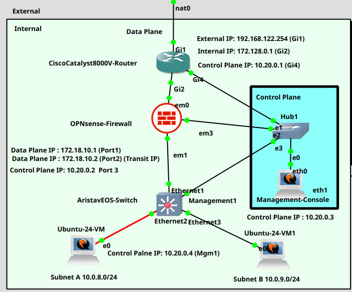
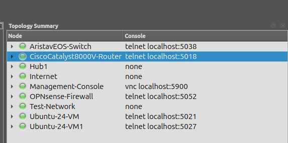

RVI(Real-to-Virtual Infrastructure) 랩의 네트워크 구조를 정리한 문서입니다.
가상(GNS3) 위에 실장비와 동일한 구성을 올리고, 실제 배포·검증 절차를 재현합니다.

{/* truncate */}

## 네트워크 구조

토폴로지는 다음 이미지와 같습니다.

## 검증 스크린샷

## 관련 문서

- [RVI — 랩 접속 자격증명](/blog/rvi-opnsense-credential)
- [PoC 네트워크 구성 요약](/blog/poc-network-summary)