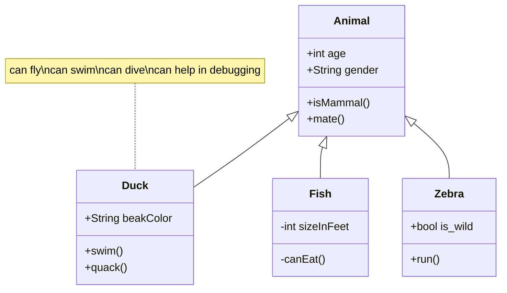

## Agent Class Diagram V1

- 일단 모든 네트워크 장비는 Device로부터 시작되므로 이를 고려해서 설계한다.

### Class Diagram

```mermaid
classDiagram
    direction TB
    class Animal {
        +int age
        +String gender
        +isMammal()
        +mate()
    }
    class Duck {
        +String beakColor
        +swim()
        +quack()
    }
    class Fish {
        -int sizeInFeet
        -canEat()
    }
    class Zebra {
        +bool is_wild
        +run()
    }
    Animal <|-- Duck
    Animal <|-- Fish
    Animal <|-- Zebra
    
    note for Duck "can fly\ncan swim\ncan dive\ncan help in debugging"
```

```mermaid
graph TD;
    A --> B;
```