# 클래스 다이어그램 v1

프로버(C++23)와 백엔드(Spring Boot / Java 26)의 <b>실제 클래스</b>를 정리한
버전 1 입니다. 설계 의도가 아니라 <b>지금 코드에 있는 것</b>을 그렸습니다.

## 이 문서를 읽는 순서

1. [전체 조감도](#1-전체-조감도) — 두 프로세스가 어디서 만나는지
2. [프로버](#2-프로버-c23) — 수집 → 저장 → 전송 파이프라인
3. [백엔드](#3-백엔드-spring-boot) — 수신 → 변환 → 검증 → 노출
4. [접점 계약](#4-접점-계약-envelope) — 양쪽이 공유하는 유일한 계약
5. [DB 스키마](#5-db-스키마) — 엔티티와 테이블

---

## 1. 전체 조감도

두 프로세스는 <b>WebSocket 하나</b>로만 만납니다. 프로버는 DB(SQLite)를
로컬에, 백엔드는 별도 DB(PostgreSQL)를 가지며 서로의 DB를 직접 보지 않습니다.

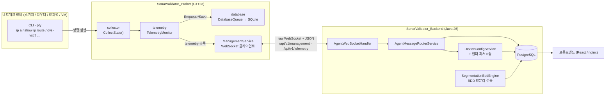

<b>핵심</b>: 프로버는 <b>능동적으로 밀어 넣고</b>(telemetry), 백엔드는
<b>능동적으로 밀어 넣습니다</b>(command). 요청-응답이 필요한 경우(정책)만
애플리케이션 레벨 `correlation_id` 로 짝을 맞춥니다.

---

## 2. 프로버 (C++23)

### 2-1. 진입점과 런타임 준비

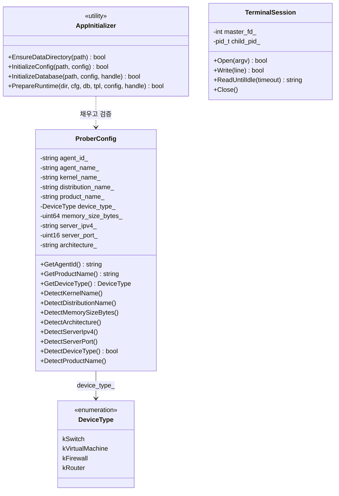

`ProberConfig` 는 <b>세 가지 출처</b>를 합칩니다: 설정 파일, 로컬 시스템 탐지
(`Detect*`), 그리고 실행 인자. `DetectProductName()` 이 벤더 파서 선택의
근거가 되므로(백엔드가 이 값으로 파서를 고름) 틀리면 수집 전체가 무의미해집니다.

### 2-2. 수집과 저장

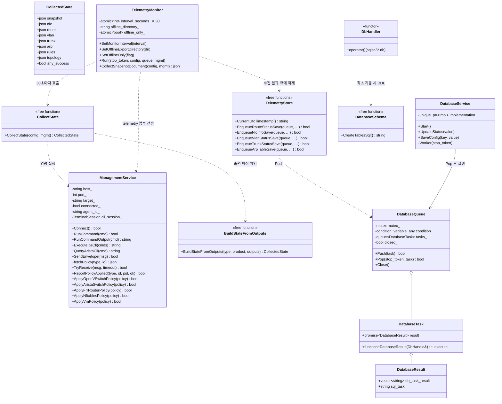

<b>설계 포인트</b>: 수집은 <b>두 갈래</b>로 나갑니다.

- `snapshot` 은 서버로 (JSON 한 덩어리)
- `nic` / `route` / `vlan` / `trunk` / `arp` 는 SQLite 로 (테이블별 행)

같은 수집 결과를 목적에 따라 다르게 씁니다. 서버는 분석용, SQLite 는
로컬 이력·오프라인 재전송용입니다.

### 2-3. 벤더별 정책 적용과 토폴로지 파싱

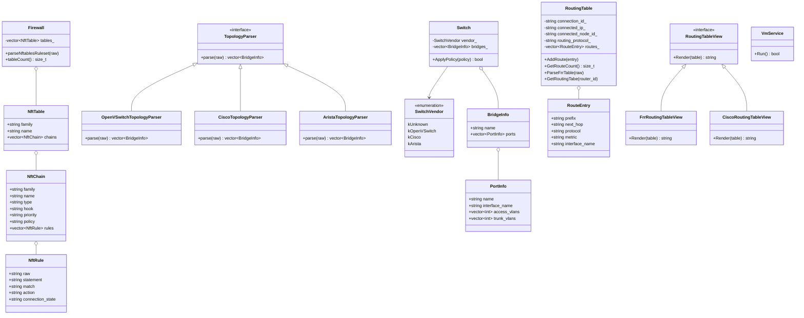

<b>Strategy 패턴이 두 곳</b>에 있습니다: `TopologyParser`(L2 토폴로지)와
`RoutingTableView`(라우팅 출력 렌더링). 새 벤더는 파서 하나만 추가하면 되고
호출부는 바뀌지 않습니다.

### 2-4. 정책 수신 (서버 → 장비)

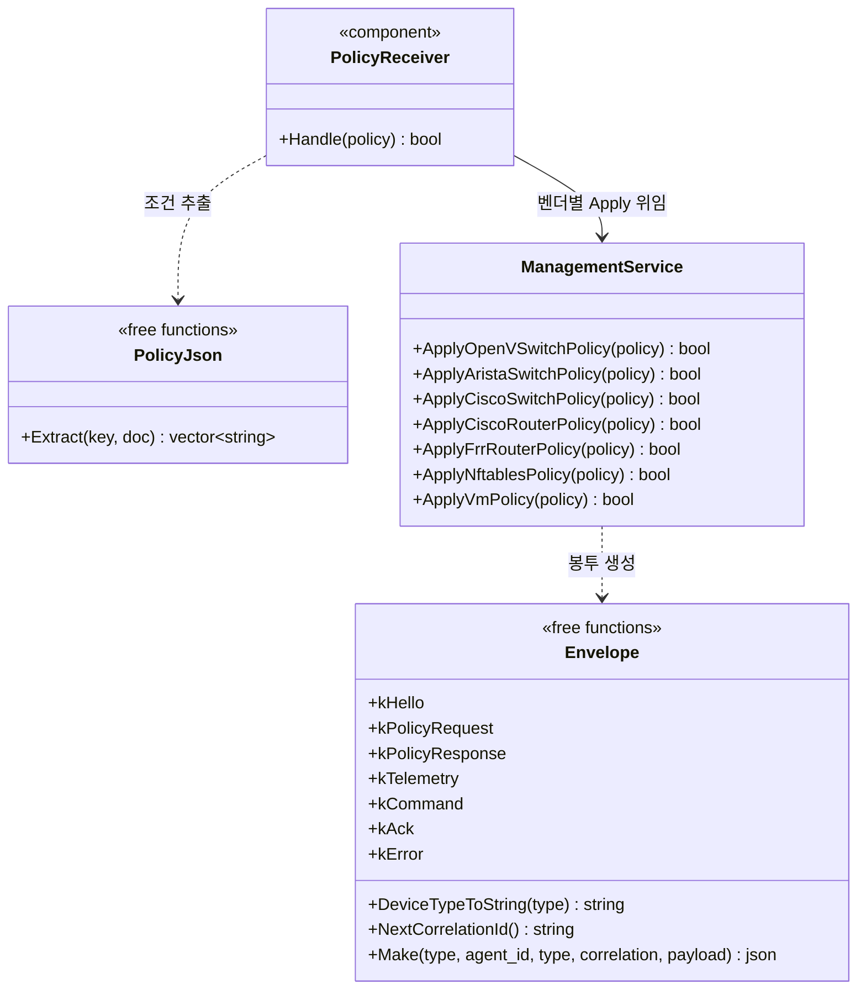

`ManagementService` 가 <b>7개의 Apply*</b> 를 모두 들고 있는 것은 이 버전의
약점입니다. 벤더가 늘면 God Class 가 됩니다. (v2 검토 대상)

---

## 3. 백엔드 (Spring Boot)

### 3-1. WebSocket 수신 계층

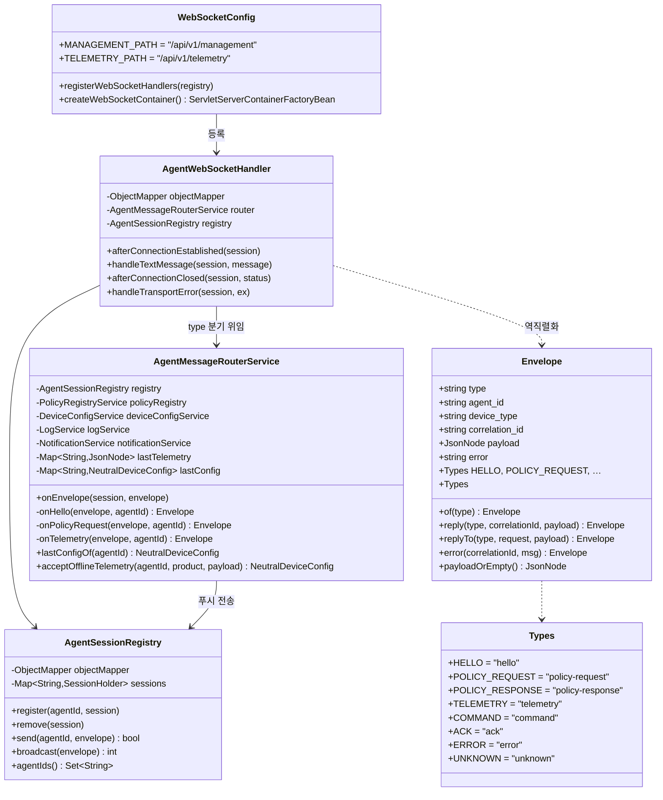

<b>분기의 단일 진입점</b>이 `AgentMessageRouterService` 입니다. 봉투의 `type`
하나로 갈라지고, `telemetry`/`ack`/`error` 는 <b>응답하지 않습니다</b>(null 반환).

### 3-2. 텔레메트리 → 설정 변환

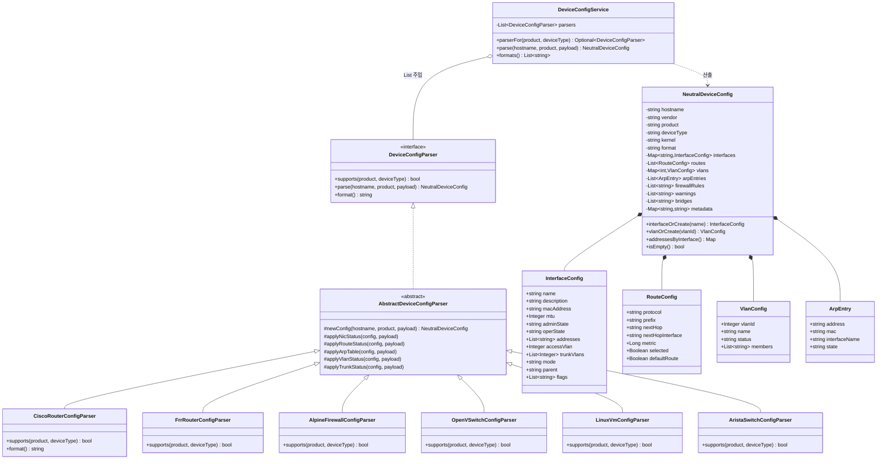

<b>파서는 예외를 던지지 않습니다.</b> 텔레메트리 경로에서 예외는 수집 유실로
이어지므로, 실패는 `warnings` 에 담고 빈 설정을 돌려줍니다.

### 3-3. BDD 망분리 검증 엔진

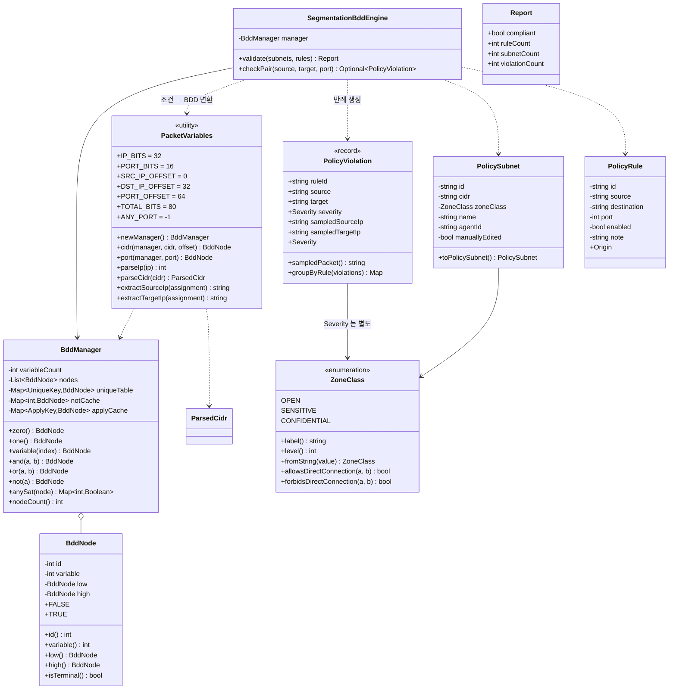

<b>왜 BDD 인가</b>: 주소 공간이 2^32 라 열거가 불가능합니다. BDD 는
접두사로 정의된 집합을 <b>구조적으로</b> 다루므로, 허용집합 ∩ 금지집합이
비어 있지 않은지 O(노드 수) 로 판정하고 `anySat()` 으로 <b>반례 패킷</b>까지
뽑아냅니다. 사용자는 "위반 3건" 과 함께 `10.0.0.0 → 10.0.1.0:443` 을 봅니다.

### 3-4. REST 계층과 서비스

```mermaid
classDiagram
    direction TB

    class ProjectController {
        -ProjectService projectService
    }
    class PolicyManagement {
        -ProjectService projectService
        -AgentSessionRegistry registry
        -NotificationService notificationService
    }
    class NetworkTopologyController {
        -ProjectService projectService
        -AgentMessageRouterService router
        -AgentSessionRegistry registry
    }
    class RouterController {
        -AgentMessageRouterService router
    }
    class AgentStatusController {
        -AgentSessionRegistry registry
        -AgentMessageRouterService router
        -DeviceConfigService deviceConfigService
    }
    class OfflineImportController {
        -OfflineSnapshotService snapshotService
        -AgentMessageRouterService router
    }
    class LogController {
        -LogService logService
        -LogAnalysisEngine analysisEngine
    }
    class OPNsenseController {
        -OPNsenseCredentialService credentialService
        -OPNsenseCredentialRepository repository
        -OPNsenseApiClient apiClient
        -AgentSessionRegistry registry
        -AgentMessageRouterService router
    }
    class AuthController {
        -AuthenticationManager authenticationManager
        -UserService userService
    }
    class UserController {
        -UserService userService
    }
    class NotificationController {
        -NotificationService notificationService
    }
    class ComplianceController {
        -ComplianceService complianceService
    }
    class AiProviderController {
        -AiProviderService providerService
    }

    class ProjectService {
        -ProjectRepository repository
        -ComplianceService complianceService
        -NotificationService notificationService
        +createProject(dto) Project
        +updateProject(key, dto) Project
        +deleteProject(key)
        +validate(key) Report
    }
    class ComplianceService {
        -ComplianceChangeRepository repository
        +record(change) ComplianceChange
    }
    class NotificationService {
        -NotificationRepository repository
        +notify(...) Notification
        +markRead(id)
    }
    class UserService {
        -AppUserRepository repository
        -PasswordEncoder passwordEncoder
        +create(...) AppUser
        +changePassword(...)
        +delete(id)
    }
    class LogService {
        -DeviceLogRepository repository
        -LogNormalizer normalizer
        +ingest(...) DeviceLog
    }
    class LogAnalysisEngine {
        -LogService logService
        -AiProviderService providerService
        -OpenAiCompatibleClient client
        -LogAnalysisRepository analysisRepository
        +analyze(...) LogAnalysis
    }
    class OfflineSnapshotService {
        -DeviceConfigService deviceConfigService
        -AgentMessageRouterService router
        +importFile(file) SnapshotResult
    }
    class OPNsenseCredentialService {
        -OPNsenseCredentialRepository repository
        -SecretCipher secretCipher
        -OPNsenseApiClient apiClient
        +save(agentId, …) Map
    }
    class AiProviderService {
        -AiProviderRepository repository
        -SecretCipher secretCipher
        -OpenAiCompatibleClient client
    }
    class SecretCipher {
        -SecretKeySpec key
        +encrypt(plain) string
        +decrypt(cipher) string
    }
    class OpenAiCompatibleClient {
        -WebClient client
        +chat(...) string
    }
    class OPNsenseApiClient {
        -WebClient client
        +checkConnection() Result
        +interfaces() Result
        +rules() Result
    }
    class LogNormalizer {
        <<utility>>
        +normalize(raw) DeviceLog
        +severityOf(head) int
    }
    class ProjectView {
        <<utility>>
        +subnetsFromDevice(agentId, config) List~PolicySubnet~
        +normalizeCidr(address) string
    }

    ProjectController --> ProjectService
    PolicyManagement --> ProjectService
    PolicyManagement --> AgentSessionRegistry
    PolicyManagement --> NotificationService
    NetworkTopologyController --> ProjectService
    NetworkTopologyController --> AgentMessageRouterService
    NetworkTopologyController --> AgentSessionRegistry
    RouterController --> AgentMessageRouterService
    AgentStatusController --> AgentSessionRegistry
    AgentStatusController --> AgentMessageRouterService
    AgentStatusController --> DeviceConfigService
    OfflineImportController --> OfflineSnapshotService
    LogController --> LogService
    LogController --> LogAnalysisEngine
    OPNsenseController --> OPNsenseCredentialService
    OPNsenseController --> OPNsenseApiClient
    AuthController --> UserService
    UserController --> UserService
    NotificationController --> NotificationService
    ComplianceController --> ComplianceService
    AiProviderController --> AiProviderService

    ProjectService --> ComplianceService
    ProjectService --> NotificationService
    LogService --> LogNormalizer
    LogAnalysisEngine --> LogService
    LogAnalysisEngine --> AiProviderService
    LogAnalysisEngine --> OpenAiCompatibleClient
    OfflineSnapshotService --> DeviceConfigService
    OfflineSnapshotService --> AgentMessageRouterService
    OPNsenseCredentialService --> SecretCipher
    OPNsenseCredentialService --> OPNsenseApiClient
    AiProviderService --> SecretCipher
    AiProviderService --> OpenAiCompatibleClient
    ProjectView ..> ProjectService
```

### 3-5. 보안 / 설정

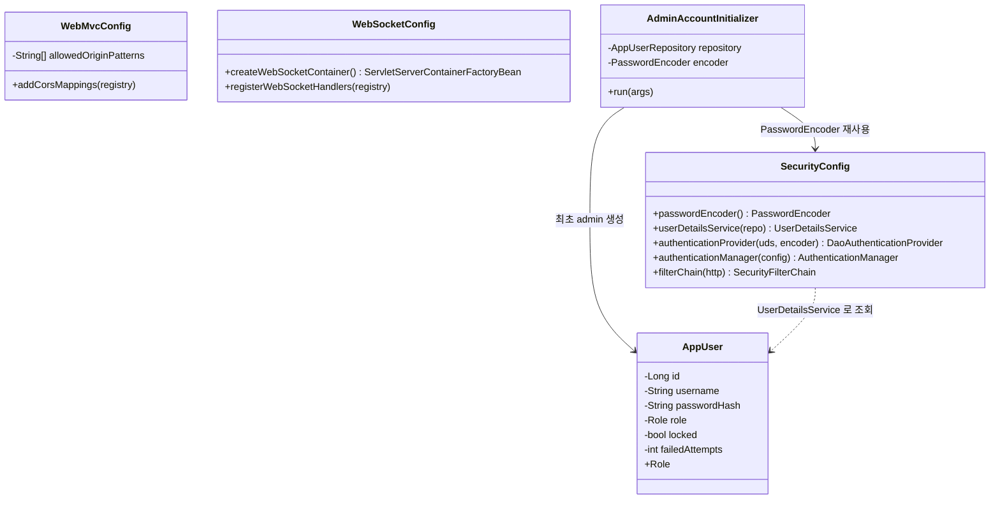

<b>인증 예외</b>: `/api/v1/management`, `/api/v1/telemetry` 는 `permitAll`
이어야 합니다. C++ 프로버는 세션 쿠키를 가질 수 없습니다.

---

## 4. 접점 계약 (Envelope)

양쪽이 공유하는 <b>유일한 계약</b>입니다. 필드는 전부 snake_case 이고,
타입 문자열은 7개로 고정입니다.

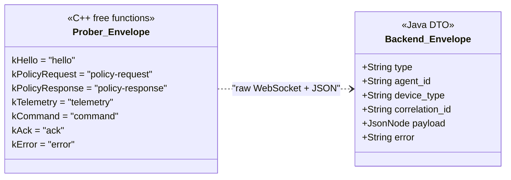

### 타입별 방향과 응답

| type | 방향 | 응답 | 비고 |
| --- | --- | --- | --- |
| `hello` | 프로버 → 백엔드 | `ack` | 최초 연결 1회, 알림 기록 |
| `policy-request` | 프로버 → 백엔드 | `policy-response` | `correlation_id` 로 짝 |
| `policy-response` | 백엔드 → 프로버 | — | 정책 본문 |
| `telemetry` | 프로버 → 백엔드 | 없음 | 일방향. 실패해도 재전송 안 함 |
| `command` | 백엔드 → 프로버 | 없음 | 서버 푸시 |
| `ack` | 프로버 → 백엔드 | 없음 | 정책 적용 결과 |
| `error` | 양방향 | 없음 | |

<b>주의</b>: `telemetry` 는 8KB 를 넘으면 Tomcat 이 close 1009 로 끊습니다.
(FRR 라우터 텔레메트리가 11.8KB) `WebSocketConfig.createWebSocketContainer()`
에서 1MB 로 올려 두었습니다. 프로퍼티로는 설정되지 않습니다.

---

## 5. DB 스키마

### 5-1. 엔티티 관계

```mermaid
erDiagram
    project ||--o{ project_subnet : "project_id (ordinal)"
    project ||--o{ project_rule : "project_id (ordinal)"
    configuration ||--o{ network_interface : "node_id"
    configuration ||--o| rest_api_node_config : "node_id (UNIQUE)"
    project ||--o{ compliance_change : "project_key"
    project ||--o{ notification : "project_key"
    ai_provider ||--o{ log_analysis : "provider_id"

    project {
        bigint id PK
        varchar project_key UK
        varchar name
        varchar category
    }
    project_subnet {
        bigint id PK
        varchar subnet_id
        varchar cidr
        varchar zone_class
        varchar agent_id
    }
    project_rule {
        bigint id PK
        varchar rule_id
        varchar source
        varchar destination
        int port
    }
    configuration {
        int node_id PK
        varchar _hostname
        smallint _device_type
        smallint _configuration_format
    }
    network_interface {
        bigint interface_id PK
        varchar member_name
        int node_id FK
    }
    rest_api_node_config {
        bigint id PK
        int node_id FK
        varchar apikey
        varchar baseurl
    }
    notification {
        bigint id PK
        varchar notification_id UK
        varchar category
        varchar severity
        varchar project_key
        varchar agent_id
        varchar dedupe_key
        int repeat_count
        boolean is_read
    }
    device_log {
        bigint id PK
        varchar agent_id
        varchar severity
        varchar fingerprint
        varchar logged_at
    }
    log_analysis {
        bigint id PK
        varchar analysis_id
        bigint provider_id FK
        text result
    }
    compliance_change {
        bigint id PK
        varchar project_key
        varchar change_type
    }
    app_user {
        bigint id PK
        varchar username UK
        varchar password_hash
        varchar role
        boolean locked
    }
    ai_provider {
        bigint id PK
        varchar name
        varchar base_url
        text api_key_encrypted
    }
    opnsense_credential {
        bigint id PK
        varchar agent_id UK
        text secret_encrypted
    }
    opnsense_firewall {
        bigint id PK
        varchar agent_id
        varchar management_ip
    }
```

### 5-2. 양쪽 DB 의 역할 분담

| | 프로버 SQLite | 백엔드 PostgreSQL |
| --- | --- | --- |
| 목적 | 로컬 수집 이력 · 오프라인 재전송 | 분석 · 검증 · 화면 |
| 단위 | 스냅샷(`collected_at` 묶음) | 엔티티 |
| 스키마 | `route_table`, `nic_info`, `nic_address`, `vlan_status`, `trunk_status`, `arp_table` | 14개 테이블 (§5-1) |
| 스키마 정의 | `database/schema.cpp` 단일 소스 | JPA 엔티티 + `ddl-auto` |
| 시간 | ISO-8601 **문자열** | ISO-8601 **문자열** (동일) |

<b>설계 의도</b>: 같은 문제를 두 번 풀지 않습니다. 프로버는 <b>원본을 그대로</b>
남기고, 해석·판정은 백엔드가 합니다. 그래서 프로버 DB 에는 판정 결과가 없고,
백엔드 DB 에는 원본 로그 대신 정규화된 `DeviceLog` 가 들어갑니다.

### 5-3. 스키마 진화 시 주의

- 프로버: `CreateTablesSql()` 은 `CREATE TABLE IF NOT EXISTS` 라 <b>기존
  테이블의 컬럼을 바꾸지 못합니다</b>. 컬럼 변경 시 마이그레이션이 필요합니다.
- 백엔드: `local` 은 `update`, `postgres` 는 `validate` 입니다. 빈 DB 로 처음
  띄울 때는 `JPA_DDL_AUTO=update` 로 한 번 생성한 뒤 `validate` 로 되돌립니다.
- 운영에서는 Flyway/Liquibase 로 옮겨야 합니다(현재 없음).

---

## 6. v1 에서 확인된 약점 (v2 검토 대상)

| # | 위치 | 문제 | 영향 |
| --- | --- | --- | --- |
| 1 | `ManagementService` | `Apply*Policy` 7개를 한 클래스가 보유 | 벤더 추가 시 God Class. Strategy 분리 필요 |
| 2 | `ManagementService` / `TelemetryService` | WebSocket 클라이언트 코드 중복 | 전송 버그를 두 번 고쳐야 함 |
| 3 | `AgentMessageRouterService` | `lastConfig` 가 <b>인메모리 캐시</b> | 재기동하면 모든 장비 설정 소실 |
| 4 | `Configuration._hostname` | unique 제약 없음 | 같은 장비가 여러 행으로 쌓임 |
| 5 | `Configuration` | 인터페이스/VRF/ACL/VLAN 이 `@Transient` | SQL 로 조회 불가. 분석은 인메모리만 |
| 6 | `Model.Ip` / `Ip6` / `Prefix` | 최근 값 객체로 정리 (v1 반영) | — |
| 7 | `AbstractRoute` | 인터페이스 필드 = `static final` | 모든 라우트가 값 공유. 구현체 사용 불가 |
| 8 | `AgentMessageFirewallService` / `AgentMessageSwitchService` | 빈 클래스 | 죽은 코드 |
| 9 | ~~`OpenSenseApiService`~~ | ~~하드코딩된 URL/키~~ | **수리 완료** — 삭제 |
| 10 | ~~`Model/entitiy` (오타 패키지)~~ | ~~`Model/entity` 와 공존~~ | **수리 완료** — 통합 |
| 11 | `OPNSenseFirewall` | `OPNsenseCredential` 과 사실상 중복 (테이블 0행) | 미정 — 통합 검토 |
| 12 | `Service/opnsense` | `@Value` 로 전역 설정을 읽는 경로 없음 | DB 경로만 존재 (의도) |

## 7. 수리 이력

### 2026-09-21 — 오타 패키지 통합

`Model/entitiy`(오타) 를 `Model/entity` 로 이동했습니다. `git mv` 를 써서 이력이
보존됩니다.

```
Model/entitiy/OPNSenseFirewall.java  →  Model/entity/OPNSenseFirewall.java
```

수정한 참조 3곳: 패키지 선언, `OPNSenseFirewallRepository`, `OPNSenseFirewallRepositoryTest`.

### 2026-09-21 — 하드코딩 URL/키 제거

참조가 0건인 죽은 코드를 삭제했습니다.

| 삭제 | 하드코딩되어 있던 값 |
| --- | --- |
| `Service/OpenSenseApiService` | `new OPNSenseClientConfig("http://test.com", "apiKey-spxxxxx")` |
| `Client/OPNSenseClientConfig` | `@Value` 기본값 `https://test.local:8000` |
| `Service/RestApiClient/OPNSenseClientService` | 위 설정 의존 |
| `Service/RestApiClient/OPNSenseEndpoint` | 경로 중복 정의 |

대체 경로는 `Service/opnsense/` 3종이며, 접속 정보는 <b>DB(장치별) + 환경변수
(암호화 키)</b> 로만 들어옵니다. 자세한 내용은
[OPNsense 설정 주입 경로](./OPNsense%20Configuration.md) 를 보세요.

빈 디렉터리 `Client/`, `Service/RestApiClient/` 도 함께 제거했습니다.
