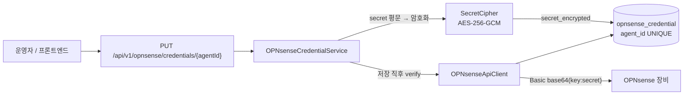

# OPNsense 설정 주입 경로

OPNsense 접속 정보는 <b>하드코딩하지 않습니다.</b> 두 가지 경로로만 들어옵니다.

## 1. 장치별 자격증명 — DB 경로 (기본)

방화벽마다 API Key 가 다르므로 <b>장치(Agent) 단위</b>로 DB 에 저장합니다.



### 테이블 `opnsense_credential`

| 컬럼 | 용도 |
| --- | --- |
| `agent_id` | 자연 키 (UNIQUE). 장치 식별자 |
| `display_name` | 표시 이름 (기본값 = agent_id) |
| `base_url` | 장치별 접속 URL. **끝 슬래시 자동 제거** |
| `api_key` | API Key (사용자 이름 자리) |
| `secret_encrypted` | API Secret — **AES-GCM 암호화** |
| `allow_insecure_tls` | 자체 서명 인증서 허용 (랩 전용, 기본 false) |
| `status` | `VERIFIED` / `FAILED` / `UNVERIFIED` |
| `detected_version` | 연결 확인 시 읽은 펌웨어 버전 |
| `last_error` | 마지막 실패 사유 |

### 시크릿 취급 원칙

1. 저장 시 <b>암호화</b>합니다 (`Service/secret/SecretCipher`, AES-256-GCM).
2. 응답에는 <b>마스킹된 값만</b> 넣습니다. 저장된 비밀을 다시 읽어 보여줄 이유가
   없고, 보여주면 그 자체가 유출 경로가 됩니다.
3. 수정 시 시크릿을 <b>비워 두면 기존 값 유지</b>입니다. 매번 재입력하게 하면
   운영자가 평문을 여기저기 붙여넣게 됩니다.
4. 평문 시크릿은 `OPNsenseConnection` 안에서만 존재하고 호출 직후 버려집니다.
   `toString()` 은 `apiSecret=[REDACTED]` 로 가립니다.

### 암호화 키는 환경변수

```
SONAR_SECRET_KEY=<openssl rand -base64 32 결과>
```

값을 바꾸면 기존에 저장된 Secret 을 <b>복호화할 수 없습니다.</b> 운영에서는
반드시 고정된 값을 주입하세요. 비어 있으면 임시 키로 동작하지만 재시작 시
기존 값을 읽지 못합니다.

### 연결 확인(verify)이 중요한 이유

URL 과 키가 맞는지 <b>저장 시점에</b> 알려주지 않으면, 운영자는 "저장됐다" 는
화면을 믿고 넘어갔다가 정책 푸시 단계에서 처음 실패를 봅니다. 그때는 원인
후보가 너무 많습니다. 그래서 저장 직후 `/api/core/firmware/status` 를 호출하고
결과를 DB 에 남깁니다.

## 2. 전역 기본값 — 환경변수 경로 (선택)

장치별 자격증명이 없을 때 쓸 전역 설정입니다. `docker-compose.yml` 의 `backend`
환경변수 또는 `.env` 로 주입합니다.

| 환경변수 | 기본값 | 용도 |
| --- | --- | --- |
| `SONAR_SECRET_KEY` | (없음) | 시크릿 암호화 키 (32바이트 Base64). **필수** |
| `SONAR_ADMIN_PASSWORD` | `admin` | 최초 기동 시에만 쓰는 admin 비밀번호 |
| `SONAR_CORS_ALLOWED_ORIGINS` | `localhost:5173,4173` | CORS 허용 출처 |

```bash
# .env
SONAR_SECRET_KEY=J8lWHOlLEKevaytC8FJD0h1bihNVEAfh+4peCcNMjxY=
SONAR_ADMIN_PASSWORD=<강한 비밀번호로 교체>
```

<b>주의</b>: OPNsense 의 URL/Key/Secret 은 환경변수로 넣지 마세요. 장치마다
키가 다르고 회전(rotation)이 필요하므로 DB 경로가 정답입니다. 환경변수는
암호화 키와 같이 <b>서버 전체에 하나뿐인 값</b>에만 씁니다.

## 3. 삭제된 하드코딩 경로 (v1 → 정리)

다음 클래스들이 <b>하드코딩된 URL/키</b>를 들고 있었고 참조가 0건이라 삭제했습니다.

| 삭제된 클래스 | 문제 |
| --- | --- |
| `Service/OpenSenseApiService` | `new OPNSenseClientConfig("http://test.com", "apiKey-spxxxxx")` 를 **생성자에서 직접** |
| `Client/OPNSenseClientConfig` | `@Value` 기본값이 `https://test.local:8000` — 실수로 그대로 배포되면 가짜 호스트로 호출 |
| `Service/RestApiClient/OPNSenseClientService` | 위 설정에 의존. `java.net.http` 와 `WebClient` 를 혼용 |
| `Service/RestApiClient/OPNSenseEndpoint` | 경로 중복 정의 |

<b>대체 경로</b>: `Service/opnsense/` 패키지 3종.

| 클래스 | 역할 |
| --- | --- |
| `OPNsenseApiClient` | 실제 REST 호출. `Basic base64(key:secret)` |
| `OPNsenseCredentialService` | DB 저장/조회 + 저장 직후 verify |
| `OPNsenseConnection` | 요청 시점의 평문 접속 정보 (record, 불변) |

### 왜 기본값을 두지 않는가

`@Value("${opnsense.base-url:https://test.local:8000}")` 처럼 기본값을 두면
설정 누락이 <b>기동 실패로 드러나지 않습니다.</b> 대신 가짜 호스트로 호출하다
런타임에 이상한 타임아웃이 나고, 원인을 찾기 어렵습니다. 하드코딩된 키는
git 이력에 영구히 남습니다.

## 4. 검증 방법

```bash
# 1) 장치 자격증명 등록 (저장과 동시에 연결 확인)
curl -X PUT http://localhost:3000/api/v1/opnsense/credentials/fw-01 \
  -H 'Content-Type: application/json' \
  -d '{"base_url":"https://10.99.143.2","api_key":"...","api_secret":"...",
       "allow_insecure_tls":true,"verify_now":true}'

# 2) 목록 (시크릿은 마스킹되어 나옵니다)
curl http://localhost:3000/api/v1/opnsense/credentials

# 3) 단건 재확인
curl -X POST http://localhost:3000/api/v1/opnsense/credentials/fw-01/verify

# 4) 응답 원문 보기 — 실장비가 붙으면 이걸로 API 매핑을 확정합니다
curl -X POST http://localhost:3000/api/v1/opnsense/credentials/fw-01/probe
```

<b>⚠️ 인증 필요</b>: `/api/v1/opnsense/**` 는 `permitAll` 이 아닙니다.
브라우저 세션 쿠키가 있어야 하므로 위 curl 은 로그인 후
`-b cookies.txt` 를 붙여야 합니다.

## 5. 미검증 사항

랩에 OPNsense 실장비가 없어 <b>실제 API 호출은 검증되지 않았습니다.</b>
그래서 `OPNsenseApiClient` 는 다음 원칙을 지킵니다.

- 응답 구조를 <b>추측하지 않습니다.</b> 키가 없으면 null/빈 값을 돌려줍니다.
- 파싱 실패를 예외로 던지지 않고 `raw` 를 함께 남깁니다.
- 호출 실패는 `Result` 로 감싸 사유와 함께 돌려줍니다.

실장비가 붙으면 `/probe` 로 원문을 확인한 뒤 매핑을 확정하세요.
