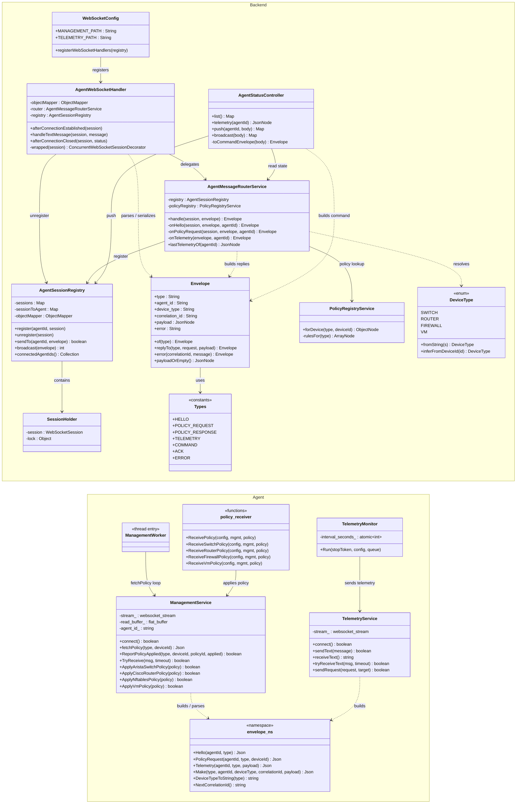
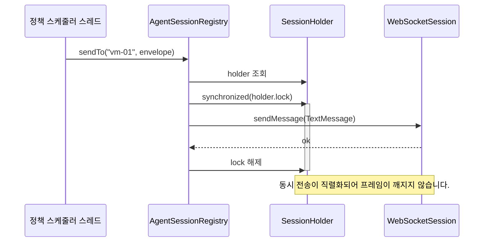
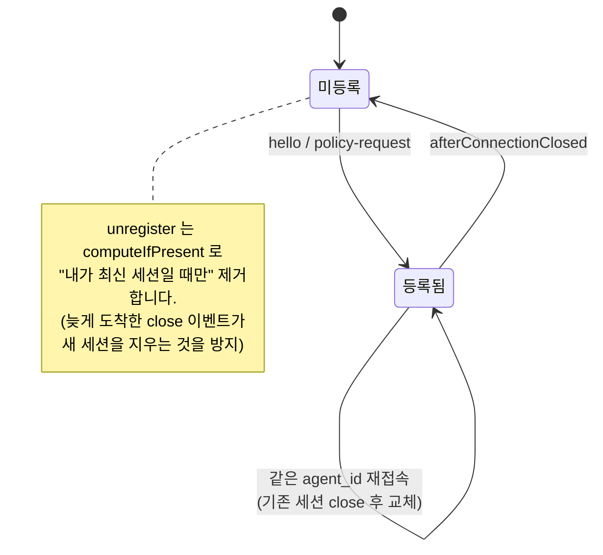

# 클래스 다이어그램

## 전체 구조

## 서버 측 클래스 책임

| 클래스 | 한 줄 책임 |
| --- | --- |
| `WebSocketConfig` | 두 경로를 하나의 핸들러에 등록합니다. |
| `AgentWebSocketHandler` | 텍스트 프레임 ↔ `Envelope` 변환. 파싱 실패 시 `error` 봉투를 돌려줍니다. |
| `AgentMessageRouterService` | `type` 별 분기. **응답의 단일 진입점** 이며 도메인 상태의 유일한 변경자입니다. |
| `AgentSessionRegistry` | `agent_id` → 세션 매핑과 서버→Agent 푸시(직렬화 포함). |
| `SessionHolder` | 세션 1개와 그 전송 락. Spring `WebSocketSession` 은 스레드 안전하지 않기 때문입니다. |
| `PolicyRegistryService` | 장치 유형별 정책 생성(현재는 자리표시자, 향후 DB 로 교체). |
| `AgentStatusController` | HTTP 표면: 연결 현황 조회, 푸시, 브로드캐스트. |
| `Envelope` / `Types` | 계약 그 자체. Agent 의 `envelope.hpp` 와 1:1 대응. |
| `DeviceType` | 문자열 → 유형 변환 및 `device_id` 접두사 추론. |

## Agent 측 클래스 책임

| 클래스 | 한 줄 책임 |
| --- | --- |
| `envelope` (namespace) | 봉투 생성/파싱 헬퍼. **유일한 프로토콜 정의 지점** 입니다. |
| `ManagementService` | 관리 경로 연결, `policy-request` → `policy-response` 상관관계 매칭, 정책 적용. |
| `TelemetryService` | 텔레메트리 경로 연결과 전송, 서버 지시 수신. |
| `TelemetryMonitor` | 주기 수집 루프. 수신한 `command.payload.monitor_interval` 로 주기를 조정합니다. |
| `policy_receiver` | 정책 JSON 을 장치 유형별 `Apply*` 로 분배. |
| `ManagementWorker` | 관리 스레드 진입점. |

## 설계상 중요한 두 가지

### 1) 세션별 락

Spring 의 `WebSocketSession` 에 여러 스레드가 동시에 `sendMessage` 를 호출하면
프레임이 섞일 수 있습니다. `ConcurrentWebSocketSessionDecorator` 와 같은 목적이지만,
버퍼 크기/시간 제한 설정이 필요 없는 구조라 락 하나로 단순하게 해결했습니다.

### 2) 재접속 시 세션 교체

`unregister` 가 단순 `remove` 였다면, 재접속 직후 도착한 이전 세션의 close 이벤트가
**새 세션을 삭제** 해버립니다. `computeIfPresent` 로 "내가 아직 최신일 때만" 지우도록
했습니다.
