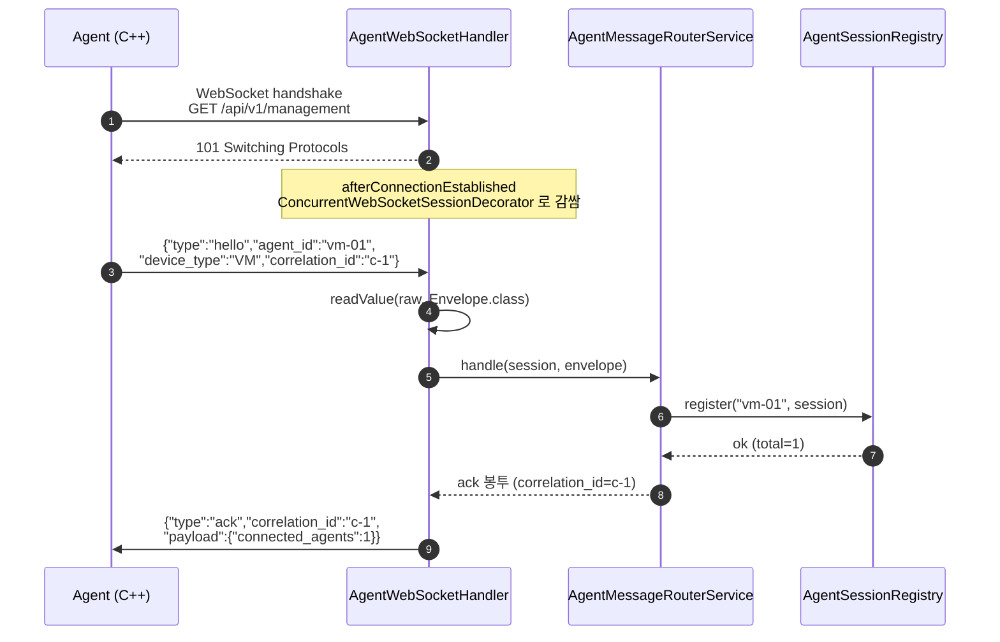
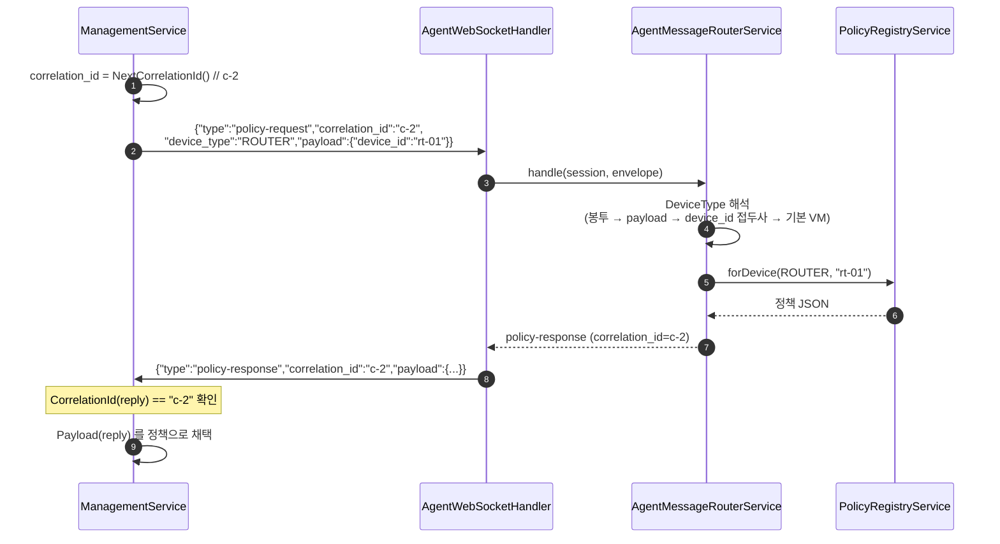
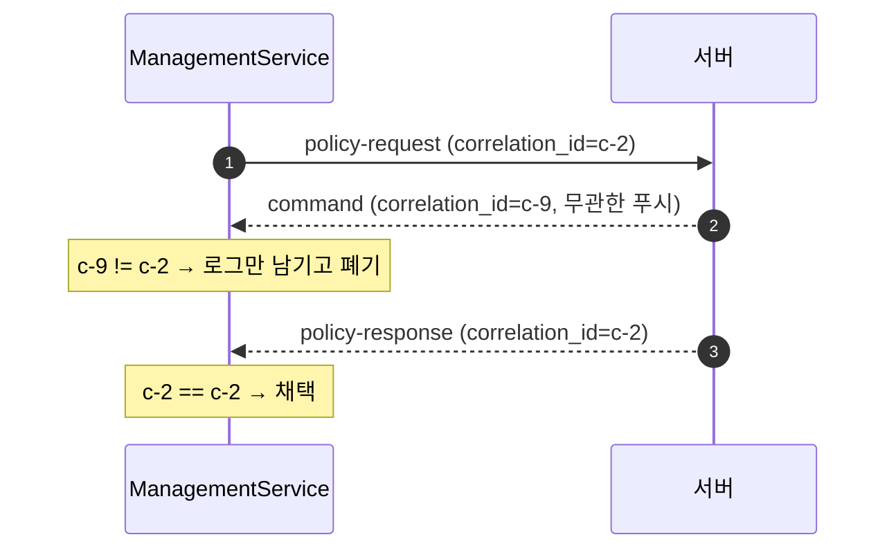
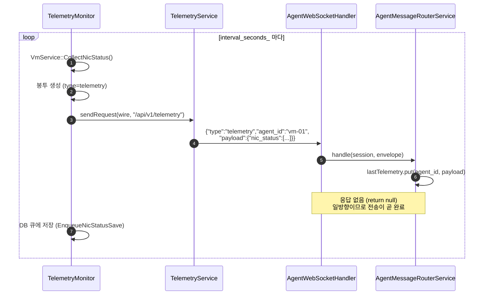
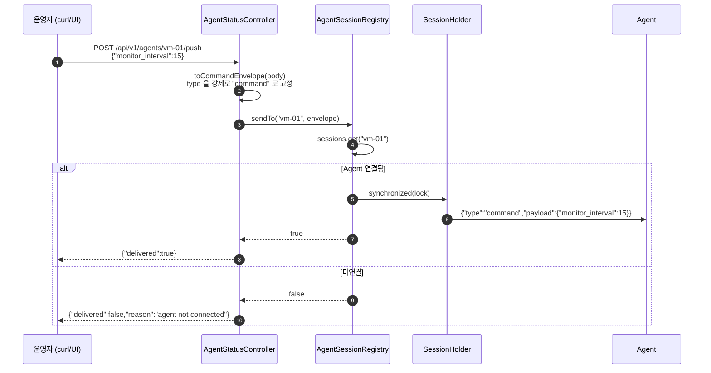
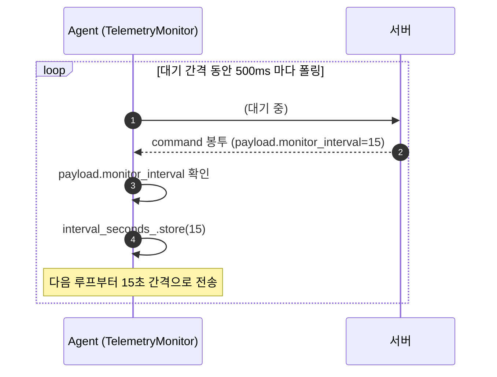
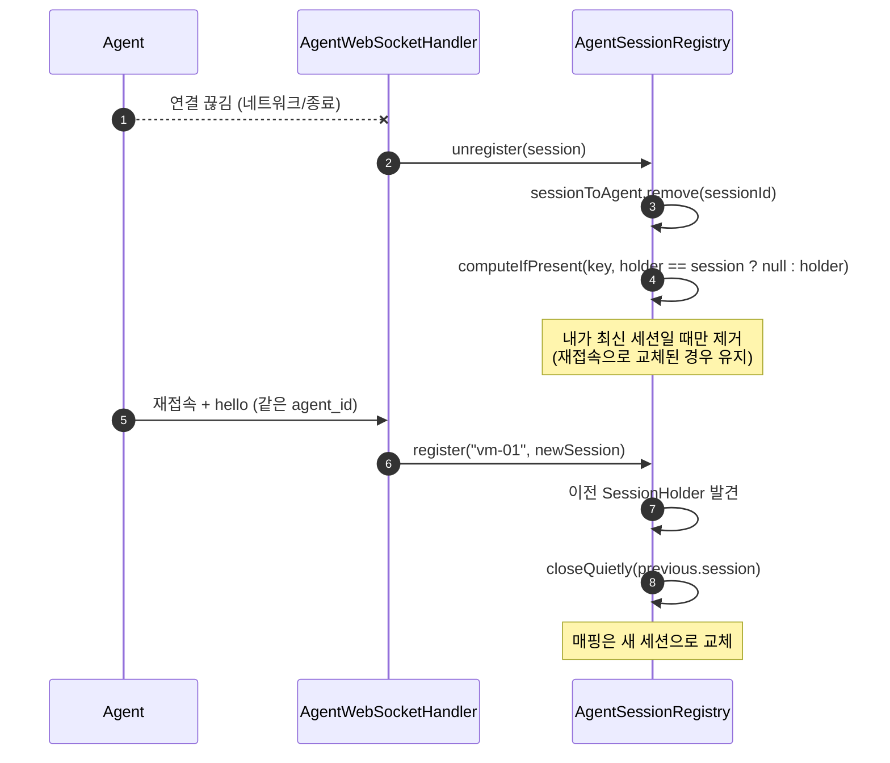
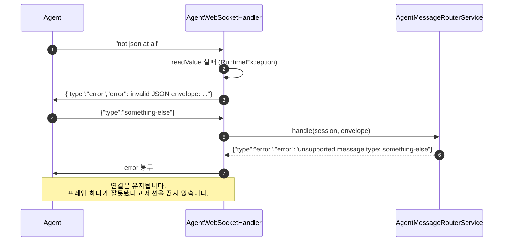

# 시퀀스 다이어그램

## 1. 연결 + hello/ack 핸드셰이크

`hello` 를 보내는 시점은 Agent 의 `fetchPolicy()` 첫 호출입니다. 즉 **정책이 필요해지는
순간 세션이 등록** 되므로 별도의 연결 관리 코드가 필요 없습니다.

## 2. 정책 요청 → 응답 (correlation_id 매칭)

이 시퀀스가 이 설계의 핵심입니다. STOMP 의 `RECEIPT` 가 하지 못했던 짝 맞추기를
애플리케이션 계층에서 수행합니다.

Agent 측 루프는 **다른 correlation_id 의 봉투를 만나면 버리고 계속 기다립니다.**
이 덕분에 응답을 기다리는 동안 서버 푸시가 끼어들어도 요청-응답이 어긋나지 않습니다.

## 3. 텔레메트리 (일방향)

:::note 일방향인 이유
텔레메트리에 응답을 보내면 Agent 의 수신 버퍼에 응답이 쌓여, 이후 `policy-response`
매칭이 밀리게 됩니다. 상태 보고는 **보내고 잊는 것** 이 맞습니다.
:::

## 4. 서버 → Agent 푸시

### 4-1. HTTP 로 트리거

운영자가 임의 `type` 을 밀어 넣어 Agent 상태를 깨뜨리지 못하도록 **항상 `command` 로
고정** 합니다. 또한 본문이 짧은 payload(`{"monitor_interval":15}`)든 완전한 봉투든
모두 받도록 `toCommandEnvelope` 가 처리합니다.

### 4-2. Agent 측 수신과 주기 변경

대기 시간 동안 소켓을 논블로킹으로 잠시 전환해 `read_some` 으로 폴링하므로,
긴 간격(예: 300초)에서도 지시를 즉시 받을 수 있습니다.

## 5. 연결 종료와 재접속

## 6. 잘못된 프레임 처리

파싱 실패나 미지원 `type` 은 **연결을 끊지 않고** `error` 봉투로 알립니다.
Agent 가 재연결 루프를 도는 비용보다, 오류를 로그로 남기고 계속 쓰는 편이 낫습니다.
