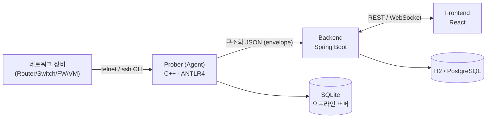

# SonarValidator 프로젝트 소개

망분리 환경을 위한 **오픈소스 네트워크 정책 검증 도구**입니다.

네트워크 장비(Router / Switch / Firewall / VM / OVS)에서 설정과 상태를 수집한 뒤,
**의도한 정책대로 실제로 동작하는지**를 검증하고 위반 사항을 알려 줍니다.

## 무엇을 하는 도구인가

기존에는 "정책을 넣었으니 적용됐을 것" 이라고 가정하고 넘어갔습니다.
SonarValidator 는 그 가정을 **실측으로 확인**합니다.

1. **수집** — 장비에 접속해 CLI 출력과 설정을 긁어옵니다.
2. **파싱** — 벤더마다 다른 출력을 공통 JSON 구조로 바꿉니다.
3. **검증** — 서버가 망분리 규칙을 기준으로 위반 여부를 판정합니다.
4. **조치** — 위반이 확인되면 격리(quarantine) 명령을 내리고 결과를 확인합니다.

> 판정은 **자동**, 조치는 **수동**입니다. 격리 버튼은 사람이 누릅니다.
> 오탐 한 번으로 정상 장비를 끊지 않기 위해서입니다.

## 구성 요소

| 구성 요소                | 역할                                                     | 기술                                    |
| ------------------------ | -------------------------------------------------------- | --------------------------------------- |
| **Prober (Agent)**       | 장비에 붙어 CLI 출력·설정을 수집하고 파싱해 서버로 전송  | C++23, ANTLR4, SQLite                   |
| **Backend**              | 수집 데이터 수신·저장, 정책 검증, REST/WebSocket API     | Java 26, Spring Boot 4.1, H2/PostgreSQL |
| **Frontend**             | 정책 편집, 토폴로지 시각화, 검증 결과 대시보드           | React + TypeScript, Vite                |
| **Docs**                 | 설계 문서 사이트                                         | Docusaurus                              |



## 설계 원칙

- **위반 판정은 서버가 한다.** 프론트엔드 검증은 즉시 피드백용이며,
  최종 판정은 서버의 BDD 연산 결과입니다.
- **프론트엔드는 벤더를 모른다.** 서버가 중립 구조(`NeutralDeviceConfig`)로
  변환한 뒤 내려줍니다.
- **실패는 조용하지 않게 한다.** 형식이 잘못된 값은 추측하지 않고 비워 두고,
  검증에서 MINOR 로 보고합니다.
- **랩마다 달라지는 값은 코드에 박지 않는다.** 관리 대역·테이블 이름·인터페이스
  기본값은 설정(`sonar.site.*`)으로 뺐습니다.

## 문서 안내

- **Blog** — 프로젝트 설계 · 가이드 · 테스트 문서를 주제별 태그로 정리했습니다.
  [`/blog`](/blog) 에서 시작하세요.
- **Docs(이 섹션)** — 통신 프로토콜, 파서, 백엔드/에이전트 설계처럼
  구조가 잡힌 설계 문서를 둡니다.
  왼쪽 사이드바에서 폴더별로 찾아볼 수 있습니다.

## 빠른 시작

Agent(Prober) 없이 Frontend + Backend 만 띄워 개발할 때는 루트의 스크립트를 씁니다.

```bash
./dev.sh                 # 프론트(5173) + 백엔드(3000, 디버그) 실행
./dev.sh --backend-only  # 백엔드만
```

각 계층을 개별 실행하는 방법과 테스트 명령은 저장소 루트의 `README.md` 를 보세요.